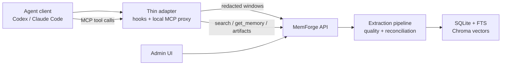

# MemForge

<p align="center">
  
</p>

<p align="center">
  <a href="https://github.com/dodoman-sun/mem-forge/actions/workflows/ci.yml"></a>
  
  
  
  
</p>

*Provenance-backed memory for coding agents and development teams.*

> **Status:** alpha. APIs, storage formats, and integration packaging may change
> while the project settles.

MemForge is a self-evolving memory layer for AI agents. It turns scattered team
knowledge into structured, source-traced memories that agents can search,
verify, and reuse.

It connects to the systems teams already use, such as Confluence, Jira,
GitHub Pages, Microsoft Teams, and long coding-agent sessions. On each
sync, MemForge extracts durable facts, decisions, procedures, and conventions
while preserving source evidence and history.

AI coding assistants often start each session blind to institutional context.
MemForge bridges that gap through MCP-enabled agent plugins, an admin API, and
integrations, with review flows for superseded facts and contradictions.

## What It Does

- Ingests knowledge from genes such as wiki pages, issue trackers, GitHub Pages,
  Teams exports, and generated agent-session packages.
- Extracts durable facts, decisions, procedures, and conventions with quality
  gates before persistence.
- Stores memory, provenance, review state, full-text search, and vector search
  in a local or self-hosted service.
- Ships thin MCP proxies for Codex, Claude Code, and other clients so agents
  can search, inspect provenance, and cache source artifacts locally while the
  service owns memory logic.
- Provides a React admin UI for source management, review queues, memory detail,
  entity browsing, and runtime settings.

Built-in genes today: `confluence`, `jira`, `github_pages`, `teams`, and
`agent_session`.

## Integrations

MemForge connects the systems where team knowledge is created with the agents
that need it during real work. Instead of rediscovering context every session,
source systems sync into evidence-backed memories that agents can retrieve when
they matter.

### Memory Sources

| Source | What MemForge captures |
| --- | --- |
|  **Confluence** | Pages, runbooks, architecture decisions, and exported PDFs. Reprocessed when source content changes. |
|  **Jira** | Issues, delivery outcomes, and conventions that outlive a ticket. |
|  **GitHub Pages** | Published docs and design references from static project sites. |
|  **Microsoft Teams** | Decisions, significant discussions, and follow-ups from team conversations. |

### Agent Integrations

Once installed, each plugin gives your agent a two-way memory loop out of the
box: it can pull source-traced context while you code, and MemForge can turn
useful work from the session into new memories afterward.

**Supported today:**  **Codex** &nbsp;&nbsp;  **Claude Code**

More source connectors are in development, including Slack, Obsidian, Outlook,
and custom team systems. Cursor and other agent runtimes can follow the same
adapter contract. Built-in support today is the set listed above.

## Architecture



Client adapters collect bounded, redacted evidence windows and upload them to
`POST /api/agent-sessions/windows`. The service canonicalizes the window,
generates the package, and queues the source sync. This keeps agent clients
portable across local and future hosted deployments.

For MCP, Codex and Claude Code talk to a plugin-local proxy over stdio. That
proxy calls the self-hosted or hosted MemForge API over HTTP(S), so search and
provenance logic stay service-owned while `get_resource(mode="file")` can still
return a real path on the agent machine.

## Quick Start

Requirements:

- Docker with a current Compose v2

```bash
git clone https://github.com/dodoman-sun/mem-forge.git
cd mem-forge

docker compose up --build
```

Open `http://localhost:5174`. The compose stack starts the MemForge API, serves
the admin UI, and keeps local data in the `memforge-data` Docker volume. Copy
`.env.example` to `.env` when you want to set model keys or local overrides.
If Docker Hub is slow or blocked in your network, set
`MEMFORGE_DOCKERHUB_PREFIX` in `.env` to a mirror prefix such as
`docker.m.daocloud.io/library/`, then rerun the same command.
For restricted or slow registry networks, use the bundled mirror profile:

```bash
docker compose --env-file .env.mirrors.example up --build
```

The API image uses WeasyPrint for Confluence PDF export and keeps Chrome as an
optional fallback when `MEMFORGE_PDF_RENDERER=chrome` is configured with a local
Chrome or Chromium executable.
When an agent needs backing source content from a Docker-hosted service, it can
read the returned `content_url` / `pdf_url` provenance links through MemForge's
artifact endpoints instead of depending on service-local filesystem paths.

For detailed setup, configuration, and first-source examples, see
[docs/quickstart.md](docs/quickstart.md).

The complete docs map is in [docs/README.md](docs/README.md).

You can also exercise the same read path from the CLI:

```bash
uv run memforge search "docker artifact provenance"
uv run memforge get-memory mem-123
uv run memforge get-resource /api/documents/doc-456/pdf --mode file
```

The CLI uses `MEMFORGE_API_URL` and optional `MEMFORGE_API_TOKEN` when set;
otherwise it targets the local Admin API port from config.

## Agent Integrations

Installable local plugin packages live under:

- [integrations/codex/memforge-memory](integrations/codex/memforge-memory)
- [integrations/claude-code/memforge-memory](integrations/claude-code/memforge-memory)

From a source checkout, register this repository as a local marketplace and
install the plugin:

```bash
# Codex
codex plugin marketplace add ./
codex plugin add memory@memforge

# Claude Code
claude plugin marketplace add ./
claude plugin install memory@memforge
```

For normal self-hosted use, the plugin talks to the running MemForge API at
`http://127.0.0.1:8765`. Set `MEMFORGE_API_URL` and optional
`MEMFORGE_API_TOKEN` only when pointing the plugin at another local or hosted
service.

```bash
export MEMFORGE_API_URL=https://api.example.memforge
export MEMFORGE_API_TOKEN=...
```

After installing, start a new Codex or Claude Code session:

```text
Use MemForge to search for "<topic>". Include source URLs.
```

To fetch backing evidence:

```text
Search MemForge for "<topic>". If a result has content_url or pdf_url, call
get_resource with mode="file" and show the local_path.
```

`local_path` is written by the local plugin under
`~/.memforge-agent/artifacts`.

Both use the same adapter contract: hook payload in, compact memory context out,
and redacted session windows uploaded to the service. See
[docs/integrations/agent-clients.md](docs/integrations/agent-clients.md) for the
client-side versus service-side boundary.

## Project Layout

```text
src/memforge/        Python service, CLI, pipeline, genes, plugin MCP proxy
admin-ui/               React admin console
integrations/           Codex and Claude Code plugin packages
docs/design/            Design notes for memory extraction and agent sessions
tests/                  Python tests
```

## Development

Requirements:

- Python 3.12 or newer
- Node.js 20 or newer
- `uv` recommended for Python dependency management

Common commands:

```bash
uv sync --extra dev
cp .env.example .env
uv run memforge api
```

In another terminal:

```bash
cd admin-ui
npm ci
npm run dev
```

Before opening a pull request:

```bash
uv run ruff check src tests
uv run pytest -q

cd admin-ui
npm ci
npm run lint
npm test
npm run build
```

The same checks are wired in GitHub Actions. See
[CONTRIBUTING.md](CONTRIBUTING.md) before opening a pull request.

## Status

MemForge is alpha software. The local/self-hosted path is the primary target
today. The agent-session boundary is designed so the same adapters can point at
a hosted service later without teaching the service to read local transcript
files.

## License

Apache License 2.0. See [LICENSE](LICENSE).
