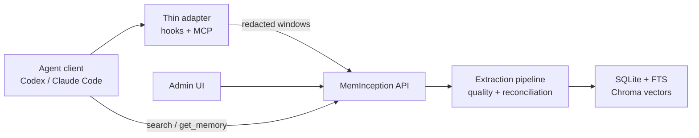

# MemInception

MemInception is an open-source memory layer for coding agents and development
teams. It turns source documents, team systems, and long agent sessions into
searchable, provenance-backed memories that can be reused through an MCP server,
an admin API, and agent-client integrations.

The project is early, but the core shape is intentional: client adapters stay
thin, the service owns extraction and lifecycle decisions, and every memory keeps
enough source evidence to be reviewed or retired later.

## What It Does

- Ingests knowledge from genes such as wiki pages, issue trackers, GitHub Pages,
  Teams exports, and generated agent-session packages.
- Extracts durable facts, decisions, procedures, and conventions with quality
  gates before persistence.
- Stores memory, provenance, review state, full-text search, and vector search
  in a local or self-hosted service.
- Exposes an MCP server so Codex, Claude Code, and other clients can search and
  submit generated session summaries.
- Provides a React admin UI for source management, review queues, memory detail,
  entity browsing, and runtime settings.

Built-in genes today: `confluence`, `jira`, `github_pages`, `teams`, and
`agent_session`.

## Architecture



Client adapters collect bounded, redacted evidence windows and upload them to
`POST /api/agent-sessions/windows`. The service canonicalizes the window,
generates the package, and queues the source sync. This keeps agent clients
portable across local and future hosted deployments.

## Quick Start

Requirements:

- Python 3.12 or newer
- Node.js 20 or newer for the admin UI
- `uv` recommended for Python dependency management

```bash
git clone https://github.com/DoDoMan-TTT/mem-inception.git
cd mem-inception

uv sync --extra dev
cp .env.example .env
uv run meminception init
uv run meminception api
```

In another terminal:

```bash
cd admin-ui
npm ci
npm run dev
```

Open `http://localhost:5174`. The UI proxies API calls to
`http://localhost:8765`.

For detailed setup, configuration, and first-source examples, see
[docs/quickstart.md](docs/quickstart.md).

The complete docs map is in [docs/README.md](docs/README.md).

## Agent Integrations

Installable examples live under:

- [integrations/codex/meminception-memory](integrations/codex/meminception-memory)
- [integrations/claude-code/meminception-memory](integrations/claude-code/meminception-memory)

Both use the same adapter contract: hook payload in, compact memory context out,
and redacted session windows uploaded to the service. See
[docs/integrations/agent-clients.md](docs/integrations/agent-clients.md) for the
client-side versus service-side boundary.

## Project Layout

```text
src/meminception/        Python service, CLI, pipeline, genes, MCP server
admin-ui/               React admin console
integrations/           Codex and Claude Code plugin packages
docs/design/            Design notes for memory extraction and agent sessions
tests/                  Python tests
```

## Development

Common commands:

```bash
make install
make lint
make test
make ui-lint
make ui-test
make ui-build
```

The same checks are wired in GitHub Actions. See
[CONTRIBUTING.md](CONTRIBUTING.md) before opening a pull request.

## Status

MemInception is alpha software. The local/self-hosted path is the primary target
today. The agent-session boundary is designed so the same adapters can point at
a hosted service later without teaching the service to read local transcript
files.

## License

Apache License 2.0. See [LICENSE](LICENSE).
