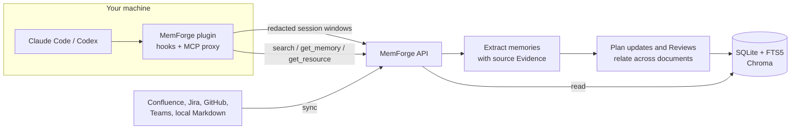

# MemForge

**Help agents remember the decisions behind your work.**

A memory layer for AI agents, with source citations and rechecking when
connected documents change.

MemForge builds it from Confluence, Jira, GitHub, Teams and your agents'
sessions. Source sync rechecks affected memories against new revisions. The
packaged agent integrations support Claude Code and Codex.

<p>
  <a href="https://github.com/shno-labs/mem-forge/actions/workflows/ci.yml"></a>
  
  
</p>


> **Status: alpha.** APIs, storage formats and plugin packaging may change.
> The open-source build runs for one user on one machine.

## Quick start

You need Docker with Compose v2 and a model API key (Anthropic for extraction by
default, OpenAI for embeddings).

```bash
git clone https://github.com/shno-labs/mem-forge.git && cd mem-forge
cp .env.example .env   # set MEMFORGE_ENRICHMENT_API_KEY and MEMFORGE_EMBEDDING_API_KEY
docker compose up --build
```

The admin UI is at http://localhost:5174. Then install the agent plugin:

```text
# Claude Code (inside a session)
/plugin marketplace add shno-labs/mem-forge
/plugin install memory@memforge
```

```bash
# Codex
codex plugin marketplace add shno-labs/mem-forge
codex plugin add memory@memforge
```

Start a new agent session. Hooks upload eligible session windows, and your
agent can search memory. See [plugin routing](docs/quickstart.md#plugin-routing)
when using a hosted endpoint or more than one workspace:

```text
Before changing the capture flow, check MemForge for decisions and conventions
that apply, and show the evidence for any you rely on.
```

To add Confluence, Jira or other sources, open **Sources** in the admin UI. The
[quickstart](docs/quickstart.md) covers model settings, local folders, the host
CLI and network details.

## Why MemForge

**Your sessions and your team's docs, in one memory.** Agent plugins capture
sessions through lifecycle hooks; today that is Claude Code and Codex. MemForge
keeps the decisions, conventions and corrections that you stated, not
everything the agent said. Every connected agent reads and writes the same
store, so a decision made in Claude Code is available in Codex. Session
memories are private to the person who had the session. Document sources sit in the same store and come back from
the same `search` call.

**Recheck knowledge as sources change.** A successful source sync evaluates
changed Evidence and the memories it supports. Supported memories can be kept;
updates may replace or retire a memory, or await a Review. Unresolved support
is preserved rather than treated as proof that a memory is false. Previous
versions retain their lifecycle history. Across documents, `equivalent`,
`updates` and `contradicts` relations help agents see competing knowledge.

**Readable Evidence with traceable sources.** `get_memory` returns Evidence
details, including citation text or excerpts and available source links. Readable text can be focused wording
produced by the model; it is not always a verbatim quotation. Source-backed
citations retain revision and range locators where available, and
`get_resource` opens the pinned citation material or backing artifact. Managed
session Evidence points to the generated concept document; raw conversation
windows are not retained.

**Self-hosted and open source.** Apache-2.0. The service and local data run from
`docker compose up` on your machine (SQLite, FTS5 and Chroma). You bring your
own model endpoints and keys; configured providers receive inference inputs.
Session text is redacted in the plugin and again in the service.

## How it works


```mermaid
flowchart LR
  subgraph You["Your machine"]
    CC["Claude Code / Codex"]
    Plugin["MemForge plugin<br/>hooks + MCP proxy"]
  end
  Docs["Confluence, Jira, GitHub,<br/>Teams, local Markdown"]
  API["MemForge API"]
  Extract["Extract memories<br/>with source Evidence"]
  Recheck["Plan updates and Reviews<br/>relate across documents"]
  Store[("SQLite + FTS5<br/>Chroma")]

  CC --> Plugin
  Plugin -- "redacted session windows" --> API
  Docs -- "sync" --> API
  API --> Extract --> Recheck --> Store
  Plugin -- "search / get_memory / get_resource" --> API
  API -- "read" --> Store
```

1. **Capture.** Plugin hooks upload bounded, redacted windows of each session.
   Connectors sync documents on demand or on a schedule.
2. **Extract.** An LLM turns each source into short memories (facts, decisions,
   procedures, conventions), with selected supporting Evidence.
3. **Reconcile.** When a source changes, affected memories are re-checked
   against the new revision, and new memories are compared with related ones
   from other documents.
4. **Recall.** Agents call MCP tools: `search` for memory cards, `get_memory`
   for evidence and relations, `get_resource` for the backing document. You
   can also ask the agent to create, correct or retire a memory; the plugin
   tells the agent to confirm with you before it writes.

More detail: [architecture](docs/architecture.md) and
[agent client integration](docs/integrations/agent-clients.md).

## How it compares

These projects address related needs with different data models. The following
summary uses their public documentation checked on October 7, 2026; it is not a
quality or latency benchmark. Corrections are welcome with a source link.

| | MemForge | Mem0 | Zep / Graphiti | claude-mem | Unblocked |
| --- | --- | --- | --- | --- | --- |
| Main focus | Source-backed Memory and coding-session knowledge | Memory APIs for applications and agents | Temporal context graphs | Persistent coding-session observations | Context from connected engineering tools |
| Source input | Confluence, Jira, GitHub, Teams, local files and plugin session windows | Application-provided content and integrations | Episodes supplied through APIs, loaders or MCP | Coding-agent hooks | Code, tickets, documents, conversations and other connected tools |
| Changing knowledge | Recheck Source revisions; retain lifecycle history and gated Reviews | v3 extraction adds facts with temporal context; manual update/delete APIs are separate | Facts have temporal validity and old facts can be invalidated | Session observations and retrieval | Reconciles sources using context, recency and authority signals |
| Evidence | Readable citation text and backing source links; pinned locators where available | Consult the selected library or Platform API contract | Source episodes and temporal facts | Observation identifiers | Citations to files, PRs, tickets and documents |
| Open-source option | Apache-2.0 local service | Apache-2.0 library; hosted Platform is separate | Apache-2.0 Graphiti; hosted Zep is separate | Apache-2.0 local service | Hosted product |

<details>
<summary>Sources for this table</summary>

- Mem0: [README](https://github.com/mem0ai/mem0), [OSS v3 migration](https://docs.mem0.ai/migration/oss-v2-to-v3), [Platform v3 migration](https://docs.mem0.ai/migration/platform-v2-to-v3), [Claude Code plugin](https://docs.mem0.ai/integrations/claude-code), [pricing](https://mem0.ai/pricing)
- Zep / Graphiti: [Graphiti README](https://github.com/getzep/graphiti), [edge model](https://github.com/getzep/graphiti/blob/main/graphiti_core/edges.py), [Community Edition notice](https://blog.getzep.com/announcing-a-new-direction-for-zeps-open-source-strategy/), [Zep Ingest](https://help.getzep.com/zep-ingest), [pricing](https://www.getzep.com/pricing)
- claude-mem: [README](https://github.com/thedotmack/claude-mem), [search tools](https://docs.claude-mem.ai/usage/search-tools.md)
- Unblocked: [product overview](https://getunblocked.com/ai-info/), [context engine](https://getunblocked.com/blog/inside-the-unblocked-context-engine/), [MCP](https://getunblocked.com/unblocked-mcp/), [pricing](https://getunblocked.com/pricing/)

</details>

## Sources

| Source | What is synced |
| --- | --- |
| Claude Code, Codex | Decisions, conventions and corrections from your sessions (private to you) |
| Confluence | Pages, including exported PDFs; accepts a root, space or page URL |
| Jira | Tickets, decisions and work items |
| GitHub Repository | Repository files from GitHub or GitHub Enterprise, scoped by folders and file types |
| GitHub Pages | Rendered documentation pages |
| Microsoft Teams | Channel messages, group chats and direct messages |
| Local Repository | Markdown, text, JSON and HTML files from a local folder or repo, uploaded by the local daemon ([guide](docs/local-repo-sync.md)) |

## Status and limits

- Alpha. Expect breaking changes to APIs, storage and plugin packaging.
- The open-source build is single-user, has no authentication, and binds to
  `127.0.0.1` only. Do not expose it on a network.
- Model extraction and semantic judgments can miss useful knowledge or make
  mistakes. Check the cited Evidence before relying on a consequential claim.
- An extraction model is required; without one, syncs store content but create
  no memories.

## Documentation

- [Quickstart](docs/quickstart.md): setup, models, plugins, sources, CLI,
  development from source
- [Docs index](docs/README.md): architecture, API, design notes and ADRs
- [Contributing](CONTRIBUTING.md)

## License

Apache License 2.0. See [LICENSE](LICENSE).
