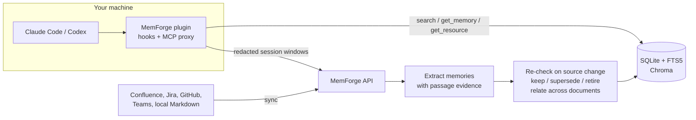

# MemForge

**Give every agent your team's brain on day one.**

The memory layer for AI agents. Everything your team knows. Cited, and always
up to date.

MemForge builds it from Confluence, Jira, GitHub, Teams and your agents'
sessions, and re-checks each memory when its source changes. Works with Claude
Code and Codex today. Claude Desktop, ChatGPT and Copilot are on the way.

<p>
  <a href="https://github.com/shno-labs/mem-forge/actions/workflows/ci.yml"></a>
  
  
</p>

<!--
  DEMO GIF (to record, under 15 s, loops):
  1. Agent session: "Which Node version does the admin UI use?" The agent answers "Node 20" and shows the memory card quoting the Confluence page.
  2. The Confluence page is edited to "Node 22", and the source syncs.
  3. New agent session, same question: "Node 22", quoting the new passage; the old memory shows as superseded in the admin UI.
  Save as .github/assets/demo.gif and replace this comment with:
  <p align="center"></p>
-->

> **Status: alpha.** APIs, storage formats and plugin packaging may change.
> The open-source build runs for one user on one machine.

## Quick start

You need Docker with Compose v2 and a model API key (Anthropic for extraction by
default, OpenAI for embeddings).

```bash
git clone https://github.com/shno-labs/mem-forge.git && cd mem-forge
cp .env.example .env   # set MEMFORGE_ENRICHMENT_API_KEY and MEMFORGE_EMBEDDING_API_KEY
docker compose up --build
```

The admin UI is at http://localhost:5174. Then install the agent plugin:

```text
# Claude Code (inside a session)
/plugin marketplace add shno-labs/mem-forge
/plugin install memory@memforge
```

```bash
# Codex
codex plugin marketplace add shno-labs/mem-forge
codex plugin add memory@memforge
```

Start a new agent session. From now on, sessions are captured, and your agent
can search memory:

```text
Before changing the capture flow, check MemForge for decisions and conventions
that apply, and show the evidence for any you rely on.
```

To add Confluence, Jira or other sources, open **Sources** in the admin UI. The
[quickstart](docs/quickstart.md) covers model settings, local folders, the host
CLI and network details.

## Why MemForge

**Your sessions and your team's docs, in one memory.** Agent plugins capture
sessions through lifecycle hooks; today that is Claude Code and Codex. MemForge
keeps the decisions, conventions and corrections that you stated, not
everything the agent said. Every connected agent reads and writes the same
store, so a decision made in Claude Code is available in Codex. Session
memories are private to the person who had the session. Document sources sit in the same store and come back from
the same `search` call.

**Memories change when their sources change.** On every sync, MemForge compares
the new revision with the memories it previously produced. A memory the new
text still supports is kept. One it no longer supports is superseded by a new
memory or retired, and the old row stays with the reason and time. Across
documents, MemForge records `equivalent`, `updates` and `contradicts` relations,
and search results carry a notice such as "Conflicts with Memory X from
&lt;source&gt;", so the agent sees the conflict instead of picking one side
silently.

**Evidence is a passage, not just a link.** Each text evidence item is a quoted
passage anchored to a character range in a specific source revision. Agents
get the quote from `get_memory`, the REST API returns the revision id and the
range, and the agent can fetch the backing page or PDF with `get_resource`.

**Self-hosted and open source.** Apache-2.0. Everything runs from
`docker compose up` on your machine, with data in a local Docker volume
(SQLite, FTS5 and Chroma). You bring your own model keys. Session text is
redacted in the plugin and again in the service, and raw session windows are
not stored.

## How it works


```mermaid
flowchart LR
  subgraph You["Your machine"]
    CC["Claude Code / Codex"]
    Plugin["MemForge plugin<br/>hooks + MCP proxy"]
  end
  Docs["Confluence, Jira, GitHub,<br/>Teams, local Markdown"]
  API["MemForge API"]
  Extract["Extract memories<br/>with passage evidence"]
  Recheck["Re-check on source change<br/>keep / supersede / retire<br/>relate across documents"]
  Store[("SQLite + FTS5<br/>Chroma")]

  CC --> Plugin
  Plugin -- "redacted session windows" --> API
  Docs -- "sync" --> API
  API --> Extract --> Recheck --> Store
  Plugin -- "search / get_memory / get_resource" --> Store
```

1. **Capture.** Plugin hooks upload bounded, redacted windows of each session.
   Connectors sync documents on demand or on a schedule.
2. **Extract.** An LLM turns each source into short memories (facts, decisions,
   procedures, conventions), each tied to the passage that supports it.
3. **Reconcile.** When a source changes, affected memories are re-checked
   against the new revision, and new memories are compared with related ones
   from other documents.
4. **Recall.** Agents call MCP tools: `search` for memory cards, `get_memory`
   for evidence and relations, `get_resource` for the backing document. You
   can also ask the agent to create, correct or retire a memory; the plugin
   tells the agent to confirm with you before it writes.

More detail: [architecture](docs/architecture.md) and
[agent client integration](docs/integrations/agent-clients.md).

## How it compares

Checked against each project's public docs in September 2026. Corrections are
welcome; open an issue with a link.

| | MemForge | Mem0 | Zep / Graphiti | claude-mem | Unblocked |
| --- | --- | --- | --- | --- | --- |
| Captures coding-agent sessions | Claude Code and Codex hooks | Claude Code plugin hooks | Only what the agent saves through a tool call | Claude Code hooks; Codex plugin | No; serves context to agents over MCP |
| Team documents in the same store | Confluence, Jira, GitHub, Teams, local files | No connectors found | Loaders for Slack exports, email, text and JSON; no Confluence or Jira | No | Broad: Confluence, Jira, GitHub, Slack, Notion and more |
| When a fact changes | Re-checked against the new source revision; superseded or retired, old version kept | v3 writes are add-only; old and new facts coexist and retrieval ranking should surface the current one | Contradicted facts are invalidated with `valid_at` / `invalid_at`, not deleted | No documented mechanism | Reconciles conflicting sources when answering, using recency and authority signals |
| What a citation points to | Quoted passage in a specific source revision | Not documented | Source episode ids | Observation ids, with files read and modified | Link to the file, PR, ticket or doc |
| Self-hosting and license | Apache-2.0, `docker compose up` | Apache-2.0, self-hosted server | Graphiti Apache-2.0; Zep Community Edition no longer maintained | Apache-2.0, local | Proprietary; on-prem on Enterprise only |
| Price | Free | Free self-hosted; hosted plans from free to $249/month | Graphiti free; hosted Zep from $125/month | Free; hosted plan available | $29 per user per month, billed annually |

<details>
<summary>Sources for this table</summary>

- Mem0: [README](https://github.com/mem0ai/mem0), [v2 to v3 migration](https://docs.mem0.ai/migration/platform-v2-to-v3), [Claude Code plugin](https://docs.mem0.ai/integrations/claude-code), [pricing](https://mem0.ai/pricing)
- Zep / Graphiti: [Graphiti README](https://github.com/getzep/graphiti), [edge model](https://github.com/getzep/graphiti/blob/main/graphiti_core/edges.py), [Community Edition notice](https://blog.getzep.com/announcing-a-new-direction-for-zeps-open-source-strategy/), [Zep Ingest](https://help.getzep.com/zep-ingest), [pricing](https://www.getzep.com/pricing)
- claude-mem: [README](https://github.com/thedotmack/claude-mem), [search tools](https://docs.claude-mem.ai/usage/search-tools.md)
- Unblocked: [product overview](https://getunblocked.com/ai-info/), [context engine](https://getunblocked.com/blog/inside-the-unblocked-context-engine/), [MCP](https://getunblocked.com/unblocked-mcp/), [pricing](https://getunblocked.com/pricing/)

</details>

## Benchmark (coming soon)

We are preparing a reproducible A/B test: the same coding task run in two
worktrees of the same repository, one agent with MemForge and one without,
measuring whether the agent reuses earlier decisions and how many turns and
tokens the task takes. The task set, scripts and raw results will be published
here together. No numbers yet.

## Sources

| Source | What is synced |
| --- | --- |
| Claude Code, Codex | Decisions, conventions and corrections from your sessions (private to you) |
| Confluence | Pages, including exported PDFs; accepts a root, space or page URL |
| Jira | Tickets, decisions and work items |
| GitHub Repository | Repository files from GitHub or GitHub Enterprise, scoped by folders and file types |
| GitHub Pages | Rendered documentation pages |
| Microsoft Teams | Channel messages, group chats and direct messages |
| Local Repository | Markdown, text, JSON and HTML files from a local folder or repo, uploaded by the local daemon ([guide](docs/local-repo-sync.md)) |

## Status and limits

- Alpha. Expect breaking changes to APIs, storage and plugin packaging.
- The open-source build is single-user, has no authentication, and binds to
  `127.0.0.1` only. Do not expose it on a network.
- An extraction model is required; without one, syncs store content but create
  no memories.

## Documentation

- [Quickstart](docs/quickstart.md): setup, models, plugins, sources, CLI,
  development from source
- [Docs index](docs/README.md): architecture, API, design notes and ADRs
- [Contributing](CONTRIBUTING.md)

## License

Apache License 2.0. See [LICENSE](LICENSE).
