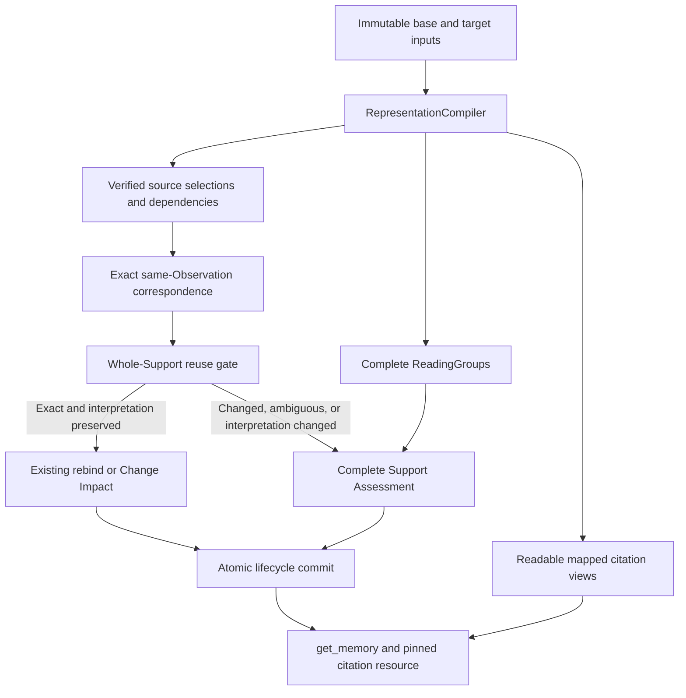

# ADR 0046: Separate Evidence correspondence from citation presentation

## Status

Proposed, 2026-10-01. This is a design change, not a description of released
behavior. It refines representation and citation contracts in
[ADR 0030](0030-compile-revision-pinned-evidence-fragments.md) and exact
correspondence/routing in
[ADR 0034](0034-unify-incremental-support-and-claim-assessment.md). Until
implemented and verified, ADR 0034's current digest matching remains in force.

## Context

An Evidence reference serves three purposes: locate authoritative material in
an immutable revision, supply the material needed to judge a claim, and let a
reader verify that claim. These purposes currently share the Fragment's text
representation too closely. The matcher compares every persisted digest,
normally both `raw_content_sha256` and `presentation_sha256`. A rendering change
therefore prevents exact correspondence even when the source selection has not
changed. The current raw digest can describe projected representation text; its
name alone does not prove an anchor into the provider's native input.

Preserving whole structures avoids lost table headers, merged cells and list
scope, but raw structure serialization is not a suitable citation. A retained
table passed back through Markdown can also be parsed as unrelated prose or a
list. The source-side cause predates the later ReadingGroup orchestration; the
[historical replay](../research/2026-10-01-evidence-readability-regression.md)
records the regression boundary. Reverting to lossy table flattening would
restore appearances while losing Evidence semantics.

## Decision

### 1. Keep one compilation seam and three separate outputs

The existing operation-local `RepresentationCompiler` owns compilation, source
coordinates, Fragment selections, deterministic presentation and ReadingGroups.
It delegates provider-native parsing to the source adapter's declared contract;
owning compilation does not make it the owner of every provider grammar.
No caller reparses a citation or supplies an LLM-generated quote as Evidence.
The compiler produces three views of the same immutable input:

| View | Purpose | Identity and completeness |
| --- | --- | --- |
| Source selection | Locate and compare a Fragment's authoritative material | Revision-pinned native field/structure selector or verified source spans, integrity digest, and versioned content value |
| ReadingGroup | Read the full structure and its dependencies | Complete interpretive structure; operation-local, no new business state |
| Citation presentation | Show the selected material in readable form | Deterministic rendering with source mapping and a renderer version; never matching authority |

These are outputs behind the existing seam, not three public parser modules or
a persistent Fragment-identity ledger. An Evidence Unit still consists of one
Primary and its Required refs, and Support is validated and rebound atomically.

The persisted selection binding must carry the pinned input/snapshot identity,
source-coordinate profile, verified selector or spans, raw integrity digest,
content-schema version and content digest. Existing Evidence parts own this
binding; Fragment catalog numbers remain transient. Dependency selections and
the interpretation-contract version are included in the complete Support's
reuse check. Presentation text/digest and renderer version remain derivation
metadata. Digests index candidate matches; a final exact comparison or verified
native mapping must confirm them. No hash alone proves occurrence identity.

For native text and structured textual fields, the existing immutable
`SourceObservationRevision.content` owns the retained authoritative coordinate
text under its declared native profile. Citation-relevant title/field values
must also belong to that immutable representation, not mutable Document metadata.
Strict decoding and verified byte-to-Unicode mapping are required where byte
integrity is claimed. Retain binary authority through revision-pinned,
content-addressed Artifacts with explicit retention/access checks.

[ADR 0041](0041-record-stored-input-on-the-source-unit-revision.md) retains only
the current input per Unit and writes its objects in place. It supplies current
reprocess input, **not historical native snapshot authority**. This supersedes
the draft's earlier assumption that its revision ID implied immutable history.
Historical correspondence/resources read the existing immutable Observation
Revision or pinned Artifact. If that authority is unavailable or unverifiable,
they report that limit; they never read a Document's latest input as old Evidence.
Provider-native decoding belongs at the adapter/representation boundary; shared
Evidence and lifecycle services have no Confluence-specific matching branch.

Source-neutral prose cleanup preserves authored headings and sentences. A title
such as `Page Properties` or a line beginning `Generated by` is not evidence of
provider-generated navigation. Provider-specific suppression requires the
adapter to identify the actual native structure and preserve authoritative
material needed to interpret claims; moving a text-only deletion rule into an
adapter does not make it safe. The immutable native input remains intact.

### 2. State the unchanged-content guarantee precisely

For two effective revisions of the same Source Unit and Observation, an old
source selection **must correspond** when its content is unchanged and its
base and target occurrence are provably unique under the profile's selection
contract. Offsets, catalog numbering, revision IDs,
renderer versions, citation whitespace and insertions elsewhere must not break
that correspondence. This applies independently to Primary and Required parts.
New Evidence refs still name the new immutable revision; matching does not mean
reusing the old ref ID or editing its historical row.

Content equality is exact equality under the representation profile's declared,
versioned source-content schema, not semantic similarity. Raw snapshot integrity
is checked separately. For example, XML attribute serialization order and a
declared non-semantic macro instance ID may be excluded from a content value;
status titles, issue keys, links, code whitespace and business values may not be
silently stripped. Canonicalization rules must be specific to the representation
profile and tested. Generic whitespace cleanup, fuzzy quote matching and a
normalized rendered string are insufficient proof.

Correspondence is established in this order:

1. Restrict candidates to the authoritative target membership of the same
   Source Unit and Observation, with existing visibility and coverage guards.
2. Resolve a source-native stable selector when supplied by the profile; verify
   that it selects exactly one target occurrence and compare the content value.
3. Otherwise find exact equal content selections within that Observation in
   both snapshots. A unique base and target candidate establish material
   correspondence. Multiple equal candidates on either side need
   a profile-proven structural mapping, such as unique matched parent and
   neighboring structures. Position alone, a diff algorithm's arbitrary tie,
   a row index or a hash collision is not that proof.
4. Retain `AMBIGUOUS` if occurrence identity cannot be established. An unresolved
   legacy selector or a changed selection goes to existing assessment; missing
   coverage retains `UNKNOWN`, and only authoritative absence proves removal.

The guarantee cannot cover indistinguishable duplicate occurrences, unavailable
historical input, or a selection whose structure actually changed. Those cases
retain the existing fail-closed behavior. One native ID is not globally trusted
across different Sources or Observations.

Material correspondence is defined by verified snapshot selections; it is not
proof that a physical occurrence survived every intermediate edit. Deleting an
occurrence and inserting an identical copy can yield the same two snapshots as
moving it. In particular, two identical old occurrences reduced to one target
must not both be rebound as an occurrence-identity match without native or
structural disambiguation. Hash indexes only narrow candidates; exact values,
cardinality, profile compatibility and dependencies provide the proof.

For large documents, parse each immutable input once and index exact source
content values behind the existing compiler seam. Confirm candidate values and
cardinality against the complete authoritative representation; an LLM request's
subset or its truncated display is not the matching universe. Document size
does not change identity semantics. Declared parse/catalog capacity limits
remain explicit typed limitations, not permission to omit unmatched material,
infer removal or split atomic publication. Capacity and semantic coverage need
their own acceptance evidence; a successful indexed lookup is insufficient.

When a source-content schema changes, compare both snapshots under the same
target schema, using a verified mapping of the old selection into its immutable
source input. Persisted digests with different schemas must never be compared
as equivalent. If the old mapping cannot be verified, perform whole-Support
assessment; do not guess or mutate the historical anchor. This permits future
renderer upgrades to preserve correspondence without promising that every
legacy compiler upgrade is a cost-free exact match.

### 3. Separate correspondence from permission to reuse Support

`EXACT_UNCHANGED` will describe proven unchanged **source selection**, rather
than equality of every display digest. It does not by itself authorize Support
reuse. The planner computes a separate reuse gate for the complete Support:
all parts correspond uniquely, remain eligible for their roles, retain their
interpretation/dependency contract, and pass existing access and stale guards.
This gate is operation-local routing metadata, not a new lifecycle status.

| Target situation | Correspondence | Whole-Support route |
| --- | --- | --- |
| Renderer-only change; dependencies and interpretation unchanged | Exact source correspondence | Existing no-change rebind, or Change Impact if the revision has source changes |
| Row unchanged; a header, footnote, scope qualifier or other revision content changes | Row still corresponds | Required-part change enters Support Assessment; other changes enter Change Impact; ambiguous scope is affected |
| Same source content; compiler fixes its interpretation or changes selection/dependency semantics | Correspondence may still be exact | Reuse gate fails; Support Assessment |
| Text unchanged but occurrence cannot be proven among duplicates | Ambiguous | Support Assessment |
| Unknown membership under partial projection | Unknown | Existing unresolved/KEEP behavior, no destructive inference |

Changed content elsewhere remains in the complete ChangeBundle, including
removed qualifiers. Exact ref matching must not bypass Change Impact. A matched
Required heading does not prove that everything below it is unchanged. The
Primary must remain authorized for revalidation; correspondence does not give
unchanged content new Claim Extraction authority.

The semantic claim under assessment remains fixed. Only complete current
Evidence can re-support it. Old giant-table ref to several new row refs is a
selection-shape change, not a one-to-one exact rebind. Assessment may choose the
new parts together and atomically replace the Support assertion, preserving
Memory identity and historical Evidence.

The proposed runtime flow is:



Partial coverage takes the existing unresolved route before reuse or assessment;
it does not enter the two success branches shown above.

### 4. Parse native structures before presenting them

Adapters declare the native representation and retain its immutable input.
Each source adapter owns its native parser, field schema, comparison rules,
identity declarations and source-specific rendering transforms. Confluence
storage XML, `ac`/`ri` namespaces, macros and native code bodies belong to the
Confluence adapter. Jira issue, comment, changelog and supported native rich-text
structures belong to the Jira adapter. Provider-specific helpers may live in
explicit provider packages, but not in generic normalization, extraction,
matching, lifecycle or storage methods.
The format declaration must identify the actual native field representation,
not infer a dialect from source type or familiar control text. For example,
Jira text-field renderer configuration may vary by field, project and issue
type; an adapter must retain an authoritative declaration or explicitly trusted
configuration with the immutable input. Unsupported or unknown representations
remain typed unavailable instead of being guessed as Markdown or active HTML.

The composition root registers these adapter contracts. Shared compilation
consumes their typed selections, source-value mappings, dependency declarations
and versioned schemas. It validates source integrity, coordinates, occurrence
uniqueness, authority and completeness; it does not switch on source type to
interpret native tags or fields. Standard Markdown/HTML structure algorithms
may remain shared. They must receive already-decoded native nodes or an explicit
adapter contract rather than gaining Confluence/Jira exceptions. Cloud uses the
same OSS source adapters and declarations, with no separate native-parser fallback.

A native diagram scene and its exported image retain separate immutable source
identities. File proximity, matching names or a shared commit do not establish
export equivalence; a later scene revision cannot silently supply text for an
older image citation. A reusable declared diagram-format parser may expose
exact text, geometry and explicit object/arrow bindings behind the source
adapter. Missing bindings remain explicit limitations. Geometric proximity is
not a compiler-proven semantic association, and a native text selection is not
pixel Evidence. Authenticated companions need an explicit retained relationship
and version contract; otherwise they are separately authorized material.

Source-specific boilerplate recognition also belongs to the adapter and requires
a verified native construct. An authored heading or sentence does not become
disposable merely because its text resembles generated UI material. Generic
cleanup must not delete provider-labelled headings/footers from other sources,
establish authoritative emptiness or modify retained source authority.

Central registration is not itself an ownership defect: a registry may reference
adapter-owned contracts without defining their native semantics. Source adapters
may delegate to separately reviewable provider-format modules rather than grow
one large method. Providers sharing a standard format should reuse its compiler;
they must not copy its parsing or correspondence implementation into each adapter.
A Jira macro embedded in Confluence storage remains Confluence storage grammar,
distinct from Jira issue payload semantics.

This changes the ownership of native schema definitions and the multi-provider
projection implementation, not the need for shared registration. Existing shared
native cleanup and the mixed private parser are design debt, not precedents for the new seam.
Preserve old frozen experiment code as evidence; new production parsing must
respect the adapter boundary.

Confluence storage is XML with custom namespaces, not ordinary rendered HTML.
Its representation parser must understand supported macros and complete tables;
it must not hand an opaque storage table to a CommonMark HTML-block parser.
Unknown constructs preserve their source selection and return a typed
representation limitation when their meaning cannot be presented safely.
They cannot silently become a selectable prose/list Fragment.
If an incumbent's selected material cannot be mapped or interpreted safely,
the existing typed derivation-failure path prevents that revision's commit and
preserves its Support. A parse limitation is never authoritative absence or a
model finding of `UNSUPPORTED`.

Native source mappings use declared coordinate spaces. A selection composed of
non-contiguous cells/fields has verified span or field selections, not a
fabricated contiguous excerpt. Every displayed value and source quotation is
traceable to its selected revision. Derived labels, such as a table's header
path, are marked as structure/context rather than presented as literal quotes.

Supported constructs have deterministic readable renderings: table columns and
rows retain their association; status macros show their stored title and any
supported meaning-bearing values, including an authored colour;
issue/link macros expose their source identifier and link; code and nested lists
retain their structure. Content mode belongs to the native representation
grammar: Markdown fenced/inline/indented code is literal; ordinary HTML
`pre/code` are formatted children whose supported markup is decoded while
whitespace is retained. Provider plain-text/CDATA remains literal only under its
explicit native descriptor. A tag name or a document/provider-specific prompt
cannot decide whether contained markup is authoritative structure. An empty status remains empty/unknown, never PASS or
FAIL by inference. Rendering a user macro may use an authoritative snapshot
label or its stored identifier, but must not silently resolve a new live value
into an old citation. Hiding macro control metadata is allowed; hiding material
macro content is not. Preserving native values in canonical material does not
prove that the reading or citation view exposes those values. Every supported
meaning-bearing native value must have a faithful mapped readable representation,
or the adapter must report an explicit unsupported interpretation. Source-authored
conventions determine significance; a colour must not silently be inferred from
a title or treated as decorative universally. Native parameter interpretation
belongs to the provider-format adapter, not the generic extractor or matcher.

### 5. Form accurate claims and readable citations at extraction origin

A complete structure remains a ReadingGroup. The compiler may offer a smaller
selectable view when it preserves the applicable structural meaning and exact
source mapping. A row can include its verified column associations; a list item
can include its applicable parent scope. Unsupported local interpretation keeps
the complete structure or reports explicit unavailability. Citation granularity
must not silently reduce reading scope or origination authority.

#### Primary and Required selection

Primary directly supports the claim's central assertion. Choose by the actual
support relationship and source authority, not by provider, format, field label,
position, length or recency. Prefer a focused complete readable selection when
its interpretation is verified; retain a complete structure when necessary.
Required-only context cannot be promoted to Primary.

Required refs are **best-effort additional citations**, prioritizing accuracy,
readability and low false positives. Select confidently contributing material
that helps verify the claim's conditions, scope, exception, timing or meaning.
Omitting an additional related citation alone is acceptable. Neither 100% recall
nor a proof of an inclusion-minimal dependency set is an acceptance requirement.
There is no numeric cap. Nearby or topically related material is not automatically
Required, and a heading, caption, table header or footnote has no mandatory role
merely because of its structure type. Do not repeat interpretation already
faithfully represented in the Primary or another selected part.

This supersedes the draft's exhaustive selected-basis and inclusion-minimal
Required requirements. It does not relax claim accuracy: the complete authorized
immutable source must support every material assertion and qualification in the
claim and its metadata, and the displayed Primary must directly evidence the
central assertion. A wrong or misleading citation, an invented source fact, or
missing claim wording that changes the source meaning remains a defect. Citation
recall and source-to-claim knowledge coverage are separate measurements.

Displayed citations are not an exhaustive inventory of source dependencies.
Compiler-proven interpretation bindings retain their exact immutable mapping.
Unchanged displayed refs alone cannot authorize whole-Memory reuse: the existing
complete ChangeBundle includes changed and removed source content outside those
refs and routes it through Change Impact. Changed interpretation or unresolved
mapping enters Support Assessment. No new citation-dependency ledger or lifecycle
state is introduced to compensate for best-effort citation recall.

Extraction and Support Assessment use the same source-neutral instructions:

```text
Read all supplied authorized source and interpretation before forming claims.
For every independently useful, source-supported conclusion:
- State its actual meaning, including material conditions, scope, logic, timing
  and modality. Do not turn a recorded instance or a proposed design into an
  unqualified current rule, or omit useful knowledge to reduce citations.
- Select an eligible authentic readable Primary that directly supports the
  central assertion. A merely related heading or closing note is insufficient.
- Add confidently relevant Required refs that contribute to verification and
  are not already represented. Aim for useful coverage, without requiring every
  related ref or duplicating mapped context. Missing an extra citation alone
  does not justify discarding or rewriting otherwise accurate knowledge.
- Use only supplied authorized refs. Do not invent quotations, promote context
  to Primary, infer facts from mutable titles, or interpret provider syntax.
```

The same relationship can occur in prose, conversations, structured fields or
structural documents. A short statement can directly state the rule; a formally
named section can be unrelated. Optional prompt examples illustrate these
relationships without introducing provider or document-type heuristics.

Ref quality is corrected at extraction origin and fixed-claim Support
Assessment. Candidate admission does not trim refs, switch their roles, repair
wording, or reject additional valid Memories as a remedy for selection quality.
Its existing schema and authority remain; the canonical source-grounding
instructions must agree across extraction, assessment and admission. Semantic
contract changes participate in durable work identity and cached-work invalidation.
The first rollout reassesses legacy selection quality; exact source matching
alone does not certify an old Primary or Required set as correct.

#### One semantic owner for final words and citations

The current canonical Value definition is the accepted ADR 0043/0034 amendment:
lasting reusable system/domain behavior, constraints, decisions and reasons,
ownership, configuration/limits and repeatable procedures. Events or status alone
are insufficient, but an event can establish lasting knowledge. When uncertain,
retain supported knowledge for the existing Value judgment. The older six-month,
refactor and code-recoverability exclusions must not survive in a separate prompt.

Value policy is independent of owned-Evidence language. Preserve the existing
source-owned language instruction when replacing obsolete Value exclusions:
final claims retain their owned source language and technical terms; read-only
context or the instruction language does not translate them by default. This
changes neither Evidence bytes nor citation roles and introduces no provider-
specific language parsing.

The Source Unit extraction operation owns complete reading and final formation.
Existing request packing is a transport detail; a successful request does not
prove complete Unit coverage. Read all authorized complete ReadingGroups while
keeping reading scope distinct from Claim Extraction authority. Application-owned
input receipts prove delivery and accounting, not cognitive reading or recall.
Do not require a model-produced worksheet, assertion ledger or disposition ontology.

Form each final standalone Memory's exact content and chosen citations together,
with one independently useful conclusion and its material qualifiers. A connected
procedure or inseparable decision/reason can remain one conclusion; independent
rules are not bundled merely because they share a topic. Explicitly authored
setup, scope, modality, conditions, branches and order must remain in final words.
The complete source supports actual metadata as well: an explicitly authored
entity may correspond to a supported alias in the claim without appearing as an
identical character substring. Mere occurrence of a name elsewhere is not proof
that it is an entity of that claim. Display titles are identity hints unless
retained as factual immutable source under the adapter contract. An update or
report date is not an effective boundary.

Use the existing Candidate fields in one response: an eligible direct
`primary_ref`, exact final content and metadata, then additional `required_refs`.
Required selection evaluates its incremental contribution to that settled claim,
not a provisional topic or a promised later wording. Field order clarifies this
responsibility; it is not proof of the model's internal reasoning. Effective
dates apply to the whole claim, not an event or one independently changing
clause. Explicit amendments and supersession stay in each affected standalone
claim, including useful historical or uncertain knowledge.

Provider-specific model interpretation is declared alongside the owning
adapter's field schema. Shared readers transport it with current structural
groups, carried witnesses and removed historical readings without parsing
provider field names or granting new Evidence authority. Stateless requests must
retain that context for carried text as well as newly read text. Extraction and
admission reuse the accepted source-neutral Value definition; the prior
code-recoverability, six-month/refactor and prefer-empty extraction exclusions
are superseded. This changes no admission decision policy.

Application emits those words and selections
unchanged. Calling the displayed selection a complete joint basis can imply the
exhaustive dependency obligation that the human contract rejects. This output
is accounting, not proof of semantic accuracy. It neither joins
model-authored clause/context trees nor runs a later wording model. Repeating
full meanings and modality fields for every ref does not establish Support and
adds another lossy semantic representation.

Before Candidate construction, a fallible checker receives the complete actual
source and exact final content/metadata/citations. Check both directions: useful
source knowledge must survive in final claims, and the claims must be accurate
with direct readable evidence and relevant citations. A broad entailed summary
does not prove that concrete source rules were retained. Producer rationales,
other Memories and navigation hints supply no missing source authority.

The checker returns only actionable source-grounded changes and genuinely
unresolved questions. Findings identify the affected final Memory, actual source
refs, authored meaning and required correction. Do not output confirmations,
withdrawn suspicions, notes or missing additional related citations as defects.
There is no per-criterion audit ontology or classification ledger. Mechanical
validation checks shape, known IDs, role eligibility, binding and access; it does
not claim to prove entailment, entity association, atomicity or recall.

Permit at most one whole-origin semantic revision followed by a fresh complete
check. Correct final words and selections together, preserving valid useful
knowledge; no score-based regeneration, earlier-result fallback or successful
subset. An unresolved or failed complete operation returns failure and preserves
incumbent Support. This introduces no per-Memory corrective lifecycle state and
moves no repair into admission. A clean model check remains fallible, especially
for visual/semantic errors shared by producer and checker. Independent source-only
review, repeated real-model runs and untouched holdouts remain necessary.

#### Complete reading, safety and validation

A complete Unit cannot silently skip an oversized or unread ReadingGroup and
publish other groups as complete. Use typed unavailability/failure, ordinary
retry/reprocess and incumbent preservation, without interpreting unread source
as absence. This supersedes the current partial `ExtractionPlan` behavior.
Planning returns an existing typed planning failure if any authorized group
cannot fit. Any failed or missing runtime group, missing planned result, or
claim whose Evidence remains unresolved after the existing selector correction
fails the complete operation; no successful subset becomes reusable output.
Omitting an optional related Required citation is distinct from returning an
invalid reference that cannot be resolved to authoritative material.

The atomic store boundary also checks the staged computation's terminal reason
and extraction policy under its existing writer fence. A computationally
`completed` planning failure is not committable, and completed predecessor-policy
work cannot bypass recovery invalidation by direct/deferred apply. SQLite and
Cloud adapters use the same readiness rule and existing persisted fields. This
adds no lifecycle state and does not reinterpret already applied historical
results. Support's existing unjudgeable `KEEP` behavior remains unchanged.

For existing multi-request workloads, the Unit owner must carry complete ordered
source context and resolve distant qualifications across request boundaries;
request-local rereading does not validate this contract. A one-catalog prototype
is not evidence of multi-request correctness. Actual schema and full-source
capacity are checked before calls; increasing limits or splitting transport to
bypass a failure is not implied by this decision.

Each request's presented Primary eligibility must equal its origination
authority. Full source context does not make every readable ref eligible to
originate a claim in that request. Keep the complete source selections and
reading structure, while presenting non-owned refs as supplementary context
and possible Required citations. Request-scoped eligibility and its identity
must agree in rendering and selector validation; aggregation and the complete
source audit retain the Unit's full authority. Limiting a role does not require
renumbering refs, changing native selections or filtering claim content.

Text and image authority remain distinct. Image-only facts require the actual
revision-pinned Artifact bytes, source/access identity and validated viewing
capability, not captions, model quotations, OCR hints or an unproven native
companion. Provider/format syntax belongs to its adapter; model image-delivery
limits belong to the LLM boundary. Multiple delivery views of one image remain
views of one Evidence selection, never new refs or authoritative source content.

An Artifact citation does not require every configured or consuming LLM to be
multimodal. `get_memory` returns the readable claim and revision-pinned citation
identity/resource, not unsolicited image bytes or transport detail views.
Human inspection and model interpretation are separate uses of that resource.
Text-only extraction and retrieval must remain usable with text-only models.

Configured-model image-input capability checking is deferred by the user to
[issue 497](https://github.com/shno-labs/mem-forge/issues/497), outside this
version's completion contract. That LLM-boundary follow-up must preserve source
adapter ownership and existing Support when pixels cannot be read. Current
online image acceptance uses the explicitly verified Sonnet route; it does not
certify arbitrary configured models. Citation identity/readability and ordinary
text use remain separate from optional image interpretation.

Phase-specific inputs and renderers make ownership explicit without appending
competing legacy response instructions. Compiler containers faithfully describe
actual structures; a table is not labeled as a list to reuse a packing flag.
Adding focused refs beside an invalid raw-XML Primary does not repair readability.

Evaluation reports claim accuracy, direct Primary, citation readability,
Required false positives/redundancy and best-effort recall separately from
knowledge coverage. Use complete authentic sources, frozen source-only knowledge
inventories, untouched source/representation holdouts and counterexamples. Accept
equivalent valid selections rather than requiring one arbitrary ref ID. Report
all operations, failures, corrections and lost expected claims; ref-count gains
obtained by discarding otherwise useful knowledge fail acceptance. Declaration,
receipt, literal membership or clean checker output is never semantic proof.

### 6. Carry citations through the actual tool boundary

`get_memory` returns readable deterministic excerpts and enough identity to
resolve every part: Evidence Unit/Support identity, persisted reference ID,
role, Source Unit, pinned revision and a resource reference. It does not send
raw namespace/control markup as the normal text excerpt. The MCP compactor must
retain these citation identities rather than keeping only excerpt and role.
If a tool's transport budget abbreviates an excerpt, it marks that excerpt as
incomplete and retains its pinned resource and dependency identities. It cannot
silently omit a Required part or present truncation as complete Evidence.

The resource operation resolves the exact authorized historical revision and
selection, with the complete Evidence Unit's access boundary. It returns the
selected material, its dependencies and provenance. A link to the latest
provider page may accompany it, but cannot replace a pinned resource. Missing
history or denied access returns a typed unavailable/denied result; it must
never silently serve the latest page. UI and MCP share this service contract.
Resource resolution must not reveal inaccessible Required material through an
otherwise visible Primary. Storage and resource adapters enforce the same scope.

### 7. Reprocess through the existing revision flow

The first rollout changes source mapping, Fragment shape and interpretation;
it therefore requires explicit derivation/compiler contract changes and
whole-Support reassessment for affected legacy Units. The user accepts this
one-time reprocessing cost. Use existing `REPROCESS` authorization and stored
inputs, with bounded inventory, dry-run and ordinary atomic revision commits.
No new migration ledger, alias bridge, business batch state or semantic
provenance backfill is introduced.

Observation/Revision identities are not repurposed to store different content.
Existing immutable-revision reuse must preserve the full representation contract.
A renderer-only upgrade recompiles a derived view without changing the source
revision's identity. If projected content or its source-coordinate profile
changes, the new identity includes that representation version and points to
the immutable source snapshot. This explicitly refines ADR 0040's current
Observation-plus-semantic-hash identity; it cannot overwrite an old revision
with the same semantic hash or create a new source revision for every renderer
version.

Exact historical replay continues using its recorded contract; current reprocess
uses the new contract. Preserve Plans, failed jobs, Evidence and Support history.

Legacy normalized revisions keep their recorded representation. Missing native
history cannot be reconstructed from current input or similar rendered text.
Current whole-Support assessment may establish new Evidence for the fixed claim;
it does not certify old native correspondence. Historical resources return the
retained normalized representation with its declared profile, or typed
unavailability, without manufacturing native selectors.

Implement canonical OSS protocols and SQLite first, then Cloud/HANA and the MCP
proxy using the same signatures, visibility, resource and routing tests. Cloud
ADRs record only HANA/hosting consequences and link this shared decision. This
documentation PR makes no runtime or deployment claim.

## Implementation and acceptance contract

Implement in dependency order: native snapshot/selection and immutable identity;
compiler views and readable closure; extraction/assessment selection prompts;
correspondence and whole-Support reuse gate; revision-pinned resources;
OSS/Cloud/proxy parity; bounded legacy
reprocess. This order is not a split lifecycle or partial publication contract.

| Acceptance case | Required evidence |
| --- | --- |
| A provider adds or changes native tags, fields or cleanup rules | Its adapter owns the implementation and schema; generic extraction/matching/storage require no provider branch |
| Another source contains text resembling Confluence/Jira boilerplate | Authored content and authority remain intact; source-specific cleanup cannot run through a generic helper |
| Native adapter compilation and generic integrity/selection validation | Adapter fixtures prove native meanings; boundary tests and import/static checks prove no native grammar/field literals leak into shared services |
| Revision number, offsets or catalog refs change; selected source content is unique and unchanged | All unchanged Primary/Required parts correspond; no display digest blocks the match |
| Renderer changes only presentation | Correspondence and source-change authority remain unchanged; Support reuse follows the existing source-change route |
| Same text in two indistinguishable rows/sections | No arbitrary occurrence match; assessment/ambiguity is preserved |
| Two identical base occurrences collapse to one target occurrence | No many-to-one occurrence rebind without verified disambiguation |
| Native key or unique parent/neighbor mapping disambiguates identical text | Deterministic verified occurrence mapping, not first-match behavior |
| Table header, merged-cell scope, footnote or distant qualifier changes | Row correspondence can remain exact; complete Support still receives the required semantic check |
| Blank lines, preformatted lists, XML macros and empty status inside a table | Complete table parsed, no swallowed later row, readable status/issue values, exact source mapping |
| Local row dependency closure cannot be proven | Whole structure retained; no lossy row selection |
| Generic closing note and an eligible acceptance statement are both in the catalog | Extraction selects the direct statement as Primary and omits the closing note when unnecessary; the durable claim is retained |
| The brief item carries the actual assertion; a formally labeled or longer item is only related | The direct assertion remains Primary; the motivating example does not become a format preference |
| Same semantic support relationships in prose, conversations, structured fields and structural documents | Shared prompt yields valid roles and complete claim coverage; evaluation includes held-out families |
| Catalog order, labels or verbosity change without changing meaning/authority | No unsupported role switch or lost claim; an explicit substantive correction is distinguished from presentation variation |
| Only Required-only context carries the core assertion | Existing catalog authority retained; no promotion or new admission remediation rule |
| Duplicate headings, unrelated neighbors or footnotes are in reading context | Extraction/assessment omits them from Required; necessary qualification and claim coverage remain complete |
| Applicable column names are already in the mapped Primary representation | No duplicate Required header ref; revision-pinned dependency mapping and reuse check remain intact |
| A condition or exception needed by the claim appears only in another Fragment | Complete reading preserves it in accurate claim meaning; extraction/assessment aims to cite it when confidently contributing, with no 100% additional-ref recall gate |
| Additional related citation is omitted, or a nearby unrelated ref is selected | An omission alone is acceptable; wrong, misleading or redundant citations are counted separately and corrected at origin without dropping valid knowledge |
| Extraction, assessment and admission apply different Value or complete-Support definitions | Canonical accepted Value and one shared definition; source-only frozen inventory scores retained |
| Display title changes, or an immutable source title/identity changes | Display-only change leaves correspondence intact; real source dependency change prevents blind reuse |
| A complete extraction plan skips a ReadingGroup or reads only changed Primary scope | No false complete-Unit success; read scope remains separate from origination authority |
| Necessary qualification is in another existing extraction request | One complete ordered Unit-wide reading preserves its actual meaning; local rereading and request-local ref IDs are insufficient |
| A provisional assertion bundles several rules, or is unsupported | One-to-many outcome preserves every valid proposition; independent review of source-grounded dispositions, not model self-certification |
| Ref count improves but an otherwise supported durable claim disappears | Evaluation fails; lost expected claims reported, no admission tightening used as remediation |
| Claim joins a durable rule and a transient test outcome | New extraction separates assertions and applies the canonical current Value definition; incumbent assessment keeps its claim fixed |
| An incumbent selection uses an unsupported/unmappable construct | Typed failure preserves Support and prevents unsafe commit; no false absence or unsupported finding |
| Compiler fixes meaning, source schema changes, or legacy table ref splits | Reuse gate prevents blind rebind; fixed claim assessed against complete current revision |
| Partial projection, tombstone, access change, stale/retried operation | Existing absence proof, visibility, idempotency, commit order and fail-closed semantics hold |
| Historical resource requested after provider page changes | Pinned old material returned or typed unavailability; latest content never substituted |
| Current Unit input object is overwritten; native history was never retained | Immutable Observation/Artifact authority only; legacy normalized history remains declared, no fabricated native backfill |
| Tool excerpt exceeds transport budget | Explicit incompleteness, complete citation identities and pinned resource; no silently dropped Required part |
| UI, get_memory and get_resource in OSS/SQLite and Cloud/HANA | Same identity/role/visibility/pinned content; adapter SQL and parameters prove scope enforcement |
| Controlled legacy reprocess | Exact bounded cohort and dry-run load recorded; atomic current Supports and preserved history verified once incrementally |

Before implementation is called complete, audit every row above, record the
contract/version changes and measured stored-input replay impact, open PRs in
every changed repository, and deploy/smoke-test Cloud if its runtime changes.

The [real-content and online Sonnet feasibility evaluation](../research/2026-10-02-evidence-mapping-feasibility.md)
records controlled revision perturbations and independent blind review. It is
evidence for this proposal, not runtime, native-history or deployment acceptance.
Its online Sonnet replay improves direct Primary selection and redundant Required
refs, but still loses some baseline-covered claims and necessary qualifications.
The proposed prompt remains unaccepted for release until the actual complete
ReadingGroup path and those named coverage/qualification cases meet this contract.
Neither candidate omission nor stricter admission may be used to claim success.

## Consequences and sources

More precise source mappings and representation metadata are required. Safe
duplicate handling may still require assessment. The initial legacy reprocess
is deliberately more expensive than future presentation upgrades. In return,
readability is independently testable, unchanged evidence survives routine
revision changes, and a citation remains verifiable after its source page moves
on. Neither readable output nor successful correspondence alone proves a claim.

- [Confluence storage format](https://confluence.atlassian.com/doc/confluence-storage-format-790796544.html): XML-based storage and custom macro/resource elements.
- [CommonMark 0.31.2 HTML blocks](https://spec.commonmark.org/0.31.2/#html-blocks): type-6 HTML blocks terminate at a blank line; retained tables are unsafe as an opaque Markdown transport.
- [Canonical XML 1.1](https://www.w3.org/TR/xml-c14n11/): serialization canonicalization is distinct from application-defined equivalence.
- [Python difflib](https://docs.python.org/3/library/difflib.html): matching heuristics and tie-breaking are not an occurrence-identity proof.
- [ALCE citation evaluation](https://aclanthology.org/2023.emnlp-main.398/): evaluate correctness and citation quality over diverse questions and corpora; fewer citations alone do not establish better grounded output.
- [Lost in the Middle](https://aclanthology.org/2024.tacl-1.9/): relevant-information position affects model behavior, motivating ordering perturbations in the selection evaluation.
