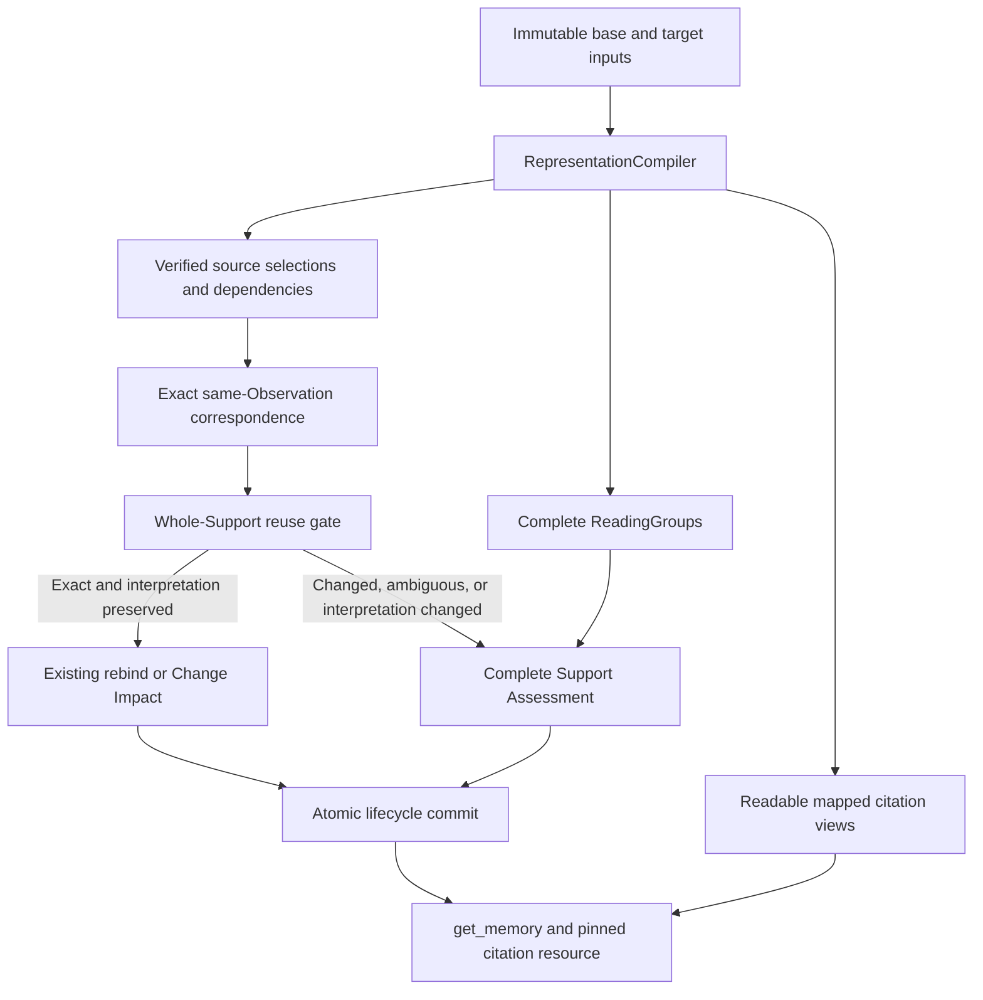

# ADR 0046: Separate Evidence correspondence from citation presentation

## Status

Proposed, 2026-10-01. This is a design change, not a description of released
behavior. It refines representation and citation contracts in
[ADR 0030](0030-compile-revision-pinned-evidence-fragments.md) and exact
correspondence/routing in
[ADR 0034](0034-unify-incremental-support-and-claim-assessment.md). Until
implemented and verified, ADR 0034's current digest matching remains in force.

## Context

An Evidence reference serves three purposes: locate authoritative material in
an immutable revision, supply the material needed to judge a claim, and let a
reader verify that claim. These purposes currently share the Fragment's text
representation too closely. The matcher compares every persisted digest,
normally both `raw_content_sha256` and `presentation_sha256`. A rendering change
therefore prevents exact correspondence even when the source selection has not
changed. The current raw digest can describe projected representation text; its
name alone does not prove an anchor into the provider's native input.

Preserving whole structures avoids lost table headers, merged cells and list
scope, but raw structure serialization is not a suitable citation. A retained
table passed back through Markdown can also be parsed as unrelated prose or a
list. The source-side cause predates the later ReadingGroup orchestration; the
[historical replay](../research/2026-10-01-evidence-readability-regression.md)
records the regression boundary. Reverting to lossy table flattening would
restore appearances while losing Evidence semantics.

## Decision

### 1. Keep one compilation seam and three separate outputs

The existing operation-local `RepresentationCompiler` owns parsing, source
coordinates, Fragment selections, deterministic presentation and ReadingGroups.
No caller reparses a citation or supplies an LLM-generated quote as Evidence.
The compiler produces three views of the same immutable input:

| View | Purpose | Identity and completeness |
| --- | --- | --- |
| Source selection | Locate and compare a Fragment's authoritative material | Revision-pinned native field/structure selector or verified source spans, integrity digest, and versioned content value |
| ReadingGroup | Read the full structure and its dependencies | Complete interpretive structure; operation-local, no new business state |
| Citation presentation | Show the selected material in readable form | Deterministic rendering with source mapping and a renderer version; never matching authority |

These are outputs behind the existing seam, not three public parser modules or
a persistent Fragment-identity ledger. An Evidence Unit still consists of one
Primary and its Required refs, and Support is validated and rebound atomically.

The persisted selection binding must carry the pinned input/snapshot identity,
source-coordinate profile, verified selector or spans, raw integrity digest,
content-schema version and content digest. Existing Evidence parts own this
binding; Fragment catalog numbers remain transient. Dependency selections and
the interpretation-contract version are included in the complete Support's
reuse check. Presentation text/digest and renderer version remain derivation
metadata. Digests index candidate matches; a final exact comparison or verified
native mapping must confirm them. No hash alone proves occurrence identity.

For native text and structured textual fields, the existing immutable
`SourceObservationRevision.content` owns the retained authoritative coordinate
text under its declared native profile. Citation-relevant title/field values
must also belong to that immutable representation, not mutable Document metadata.
Strict decoding and verified byte-to-Unicode mapping are required where byte
integrity is claimed. Retain binary authority through revision-pinned,
content-addressed Artifacts with explicit retention/access checks.

[ADR 0041](0041-record-stored-input-on-the-source-unit-revision.md) retains only
the current input per Unit and writes its objects in place. It supplies current
reprocess input, **not historical native snapshot authority**. This supersedes
the draft's earlier assumption that its revision ID implied immutable history.
Historical correspondence/resources read the existing immutable Observation
Revision or pinned Artifact. If that authority is unavailable or unverifiable,
they report that limit; they never read a Document's latest input as old Evidence.
Provider-native decoding belongs at the adapter/representation boundary; shared
Evidence and lifecycle services have no Confluence-specific matching branch.

### 2. State the unchanged-content guarantee precisely

For two effective revisions of the same Source Unit and Observation, an old
source selection **must correspond** when its content is unchanged and its
base and target occurrence are provably unique under the profile's selection
contract. Offsets, catalog numbering, revision IDs,
renderer versions, citation whitespace and insertions elsewhere must not break
that correspondence. This applies independently to Primary and Required parts.
New Evidence refs still name the new immutable revision; matching does not mean
reusing the old ref ID or editing its historical row.

Content equality is exact equality under the representation profile's declared,
versioned source-content schema, not semantic similarity. Raw snapshot integrity
is checked separately. For example, XML attribute serialization order and a
declared non-semantic macro instance ID may be excluded from a content value;
status titles, issue keys, links, code whitespace and business values may not be
silently stripped. Canonicalization rules must be specific to the representation
profile and tested. Generic whitespace cleanup, fuzzy quote matching and a
normalized rendered string are insufficient proof.

Correspondence is established in this order:

1. Restrict candidates to the authoritative target membership of the same
   Source Unit and Observation, with existing visibility and coverage guards.
2. Resolve a source-native stable selector when supplied by the profile; verify
   that it selects exactly one target occurrence and compare the content value.
3. Otherwise find exact equal content selections within that Observation in
   both snapshots. A unique base and target candidate establish material
   correspondence. Multiple equal candidates on either side need
   a profile-proven structural mapping, such as unique matched parent and
   neighboring structures. Position alone, a diff algorithm's arbitrary tie,
   a row index or a hash collision is not that proof.
4. Retain `AMBIGUOUS` if occurrence identity cannot be established. An unresolved
   legacy selector or a changed selection goes to existing assessment; missing
   coverage retains `UNKNOWN`, and only authoritative absence proves removal.

The guarantee cannot cover indistinguishable duplicate occurrences, unavailable
historical input, or a selection whose structure actually changed. Those cases
retain the existing fail-closed behavior. One native ID is not globally trusted
across different Sources or Observations.

Material correspondence is defined by verified snapshot selections; it is not
proof that a physical occurrence survived every intermediate edit. Deleting an
occurrence and inserting an identical copy can yield the same two snapshots as
moving it. In particular, two identical old occurrences reduced to one target
must not both be rebound as an occurrence-identity match without native or
structural disambiguation. Hash indexes only narrow candidates; exact values,
cardinality, profile compatibility and dependencies provide the proof.

For large documents, parse each immutable input once and index exact source
content values behind the existing compiler seam. Confirm candidate values and
cardinality against the complete authoritative representation; an LLM request's
subset or its truncated display is not the matching universe. Document size
does not change identity semantics. Declared parse/catalog capacity limits
remain explicit typed limitations, not permission to omit unmatched material,
infer removal or split atomic publication. Capacity and semantic coverage need
their own acceptance evidence; a successful indexed lookup is insufficient.

When a source-content schema changes, compare both snapshots under the same
target schema, using a verified mapping of the old selection into its immutable
source input. Persisted digests with different schemas must never be compared
as equivalent. If the old mapping cannot be verified, perform whole-Support
assessment; do not guess or mutate the historical anchor. This permits future
renderer upgrades to preserve correspondence without promising that every
legacy compiler upgrade is a cost-free exact match.

### 3. Separate correspondence from permission to reuse Support

`EXACT_UNCHANGED` will describe proven unchanged **source selection**, rather
than equality of every display digest. It does not by itself authorize Support
reuse. The planner computes a separate reuse gate for the complete Support:
all parts correspond uniquely, remain eligible for their roles, retain their
interpretation/dependency contract, and pass existing access and stale guards.
This gate is operation-local routing metadata, not a new lifecycle status.

| Target situation | Correspondence | Whole-Support route |
| --- | --- | --- |
| Renderer-only change; dependencies and interpretation unchanged | Exact source correspondence | Existing no-change rebind, or Change Impact if the revision has source changes |
| Row unchanged; a header, footnote, scope qualifier or other revision content changes | Row still corresponds | Required-part change enters Support Assessment; other changes enter Change Impact; ambiguous scope is affected |
| Same source content; compiler fixes its interpretation or changes selection/dependency semantics | Correspondence may still be exact | Reuse gate fails; Support Assessment |
| Text unchanged but occurrence cannot be proven among duplicates | Ambiguous | Support Assessment |
| Unknown membership under partial projection | Unknown | Existing unresolved/KEEP behavior, no destructive inference |

Changed content elsewhere remains in the complete ChangeBundle, including
removed qualifiers. Exact ref matching must not bypass Change Impact. A matched
Required heading does not prove that everything below it is unchanged. The
Primary must remain authorized for revalidation; correspondence does not give
unchanged content new Claim Extraction authority.

The semantic claim under assessment remains fixed. Only complete current
Evidence can re-support it. Old giant-table ref to several new row refs is a
selection-shape change, not a one-to-one exact rebind. Assessment may choose the
new parts together and atomically replace the Support assertion, preserving
Memory identity and historical Evidence.

The proposed runtime flow is:



Partial coverage takes the existing unresolved route before reuse or assessment;
it does not enter the two success branches shown above.

### 4. Parse native structures before presenting them

Adapters declare the native representation and retain its immutable input.
Confluence storage is XML with custom namespaces, not ordinary rendered HTML.
Its representation parser must understand supported macros and complete tables;
it must not hand an opaque storage table to a CommonMark HTML-block parser.
Unknown constructs preserve their source selection and return a typed
representation limitation when their meaning cannot be presented safely.
They cannot silently become a selectable prose/list Fragment.
If an incumbent's selected material cannot be mapped or interpreted safely,
the existing typed derivation-failure path prevents that revision's commit and
preserves its Support. A parse limitation is never authoritative absence or a
model finding of `UNSUPPORTED`.

Native source mappings use declared coordinate spaces. A selection composed of
non-contiguous cells/fields has verified span or field selections, not a
fabricated contiguous excerpt. Every displayed value and source quotation is
traceable to its selected revision. Derived labels, such as a table's header
path, are marked as structure/context rather than presented as literal quotes.

Supported constructs have deterministic readable renderings: table columns and
rows retain their association; status macros show the stored status title;
issue/link macros expose their source identifier and link; code and nested lists
retain their structure. An empty status remains empty/unknown, never PASS or
FAIL by inference. Rendering a user macro may use an authoritative snapshot
label or its stored identifier, but must not silently resolve a new live value
into an old citation. Hiding macro control metadata is allowed; hiding material
macro content is not.

### 5. Select claim-local Evidence within complete reading context

A complete table remains a ReadingGroup. A row may become selectable Evidence
when the compiler preserves its column association and the structural context
needed to interpret it, including applicable merged cells or linked footnotes.
Complex cases without a proven local closure remain whole-structure selections.
This changes citation granularity for verifiability, not request packing or
model capacity. Existing complete reading and destructive coverage remain intact.

#### Primary and Required selection contract

The Primary must directly support the claim's central assertion, read with its
necessary qualifiers. Selection is determined by the Evidence's contribution
to the claim, not its provider, document type, field name, structural position,
length or recency alone. There is no hierarchy that always prefers a particular
kind of statement or always excludes another. Explicit corrections, conditions,
source authority and temporal scope still affect what the content supports.
Required material cannot supply the entire central
assertion while the Primary supplies only topical association. Among eligible
Fragments that directly carry the assertion, prefer the smallest complete
source selection over a broad structure with unrelated facts; retain a whole
structure when local dependency closure cannot be proven.

Required refs form a sufficient, inclusion-minimal set with the Primary:
removing any remaining Required part would lose a supported
condition, scope, exception, time qualification or necessary interpretation.
This is a semantic necessity check, not a numeric cap or a demand to prove the
globally smallest set. A heading already adequately represented by another
selected scope ref is redundant. Nearby text shown in a ReadingGroup stays
reading context unless its contribution is necessary. Structural dependencies
are resolved from the compiler's catalog and retain their revision-pinned source
mapping. Preserving structural meaning does not mean automatically adding all
headers, captions or footnotes to `required_refs`.

When a compiler-proven row representation already includes the applicable
column names or other interpretation in its mapped citation, the model does
not select the same material again as separate Required refs. Its source
dependency binding still participates in the Support reuse gate. If the claim
needs a qualification in another Fragment that this representation does not
cover, the model selects that Fragment as Required. Unrelated table headings,
exceptions to another rule and unrelated footnotes stay reading context.
A readable Evidence Unit presents the selected material with its needed
interpretation, preserving each actual pinned part without duplicate citations.

Claim Extraction and Support Assessment use this same selection contract. New
compound claims that join independently useful assertions should be extracted
separately when that gives each its own direct Primary. Expected behavior and a
dated test outcome remain distinct assertions: "assignment should be allowed"
and "the recorded run failed" must not become an unqualified permanent product
rule. Support Assessment cannot split or rewrite an incumbent claim silently;
it assesses that fixed claim using complete current Evidence.

#### Improve selection at extraction and Support Assessment

Ref quality belongs where the model selects Evidence: Claim Extraction and
Support Assessment. The model reads the complete supplied catalog/ReadingGroup
and chooses the correct refs in the original output. It is not limited to a
previously selected pool when deciding which eligible Fragment directly carries
the assertion. Candidate admission keeps its existing complete-support, value
and uniqueness responsibilities and its existing response schema. It neither
repairs Primary/Required roles nor trims refs, and it gains no rejection reason
or stricter rejection rule for redundant refs or imperfect role placement.

The same model-facing selection instructions apply to every supported Source
and representation. Representation adapters supply exact, readable material and
eligibility, not provider-specific selection prompts. Instructions state the
following semantic rules; any illustrative examples are source-neutral and
show a support relationship, not a shortcut based on document labels:

```text
For each durable claim, select its Evidence from the supplied catalog:
1. Consider every supplied Fragment for independently useful assertions that
   pass the unchanged durable-knowledge rules. Do not sample representative
   claims or let a broad summary stand in for independently useful assertions.
2. Distinguish an explicitly stated rule, intended behavior, permission or
   prohibition from an observation of one instance. Preserve the supported rule
   when nearby outcomes are transient; do not turn an instance result or incident
   into a timeless rule. A label or status alone proves no unstated rule.
3. Choose an eligible Primary that most directly supports the claim's central
   assertion, read with its necessary qualifications. Topical association is
   insufficient. Do not select or exclude a ref based on its document type,
   label, location, length or recency alone. Respect explicit corrections,
   applicable conditions, source authority and the claim's temporal scope.
   Prefer the smallest complete direct selection with proven interpretation;
   retain a broad structure when local completeness is not established.
4. If the Primary's represented material supports the entire claim without
   ambiguity, return required_refs: []. Being nearby, related or supplied as
   reading context does not make another ref necessary Evidence.
5. Add a Required ref only for a distinct condition, scope, exception, time or
   interpretation that the claim needs and the Primary does not already cover.
   Ask whether removing it would make the claim unsupported or ambiguous.
6. Do not repeat a contribution already covered by the mapped Primary or
   another selected ref. Structure type alone does not make a ref necessary.
7. Preserve genuinely necessary qualifications; there is no Required-count cap.
   Do not shorten the claim, omit durable knowledge or skip a supported claim
   merely to obtain fewer refs.
   Every material assertion, condition and identifier in the emitted claim must
   be supported by selected refs and their mapped interpretation. Unselected
   surrounding text cannot repair a missing selected contribution. Do not
   silently generalize or bundle an independent assertion or instance outcome.
8. Keep the catalog's existing role authority: Required-only context cannot
   become Primary. Use only supplied refs and never invent a source quotation.
```

The semantic examples below describe neutral Fragments A/B/C. Their roles are
the same whether the material came from prose, a conversation, a structured
record or a table, provided the represented meaning and authority are the same:

| Supplied meaning and claim | Selection principle |
| --- | --- |
| A states "In mode M, the limit is three attempts"; B merely mentions reviewing that limit; claim repeats A's rule | A is Primary; B adds no necessary contribution |
| A states "The limit is three attempts"; B establishes that this statement applies only in mode M; claim states the rule for M | A is Primary and B is Required if A's mapped representation does not already carry that scope |
| A already states the complete rule for M; B repeats the same scope and C concerns another condition not used by the claim | A is Primary; neither B nor C is Required |

Examples must include the reverse of any tempting format heuristic in the
evaluation corpus: a brief item can carry the actual assertion, and a formally
named section can be unrelated. Neither brevity nor a section/field label
determines the role. These evaluation examples need not all be shipped in the
prompt; keep prompt examples small and generic rather than accumulating
provider-specific exceptions.

The compiler supplies correctly bounded, readable candidate material and
visible source-mapped structure so these instructions can be applied. Generic
prompt advice cannot repair a catalog that offers a swallowed list or only a
giant raw table as the selectable Primary. Resolver checks remain mechanical:
known IDs, role eligibility, source/revision/access binding and valid dependency
mapping, with the existing typed selector correction/failure boundary. No new
post-extraction role fixer, semantic pruning pass or per-ref model call is added.

Selection semantics change extraction and Support-assessment contract versions
and durable work identities; admission's response contract remains unchanged.
A presentation-only update does not change selection semantics.
The first rollout must reassess legacy selection quality; exact matching alone
must not preserve an old incorrect Primary or redundant Required set. Subsequent
rebinds may reuse selections only under the validated selection-contract version.
Semantic model selection requires stored-input replay and evaluation against
annotated source/claim fixtures; it is not the deterministic guarantee of
unchanged-source matching. Evaluation measures direct Primary selection,
unnecessary Required refs, complete qualification and durable-claim coverage
together. A prompt that reduces ref count by omitting otherwise supported,
valuable Memories fails acceptance. The before/after replay reports every lost
expected claim, rather than measuring only ref count among surviving candidates.

Evaluate semantic patterns across multiple supported representations, including
unstructured text, conversations, structured fields and complete structural
documents. Compare contribution/role correctness and knowledge coverage, not
identical ref IDs when representations have different boundaries. Use held-out
source/representation families and counterexamples so success on the motivating
table/comment cohort alone cannot pass. Harmless changes in catalog ordering,
labels, proximity or verbosity must not switch roles without a change in support
or authority. Genuine changes of meaning or an explicit correction must change
the selection when appropriate. Use one shared prompt/selection contract; no
provider-specific prompt route or hidden document-type preference is introduced.
When several selections are equally valid, accept their contribution/role
equivalence rather than imposing a single ref ID as the only correct answer.

### 6. Carry citations through the actual tool boundary

`get_memory` returns readable deterministic excerpts and enough identity to
resolve every part: Evidence Unit/Support identity, persisted reference ID,
role, Source Unit, pinned revision and a resource reference. It does not send
raw namespace/control markup as the normal text excerpt. The MCP compactor must
retain these citation identities rather than keeping only excerpt and role.
If a tool's transport budget abbreviates an excerpt, it marks that excerpt as
incomplete and retains its pinned resource and dependency identities. It cannot
silently omit a Required part or present truncation as complete Evidence.

The resource operation resolves the exact authorized historical revision and
selection, with the complete Evidence Unit's access boundary. It returns the
selected material, its dependencies and provenance. A link to the latest
provider page may accompany it, but cannot replace a pinned resource. Missing
history or denied access returns a typed unavailable/denied result; it must
never silently serve the latest page. UI and MCP share this service contract.
Resource resolution must not reveal inaccessible Required material through an
otherwise visible Primary. Storage and resource adapters enforce the same scope.

### 7. Reprocess through the existing revision flow

The first rollout changes source mapping, Fragment shape and interpretation;
it therefore requires explicit derivation/compiler contract changes and
whole-Support reassessment for affected legacy Units. The user accepts this
one-time reprocessing cost. Use existing `REPROCESS` authorization and stored
inputs, with bounded inventory, dry-run and ordinary atomic revision commits.
No new migration ledger, alias bridge, business batch state or semantic
provenance backfill is introduced.

Observation/Revision identities are not repurposed to store different content.
Existing immutable-revision reuse must preserve the full representation contract.
A renderer-only upgrade recompiles a derived view without changing the source
revision's identity. If projected content or its source-coordinate profile
changes, the new identity includes that representation version and points to
the immutable source snapshot. This explicitly refines ADR 0040's current
Observation-plus-semantic-hash identity; it cannot overwrite an old revision
with the same semantic hash or create a new source revision for every renderer
version.

Exact historical replay continues using its recorded contract; current reprocess
uses the new contract. Preserve Plans, failed jobs, Evidence and Support history.

Legacy normalized revisions keep their recorded representation. Missing native
history cannot be reconstructed from current input or similar rendered text.
Current whole-Support assessment may establish new Evidence for the fixed claim;
it does not certify old native correspondence. Historical resources return the
retained normalized representation with its declared profile, or typed
unavailability, without manufacturing native selectors.

Implement canonical OSS protocols and SQLite first, then Cloud/HANA and the MCP
proxy using the same signatures, visibility, resource and routing tests. Cloud
ADRs record only HANA/hosting consequences and link this shared decision. This
documentation PR makes no runtime or deployment claim.

## Implementation and acceptance contract

Implement in dependency order: native snapshot/selection and immutable identity;
compiler views and readable closure; extraction/assessment selection prompts;
correspondence and whole-Support reuse gate; revision-pinned resources;
OSS/Cloud/proxy parity; bounded legacy
reprocess. This order is not a split lifecycle or partial publication contract.

| Acceptance case | Required evidence |
| --- | --- |
| Revision number, offsets or catalog refs change; selected source content is unique and unchanged | All unchanged Primary/Required parts correspond; no display digest blocks the match |
| Renderer changes only presentation | Correspondence and source-change authority remain unchanged; Support reuse follows the existing source-change route |
| Same text in two indistinguishable rows/sections | No arbitrary occurrence match; assessment/ambiguity is preserved |
| Two identical base occurrences collapse to one target occurrence | No many-to-one occurrence rebind without verified disambiguation |
| Native key or unique parent/neighbor mapping disambiguates identical text | Deterministic verified occurrence mapping, not first-match behavior |
| Table header, merged-cell scope, footnote or distant qualifier changes | Row correspondence can remain exact; complete Support still receives the required semantic check |
| Blank lines, preformatted lists, XML macros and empty status inside a table | Complete table parsed, no swallowed later row, readable status/issue values, exact source mapping |
| Local row dependency closure cannot be proven | Whole structure retained; no lossy row selection |
| Generic closing note and an eligible acceptance statement are both in the catalog | Extraction selects the direct statement as Primary and omits the closing note when unnecessary; the durable claim is retained |
| The brief item carries the actual assertion; a formally labeled or longer item is only related | The direct assertion remains Primary; the motivating example does not become a format preference |
| Same semantic support relationships in prose, conversations, structured fields and structural documents | Shared prompt yields valid roles and complete claim coverage; evaluation includes held-out families |
| Catalog order, labels or verbosity change without changing meaning/authority | No unsupported role switch or lost claim; an explicit substantive correction is distinguished from presentation variation |
| Only Required-only context carries the core assertion | Existing catalog authority retained; no promotion or new admission remediation rule |
| Duplicate headings, unrelated neighbors or footnotes are in reading context | Extraction/assessment omits them from Required; necessary qualification and claim coverage remain complete |
| Applicable column names are already in the mapped Primary representation | No duplicate Required header ref; revision-pinned dependency mapping and reuse check remain intact |
| A condition or exception needed by the claim appears only in another Fragment | Extraction/assessment selects it as Required; no count cap or blanket requirement based on its structure type |
| Ref count improves but an otherwise supported durable claim disappears | Evaluation fails; lost expected claims reported, no admission tightening used as remediation |
| Claim joins a durable rule and a transient test outcome | New extraction separates assertions and applies the existing value gate; incumbent assessment keeps its claim fixed |
| An incumbent selection uses an unsupported/unmappable construct | Typed failure preserves Support and prevents unsafe commit; no false absence or unsupported finding |
| Compiler fixes meaning, source schema changes, or legacy table ref splits | Reuse gate prevents blind rebind; fixed claim assessed against complete current revision |
| Partial projection, tombstone, access change, stale/retried operation | Existing absence proof, visibility, idempotency, commit order and fail-closed semantics hold |
| Historical resource requested after provider page changes | Pinned old material returned or typed unavailability; latest content never substituted |
| Current Unit input object is overwritten; native history was never retained | Immutable Observation/Artifact authority only; legacy normalized history remains declared, no fabricated native backfill |
| Tool excerpt exceeds transport budget | Explicit incompleteness, complete citation identities and pinned resource; no silently dropped Required part |
| UI, get_memory and get_resource in OSS/SQLite and Cloud/HANA | Same identity/role/visibility/pinned content; adapter SQL and parameters prove scope enforcement |
| Controlled legacy reprocess | Exact bounded cohort and dry-run load recorded; atomic current Supports and preserved history verified once incrementally |

Before implementation is called complete, audit every row above, record the
contract/version changes and measured stored-input replay impact, open PRs in
every changed repository, and deploy/smoke-test Cloud if its runtime changes.

The [real-content and online Sonnet feasibility evaluation](../research/2026-10-02-evidence-mapping-feasibility.md)
records controlled revision perturbations and independent blind review. It is
evidence for this proposal, not runtime, native-history or deployment acceptance.
Its online Sonnet replay improves direct Primary selection and redundant Required
refs, but still loses some baseline-covered claims and necessary qualifications.
The proposed prompt remains unaccepted for release until the actual complete
ReadingGroup path and those named coverage/qualification cases meet this contract.
Neither candidate omission nor stricter admission may be used to claim success.

## Consequences and sources

More precise source mappings and representation metadata are required. Safe
duplicate handling may still require assessment. The initial legacy reprocess
is deliberately more expensive than future presentation upgrades. In return,
readability is independently testable, unchanged evidence survives routine
revision changes, and a citation remains verifiable after its source page moves
on. Neither readable output nor successful correspondence alone proves a claim.

- [Confluence storage format](https://confluence.atlassian.com/doc/confluence-storage-format-790796544.html): XML-based storage and custom macro/resource elements.
- [CommonMark 0.31.2 HTML blocks](https://spec.commonmark.org/0.31.2/#html-blocks): type-6 HTML blocks terminate at a blank line; retained tables are unsafe as an opaque Markdown transport.
- [Canonical XML 1.1](https://www.w3.org/TR/xml-c14n11/): serialization canonicalization is distinct from application-defined equivalence.
- [Python difflib](https://docs.python.org/3/library/difflib.html): matching heuristics and tie-breaking are not an occurrence-identity proof.
- [ALCE citation evaluation](https://aclanthology.org/2023.emnlp-main.398/): evaluate correctness and citation quality over diverse questions and corpora; fewer citations alone do not establish better grounded output.
- [Lost in the Middle](https://aclanthology.org/2024.tacl-1.9/): relevant-information position affects model behavior, motivating ordering perturbations in the selection evaluation.
