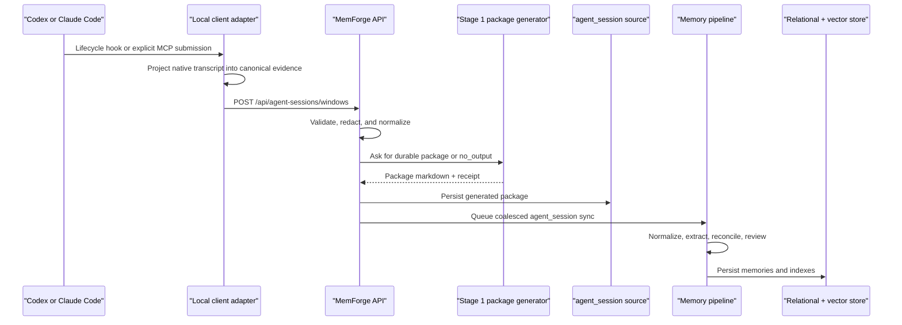

# Agent Session Memory Architecture

Status: active design for the repo-first agent-session memory and curator work.

This document consolidates the current design for Codex, Claude Code, and
future coding-agent session memories. It explains the full path from local
agent-session capture to searchable memories, and it defines how long-running
session memories are kept useful without creating cloud-only behavior.

## Why This Exists

Agent coding sessions produce a different kind of source material than Jira or
Confluence. Documents are usually organized by a team project, a page tree, or a
Jira filter. Coding sessions are usually organized by the repository where the
work happened. A single MemForge project can include many repositories, and a
single repository can support multiple business projects over time.

The old flat model can work for short-term memory, but it has two problems when
users run Codex or Claude Code for months:

- too many small atomic memories compete with durable repo conventions;
- project-only grouping can mix unrelated repositories or hide repo-specific
  learnings.

The new design keeps atomic memories, adds repo-aware identity, and introduces a
non-destructive curator that can create consolidated memories with explicit
lineage.

## Design Goals

- Keep coding-agent memories useful after long-term usage.
- Treat repository identity as the primary context for agent-session memory.
- Keep MemForge project mapping as an optional relevance signal, not the source
  of truth for coding-session identity.
- Make curated memories searchable as first-class memories.
- Preserve atomic memories and source provenance.
- Keep OSS routes and services canonical.
- Let cloud HANA implement the same storage contract instead of replacing API
  behavior.
- Leave room for future source-type curator policies without adding generic
  fallback behavior.

## Non-Goals

- Do not curate Jira, Confluence, or other document/work-tracking sources in
  this first version.
- Do not delete, retire, or hide atomic memories automatically.
- Do not create a curator dashboard in the first release.
- Do not make repository identity an authorization rule.
- Do not introduce a cloud-only route fork for memory search or curation.

## Architecture At A Glance

```text
Codex / Claude Code
  -> local client adapter
  -> bounded canonical evidence window
  -> POST /api/agent-sessions/windows
  -> MemForge-generated agent-session package
  -> agent_session source sync
  -> AgentSessionGene normalization
  -> memory extraction and reconciliation
  -> storage-neutral memory services
  -> SQLite in OSS / HANA in cloud / future stores
  -> repo-aware, lineage-aware search
```

The client captures evidence. MemForge owns memory decisions.

## Ownership Boundary

| Concern | Agent client | MemForge service |
| --- | --- | --- |
| Local hook payloads | Reads host-tool hook payloads | Never reads local transcript files directly |
| Transcript/window slicing | Builds bounded canonical evidence | Validates, redacts, and canonicalizes again |
| Package generation | Does not summarize by default | Generates durable agent-session packages |
| Memory extraction | Does not extract memories | Runs normal source sync and extraction |
| Memory storage | Does not write memory rows | Persists atomic and curated memories |
| Authorization | Sends bearer/API token | Derives principal and access scope |
| Search | Supplies optional repo context | Enforces access and ranks results |

This boundary is the same for self-hosted OSS and cloud deployment.

## Agent Session Ingestion Flow



The legacy explicit document path still exists for cases where an agent already
has a generated summary:

```text
MCP submit_agent_session_document
POST /api/agent-sessions/documents
```

Automatic hook capture should use `/api/agent-sessions/windows` so the service,
not the client plugin, owns package generation and source-sync scheduling.

## Repository Identity

`repo_identifier` is the stable context key for coding-session memories.

Preferred derivation order:

1. normalized VCS remote URL, such as `github.com/org/repo`;
2. explicit repo slug supplied by the client;
3. existing receipt `repo` value;
4. workspace basename only as a display fallback, never as a project key.

For agent-session memories:

```text
source_type      = agent_session
client           = codex | claude-code
repo_identifier  = github.com/org/repo
project_key      = optional MemForge project relevance bucket
visibility       = existing visibility rule
owner_user_id    = existing private owner rule
```

`repo_identifier` is stored on the memory row and in vector metadata. It is a
ranking and grouping signal, not an access-control signal.

## Project Mapping

Project mapping still matters, but it is not the primary session identity.

For document sources, project mapping is usually natural:

```text
Confluence page tree -> project
Jira filter/project  -> project
```

For coding sessions, the repo is more stable:

```text
Codex session in repo A -> repo_identifier A
Claude Code session in repo A -> repo_identifier A
MemForge project        -> optional relevance bucket
```

If an agent-session source has no project mapping, memories land in
`UNSORTED`. The system must not mint project keys from local workspace names.

## Memory Levels And Lineage

The design has two memory levels:

- `atomic`: memory extracted from one source item or session package;
- `consolidated`: memory created by the curator from multiple atomic memories.

Both levels are searchable. Consolidated memories do not replace atomic
memories in V1.

Lineage is explicit:

```text
consolidated memory
  summarizes -> atomic memory A
  summarizes -> atomic memory B
  summarizes -> atomic memory C
```

Required storage fields:

- `memories.repo_identifier`
- `memories.memory_level`
- `memories.curation_cluster_id`
- `memory_derivations.parent_memory_id`
- `memory_derivations.child_memory_id`
- `memory_derivations.relation`
- `memory_curation_runs.*`

`memory_level` is not a lifecycle state. A consolidated memory can still be
active, superseded, or retired later through normal lifecycle rules.

## Curator Design

The curator has a generic runner and explicit source-type policies.

```text
MemoryCuratorRunner
  -> receives candidate memories
  -> filters through registered policy
  -> groups eligible memories into deterministic clusters
  -> creates consolidated memory drafts
  -> inserts consolidated memories
  -> records derivation lineage
  -> records curation-run audit data
```

V1 registers only one policy family:

```text
agent_session.coding.v1
  clients: codex, claude-code
  memory level: atomic only
  required: repo_identifier
  cluster boundary: visibility + owner + repo + project + topic
```

There is no generic fallback curator. Adding Jira, Confluence, Teams, or another
source type requires an explicit policy and tests.

## Curator Safety Rules

- Do not consolidate across private owners.
- Do not consolidate private and workspace-visible memories together.
- Do not consolidate across repositories.
- Do not mutate or delete atomic memories in V1.
- Keep source provenance and derivation edges.
- Store curation-run metadata for auditability.
- Treat generated agent-session packages as low-authority source material; they
  do not outrank authored team documents automatically.

## Search Behavior

Search remains access-controlled by the existing visibility, owner, workspace,
status, and project rules. Repo context only affects relevance.

When search receives `active_repo_identifier`, same-repo memories receive an
affinity boost. Cross-repo results are not hidden.

After ranking, search applies lineage-aware shaping:

1. retrieve normal candidates;
2. enrich candidates with `repo_identifier`, `memory_level`, and
   `curation_cluster_id`;
3. group candidates by curation family;
4. if a consolidated memory and its children are both present, prefer the
   consolidated memory by default;
5. keep a child result when it strongly outranks the summary for an exact error,
   file, symbol, or issue-specific query.

This keeps broad searches clean while preserving precise debugging retrieval.

## Storage Contract

OSS owns canonical behavior:

```text
OSS API routes
  -> storage-neutral services
  -> store protocols
  -> SQLite implementation
```

Cloud extends the same behavior:

```text
Cloud API composition
  -> same OSS routes and services
  -> same store protocols
  -> HANA implementation
```

Future Postgres or other stores should implement the same protocol. They should
not replace memory routes to get different behavior.

Required store capabilities include:

- memory insert/update with curation metadata;
- derivation insert/read;
- curation-run insert/read;
- ranking metadata reads for top search candidates;
- source item normalization that preserves `repo_identifier`.

## Prompt And Extraction Semantics

Agent-session extraction should prefer durable engineering knowledge:

- accepted design decisions;
- verified implementation facts;
- repo conventions;
- setup or deployment procedures;
- recurring debugging lessons;
- user corrections that changed behavior.

It should avoid:

- raw command logs with no durable lesson;
- local transient paths unless they are intentionally documented;
- unaccepted brainstorming;
- tool chatter;
- secrets or credentials;
- one-off status updates that are unlikely to matter later.

This is a source-type prompt overlay: the generic extraction pipeline stays the
same, while `agent_session` contributes source-specific guidance.

## User-Visible Behavior

There is no new required UI surface in this round.

Users may notice indirect behavior changes:

- coding-agent search results can become more repo-relevant;
- broad searches may show fewer duplicate session memories once curated
  summaries exist;
- MCP and hook context can become less noisy for long-running repo work.

Users should not see:

- a new curator dashboard;
- new source configuration fields;
- a different source-list workflow;
- automatic deletion or disappearance of existing atomic memories.

Future UI could add labels such as `curated`, `covers N memories`, or a lineage
detail view. That is intentionally outside this first implementation.

## Testing Strategy

The design is covered by three test layers.

Unit and storage tests:

- repo identifier normalization;
- agent-session normalization carries `repo_identifier`;
- memory rows persist curation metadata;
- derivation lineage round-trips;
- curation-run audit records round-trip.

Search tests:

- same-repo candidates get a relevance boost;
- consolidated and child candidates collapse by default;
- exact child matches can still outrank summaries.

Integration/smoke tests:

- real local repo identifiers are derived from real checkouts;
- agent-session source sync persists `repo_identifier` into memories and vector
  metadata;
- curator creates consolidated memories without deleting atomic memories.

Cloud contract tests should prove HANA exposes the same behavior as SQLite for
the new curation fields and methods.

## Rollout

Recommended rollout order:

1. ship repo identifier propagation for agent-session memories;
2. ship storage schema/protocol support for curation metadata and lineage;
3. ship lineage-aware search shaping;
4. ship non-destructive agent-session curator runner;
5. ship HANA contract implementation in cloud;
6. run local and cloud smoke tests;
7. only then consider future UI labels or curator operations.

## Open Future Work

- Add an explicit scheduled curator job once operating thresholds are proven.
- Add UI visibility for consolidated memory labels and lineage detail.
- Add source-type curator policies for Jira or Confluence only if real usage
  shows long-term noise there.
- Pass repo context from more explicit MCP/CLI search paths, not only lifecycle
  hook context.
- Add a future lifecycle policy that can retire or supersede atomic memories,
  but only with audit and rollback semantics.
