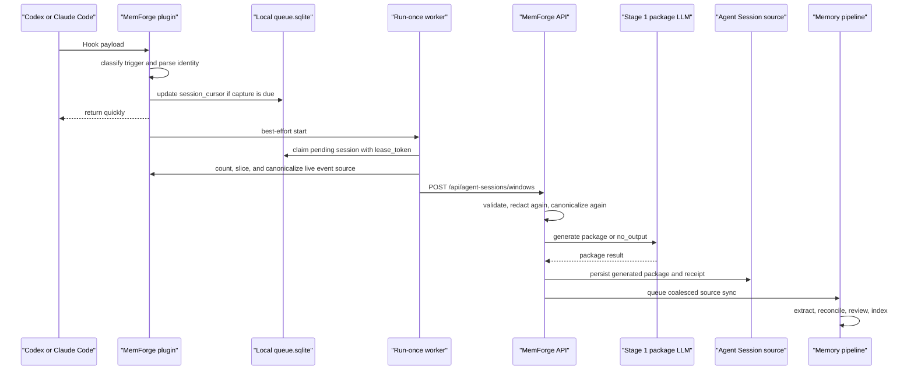

# Agent Session SaaS Plugin Flow

Status: active design, 2026-05-30

## Design Goal

Agent-session memory should work for long Codex, Claude Code, and future coding
agent sessions without letting any client plugin own memory authority. The
plugin captures bounded session windows and delivers them safely. MemForge owns
authorization, package generation, source sync, extraction, reconciliation,
review, and indexing.

The design is intentionally small:

```text
agent coding tool plugin -> redacted canonical evidence window -> MemForge package
                         -> agent_session source sync -> canonical memories
```

Native transcript rows are transient. The plugin uses them only as a local
cursor source and projects them into canonical evidence before upload. MemForge
stores generated packages, receipts, hashes, and processing status. It does not
store raw windows by default.

## Ownership Boundary

| Concern | Agent coding tool plugin | MemForge service |
| --- | --- | --- |
| Local lifecycle | Observe Codex, Claude Code, or future client hooks | Never read local transcript files directly |
| Session reading | Use a client adapter to count and slice local event units | Validate upload shape, limits, and canonical evidence |
| Durability | Keep local bookmark, pending flag, lease token, retry state | Persist receipts, generated packages, sync state |
| Privacy | Redact obvious secrets before network transit | Redact again before hashing, prompting, or storing packages |
| Auth | Attach a bearer/API token from local config | Derive tenant, user, project, and source scope from auth |
| Processing | Upload canonical evidence windows | Generate packages, queue source sync, extract memories |
| Authority | Provide provenance only | Treat provenance as audit data, not authorization input |

For local single-user development, the service can keep the fixed
`src-agent-sessions` source. For hosted SaaS, source identity, tenant identity,
and project scope must be service-derived.

## End-To-End Workflow



The plugin never calls `/api/sources/{source_id}/sync` in the default hook flow.
The window endpoint is a package-generation boundary, not a memory-indexing
boundary.

## Workflow Walkthrough

### 1. Hook Arrives

The client invokes the plugin with a native hook payload. The adapter reads only
what is needed to identify the session and classify the lifecycle moment.

Example hook-shaped input:

```json
{
  "session_id": "0193-example",
  "hook_event_name": "PreCompact",
  "transcript_path": "/Users/me/.codex/sessions/0193.jsonl",
  "cwd": "/Users/me/project"
}
```

The adapter converts native hook names into a small normalized vocabulary:

| Normalized capture policy | Typical native hooks | Why it exists |
| --- | --- | --- |
| `REQUIRED_CAPTURE` | `PreCompact` | Context may be lost, so capture regardless of the cheap gate. |
| `GATED_CAPTURE` | `Stop`, `SubagentStop` | A turn or unit ended. Capture only when the uncaptured tail has durable signals. |
| `RECOVER` | `SessionStart` | Retry pending work and re-arm an idle session whose transcript grew. |
| `IGNORE` | unsupported hooks | Leave the session untouched. |

Per-prompt memory retrieval is not in this table. The plugin no longer wires a
`UserPromptSubmit` hook; the agent calls the MCP `search` tool on demand for
query-aware context.

The point of normalized capture policies is not abstraction for its own sake. It
keeps Codex, Claude Code, and future clients on one capture algorithm while
confining client-specific assumptions to the adapter.

### 2. Capture Is Requested

The hook does not freeze a range and does not run LLM work. It only updates the
local `session_cursor` row:

```text
client=codex
session_id=0193-example
captured_through=120
capture_pending=1
pending_trigger=REQUIRED_CAPTURE
request_seq=42
```

`REQUIRED_CAPTURE` wins over `GATED_CAPTURE` because context-loss capture has
higher recall. Repeated hook events collapse into the same pending flag.

### 3. Worker Builds A Window

The detached worker claims one pending session with a random `lease_token`. It
then computes the range from live state:

```text
from = session_cursor.captured_through
to   = EventSource.count(identity)
```

For Codex and Claude Code today, `EventSource.count()` is the transcript JSONL
line count. The worker reads `[from, to)`, not a range stored by the hook. This
matters because the transcript may grow between hook time and upload time.

If the transcript disappeared while the session is pending, the worker keeps
`capture_pending=1` and stores `last_error`; it does not silently mark the
session complete.

### 4. Worker Uploads A Bounded Evidence Prefix

The uncaptured tail is the part of the event stream after the bookmark:

```text
captured_through = 120
current count    = 220
tail             = [120, 220)
```

The worker scans complete native event units, drops bootstrap/context noise, and
projects useful records into canonical evidence. If the projected evidence fits,
it uploads one window representing `[120, 220)` and advances the bookmark to 220
after success.

If the projected evidence is too large, the worker uploads only the first
bounded evidence prefix of that tail:

```text
tail                 = [120, 220)
evidence budget      = 40 events or about 60k chars
uploaded evidence    = useful records from [120, 150)
omitted metadata     = counted in receipt metadata
remaining tail       = [150, 220)
```

After a successful prefix upload:

```text
captured_through = 150
capture_pending  = 1
```

The next worker pass continues from 150. The bookmark advances through records
that were either represented as canonical evidence or explicitly omitted as
metadata/context noise. If one JSONL line contains oversized useful evidence,
the plugin preserves the evidence head and tail with a middle truncation marker,
marks the window truncated, and advances by one line after upload succeeds.

### 5. MemForge Generates Or Rejects A Package

The plugin posts to:

```http
POST /api/agent-sessions/windows
Authorization: Bearer <plugin token>
```

Representative request:

```json
{
  "schema_version": "agent-session-window/v1",
  "plugin_version": "0.1.0",
  "client": "codex",
  "session_id": "0193-example",
  "trigger": "REQUIRED_CAPTURE",
  "workspace": "/Users/me/project",
  "repo": "project",
  "branch": "main",
  "commit_sha": "abc123",
  "history_window": {
    "kind": "transcript_window",
    "transcript_path": "/Users/me/.codex/sessions/0193.jsonl",
    "start": "120",
    "end": "150",
    "line_count": 30,
    "truncated": true
  },
  "events": [
    {"kind": "user_message", "actor": "user", "text": "Refine the agent-session design."},
    {"kind": "tool_call", "actor": "assistant", "name": "apply_patch", "text": "Updated hook adapter."},
    {"kind": "tool_result", "actor": "tool", "name": "exec_command", "text": "Focused pytest passed."}
  ],
  "transcript_markdown": "{legacy field containing compact canonical evidence, not raw JSONL}",
  "receipt": {
    "hook": "REQUIRED_CAPTURE",
    "metadata": {
      "from_line": 120,
      "uploaded_to_line": 150,
      "observed_to_line": 220,
      "omissions": {"metadata_or_context": 42}
    }
  },
  "retention": "none",
  "process_now": false
}
```

MemForge validates `schema_version`, redacts again, canonicalizes the uploaded
events again, hashes the service-canonical content, and runs Stage 1 package
generation. The LLM can return a durable package or `no_output`.

The current API keeps `agent-session-window/v1` for compatibility. Within that
schema, `events` are now the primary canonical evidence stream. The
`transcript_markdown` field remains only as a legacy/fallback carrier; normal
plugins fill it with rendered canonical evidence rather than raw transcript
JSONL. When canonical events exist, Stage 1 packaging ignores raw transcript
fallback text.

`trigger` is the normalized capture policy (`REQUIRED_CAPTURE`,
`GATED_CAPTURE`, or `RECOVER`). Native hook names such as `PreCompact` are
client details and belong in adapter logs or receipt metadata when needed. The
uploaded range is always
`history_window.start/end`; `observed_to_line` only records the live transcript
count seen when the worker built the window.

Package-created response:

```json
{
  "accepted": true,
  "window_hash": "sha256:...",
  "status": "processed",
  "result": "package_created",
  "doc_id": "agent-session-codex-0193-precompact-...",
  "source_id": "src-agent-sessions",
  "sync_started": false,
  "sync_queued": true
}
```

No-output response:

```json
{
  "accepted": true,
  "window_hash": "sha256:...",
  "status": "processed",
  "result": "no_output",
  "reason": "window had no durable memory value",
  "sync_started": false,
  "sync_queued": false
}
```

### 6. Package Promotes Through The Existing Source Pipeline

When Stage 1 creates a package, MemForge persists it as an `agent_session`
source document, writes a receipt with the window outcome, and queues a coalesced
`Agent Session Summaries` sync. If a package is created while that source is
already syncing, the queued request waits for the active pass and then runs one
follow-up pass, so packages created after discovery are not stranded until a
manual sync.

`Agent Session Summaries` is a service-managed source. Admin UI surfaces can
show its status, counts, and sync or repair controls, but it is not offered in
the normal add-source connector list and it does not expose a user-editable
source configuration dialog or destructive delete action.
The read-only details view should use the generic
`GET /api/sources/{source_id}/projects` inventory endpoint plus
`GET /api/agent-sessions/completeness`; it should not expose raw package JSON or
local package paths.

```text
generated package
  -> agent_session source document
  -> normal source sync
  -> AgentSessionGene normalization
  -> extraction
  -> reconciliation and review
  -> FTS and vector indexes
```

Generated packages are low-authority source material. They can produce useful
handoff context and candidate memories, but they do not bypass the normal memory
lifecycle or outrank authored team sources automatically.

### 7. Completeness Is Auditable

Capture completeness is a local bookmark check:

```text
captured_through == EventSource.count(identity)  -> complete
captured_through <  EventSource.count(identity)  -> uncaptured tail remains
```

Server receipts answer what happened to uploaded windows:

```text
outcome = package_created | no_output | failed
```

`GET /api/agent-sessions/completeness` summarizes processed window outcomes on
demand. It does not store a verdict or create a background audit job. When at
least one window failed, the response also carries a `latest_failure` summary
(`count`, `reason`, `last_seen_at`) so the admin UI can surface a single
operational warning instead of querying receipts again.

## Client-Side Components

### ClientAdapter

The adapter is the only client-specific layer:

```text
parse_identity(payload)   -> session_id, workspace, repo, branch, commit
classify_capture_policy(payload) -> CONTEXT | REQUIRED_CAPTURE | GATED_CAPTURE | RECOVER | IGNORE
event_source(identity)    -> count() and slice()
project_events(lines)     -> canonical evidence events + omissions
```

It is allowed to know that Codex uses rollout JSONL with top-level
`timestamp/type/payload`, or that Claude Code nests tool parts under
`message.content[]`. Those assumptions must not leak into the queue/bookmark
core or into the Stage 1 packaging prompt.

The adapter does rule-based projection only. It does not summarize, extract
memories, or decide durable truth.

Canonical event shape:

```json
{
  "kind": "tool_result",
  "actor": "tool",
  "name": "exec_command",
  "text": "focused pytest passed",
  "source_type": "response_item",
  "native_type": "function_call_output",
  "timestamp": "2026-05-30T12:00:11Z",
  "truncation": {
    "strategy": "middle",
    "original_chars": 120000
  }
}
```

Supported `kind` values stay intentionally small:
`user_message`, `assistant_message`, `tool_call`, `tool_result`,
`file_change`, `command_result`, `decision`, and `error`.

### EventSource

The core indexes one ordered stream per session:

```text
EventSource.count(identity)           -> integer event count
EventSource.slice(identity, from, to) -> complete event units in [from, to)
```

Current clients use `FileTranscriptSource`:

```text
count = JSONL line count
slice = complete JSONL lines
```

Future clients without transcript files can use `AssembledEventSource`, where
hooks append native events to a local `hook_events` table and the same bookmark
logic indexes those rows.

### Local Queue

The MVP queue has one cursor row per client session:

```sql
CREATE TABLE session_cursor (
  client           TEXT NOT NULL,
  session_id       TEXT NOT NULL,
  captured_through INTEGER NOT NULL DEFAULT 0,
  capture_pending  INTEGER NOT NULL DEFAULT 0,
  pending_trigger  TEXT,
  lease_until      TEXT,
  lease_token      TEXT,
  request_seq      INTEGER NOT NULL DEFAULT 0,
  last_error       TEXT,
  updated_at       TEXT NOT NULL,
  PRIMARY KEY (client, session_id)
);
```

`captured_through` is the bookmark. `lease_token` is a claim ticket: a worker can
finish the row only while the row still contains its token. `request_seq`
increments on every capture request so a worker can detect that a newer request
arrived while it was uploading.

The queue opens in WAL mode with a short busy timeout. That is enough for
overlapping hooks, a run-once worker, and a `RECOVER` pass without introducing a
resident daemon.

## Service-Side Components

| Component | Responsibility |
| --- | --- |
| `/api/agent-sessions/windows` | Validate versioned window uploads and call Stage 1 package generation |
| Window canonicalizer | Redact again, drop operational noise, normalize legacy events, and build service-canonical package input |
| Stage 1 LLM packager | Convert canonical evidence into durable markdown packages, or return `no_output` |
| Agent session receipts | Record processed outcome, reason, hash, range, and provenance |
| Package store | Persist generated markdown atomically by deterministic document id |
| SyncService queue | Coalesce package-created events into one source sync request; wait for an active pass before running the follow-up |
| `AgentSessionGene` | Normalize generated packages as `agent_session` source documents |
| Memory pipeline | Extract, reconcile, review, and index canonical memories |
| Completeness endpoint | Summarize processed window outcomes on demand |

Stage 1 prompt contract:

- Create a package only when a future agent would plausibly act better because
  the package exists; otherwise return `no_output`.
- Prefer evidence in this order: user-confirmed decisions and corrections,
  tool-verified facts, then assistant summaries only when backed by user or tool
  evidence.
- Treat tentative proposals and brainstorming as non-durable unless the user
  accepted them or tool evidence shows they were implemented.
- Keep run logs, exit codes, hook state, raw local paths, and secrets out of
  durable package content.

The legacy explicit summary path remains available:

```text
MCP submit_agent_session_document
POST /api/agent-sessions/documents
```

Use it when an agent or user already has a real generated summary document.
Automatic hook capture should use `/api/agent-sessions/windows` so MemForge owns
the package-generation prompt and source-sync scheduling.

`POST /api/hooks/receipts` remains a lightweight lifecycle receipt endpoint. It
does not create source material and does not write memories.

## Real Transcript Checks

The design was checked against local Codex and Claude Code JSONL sessions, not
only toy fixtures.

Codex observations:

- Common top-level keys are `timestamp`, `type`, and `payload`.
- Useful semantic detail often lives in nested `payload` records such as
  `function_call`, `function_call_output`, `message`, and `agent_message`.
- Some lines are very large, so the upload budget must handle oversized single
  lines.
- The useful memory evidence may appear after a large bootstrap prefix, so
  budgeting must happen after metadata/context filtering, not by raw line prefix
  alone.

Claude Code observations:

- Common top-level records include `assistant`, `user`, and system entries.
- Tool details appear in `message.content[]` parts such as `tool_use`,
  `tool_result`, `text`, and `thinking`.

Design consequences:

- Split by complete event units, not arbitrary bytes.
- Advance the bookmark only through represented or explicitly omitted units.
- Let `GATED_CAPTURE` scan the uncaptured tail incrementally and return early
  once it sees a durable signal.
- Keep parser assumptions inside the adapter.
- Keep raw transcript JSONL out of the Stage 1 prompt when canonical evidence
  exists.

## Generality Across Agent Clients

The implementation is general at the windowing boundary, not by pretending every
client has the same transcript format.

```text
client-specific adapter
  -> normalized capture policy
  -> EventSource.count/slice
  -> canonical evidence projection
  -> shared queue and worker
  -> shared window upload
```

Codex and Claude Code are both file-backed clients, so the current implementation
uses a concrete shared file path reader plus per-client parsing. When the first
non-file client lands, the adapter contract becomes the extraction point for
`AssembledEventSource`.

Expected future mappings:

| Client | Event source | Capture policy |
| --- | --- | --- |
| Codex | rollout JSONL file | `PreCompact` as `REQUIRED_CAPTURE`, `Stop` as `GATED_CAPTURE` |
| Claude Code | transcript JSONL file | `PreCompact` as `REQUIRED_CAPTURE`, `Stop`/`SubagentStop` as `GATED_CAPTURE` |
| Cursor | assembled hook events | size/idle `GATED_CAPTURE` if no compaction boundary exists |
| Other clients | adapter-defined | same shared queue and window upload |

## Hosted SaaS Hardening To-Do

Keep hosted tenancy as a tracked hardening list, not as extra MVP machinery:

- Derive `tenant_id`, `project_id`, user identity, and agent-session source id
  from plugin auth or registration.
- Enforce auth on window, hook, source, memory, and completeness APIs.
- Add project allowlist/opt-in on both client and server.
- Add token registration, rotation, revocation, expiry, and last-used audit.
- Add request limits for bytes, event count, nesting, string length, and receipt
  metadata.
- Define deletion semantics across generated packages, receipts, memories,
  vectors, sync history, audit retention, and local queue purge guidance.
- Add offline retry backoff, jitter, queue/disk caps, rate-limit handling, and a
  manual drain command.
- Return structured unsupported-version responses and publish a schema
  compatibility window.

## Reliability Rules

- Hooks must return quickly and must not fail the user's coding session.
- A skipped `GATED_CAPTURE` must not advance the bookmark; skipped content folds
  into the next capture.
- `REQUIRED_CAPTURE` always requests capture.
- A worker advances `captured_through` only after confirmed upload and only while
  it still owns the row's `lease_token`.
- Oversized tails upload bounded evidence prefixes and leave the rest pending.
- Missing transcripts and upload failures leave visible local state:
  `capture_pending=1`, unchanged bookmark, and `last_error`.
- Generated package writes are atomic: temp file plus rename.
- Window identity combines the event range with a content hash. Identical retries
  are idempotent; same-range changed content becomes a distinct document.

## Non-Goals

- No direct memory insertion from hooks.
- No MemForge discovery of local Codex or Claude Code transcript files.
- No mandatory standalone daemon for users.
- No raw window storage by default.
- No Codex-style global Phase 2 consolidation in the MVP.
- No promotion of generated agent-session claims over authored source material
  without normal reconciliation and review.

## Verification Coverage

The implementation has focused tests for:

- hook capture-policy classification, skip/capture gating, and `RECOVER`
  re-arming
- lease-token and `request_seq` protection against stale workers
- bounded evidence-prefix upload for oversized tails
- missing transcript retry state
- pre-network redaction and bearer auth
- canonical evidence extraction for Codex payloads and Claude nested content
- service-side canonicalization before Stage 1 packaging
- schema version validation
- package-created, `no_output`, and failed receipt outcomes
- service-owned queued source sync after package creation
- Codex nested `payload` parsing and Claude nested `message.content[]` parsing
- completeness outcome summaries for generated window packages
