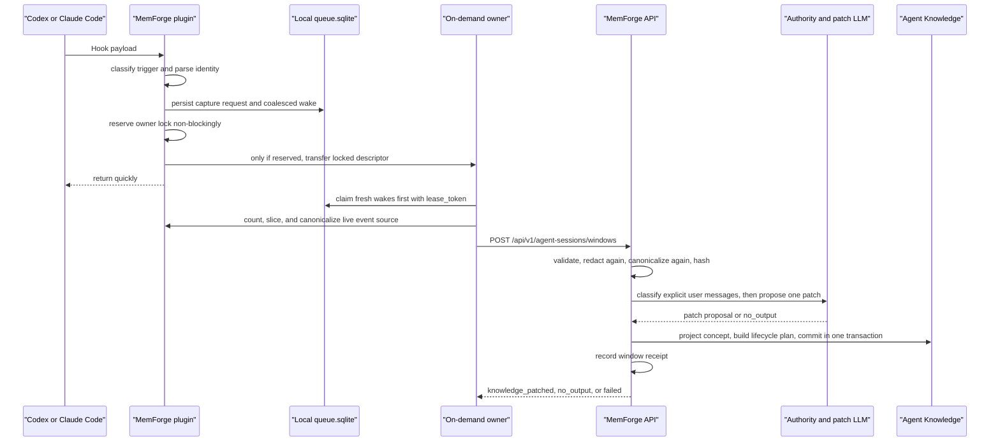

# Agent Session SaaS Plugin Flow

Status: active design, 2026-09-29

## Design Goal

Agent-session memory should work for long Codex, Claude Code, and future coding
agent sessions without letting any client plugin own memory authority. The
plugin captures bounded session windows and delivers them safely. MemForge owns
authorization, user-authority classification, the knowledge patch, lifecycle
reconciliation, and indexing.

The design is intentionally small:

```text
agent coding tool plugin -> redacted canonical evidence window -> MemForge patch proposal
                         -> private Agent Knowledge claim -> canonical memory
```

Native transcript rows are transient. The plugin uses them only as a local
cursor source and projects them into canonical evidence before upload. MemForge
stores private Agent Knowledge (concepts, claims, and their memories), window
receipts, hashes, and processing status. It does not store raw windows.

The service side of this flow is the Agent Knowledge Bundle; see
[agent-knowledge-bundle.md](agent-knowledge-bundle.md) for the concept and
claim model. This document covers capture, upload, and what the window endpoint
does with each upload.

## Ownership Boundary

| Concern | Agent coding tool plugin | MemForge service |
| --- | --- | --- |
| Local lifecycle | Observe Codex, Claude Code, or future client hooks | Never read local transcript files directly |
| Session reading | Use a client adapter to count and slice local event units | Validate upload shape, limits, and canonical evidence |
| Durability | Keep local bookmark, pending flag, lease token, retry state | Persist receipts, Agent Knowledge, and memory lifecycle state |
| Privacy | Redact obvious secrets before network transit | Redact again before hashing, prompting, or storing |
| Auth | Attach a bearer/API token from local config | Derive user and source scope from the request principal |
| Processing | Upload canonical evidence windows | Classify user authority, propose one knowledge patch, apply it |
| Authority | Provide provenance only | Treat provenance as audit data, not authorization input |

Each client and user has one private `agent_session` Source. MemForge derives
its id from the client name and the request principal
(`src-agent-sessions-<client>-<owner fingerprint>`); the plugin never names a
source.

## End-To-End Workflow


```mermaid
sequenceDiagram
  participant Tool as "Codex or Claude Code"
  participant Plugin as "MemForge plugin"
  participant Queue as "Local queue.sqlite"
  participant Worker as "On-demand owner"
  participant API as "MemForge API"
  participant LLM as "Authority and patch LLM"
  participant Knowledge as "Agent Knowledge"

  Tool->>Plugin: Hook payload
  Plugin->>Plugin: classify trigger and parse identity
  Plugin->>Queue: persist capture request and coalesced wake
  Plugin->>Plugin: reserve owner lock non-blockingly
  Plugin->>Worker: only if reserved, transfer locked descriptor
  Plugin-->>Tool: return quickly
  Worker->>Queue: claim fresh wakes first with lease_token
  Worker->>Plugin: count, slice, and canonicalize live event source
  Worker->>API: POST /api/v1/agent-sessions/windows
  API->>API: validate, redact again, canonicalize again, hash
  API->>LLM: classify explicit user messages, then propose one patch
  LLM-->>API: patch proposal or no_output
  API->>Knowledge: project concept, build lifecycle plan, commit in one transaction
  API->>API: record window receipt
  API-->>Worker: knowledge_patched, no_output, or failed
```

The window request is the whole write path. Agent-session Sources have no
source sync, so neither the plugin nor the scheduler triggers one.

## Workflow Walkthrough

### 1. Hook Arrives

The client invokes the plugin with a native hook payload. The adapter reads only
what is needed to identify the session and classify the lifecycle moment.

Example hook-shaped input:

```json
{
  "session_id": "0193-example",
  "hook_event_name": "PreCompact",
  "transcript_path": "/Users/me/.codex/sessions/0193.jsonl",
  "cwd": "/Users/me/project"
}
```

The adapter converts native hook names into a small normalized vocabulary:

| Normalized capture policy | Typical native hooks | Why it exists |
| --- | --- | --- |
| `REQUIRED_CAPTURE` | `PreCompact` | Context may be lost, so capture regardless of the cheap gate. |
| `GATED_CAPTURE` | `Stop`, `SubagentStop` | A turn or unit ended. Capture only when the uncaptured tail has durable signals. |
| `RECOVER` | `SessionStart` | Retry pending work and re-arm an idle session whose transcript grew. |
| `IGNORE` | unsupported hooks | Leave the session untouched. |

Per-prompt memory retrieval is not in this table. The plugin does not register
a `UserPromptSubmit` hook; the agent calls the MCP `search` tool on demand for
query-aware context.

The point of normalized capture policies is not abstraction for its own sake. It
keeps Codex, Claude Code, and future clients on one capture algorithm while
confining client-specific assumptions to the adapter.

### 2. Capture Is Requested

The hook does not freeze a range and does not run LLM work. It only updates the
local `session_cursor` row:

```text
client=codex
session_id=0193-example
captured_through=120
capture_pending=1
pending_trigger=REQUIRED_CAPTURE
request_seq=42
```

`REQUIRED_CAPTURE` wins over `GATED_CAPTURE` because context-loss capture has
higher recall. Repeated hook events collapse into the same pending flag.

### 3. Worker Builds A Window

The detached worker claims one pending session with a random `lease_token`. It
then computes the range from live state:

```text
from = session_cursor.captured_through
to   = EventSource.count(identity)
```

For Codex and Claude Code today, `EventSource.count()` is the transcript JSONL
line count. The worker reads `[from, to)`, not a range stored by the hook. This
matters because the transcript may grow between hook time and upload time.

If the transcript disappeared while the session is pending, the worker keeps
`capture_pending=1` and stores `last_error`; it does not silently mark the
session complete.

Stop, PreCompact, and SessionStart use one capture scheduler. Fresh durable
wakes are claimed before historical pending rows in each round of at most five.
One activation can process at most five historical rows, while new wakes and
successful bounded prefixes can continue into further rounds. A claimed round
is not preempted by a later hook.

Failure keeps the bookmark and sets `retry_after` from failure completion. Upload
failures back off exponentially from 60 seconds, doubling per consecutive
failure (`failure_count`) up to one hour; success clears both. A failure that
means no workspace can be selected (`workspace_selection_required`,
`workspace_not_found_or_inaccessible`, or a local binding error) waits the full
hour. When it is due again the worker resolves the session directory locally and
sends nothing while that still selects no workspace; a later hook that resolves a
workspace clears the wait. Waiting captures whose transcript last changed more
than 7 days ago are dropped with `last_error = workspace_backlog_expired`.
SessionStart shows the binding hint while such captures wait and the current
project is unbound. The same identity is not retried within that worker
activation. With no eligible work the owner exits; later hooks or explicit
recovery retry pending work.
SessionStart wakes its current already-pending row, or rearms its idle row if
the transcript grew. It never changes the pinned workspace to wake a session.

### 4. Worker Uploads A Bounded Evidence Prefix

The uncaptured tail is the part of the event stream after the bookmark:

```text
captured_through = 120
current count    = 220
tail             = [120, 220)
```

The worker scans complete native event units, drops bootstrap/context noise, and
projects useful records into canonical evidence. If the projected evidence fits,
it uploads one window representing `[120, 220)` and advances the bookmark to 220
after success.

If the projected evidence is too large, the worker uploads only the first
bounded evidence prefix of that tail:

```text
tail                 = [120, 220)
evidence budget      = 40 events or about 60k chars
uploaded evidence    = useful records from [120, 150)
omitted metadata     = counted in receipt metadata
remaining tail       = [150, 220)
```

After a successful prefix upload:

```text
captured_through = 150
capture_pending  = 1
```

The next worker pass continues from 150. The bookmark advances through records
that were either represented as canonical evidence or explicitly omitted as
metadata/context noise. If one JSONL line contains oversized useful evidence,
the plugin preserves the evidence head and tail with a middle truncation marker,
marks the window truncated, and advances by one line after upload succeeds.

### 5. MemForge Proposes A Knowledge Patch

The plugin posts to:

```http
POST /api/v1/agent-sessions/windows?workspace_id=<selected workspace>
Authorization: Bearer <plugin token>
```

Representative request:

```json
{
  "schema_version": "agent-session-window/v1",
  "plugin_version": "0.1.0",
  "client": "codex",
  "session_id": "0193-example",
  "trigger": "REQUIRED_CAPTURE",
  "workspace": "/Users/me/project",
  "repo": "project",
  "branch": "main",
  "commit_sha": "abc123",
  "history_window": {
    "kind": "transcript_window",
    "transcript_path": "/Users/me/.codex/sessions/0193.jsonl",
    "start": "120",
    "end": "150",
    "line_count": 30,
    "truncated": true
  },
  "events": [
    {"kind": "user_message", "actor": "user", "text": "Refine the agent-session design."},
    {"kind": "tool_call", "actor": "assistant", "name": "apply_patch", "text": "Updated hook adapter."},
    {"kind": "tool_result", "actor": "tool", "name": "exec_command", "text": "Focused pytest passed."}
  ],
  "transcript_markdown": "{fallback field containing compact canonical evidence, not raw JSONL}",
  "receipt": {
    "hook": "REQUIRED_CAPTURE",
    "metadata": {
      "from_line": 120,
      "uploaded_to_line": 150,
      "observed_to_line": 220,
      "omissions": {"metadata_or_context": 42}
    }
  },
  "retention": "none",
  "process_now": false
}
```

MemForge validates `schema_version`, requires `retention` to be `none`, redacts
again, canonicalizes the uploaded events again, and hashes the service-canonical
content. A window whose range and hash already have a receipt returns the
recorded result with `"idempotent": true`; only a window whose earlier attempt
failed runs again.

For a new window, MemForge first classifies explicit user messages: each one is
marked `primary` when it states durable intent (a rule, preference, decision,
or approval of a durable direction) and `supporting` otherwise. Assistant
messages and tool output are always `supporting`. It then makes one patch
proposal call. The prompt lists the user's existing private concepts for the
same repository and the primary and supporting evidence, and the model returns
one action: `create_new_concept`, `add_new_claim`, `update_existing_claim`,
`supersede_existing_claim`, or `no_output`. A proposal whose `primary_event_id`
is not a primary user message, or whose `required_event_ids` are not explicit
user messages, is recorded as `no_output`.

Within `agent-session-window/v1`, `events` are the canonical evidence stream.
`transcript_markdown` is a fallback carrier: plugins fill it with rendered
canonical evidence, not raw transcript JSONL, and the service passes it to the
patch prompt only when no canonical events survive canonicalization.

`trigger` is the normalized capture policy (`REQUIRED_CAPTURE`,
`GATED_CAPTURE`, or `RECOVER`). Native hook names such as `PreCompact` are
client details and belong in adapter logs or receipt metadata when needed. The
uploaded range is always
`history_window.start/end`; `observed_to_line` only records the live transcript
count seen when the worker built the window.

Patch-applied response:

```json
{
  "accepted": true,
  "window_hash": "sha256:...",
  "status": "processed",
  "result": "knowledge_patched",
  "patch_outcome": "applied",
  "concept_id": "akb_concept_...",
  "claim_id": "akb_claim_...",
  "memory_id": "...",
  "source_id": "src-agent-sessions-codex-...",
  "source_type": "agent_session",
  "process_now": false,
  "sync_started": false,
  "sync_queued": false
}
```

No-output response:

```json
{
  "accepted": true,
  "window_hash": "sha256:...",
  "status": "processed",
  "result": "no_output",
  "patch_outcome": "skipped_not_memory",
  "reason": "window had no durable memory value",
  "covered_concept_id": null,
  "covered_claim_id": null,
  "sync_started": false,
  "sync_queued": false
}
```

`covered_concept_id` and `covered_claim_id` name an existing claim that already
covers the window, when the model identified one. A proposal that cannot be
applied (for example, it matches more than one existing claim, or targets a
concept outside the caller's scope) returns `"result": "failed"` with its
`patch_outcome` and `reason`. `sync_started` and `sync_queued` are always
`false`, because agent-session Sources have no source sync.

Error responses:

| Status | Meaning | Plugin behavior |
| --- | --- | --- |
| 400 | Invalid request, unsupported `schema_version`, `retention` other than `none`, or paused Source | Keep the bookmark and back off |
| 409 | Another activity already holds the Source activity lease | Keep the bookmark and back off |
| 503 | Authority or patch LLM failed; body code `agent_session_llm_failed`, header `Retry-After: 60` | Keep the bookmark and back off |

Every error keeps the capture pending, so the same range is uploaded again.

### 6. The Patch Becomes A Private Claim

MemForge applies the proposal through `AgentKnowledgeBundleService`:

```text
patch proposal
  -> resolve the target claim against the caller's current private claim memories
  -> render the concept markdown from its claims
  -> project the concept as the Source Unit of the agent_session Source
  -> locate each claim's exact text in that markdown
  -> build the Lifecycle Plan directly
  -> commit projection, lifecycle mutations, concept, and claim in one transaction
```

Target resolution is memory-first. A `create_new_concept` or `add_new_claim`
proposal that matches exactly one current claim memory becomes an update of that
claim; more than one match fails as ambiguous. An update or supersede proposal
without ids resolves its target the same way. Writes are limited to the caller's
own private concepts in the same repository.

The concept is the Source Unit and its id is the document id. Claims in the
concept that the patch did not touch are rebound to the new concept revision
deterministically, without an LLM call. An update or supersede records a
`refines` or `contradicts` relation derived from the patch action. There is no
extraction or relation-classification LLM call in this step.

Agent-session Sources are service-managed. The Admin UI lists each one with
the counts from `GET /api/v1/agent-sessions/completeness`, and does not offer
configure, sync, or delete actions for it. The owner corrects or retires an
agent-session claim through the memory lifecycle service under Owner Authority
(ADR 0012); that path is separate from automated Source reconciliation.

### 7. Completeness Is Auditable

Capture completeness is a local bookmark check:

```text
captured_through == EventSource.count(identity)  -> complete
captured_through <  EventSource.count(identity)  -> uncaptured tail remains
```

Server receipts answer what happened to uploaded windows:

```text
outcome = knowledge_patched | no_output | failed
```

`GET /api/v1/agent-sessions/completeness` summarizes processed window outcomes
on demand, including `no_output_fraction` over processed windows. It does not
store a verdict or create a background audit job. When at least one window
failed, the response also carries a `latest_failure` summary (`count`,
`reason`, `last_seen_at`) so the admin UI can surface a single operational
warning instead of querying receipts again.

## Client-Side Components

### ClientAdapter

The adapter is the only client-specific layer:

```text
parse_identity(payload)   -> session_id, workspace, repo, branch, commit
classify_capture_policy(payload) -> REQUIRED_CAPTURE | GATED_CAPTURE | RECOVER | IGNORE
event_source(identity)    -> count() and slice()
project_events(lines)     -> canonical evidence events + omissions
```

It is allowed to know that Codex uses rollout JSONL with top-level
`timestamp/type/payload`, or that Claude Code nests tool parts under
`message.content[]`. Those assumptions must not leak into the queue/bookmark
core or into the service patch prompt.

The adapter does rule-based projection only. It does not summarize, extract
memories, or decide durable truth.

Canonical event shape:

```json
{
  "kind": "tool_result",
  "actor": "tool",
  "name": "exec_command",
  "text": "focused pytest passed",
  "source_type": "response_item",
  "native_type": "function_call_output",
  "timestamp": "2026-05-30T12:00:11Z",
  "truncation": {
    "strategy": "middle",
    "original_chars": 120000
  }
}
```

Supported `kind` values stay intentionally small:
`user_message`, `assistant_message`, `tool_call`, `tool_result`,
`file_change`, `command_result`, `decision`, and `error`.

### EventSource

The core indexes one ordered stream per session:

```text
EventSource.count(identity)           -> integer event count
EventSource.slice(identity, from, to) -> complete event units in [from, to)
```

Current clients use `FileTranscriptSource`:

```text
count = JSONL line count
slice = complete JSONL lines
```

Future clients without transcript files can use `AssembledEventSource`, where
hooks append native events to a local `hook_events` table and the same bookmark
logic indexes those rows.

### Local Queue

The queue has one cursor row per client session:

```sql
CREATE TABLE session_cursor (
  client            TEXT NOT NULL,
  session_id        TEXT NOT NULL,
  transcript_path   TEXT,
  workspace         TEXT,
  workspace_id      TEXT,
  captured_through  INTEGER NOT NULL DEFAULT 0,
  capture_pending   INTEGER NOT NULL DEFAULT 0,
  pending_trigger   TEXT,
  lease_until       TEXT,
  lease_token       TEXT,
  request_seq       INTEGER NOT NULL DEFAULT 0,
  last_error        TEXT,
  last_attempt_at   TEXT,
  wake_requested_at TEXT,
  failure_count     INTEGER NOT NULL DEFAULT 0,
  retry_after       TEXT,
  created_at        TEXT NOT NULL,
  updated_at        TEXT NOT NULL,
  PRIMARY KEY (client, session_id)
);
```

`captured_through` is the bookmark. `lease_token` is a claim ticket: a worker can
finish the row only while the row still contains its token. `request_seq`
increments on every capture request so a worker can detect that a newer request
arrived while it was uploading.

`wake_requested_at` records unclaimed demand, preserving the earliest request
time. It is consumed in the lease transaction; later hooks can set it again.
It is distinct from `capture_pending`, which also includes historical failures.

The queue opens in WAL mode with a bounded busy timeout. A hook persists its
request before ensuring an owner. It reserves the advisory lock non-blockingly
before spawning, transfers the locked descriptor, and closes its copy without
unlocking. Other hooks leave their wakes for that owner and spawn no waiter.

Before exit, the owner rechecks eligible work under a SQLite write transaction.
It releases the advisory lock inside that transaction, then commits and exits.
This serializes enqueue with the final check/unlock so a concurrent wake belongs
to the existing owner or a newly spawned owner. No network I/O or transcript scan
runs inside a queue write transaction.

Crashes preserve pending work and release OS ownership; leases must expire before
retry. There is no timer or idle polling, so recovery needs a later hook. POSIX
locking is required. Upgrade both clients and let old workers exit before relying
on the single-owner process bound. See [ADR 0035](../adr/0035-preserve-current-agent-session-capture-wakeups.md)
for the ownership and recovery contract.

## Service-Side Components

| Component | Responsibility |
| --- | --- |
| `POST /api/v1/agent-sessions/windows` | Validate versioned window uploads, derive the per-client, per-user Source, and run the patch flow |
| Window canonicalizer | Redact again, drop operational noise, normalize events, and assign per-window evidence ids |
| Authority classifier | Classify explicit user messages in bounded batches while preserving the full canonical event stream as context; require exactly one typed decision per batch candidate |
| Patch proposer | Turn primary and supporting evidence plus the user's existing private concepts into one patch action, or `no_output` |
| `AgentKnowledgeBundleService` | Resolve the target claim, render and project the concept, build and commit the Lifecycle Plan |
| Source activity lease | Hold an agent-patch activity lease on the Source while a patch runs; a conflicting activity returns HTTP 409 |
| Agent session receipts | Record processed outcome, reason, hash, range, and provenance; answer repeated uploads |
| Completeness endpoint | Summarize processed window outcomes on demand |

Patch prompt contract:

- Authority classification is fail-closed. Candidate output is bounded by
  batching, not by dropping surrounding evidence or accepting a truncated
  response. A candidate that still has no valid decision after the batch
  runner's single re-ask fails the window before the patch proposal.
- A non-`no_output` action must cite exactly one primary user message as
  `primary_event_id`. Supporting evidence can explain or qualify a claim but
  cannot authorize one.
- Keep only durable preferences, conventions, procedures, decisions, pitfalls,
  or debugging takeaways; return `no_output` for ordinary progress, transient
  status, or facts a future agent can rediscover from the repository.
- Return `no_output` when an existing claim already covers the statement.
- Keep run logs, exit codes, branch and test names, and deployment notes in
  `claim_text` as provenance, out of the durable claim.

Agent-session knowledge enters MemForge only through windows, so every durable
claim is anchored to an explicit user message.

`POST /api/v1/hooks/receipts` is a lightweight lifecycle receipt endpoint. It
does not create source material and does not write memories.

### Cloud Impact

MemForge Cloud composes this package and runs the same window route and Agent
Knowledge code. Its relational store is HANA, which implements
`apply_agent_claim_source_projection_lifecycle` from the storage protocol in
`src/memforge/storage/adapters/protocols.py`, and the authority and patch LLM
calls go through Cloud's `sap/` LiteLLM routes. This document describes that
shared behavior; it changes no code, so Cloud needs no change.

## Real Transcript Checks

The design was checked against local Codex and Claude Code JSONL sessions, not
only toy fixtures.

Codex observations:

- Common top-level keys are `timestamp`, `type`, and `payload`.
- Useful semantic detail often lives in nested `payload` records such as
  `function_call`, `function_call_output`, `message`, and `agent_message`.
- Some lines are very large, so the upload budget must handle oversized single
  lines.
- The useful memory evidence may appear after a large bootstrap prefix, so
  budgeting must happen after metadata/context filtering, not by raw line prefix
  alone.

Claude Code observations:

- Common top-level records include `assistant`, `user`, and system entries.
- Tool details appear in `message.content[]` parts such as `tool_use`,
  `tool_result`, `text`, and `thinking`.

Design consequences:

- Split by complete event units, not arbitrary bytes.
- Advance the bookmark only through represented or explicitly omitted units.
- Let `GATED_CAPTURE` scan the uncaptured tail incrementally and return early
  once it sees a durable signal.
- Keep parser assumptions inside the adapter.
- Keep raw transcript JSONL out of the patch prompt when canonical evidence
  exists.

## Generality Across Agent Clients

The implementation is general at the windowing boundary, not by pretending every
client has the same transcript format.

```text
client-specific adapter
  -> normalized capture policy
  -> EventSource.count/slice
  -> canonical evidence projection
  -> shared queue and worker
  -> shared window upload
```

Codex and Claude Code are both file-backed clients, so the current implementation
uses a concrete shared file path reader plus per-client parsing. When the first
non-file client lands, the adapter contract becomes the extraction point for
`AssembledEventSource`.

Expected future mappings:

| Client | Event source | Capture policy |
| --- | --- | --- |
| Codex | rollout JSONL file | `PreCompact` as `REQUIRED_CAPTURE`, `Stop` as `GATED_CAPTURE` |
| Claude Code | transcript JSONL file | `PreCompact` as `REQUIRED_CAPTURE`, `Stop`/`SubagentStop` as `GATED_CAPTURE` |
| Cursor | assembled hook events | size/idle `GATED_CAPTURE` if no compaction boundary exists |
| Other clients | adapter-defined | same shared queue and window upload |

## Hosted SaaS Hardening To-Do

Keep hosted tenancy as a tracked hardening list, not as extra MVP machinery:

- Derive `tenant_id` and `project_id` from plugin auth or registration, the way
  user identity and the agent-session Source id come from the request principal.
- Enforce auth on window, hook, source, memory, and completeness APIs.
- Add project allowlist/opt-in on both client and server.
- Add token registration, rotation, revocation, expiry, and last-used audit.
- Add request limits for bytes, event count, nesting, string length, and receipt
  metadata.
- Define deletion semantics across Agent Knowledge concepts and claims,
  receipts, memories, vectors, audit retention, and local queue purge guidance.
- Add offline retry backoff, jitter, queue/disk caps, rate-limit handling, and a
  manual drain command.
- Return structured unsupported-version responses and publish a schema
  compatibility window.

## Reliability Rules

- Hooks must return quickly and must not fail the user's coding session.
- A skipped `GATED_CAPTURE` must not advance the bookmark; skipped content folds
  into the next capture.
- `REQUIRED_CAPTURE` always requests capture.
- A worker advances `captured_through` only after confirmed upload and only while
  it still owns the row's `lease_token`.
- Oversized tails upload bounded evidence prefixes and leave the rest pending.
- Missing transcripts and upload failures leave visible local state:
  `capture_pending=1`, unchanged bookmark, and `last_error`.
- A patch commits its projection, lifecycle mutations, and Agent Knowledge rows
  in one database transaction.
- Window identity combines the event range with a content hash. Identical retries
  return the recorded result; same-range changed content is a distinct window
  with its own receipt.

## Non-Goals

- No direct memory insertion from hooks.
- No MemForge discovery of local Codex or Claude Code transcript files.
- No mandatory standalone daemon for users.
- No raw window storage: `retention` must be `none`.
- No Codex-style global Phase 2 consolidation in the MVP.
- No agent-session writes outside the uploading user's own private concepts and
  claims.
- No source sync for agent-session Sources.

## Verification Coverage

The implementation has focused tests for:

- hook capture-policy classification, skip/capture gating, and `RECOVER`
  re-arming
- lease-token and `request_seq` protection against stale workers
- bounded evidence-prefix upload for oversized tails
- missing transcript retry state
- pre-network redaction and bearer auth
- canonical evidence extraction for Codex payloads and Claude nested content
- service-side canonicalization before authority classification and patching
- schema version validation
- rejection of patches that cite non-primary or non-user evidence
- `knowledge_patched`, `no_output`, and failed receipt outcomes, and idempotent
  repeated windows
- patch application through the projected lifecycle, including rollback when
  the claim projection cannot commit
- Codex nested `payload` parsing and Claude nested `message.content[]` parsing
- completeness outcome summaries for processed windows
