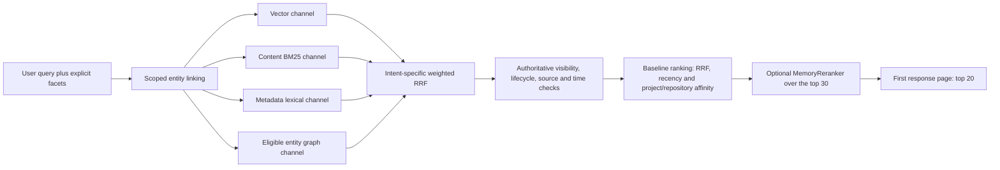

# Query-time Memory reranking

Status: accepted target design; implementation is deferred until the Support Assessment work is complete.

## 1. Purpose and boundary

Reranking improves the order of an already retrieved, authorized Memory shortlist. It does not create Memories, change Support, execute lifecycle actions, or repair first-stage recall. The Source revision and Support Assessment work remains a separate lifecycle concern.

The target OSS defaults are one public response page of 20 Memories, a per-channel ranked candidate window of 50, and an optional rerank window of 30. Four retrieval channels each returning up to 50 results can intuitively produce about 200 entries before deduplication, but there is no fixed global 200-item pool. Channel overlap usually makes the union smaller; graph fan-out over several linked entities can make it larger.

## 2. Runtime flow



Every channel receives the caller AccessScope and applicable hard facets. The relational store rechecks visibility and lifecycle status after fusion; source and time predicates are also applied before any model receives a candidate. A reranker can only reorder the supplied authorized IDs. Queryless source/time listing is a deterministic database operation and never invokes the reranker.

Intent stays application-owned. `general_hybrid`, `known_item`, and `relationship` keep their accepted fusion policies. Reranking does not add another intent classifier and cannot alter the requested or resolved intent.

## 3. One narrow application seam

Search depends on a `MemoryReranker`, not a provider-shaped Structured LLM client:

```python
class MemoryReranker(Protocol):
    async def rerank(self, request: RerankRequest) -> RerankResult: ...
```

Logical request:

```json
{
  "query": "How do we recover a failed payroll assignment?",
  "resolved_intent": "general_hybrid",
  "candidates": [
    {
      "memory_id": "mem-0001",
      "content": "...",
      "memory_type": "procedure",
      "baseline_rank": 1,
      "baseline_score": 0.91,
      "retrieval_evidence": {
        "rank_fusion": {"contributions": []},
        "metadata_lexical": null
      }
    }
  ]
}
```

Logical result:

```json
{
  "ordered_ids": ["mem-0007", "mem-0001"],
  "scores": {"mem-0007": 0.93, "mem-0001": 0.71},
  "provider": "typesafe",
  "model": "jev-1.13.0",
  "contract_version": "memory-rerank-v1",
  "complete": true
}
```

`ordered_ids` is mandatory. Scores are optional because pointwise and listwise backends expose different native results. The application preserves baseline ranks and scores for diagnostics and deterministic tie-breaking; it does not overwrite them with synthetic `1.00, 0.99, ...` values.

The result is valid only when every input candidate appears exactly once, no unknown ID appears, and the request identity still matches the query, facets, candidate manifest, backend, model, and contract version. A timeout, provider error, duplicate, omission, unknown ID, or stale result invalidates the whole rerank. Search then returns the unchanged baseline ranking. Partial reranking is not published.

Target transport (Cloud #505): the reranker sends its request through the LLM batch runner of [ADR 0036](../adr/0036-separate-semantic-work-from-inference-executors.md) as one indivisible listwise item. The runner never splits it. Search passes its deadline to the call, and a timeout or invalid output returns the baseline order. This is a fixed code rule, not configuration.

## 4. Replaceable inference adapters

### 4.1 Classifier-model pointwise reranker

A classifier model means TypeSafe/Jev or a small-parameter LLM admitted for the complete task contract. It evaluates one independent query-candidate pair:

```text
State: query + one authorized Memory card + resolved intent
Question: Does this Memory directly help answer or execute the query?
Output: comparable relevance probability
```

A Jev adapter uses one Noul probability per pair. Calls may run with bounded parallelism, but rate limits, latency and cost are transport details. The application sorts by relevance probability, then baseline rank, then Memory ID. The model cannot add candidates or change hard filters.

### 4.2 Structured-LLM listwise reranker

A listwise adapter sends the same bounded candidate manifest to a Structured LLM and requests one complete permutation. It reuses the existing capability but validates the full permutation atomically. Its native output need not invent pointwise scores.

Backend admission is task-wide, based on a pinned evaluation set and model/version. There is no per-candidate confidence cascade from one backend to another. Provider failure falls back to the deterministic baseline order, not to an unrecorded substitute model.

## 5. Placement and initial scope

Reranking runs after weighted RRF, authoritative hard filters, recency, and project/repository affinity, and before the first response-page slice. Version one reranks the first page only, using the top 30 baseline candidates to produce the default top 20. Deep reranked pagination is out of scope; non-first-page reads retain the deterministic baseline order until a stable reranked cursor contract is designed.

Initial rollout is limited to `general_hybrid`. Known-item retrieval depends heavily on exact metadata identity, and relationship retrieval depends on graph evidence; a generic semantic relevance score can demote those strong signals. Those intents require separate query-family evidence before admission. Retrieval evidence and resolved intent remain available to adapters so later task-specific criteria can preserve those signals.

The rerank window is not increased merely because the corpus or fused union grows. First-stage `Recall@30` must show that the shortlist contains the expected Memory. Reranking cannot recover a Memory omitted by vector, lexical, metadata, graph, visibility, provenance, or candidate-window logic.

## 6. Evaluation and release gate

A fixed multilingual GoldenEval compares the unchanged baseline against each candidate backend on the same immutable query/candidate manifests. At minimum it records:

- first-stage `Recall@30` before reranking;
- `MRR@20`, `NDCG@20`, and `Recall@20` after reranking;
- results by general, exact-identity, relationship, English, Chinese, and mixed-language query family;
- p50/p95 end-to-end latency, provider errors, input tokens or equivalent usage, and per-query cost;
- SQLite/HANA parity for the candidate manifest and all visibility, lifecycle, source, time, and memory-type predicates.

A backend is enabled only when it improves the approved retrieval-quality gates without violating latency, cost, visibility, or adapter-parity gates. TypeSafe cookbook results are research evidence, not MemForge acceptance evidence. The baseline remains the production fallback.

The OSS contract owns `default_top_k=20`, `rank_window_size=50`, and the initial `rerank_candidates=30`. Cloud configuration and its pinned OSS dependency must use the same defaults before Cloud acceptance; a Cloud-only top-10 default is contract drift.

## 7. Non-goals

- no reranking over the full workspace or an assumed 200-item global pool;
- no reranker before authorization, lifecycle, source, or time filtering;
- no queryless-listing reranker;
- no reranker-owned intent, candidate generation, Support, lifecycle, or Memory mutation;
- no automatic enablement based only on corpus size;
- no per-item confidence fallback or partial reordered page;
- no deep reranked pagination in version one;
- no claim that Jev, a small LLM, or the existing listwise LLM wins before MemForge GoldenEval.

## 8. References

- [TypeSafe reranking cookbook](https://docs.typesafe.ai/cookbooks/rerank_typesafe.md)
- [TypeSafe Noul primitive](https://docs.typesafe.ai/primitives/noul.md)
- [TypeSafe models](https://docs.typesafe.ai/models.md)
- [Elasticsearch reciprocal rank fusion](https://www.elastic.co/docs/reference/elasticsearch/rest-apis/reciprocal-rank-fusion)
- [ADR 0022: ranked search intent](../adr/0022-resolve-ranked-search-intent-from-validated-client-hints.md)
- [ADR 0024: lexical candidate eligibility](../adr/0024-separate-lexical-candidate-eligibility-from-term-rarity.md)
