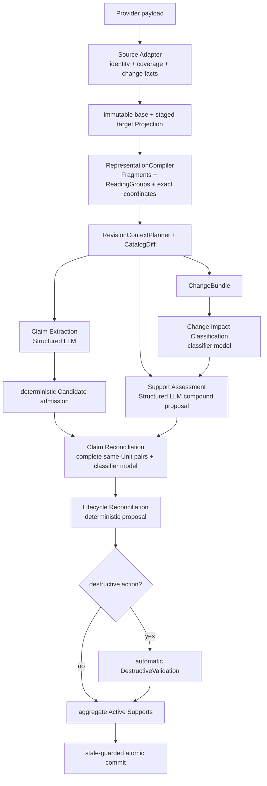
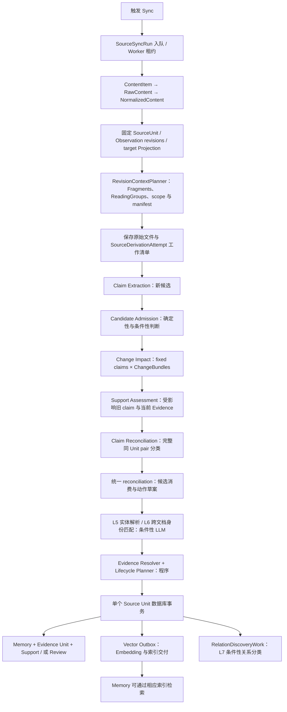

# 单篇文档从 Sync 到 Memory 的完整设计

日期：2026-09-07，目标输入策略更新：2026-09-22。本文描述共享代码的 Sync→Memory 合同；上一版紧凑 catalog 与可恢复分批的验收记录在已关闭的 [Cloud #473](https://github.com/dodoman-sun/memforge-cloud/issues/473)，第 0 节优化的实现与部署由 [Cloud #505](https://github.com/dodoman-sun/memforge-cloud/issues/505) 跟踪。

本文以一篇 Confluence 页面为主线，覆盖首次导入和后续更新。Jira、Markdown 和带附件的文档复用相同领域流程，差异集中在源解析与表示方式。实施前评审基线为 OSS main `abdbdf18a3c1100289051c289046c0c07092fa76`：基线核对的相关路径与固定复核工作树 `3b8b1fc4` 一致。Cloud 对照基线为 `11338e0235ab23df3199b8024a05c1b17ed71d10`。这里不宣称线上 Cloud 已部署目标设计。

**阅读约定：**第 0 节是截至 2026-09-22 接受的目标合同，尚未据此宣称实现或部署完成；第 18 节继续记录实现差异。后文历史段落中的 L1–L7 只是旧模型职责编号，不能进入新的类型、方法或状态名称。新设计统一使用 Claim Extraction、Support Assessment、Claim Reconciliation 和 Lifecycle Reconciliation。若旧段落与第 0 节冲突，以第 0 节和 [ADR 0034](../adr/0034-unify-incremental-support-and-claim-assessment.md#context-planning-optimization-amendment-2026-09-21) 为准。

## 文档职责与阅读入口

本文是普通 Source 文档从 Sync 到 Memory 的完整流程入口，解释模块、数据、模型调用和失败边界。共享决策以 OSS ADR 为准；本次合并判断与输入策略由 [ADR 0034](../adr/0034-unify-incremental-support-and-claim-assessment.md) 记录共享决策。第 18 节区分实施前基线与改造落点。

- [Document Memory Lifecycle](document-memory-lifecycle.md) 只定义 Evidence/Support、动作与 Review 的领域约束，不再重复完整 Sync 流程。
- [Source-Agnostic Memory Extraction](source-agnostic-memory-extraction.md) 负责当前提取、角色和 selector 合同；[增量 Primary authority](representation-scoped-incremental-primary-authority.md) 负责表示级差量算法。本文不另造 compiler 或授权规则。
- [ADR 0009](../adr/0009-bound-cross-document-relation-discovery.md)、[0017](../adr/0017-stage-recoverable-source-unit-derivation-before-lifecycle-commit.md)、[0030](../adr/0030-compile-revision-pinned-evidence-fragments.md) 分别拥有异步关系发现、可恢复推导、不可变 Evidence 的详细合同。
- [Semantic judgment execution](semantic-judgment-execution.md) 说明生成与分类调用如何共享 ContextBundle、如何使用 prompt cache，以及哪些判断可以选择 Structured LLM 或 TypeSafe/Jev；[ADR 0036](../adr/0036-separate-semantic-work-from-inference-executors.md) 记录该共享决策。
- [大文档恢复分析](large-document-reconciliation-recovery.md) 是历史问题与未批准选项的记录，不是另一份当前主流程或执行 backlog。

全文/delta 选择用于文档语义材料的供应，不是对所有模型职责一律传全文：Candidate Admission 看候选，Claim Reconciliation 看完整 claim/Evidence 目录，Entity Resolution 看名称语境，跨文档身份与关系发现只看知识及范围。直接用户创建/纠正、managed agent commands 有各自的授权入口，复用后段 Evidence/Lifecycle，但不强制绕回 provider Sync。

## 0. 目标优化方案：少传历史正文，完整覆盖变化，自动保护删除

### 0.1 目标与取舍

本方案优先保证两件事：当前 Memory 拥有完整、可解析的当前 Evidence；系统不会因 Partial 采集、输入分组或模型漏判而错误删除仍然有效的知识。产品接受跨 Source Unit 关系发现的少量漏判、临时重复 Memory、陈旧 Support 暂时保留，以及跨 Source Unit 后 Memory ID 不延续。同一 Source Unit 的 Candidate/Memory 关系不再依赖语义 top-k：确定性 exact match 由程序处理，其余完整 pair manifest 由分类器模型（Jev 或小参数 LLM）分片判断。

目标流程是：



执行器按任务类型选择，而不是按单条 confidence 分流：开放式生成和依赖多字段的 Evidence 计划使用 Structured LLM；封闭、输入完整、逐项独立的分类或排序使用分类器模型（Jev 或小参数 LLM）；exact 比较、完整性、权限和 lifecycle action 始终由程序负责。分类概率只用于离线评估和监控，不决定运行时是否换模型。

### 0.2 `RevisionContextPlanner` 是唯一对外上下文接口

调用方只需要：

```python
plan_revision_context(
    base_projection,
    target_projection,
    change_set,
    existing_supports,
    coverage,
) -> RevisionContextPlan | TypedPlanningFailure
```

内部的 Markdown/HTML、纯文本、canonical JSON、Jira 和 Teams 表示 adapter 负责生成统一 ReadingGroup：

```text
scope / container / before / target / after
+ authority / selectable refs / exact coordinates
```

`target` 可以是 current Fragment，也可以是 `RemovedAnchor`。因此纯删除不需要伪造空 current Fragment。ReadingGroup 只扩大阅读范围，不扩大 Primary 权限；Context 和历史 excerpt 不能被选为当前 Evidence。

#### `RepresentationCompiler` 只在 planner 内部暴露

Fragment 和 ReadingGroup 是同一 immutable Revision 的两种视图，不能由 Extraction、Support 和 request packer 分别解析。`RevisionContextPlanner` 私有调用一个深的 `RepresentationCompiler`：

```python
compile_representation(
    revision,
    candidate_ranges,
) -> CompiledRepresentation | TypedRepresentationFailure
```

`CompiledRepresentation` 同时包含 exact coordinate map、structure manifest、Fragment catalog 和只引用这些 Fragment 的 ReadingGroups。Markdown、HTML 和 canonical record 的 parser/AST 类型不会泄漏给 caller，也不新增持久化 Fragment/ReadingGroup 表。

实现优先采用能表达所需结构的成熟开源 parser，并把它锁在 representation adapter 内。开源 parser 只给 line range 或 normalized tree 时，adapter 负责映射并验证 raw half-open offsets；无法精确映射就 typed failure，不能把 normalized text 当 Evidence。自研代码只允许补齐坐标映射或未被库覆盖的注册结构，不允许重新实现一套散落在各调用方的 Markdown/HTML/JSON parser。

#### Context 与模型调用分开

Planner 输出 backend-neutral `ContextBundle`，按稳定性排列：

```text
CONTRACT → REVISION_SHARED → COHORT → CARRIED_STATE → ATTEMPT
```

Structured LLM adapter 将其渲染为稳定前缀在前的 prompt，并在实际 route 支持时请求 prompt caching；分类器 adapter 将同一判断上下文渲染为共享 state 和独立的封闭标签问题。分类器实现可以是 Jev，也可以是通过同一任务评估的小参数 LLM。Claim Extraction 与完整 Support Assessment 使用 `GenerationExecutor`；Change Impact、同 Unit Relation 和 rerank 使用 `JudgmentExecutor`。executor 只负责推理调用，不能改变 ReadingGroups、selectable refs、work manifest 或 lifecycle authority。

### 0.3 旧 Evidence 的确定性对应

程序始终持有 Memory、Support、Evidence、Observation、Revision、fragment/container digest、coverage 和 source provenance。digest、内部 ID、offset、trace 与 revision metadata 不进入模型输入；模型只收到本次语义判断所需的 prompt-local ref、结构标题和准确文本。程序将 prior Support Evidence 分类为：

| 状态 | 确定性判定 | 后续处理 |
| --- | --- | --- |
| `EXACT_UNCHANGED` | 同一 Source Unit 中存在唯一兼容的 exact fragment，fragment 与 container digest 都未变 | 建立 current ref；若没有 changed groups，直接 `REBIND_SUPPORT` |
| `CONTAINER_CHANGED` | fragment exact，但所在 ReadingGroup/container 改变 | current exact fragment + ChangeBundle；不发送旧 excerpt |
| `MODIFIED` | 原 provider object/结构仍在，但 fragment 内容改变 | 旧 excerpt + 当前对应 ReadingGroup，直接进入 Support Assessment |
| `REMOVED` | authoritative complete coverage 证明原 fragment 消失 | 旧 excerpt + current-full Assessment Scope，直接进入 Support Assessment |
| `AMBIGUOUS` | 多个 exact/structural candidate 或对应不唯一 | 旧 excerpt + 全部候选 ReadingGroups，直接进入 Support Assessment |
| `UNKNOWN` | Partial coverage 不能证明存在或删除 | 程序产生 `UNRESOLVED(partial_coverage)`，KEEP；不调用 Support LLM，不允许破坏性动作 |

旧 excerpt 的发送规则没有可选分支：只对 `MODIFIED`、`REMOVED`、`AMBIGUOUS` 发送一次 immutable exact excerpt；`EXACT_UNCHANGED` 与 `CONTAINER_CHANGED` 不发送，因为 current fragment 已包含相同正文；`UNKNOWN` 不进入模型。历史 excerpt 永远只读且不可被选择为 current Evidence。

`REBIND_SUPPORT` 只刷新当前 provenance：Memory ID 与 claim 不变，程序创建或复用 target Revision 的 Evidence Unit，并在同一 Lifecycle Plan 事务中 `ATTACH_SUPPORT` 新 assertion、将被替换的旧 assertion 标为 inactive。旧 Support 行、旧 Evidence 与 lifecycle history 保持不可变并可审计，不做物理删除或原地改写。幂等身份绑定 Memory、Source Unit、target Revision 与 current Fragment。

`EXACT_UNCHANGED` 只证明原句仍在，不证明远处没有新增例外。Planner 将全部新增/修改 ReadingGroups 在容量内组合成 `ChangeBundle`；分类器模型（Jev 或小参数 LLM）对每条 exact-rebound fixed claim 输出 `AFFECTED` 或 `UNAFFECTED`。一个 bundle 对 300 条 claims 是 300 个分类问题，不是 `300 × group_count`。多个 bundle 的结果由程序作 OR 归约；任一 `AFFECTED` 进入完整 Support Assessment，全部 `UNAFFECTED` 才完成 KEEP+REBIND。该任务是否交给某个分类器 backend 由固定评估集整体准入，不按单条 confidence fallback。

### 0.4 Delta、current-full 与大文档

三个输入概念必须分开：

- `ReadingGroup` 是一个可独立理解的当前结构单元，可包含多个可引用 `EvidenceFragment`；
- `AssessmentContext` 是单次 Support 调用实际收到的一个或多个 ReadingGroups，以及由它们生成的 prompt-local Evidence Candidate Catalog；
- `AssessmentScope` 是整个 Support work 必须覆盖的逻辑范围，取 `DELTA` 或 `FULL_CURRENT_REVISION`。

Delta 的逻辑输入为：

```text
all changed ReadingGroups grouped into ChangeBundles
+ fixed claims and compact Support metadata
+ current context for modified/removed/ambiguous Evidence
+ historical excerpts exactly for MODIFIED/REMOVED/AMBIGUOUS
```

旧 Evidence 分散在全文不等于 Delta 接近 Full。`EXACT_UNCHANGED` 只贡献 current ref 和 compact state。`MODIFIED` 使用对应 current ReadingGroup；`AMBIGUOUS` 使用全部确定候选。Planner 总是确定 Delta contexts 和其余 current-full continuation；它不让模型判断“负面 Delta 是否已经足够”。Delta 只能提前确认 `SUPPORTED`；Delta manifest 完成后仍不能组成完整 current Support，就产生内部控制结果 `NEEDS_FULL` 并继续读取其余 current contexts。只有完整 Full manifest 完成后才允许最终 `UNSUPPORTED`。

当 Delta 已覆盖完整 Full manifest，或完整序列化后的 Full 计划不比“Delta + 可能的 Full continuation”更贵时，Planner 直接从 `FULL_CURRENT_REVISION` 开始。这样不会出现 `remaining_full_contexts=[]` 却仍等待另一次 Full 判断的状态。这个决定完全由 exact correspondence、CatalogDiff、coverage、manifest 与 token/capacity 估算生成，不调用分类器或 Structured LLM，也没有 `negative_conclusive` 一类模型字段。

Full 表示逻辑上覆盖完整 effective current Projection，不表示一次把原始全文塞进模型。小文档可用一个 AssessmentContext；大文档将完整 current Catalog 划分成多个 AssessmentContexts，按 manifest 流式处理并携带 grounded previous state。只有所有 contexts 完成且 provider coverage 为 complete，才可产生 `unsupported`。Full 不能把 `PARTIAL_PROJECTION` 升级为完整快照。

Support 有两种确定的 cache 布局。一个固定 current Evidence Catalog 对多个 Memory cohorts 时使用 `REVISION_FIRST`（evidence-fixed batching）；一个固定 unresolved cohort 流式扫描多个 AssessmentContexts 时使用 `COHORT_FIRST`（cohort-fixed streaming）。布局随完整 work plan 确定，重试不切换；它只改变稳定前缀顺序，不改变逻辑材料。`previous_state` 与 attempt diagnostics 永远位于变化后缀。SAP/gateway route 只有在实际透传并报告 provider cache 时才启用 `cache_control`。

单个超大 Observation 只能按已注册 representation contract 拆成具有 exact authority coverage 的结构，例如完整列表、heading+paragraph、完整表格或 canonical record field。仍不可分且超限时返回 typed capacity failure，KEEP 受影响 Support，不推进 baseline，也不从部分结果创建 Memory。

### 0.5 Support witness 累积

Support Assessment 的 work key 是 `(memory_id, independent_support_id)`。不同来源或不同 Evidence Unit 不能拼成一个 Support；一个 Evidence Unit 始终是一 Primary、零到多个 Required。一个 ReadingGroup 可以包含多条 EvidenceFragments，一个 AssessmentContext 也可以包含多个 ReadingGroups，因此“当前 ReadingGroup”与多 Evidence 并不冲突。

Support 的最终语义结果只有：

```text
SUPPORTED(work_id, primary_ref, required_refs[])
UNSUPPORTED(work_id)
```

只有 `SUPPORTED` 允许并要求 selector 字段；`UNSUPPORTED` 的 schema 禁止 `primary_ref` 和 `required_refs`，不再发送 `null` 与空数组。Primary/Required 必须来自当前 AssessmentContext 的 Evidence Candidate Catalog，或来自 `previous_state` 中已由更早 AssessmentContext grounding、并在本次请求中重新提供正文的 current refs；历史 refs 永远不可选择。

每个流式 `support_assess` step 只输出本次新增的 bounded grounded witnesses，不输出累计 `status`：

```json
{
  "work_id": "WRK-0001",
  "witness_delta": {
    "support_witness_refs": ["PRM-0012"],
    "opposing_witness_refs": ["PRM-0041"]
  }
}
```

程序验证 `witness_delta` 的 membership 后，与此前 supporting/opposing sets 做单调 union；后一次模型输出不能通过省略删除早期 decisive witness。下一次调用必须同时收到这个程序持有的 union 中所有 current refs 的准确正文与 Primary 资格，形成 `carried_witness_catalog`；只传 ref 会让模型无法继续验证组合语义。例如 Full scope 分为两个 AssessmentContexts：第一组找到“HR 审批”并把 `PRM-0012` 加入 supporting set；第二组收到该 union 及 `PRM-0012` 的 current 正文，找到“Finance 审批”的 `REQ-0041`。最后一个 `support_assess` 返回 `SUPPORTED(WRK-0001, PRM-0012, [REQ-0041])`；`support_finalize` 验证 selectors、manifest 与 coverage 后产生 `COMPLETED(SUPPORTED)` 收据。若第二组出现取消 Finance 审批的 current Evidence，则 ref 被 union 到 opposing set，最终不能被第一组的局部支持覆盖。

Delta manifest 完成后，Structured LLM 只能返回 `SUPPORTED(...)` 或内部过渡 `NEEDS_FULL(work_id, witness_delta)`。`NEEDS_FULL` 不是 Support/lifecycle 状态；程序先将 delta 单调合并到累计 witnesses，Full continuation 再只读取尚未处理的 contexts。Full manifest 与 authoritative coverage 均完成后，Structured LLM 才能返回 `SUPPORTED(...)` 或 `UNSUPPORTED(work_id)`。

执行结果由程序另行包装为 `COMPLETED(SUPPORTED|UNSUPPORTED)` 或 `UNRESOLVED(reason)`。Partial coverage、缺失 context、容量/Provider/schema 失败、模型 abstain 或合法分包间不一致均为 `UNRESOLVED`：KEEP、不允许破坏性动作、不推进 Support baseline。完整 Support Assessment 是依赖多字段的 Evidence 计划，统一由 Structured LLM 完成，不拆成按 confidence 选择 backend 的 cascade。

### 0.6 Claim Reconciliation 使用完整同 Unit pair manifest

同一 Source Unit 的 Claim Reconciliation 是封闭 pair classification。程序先消费 exact duplicate；其余 `N` 个 admitted Candidates 与 `M` 个 Active incumbent Memories 形成完整 pair manifest。分类器模型（Jev 或小参数 LLM）为每个 pair 返回且只返回一个标签：

```text
EQUIVALENT / REFINES / CONTRADICTS / UNRELATED / INSUFFICIENT
```

Catalog 正文作为共享 state 编码，pair questions 只引用 application-issued IDs。问题仍是 `N × M`，但正文不按 pair 重复。传输按估算 token 容量分片、以现有 bounded concurrency 并行；分片是计算细节，不能生成额外业务状态、改变覆盖或部分提交。概率只保留用于离线校准与 telemetry，不触发单条 LLM fallback。

本设计接受同轮 Candidate-to-Candidate 的少量语义重复，不增加另一轮全扫描。跨 Source Unit/全工作区关系发现仍先由现有 hybrid retrieval 产生有限 `K`，再由同一分类器合同判断，因为全工作区笛卡尔积没有界；该发现路径的漏判不能授权破坏性 lifecycle action。

### 0.7 自动 DestructiveValidation

普通 KEEP、Evidence replacement 和非破坏性 ADD 不增加额外检查。准备 `REMOVE_SUPPORT`、`SUPERSEDE` 或 `RETIRE_MEMORY` 时，程序自动验证：

1. affected object 有 authoritative coverage 或 explicit tombstone；
2. Claim Extraction、Support Assessment 与 work manifest 完整且无技术失败；
3. decisive current witnesses 可重新解析，Support set 与 revision 未 stale；
4. `UNSUPPORTED` proposal 是否绑定已完成、authoritative 的 Full receipt；
5. 模拟 source-scoped removal 后，Memory 是否还有其他 Active Support。

这一步没有人工确认，也不会再次扫描 current Projection。Delta→Full 语义覆盖只由 Support Planning/Assessment 执行一次；DestructiveValidation 只验证完成收据、coverage、witnesses、Support count 与 stale guards。UNKNOWN coverage、`UNRESOLVED`、capacity failure 和 stale input 均自动 KEEP。只有最后一个 Active Support 被合法移除时才可 retire Memory。

### 0.8 Source Unit identity 改变

Provider Page ID、Teams window identity 等发生变化时，系统按旧 Unit 删除＋新 Unit 创建处理，不跨 Unit 做破坏性语义 rebind，也不保证 Memory ID 连续：

```text
COMPLETE_SNAPSHOT 证明 A 消失
  → 移除 A-scoped Supports
  → 无其他 Active Support 时 retire

B 新增
  → 正常提取 Candidate
  → 创建 Memory，或通过既有非破坏性身份匹配附加到 Active Memory
```

`PARTIAL_PROJECTION` 中 A 未返回只代表 UNKNOWN，必须保留 A Support。删除和创建可以先后提交并短暂出现空档或并存，但必须幂等并最终收敛。Provider 明确的 move/reply/quote/corrects mapping 可以扩大确定比较范围；文本相似度不能。

### 0.9 Source adapter 前置合同

统一流程依赖 Adapter 提供：稳定 Unit/Observation identity、coherent provider checkpoint、细粒度 coverage、Added/Changed/Removed/Tombstoned facts、结构/顺序/回复关系和 exact selectable ranges。Jira 应分别表达 core/comments/changelog coverage 并完成分页；Teams 应提供稳定 thread/window membership、reply pagination 和明确 edit/delete/tombstone。Adapter 无法证明时降级为 Partial，流程仍可处理 positive changes，但不会从缺失推断删除。

### 0.10 验收案例

| 案例 | 预期 |
| --- | --- |
| 标点变化 | 旧 Evidence `MODIFIED`；重新评估并替换为 current Evidence，Memory ID 保留 |
| 同页移动和同义改写 | changed group 被提取；旧 fixed claim 获得 current Evidence；等价 Candidate 被消费 |
| 累计 Meeting Minutes 只追加 | 只传 changed groups、fixed claims 与 compact metadata；不因旧 Evidence 分散而 Full |
| 末尾新增“废止此前所有规则” | opposing witness 对所有 scoped claims 保留到 finalize；不得被后续 group 覆盖 |
| 旧句删除、未变远处仍有同义支持 | Support Assessment 的 Full continuation 找到 current Support并换 Evidence；DestructiveValidation 只验证完成收据 |
| 近全文重写 | current-full ReadingGroups 流式完成；全部 work 完成后一次提交，超能力则整轮 fail closed |
| Jira 完整删除 Comment | authoritative comments coverage 允许移除对应 Support |
| Jira Partial pagination | 未返回 Comment 为 UNKNOWN，禁止 retire |
| Teams 同 window edit/delete | stable message ID + current revision/tombstone 驱动正常 Support 变更 |
| Teams 跨 window correction | 不自动破坏旧 window Memory；只走普通新增与非破坏性身份/关系路径 |
| Page A identity 消失、Page B 新增 | Complete 时允许 delete-and-recreate；Partial 时保留 A；不保证 Memory ID |
| Memory 另有 Jira Support | Confluence Support 删除后 Memory 仍 Active，不能由 Confluence retire |

### 0.11 明确不做

- 不把阶段编号写入方法、类型或状态名；
- 不引入人工 confirmation；
- 不以语义检索裁剪同一 Source Unit 的 mandatory relation pairs；
- 不新增 Candidate-to-Candidate 语义去重；
- 不让分类器模型或 Structured LLM 直接执行 lifecycle action；
- 不新增永久 Fragment 表、MemoryRevision 或第二套 lifecycle；
- 不保证跨 Source Unit 的 Memory ID 连续；
- 不用截断、缩小业务覆盖或部分提交来规避模型容量。

## 1. 整个周期由谁负责

| 领域模块 | 对外负责什么 | 不拥有的决定 |
|---|---|---|
| Source Projection | 将 provider 内容转换成准确身份、不可变版本、成员集合、访问资格和版本变化 | 不决定什么知识应该新增或退休 |
| Evidence Derivation | 从获授权的变化提取 Candidate；验证固定旧 claim 的当前支持；解析可审计 Evidence | 不直接写正式 Memory 生命周期 |
| Memory Lifecycle | 候选准入、新旧知识对齐、身份复用、完整 Evidence 检查、Plan 与原子提交 | 不让数据库事务等待远程 LLM |
| Knowledge Discovery | Memory 的索引交付、检索和提交后关系发现 | 不凭相似度自动替换别的来源的知识 |
| Review Orchestration | 展示未决事项，接收决定，重新检查条件并调用 Lifecycle | 不直接绕过 Plan 改 Support |

上表是职责分组，不要求新建五个 service、公共 interface 或数据库表。实现优先复用现有 planner/compiler、MemoryEngine、reconciler、MemoryStore 和 ReviewService；只有调用者需要的合同跨模块暴露。

SyncService、Worker、lease、任务池、SQLite/HANA、ArtifactStore 是执行与存储设施。无需为全文模式、delta 模式或每一种案例另建生命周期模块。

## 2. 主流程图



这是推荐的职责顺序。Support Assessment 合并旧 claim 的支持判断与必要证据重构判断，避免先判 supported、后面对相同输入再独立重判一次。现有调用基础和需要修改的位置见第 18 节。

## 3. 进入系统后有哪些实体

同一段原文不会先后“变成”一串相互替代的对象；系统建立的是不同职责的表示和关联。

| 实体 | 生命周期与作用 | 是否正式知识 |
|---|---|---|
| Configured Source | 已保存的连接、采集范围、权限、配置版本 | 否 |
| SourceSyncRun | 一次 Source 同步的持久运行记录，含 lease、进度、重试与结果 | 否 |
| ContentItem | provider 枚举到的条目元数据；内存对象 | 否 |
| RawContent / NormalizedContent | 抓取结果与规范化结果；内存对象，正文另存文件/对象存储 | 否 |
| DocumentRecord | 文档标题、URL、内容 hash、原始/规范化内容 URI；当前记录由提交更新 | 否 |
| SourceUnit | 一篇页面、一个 issue 等 provider item 的稳定领域身份 | 否 |
| SourceObservation | Unit 内一个稳定内容部分，例如 page body、comment、attachment | 否 |
| SourceObservationRevision | 一个 Observation 的不可变版本，保存实际内容或 Artifact 表示信息 | 否 |
| SourceUnitRevision | 固定该时刻有效的 Observation Revision 集合；自身不是整篇正文 | 否 |
| SourceProjection / RevisionDelta | 拟提交的目标快照及变化事实；准备阶段存于 derivation payload，提交后投影为当前状态 | 否 |
| SourceDerivationAttempt / BatchRecord | 持久化本次目标、工作清单、完成输出和失败信息，以便准确恢复 | 否 |
| RevisionFragmentIndex / Catalog | 按固定版本编译的片段与临时引用；操作级复用，不引入片段业务状态表 | 否 |
| RawMemory / Candidate | 模型提取的候选及选择的证据；成功提取结果可暂存 | 否 |
| CandidateLedgerResult / 支持判断 / 关系判断 | 准入与生命周期准备结果；通常是工作内中间值，必要审计进入已有 Plan/runtime 记录 | 否 |
| Entity / EntityAlias | 项目、系统等名称的规范身份；实体字典不是 Memory | 否 |
| EvidenceReference | 精确版本、位置、摘要和角色的原文引用 | 是正式知识的依据 |
| EvidenceUnit | 一条 claim 的完整证据组：一个 Primary、零到多个 Required | 是正式支持依据 |
| MemoryUnitSupportAssertion | 将一条 Memory 与完整 EvidenceUnit 关联；本文简称 Support | 是 |
| Memory | 面向用户的 canonical claim、类型、范围、状态与时间等 | 是 |
| LifecyclePlan / LifecycleReview | 业务动作、覆盖、stale guards、审核与历史 | 是生命周期记录 |
| LifecycleVectorTask / RelationDiscoveryWork | 同事务登记的索引与关系发现工作，提交后执行 | 是可恢复后续工作 |

SourceSyncInput 是本地上传/daemon 输入的持久收据；服务器直接抓取 Confluence 时不要求先为每篇页面造一条这种记录。一次 SourceSyncRun 可处理多篇文档，每个 Source Unit 有自己的推导和提交边界，不是整个 Source 一个巨型事务。

**版本保存与用户看到的来源。** 本文的 v1/v2 是实际 revision 的讲解代称。服务端保存已采集的不可变 Observation 内容版本，为 delta 和证据追溯提供依据；这不等于备份来源系统的全部历史，也不包含两次同步之间未采集的版本。Source Unit 更新可以继续引用未变 Observation 的原版本，因此处理全部相关 Memory 不等于重建全部 Evidence。

get_memory 的 Evidence 摘录绑定确定版本；普通来源链接或文档内容链接不保证打开这个历史版本，不能拿链接当前显示的正文替代当时的证据。展示时应区分证据摘录与来源文档；Artifact 的具体版本引用继续按既有访问规则处理。本设计复用现有版本存储，不增加历史文档浏览器。

## 4. 步骤一：Trigger 与后台执行【已有，无 LLM】

版本基线的唯一决策来源是 [ADR 0034](../adr/0034-unify-incremental-support-and-claim-assessment.md#support-validation-baseline-ownership-2026-09-07)。流程中分别使用 Evidence 的不可变出处、Support 最后成功验证的 Plan、该 Plan 的目标 Unit 快照；不再由 Evidence 的 extraction run 隐含承担验证进度。只有实际建立或验证该 Support 的事务提交后才能推进关联。受保护而暂留的旧 Support 不自动获得新基线；异步冲突 Review 不冻结两边各自完成的验证。

这是 2026-09-07 的基线契约修订；下文第 18 节的实施前对照不构成另一个版本基线设计，也不证明本修订已部署。

用户点击 Sync、调度器到期，或输入事件触发 Sync。服务器检查 Source 是否存在、调用者权限、Source 是否暂停以及互斥操作，然后入队 SourceSyncRun，返回运行收据。

Worker 领取租约并续约，使用固定的 Source 配置与访问范围执行。重复触发使用已有 coalescing/后续运行合同，不直接创建第二份 Memory 工作。

本文跟踪该 run 中的页面 P。源枚举过程中出现的其他页面分别处理，不能因 P 失败回滚已经完成的其他页面，也不能因其他页面成功把 P 标成成功。

## 5. 步骤二：采集、规范化与快照【已有，无语义 LLM】

1. Gene 枚举 ContentItem：page id、URL、标题、provider version 等。
2. 抓取 RawContent：原始 bytes、content type、附件，以及明确的空内容/删除证据。
3. Normalizer 输出 NormalizedContent，供展示和后续处理。Confluence/Jira 等受支持文档的结构规范化按程序完成。
4. Source Projection Adapter 建立稳定 SourceUnit 和 SourceObservation。页面 body 通常是一个 Observation，附件可以是其他 Observation；Markdown 段落是后续 Fragment，不能把每段都当作一个新 Observation。
5. 建立目标 SourceObservationRevision，并由 SourceUnitRevision 固定有效成员集合。读取上一成功提交的快照，计算变化事实。

原始文件、规范化文件及准确 Artifact 可提前保存。此时只有“数据已抓取并保存”，不等于目标已成为当前投影，更不等于 Memory 已更新。访问变化、tombstone、Partial Projection 与 Artifact eligibility 必须作为确定性事实处理。

## 6. 步骤三：暂存目标、准备工作【已实现，无 LLM】

在 source_derivation_attempts/source_derivation_batches 中记录固定目标、base、上下文身份、工作输入 hash、提取合同版本及成功输出。未完成的工作可以恢复，完成输出只能在输入与合同完全匹配时复用。

Representation 为需要的固定 revision 构建一次索引；相同 base/target 的比较结果在本次操作复用。输入预算计算不等于重新解析每条 Memory 的整个文档。

### 6.1 两个授权范围

| 范围 | 决定什么 |
|---|---|
| 可读/可供判断的上下文 | 当前文档哪些片段实际交给模型理解 |
| 新候选 Primary 授权 | 本次新增、修改的哪些完整结构/字段可以成为新知识依据 |

小文档读全文也不能扩大第二个范围。旧片段可支持固定旧 claim；不能因为成为 revalidation Primary 就获得 extraction Primary 授权。Required 和辅助 Context 不自动产生新的提取权限。首次导入或明确全量 reprocess 使用其自身授权合同。

### 6.2 输入范围与请求预算

首次导入：L1 使用全文的授权 catalog，超限时按合法结构分批提取候选。
正常更新：统一 RevisionContextPlanner 用 exact correspondence、CatalogDiff、coverage
和完整 current manifest 建立 delta contexts 与尚未处理的 full continuation。delta
包括新增/修改结构、对应 ReadingGroups、compact Support metadata、旧 Evidence 的
current exact candidates，以及仅为 `MODIFIED`、`REMOVED`、`AMBIGUOUS` 工作提供的
bounded exact historical excerpts。`EXACT_UNCHANGED` 不重复传输旧正文；current-full
也不携带非当前 history。

对 Support Assessment，Delta 只能提前确认 `SUPPORTED`；未找到完整 Support 就继续
已经规划好的 Full remainder，不能把局部未命中当作 `UNSUPPORTED`。Planner 可在完整
Full 的实际序列化成本低于“Delta + continuation”时直接从 Full 开始。这个判断不调用
分类器或 Structured LLM，不使用改动比例、文档大小比例或 Source 类型阈值。对 Claim
Extraction，scope 仍由新增/修改 Primary 授权与容量决定。程序可解析完整快照以计算
准确 delta；这本身不授权全文。

Claim Extraction 与 Support Assessment 都可将选定的 Delta 或 current-full 按
representation-safe ReadingGroups 流式传输。Claim Extraction 仅从每组获授权
current structures 产生候选；Context-only group 不能授权 Primary。工作清单与完成
收据保证所有 ReadingGroups 处理完毕后才进入原子提交，分包本身不形成业务状态。

模式只决定模型阅读范围，不改变 L1 的新候选 Primary 授权。即使选择 full，
只有本次新增、修改的准确完整结构或字段可以成为新提取的 Primary；上下文仍为
Required-only。L3 检查固定旧 claim 时可以使用 catalog 中本来合法的当前 Primary。

阅读分组由 representation 决定，不由 source_type 决定。Markdown 与可准确定位的
HTML 通过标题范围带入所属标题及标题后第一个完整段落；一个 Markdown/HTML 列表
作为完整阅读组，带入可证明的紧邻引导段。无序列表各顶层项仍保留各自准确
Evidence anchor，
整组可读不等于整组获得 Primary。注册 canonical JSON 只带 schema 声明的上下文
字段，注册的嵌套 Markdown/HTML 字符串再复用相同规则；Teams `/content` 走这条
canonical 路径。Agent Session 上传先投影为 `session_summary` Markdown，再使用
Markdown 规则，不让 selector 猜测任意原始 JSON。新增上下文不会递归拉入无关组。
无标题文档、plain text、表格与 binary Artifact 不增加猜测性的阅读分组；表格和
Artifact 继续使用已有原子表示。reading index 不负责预算或分批，扩展后由请求策略
按实际 route 容量决定是否可执行。

基线是这组 Support 最后可靠验证的快照，不是 Evidence 的创建版本或最近一次
Source sync。完全没有已验证基线时，L3 可在目标覆盖充分时通过 current-full
重新证明；记录声称存在命名基线但快照丢失、身份不符、损坏、不可访问或覆盖不全
属于 `UNRESOLVED(missing_or_invalid_baseline)` 技术结果，不能改写成 full、
`unsupported` 或成功空结果。L1 声明为
incremental 而缺少所需基线时也不能静默变成首次导入。

这里的 full 是完整读取当前有效 Source Projection，不是重新抓取 provider 历史或
修复上游覆盖缺口。Partial Projection 明确保留的旧 Observation 仍属于有效当前
投影；覆盖不权威时未返回的对象不能因为选择 full 就当作删除。

LiteLLM 提供模型能力与 token 估算；应用统一预算指令、schema、Source、claims、
delta 的完整历史材料、累计状态、图片、输出和纠错余量。有效 input/context/output
上限取 LiteLLM 元数据与显式 operator cap 的较小值；未知 route 必须显式配置三种
上限。
单次请求可用输入为 `min(input, context - output) * fraction - correction reserve`，
默认 fraction 为 0.8、纠错预留为 1,024 tokens，输出预留不超过 output 上限和
context 的四分之一。输入与输出超限均通过既有传输分批处理，不能截断为成功
结果；这些数值是容量规则，不是语义准确率或 full/delta 选择比例。

### 6.3 紧凑 catalog 与 Support Assessment 流式执行

普通文本模型输入只采用 prompt-local ref、结构标题和准确原文；重复 Observation/Revision metadata、digest、offset、内部 ID 与权限映射由程序持有，不进入 LLM。一个 ReadingGroup 可包含多个可选择 EvidenceFragments；一个 AssessmentContext 可包含一个或多个 ReadingGroups。

Support Assessment 的逻辑输入由 AssessmentScope 定义，物理输入由一个或多个 AssessmentContexts 供应。完整请求能装下时一次判断多条 fixed claims；大输入按 context 与 cohort 分片，批间携带程序单调累计的 grounded supporting/opposing refs，并在下一次请求中重新提供其 current 正文。最终状态只在程序验证完整 manifest、current Evidence 和原子提交条件后产生。

Evidence-fixed、多 Memory cohorts 使用 `REVISION_FIRST` cache layout；cohort-fixed、多 contexts streaming 使用 `COHORT_FIRST` cache layout。稳定 Evidence Catalog 或 fixed claims 必须确定排序和序列化；`previous_state` 与纠错诊断始终在可缓存前缀之后。缓存命中只优化成本和延迟，不参与 work identity、正确性或恢复。

`support_assess` 保存模型阶段；`support_finalize` 仅是程序完成收据。分批 witness 不成为 Evidence 或 lifecycle state；不同合法顺序必须归约为相同 proposal，否则执行结果为 `UNRESOLVED(order_disagreement)` 并 KEEP。

## 7. 步骤四：Claim Extraction【早期合同已实现；第 0 节优化待验收】

**触发：**首次导入有获授权内容，或普通更新存在获授权的新增/修改结构。仅删除且无当前 Primary 授权时可跳过。

**输入：**本次工作类型、允许生成 Primary 的当前片段、可读上下文、角色限制和输出合同。图片参与判断时必须实际供应对应 revision 的 bytes，不用空文字或摘要替代。

**LLM 输出：**canonical claim、类型、实体 mentions、适用时间等候选信息，以及 Primary/Required 的当前片段引用。文档摘要或 Artifact 摘要如有，属于可选辅助输出，不能替代 Evidence。

**程序校验：**输出格式、真实引用、Primary 授权、角色、访问兼容性及证据完整性。通过后保存到本次 derivation 的成功输出，形成 RawMemory/Candidate。尚不创建正式 Memory。

本文按两个步骤描述：L1 找出本次变化带来的新知识候选；L3 检查已有知识是否仍被当前来源支持。L1 输出候选，不直接创建 Memory；L3 输出支持判断与证据调整方案，不直接修改旧 Memory。两种结果都交给后面的统一 reconciliation 和 Lifecycle Plan，决定最终如何提交。

## 8. 步骤五：候选准入 L2【已有，条件性 LLM】

输入仅是本次提取到的候选集合及必要的候选元数据，不需要再次读全文。程序先做确定性质量检查和完全相同内容合并；需要时 LLM 选择不冗余且有价值的候选，输出 CandidateLedgerResult。

没有候选或确定性去重后仅一个候选时，已有路径不调用此模型。模型只能选择/拒绝现有候选，不自行编写一个新合成 claim。

这是本次候选内部的准入，不是跨文档 Memory 身份匹配。既有准入异常允许保留候选继续处理的分支，不等于证据有效性或旧 Memory 支持判断可以同样 fail-open。

通过本阶段不表示立即 CREATE_MEMORY。候选还要经过第 10 节同 Unit reconciliation 和第 11 节跨文档身份匹配；跨文档冲突/细化关系由第 14 节的关系工作处理。跨文档完整路径集中说明如下。

## 9. 步骤六：Support Assessment【早期合同已实现；第 0 节优化待验收】

首先按稳定 SourceUnit ID 读取通过本 Unit 的独立 Evidence Units 获得支持的 Active Memories。首次导入没有同 Unit old Support 时跳过。

程序使用 fragment/container digest、结构 locator 与 coverage 将 prior Evidence 分类为 `EXACT_UNCHANGED`、`CONTAINER_CHANGED`、`MODIFIED`、`REMOVED`、`AMBIGUOUS` 或 `UNKNOWN`。`UNKNOWN` 由程序直接产生 `UNRESOLVED(partial_coverage)` 并 KEEP。`MODIFIED`、`REMOVED`、`AMBIGUOUS` 固定携带一次 old exact excerpt；其他状态禁止携带 old excerpt。

`EXACT_UNCHANGED` 的 fixed claims 仍与合并后的 ChangeBundles 做 Change Impact Classification。该任务统一交给分类器模型（Jev 或小参数 LLM），每个 claim 对每个 capacity-safe bundle 输出 `AFFECTED` 或 `UNAFFECTED`；程序对多个 bundles 做 OR。没有 confidence fallback。`UNAFFECTED` 完成 KEEP+REBIND；`AFFECTED` 与所有直接受影响状态进入 Structured LLM Support Assessment。

程序先生成 Support 计划；这个决定不调用模型：

```json
{
  "work_manifest": ["WRK-0001"],
  "initial_scope": "DELTA",
  "delta_contexts": ["CTX-0001"],
  "remaining_full_contexts": ["CTX-0002", "CTX-0003"],
  "provider_coverage": "COMPLETE"
}
```

每个 Structured LLM `support_assess` 输入：

```text
phase: delta_scan | full_scan
+ fixed old claim
+ old excerpt exactly for MODIFIED/REMOVED/AMBIGUOUS
+ current AssessmentContext(s)
+ current Evidence Candidate Catalog: ref + exact text + primary_eligible
+ previous_state: support_witness_refs + opposing_witness_refs
+ carried_witness_catalog: prior selected current refs + exact text + primary_eligible
```

`ReadingGroup` 是可理解结构，内部可有多条 EvidenceFragments；`AssessmentContext` 是一次调用实际读取的一个或多个 ReadingGroups；`AssessmentScope` 是整个 work 的逻辑覆盖。Full 对大文档按 contexts 流式覆盖完整 current Catalog，而不是一次传原始全文。

非最后一步只输出 `witness_delta` 中本次观察到的 supporting/opposing current refs；程序校验后与已有 state 单调 union。Delta 最后一步输出 `SUPPORTED(primary_ref, required_refs[])` 或内部 `NEEDS_FULL(witness_delta)`；Delta 不能输出 `UNSUPPORTED`。Full 最后一步才输出最终判别联合：`SUPPORTED` 必须带一 Primary 和零到多个 Required；`UNSUPPORTED` 禁止 selector 字段。技术或覆盖失败由程序包装为 `UNRESOLVED(reason)`，不是模型的第三个语义状态。`UNSUPPORTED` 只提出 source-scoped Support removal，最终是否 supersede/retire 仍由 Lifecycle Planner 检查完整 coverage、其他 Active Supports 和 stale guards。

程序解析选择并构造完整 current Evidence Unit；模型判断语义，程序验证 revision、selector membership、角色、digest 与 authority。`REBIND_SUPPORT` 在同一事务中附加 target-Revision Evidence 的新 Support assertion，并将被替换的旧 assertion 标为 inactive；Memory/claim 不变，旧行与历史不改写。

## 10. 步骤七：Claim Reconciliation【完整同 Unit pair 分类】

本阶段只比较本 Unit admitted Candidates 与同 Unit Active incumbent Memories。程序先处理 exact duplicate；其余完整 pair manifest 使用分类器模型（Jev 或小参数 LLM）。分类器输入共享 Candidate/Memory catalog，每个 pair 输出一个封闭标签：

| 标签 | 含义 |
| --- | --- |
| `EQUIVALENT` | 主体、范围、时间和要求强度的真值条件一致 |
| `REFINES` | 同一知识项的一方在相容前提下增加实质要求或缩小范围；必须保留方向 |
| `CONTRADICTS` | 同一主体、重叠范围和时间内不能同时为真 |
| `UNRELATED` | 没有 material relation |
| `INSUFFICIENT` | 已供应材料不足以分类 |

问题数是 `N × M`，不是 catalog 稀疏发现。Batch planner 按输入 token 容量形成完整 rectangles 并以 bounded concurrency 执行；所有请求完成且 manifest 完整后一次归约。未知 ID、重复结果、缺少 pair、截断、拒绝或技术失败不能解释为 `UNRELATED`。

Relation 标签不是 lifecycle action。`EQUIVALENT` 可消费重复 Candidate并复用 incumbent；`REFINES` 与 `CONTRADICTS` 只形成 relation/revision proposal；任何 REMOVE、SUPERSEDE 或 RETIRE 仍需要 Support Assessment 与 DestructiveValidation。跨文档关系继续由 bounded retrieval 产生 `K` pairs 后复用相同分类器合同，不做全工作区 N×M。

例如旧规则为“所有美国常规薪资发布需要两名审批人”：等价改写为 `EQUIVALENT`；增加“来自不同团队”为 directional `REFINES`；改为一名审批人为 `CONTRADICTS`；审批记录保存七年为 `UNRELATED`。范围仅覆盖紧急场景的 refiner 不能整体替换普通场景。

## 11. 步骤八：实体解析 L5 与全局身份匹配 L6【已有】

L5 是检索辅助，不是知识真实性或生命周期授权检查。其现有步骤是：对已提取名称规范化去重 → 查询已有名称/别名 → 对未命中名称召回候选并按配置做 Embedding 筛选 → 仅对疑似同一对象调用 LLM → 复用实体并按规则记录别名，或保留为独立实体。结果供 L6/L7 的共享实体召回使用；同实体不能直接证明两条 Memory 等价或冲突。

这不是每篇文档固定增加一次 LLM，也不要求建设新的本体或实体生命周期。现有 caller 实际只传文档前 2,000 字符作为语境，不是精确挑选的相关 Evidence；本次不把实体消歧重构列为必需改造，也不声称其召回效果已经验证。Embedding 与语义生成调用分开计量。实体字典可能提前持久化，不意味着 Memory 已提交。

对第 10 节剩余的 ADD 候选，IdentityResolver 先按访问兼容范围查询已提交的完全相同 claim。精确命中可不调用 LLM。

未精确命中时，用向量与共享实体召回候选 Memory。L6 对召回的新旧 claim 判断语义等价，并复用相同输入、当前 Support 和访问条件仍有效的已有分类结果。输入是候选知识对及范围，不是源文档全文。

- 找到等价目标：复用已有 Memory，追加本次完整 Evidence Unit 的 Support。
- 未找到等价目标：保留 CREATE_MEMORY 草案。
- 访问不兼容：不自动合并。

例如 Jira 先提交 M，Confluence 后处理时可以找到 M 并追加 Support，不要求两个 Source 同一个事务。本设计不宣称有界召回可消灭所有语义重复，也不把同时发生的独立并发创建假定为已全局去重。

### 跨文档三条路径

“跨文档”通常意味着不同 Source Unit，可以是同一个 Confluence Source 的两篇页面，也可以是 Jira 与 Confluence 两个 Source。候选仍只来自本次获授权变化；跨文档检索查找已有 Memory，不重新提取所有旧文档全文。

| 场景 | 创建前 L6 / 当前 Lifecycle | 提交后 L7 |
|---|---|---|
| Jira 已有“两人审批”，Confluence 新候选表达相同规则 | 等价且访问兼容则复用原 Memory，追加 Confluence 的独立完整 Support | 按需要发现其他关系；不再创建一个重复 Memory 后做合并 |
| Jira 为“两人审批”，Confluence 新候选明确改为“三人审批”，此前二者没有共享 Memory | 不属于等价，不能把支持三人的 Evidence 附到两人 claim；候选按其合法来源进入独立创建 | 在同主体/范围冲突被确认时建立关系与既有冲突 Review，不自动覆盖 Jira 的知识 |
| Memory 已同时有 Jira/Confluence 的 Support，之后 Confluence 改为三人审批 | 当前 Unit 已能通过 scoped Support 找到这条共享 Memory；完整评估 Confluence 的支持变化。其他 Source 仍有 Support 时，替代受 external-support Review gate 约束 | 可补充跨来源关系与冲突信息；不能接管当前 Unit 的原子 Support 更新 |

跨文档只是更具体的补充、或属于不同场景时，不把 REFINES/相似度当成 EQUIVALENT：可以保留独立知识并建立关系。命中跨文档候选不赋予修改其来源的权限。当前 Unit 的完整处理覆盖与跨文档的有界候选发现是不同合同；后者不能替代前者。

## 12. 步骤九：构建 Evidence 与 LifecyclePlan【已有骨架，校验接口改造，无 LLM】

统一 Evidence Resolver 将合法选择或继承计划转换为当前 EvidenceReference 和完整 EvidenceUnit。每条 Source-backed Unit 恰好一个 Primary，零到多个 Required；Context 单独关联，不作为 Support 成员。

关系为：**Memory ← MemoryUnitSupportAssertion → EvidenceUnit → Primary + Required**。

一个 Memory 可由多个独立完整 Unit 支持。一次 revalidation 固定本次 Source Unit 的支持范围，不能借用其他来源的零散片段补全它。

Lifecycle Planner 汇总整篇文档的动作，检查：

- 每个旧 Memory 有明确处理结果；候选与证据关联完整。
- 目标仍是本次固定 revision，当前 source activity、owner、Support 集合与内容 hash 没变。
- 附加 Support 的内容等价证明和访问范围成立。
- UPDATE 有完整无损修订证明；SUPERSEDE/退休满足相应 authority 和 gate。
- 其他 Source 仍有 Support 时，不能用本 Source 的变化自动替换整条共享 Memory；按既有 Review 规则处理。

Planner 输出一个 LifecyclePlan，包含必要的 CREATE_MEMORY、ATTACH_SUPPORT、REMOVE_SUPPORT、SUPERSEDE_MEMORY、RETIRE_MEMORY、索引和 Review 动作。模型不生成数据库 ID、offset、digest 或可直接执行的任意写操作。

UPDATE 是知识修订语义：现有 planner 使用新修订记录关联旧历史，不能将其描述成直接覆盖同一 Memory row。纯 Evidence 更新则保留原 Memory 的 claim 和身份。

## 13. 步骤十：唯一的正式生命周期提交【已有，无 LLM】

在一个 Source Unit 数据库事务内，重新验证 stale guards，完成：

1. 提交目标 Source Projection 与当前 DocumentRecord、lineage。
2. 保存准确的 EvidenceReferences、EvidenceUnits 和必要实体关联。
3. 创建/修订/保留 Memory，并原子调整 Support。
4. 保存 LifecyclePlan、业务审计以及需要的 LifecycleReview。
5. 登记 LifecycleVectorTask 和 RelationDiscoveryWork。
6. 将适用的已消费 derivation 标为已应用。

事务内不执行 provider 抓取、LLM 或向量服务写入。SQLite 与 HANA 实现同一个业务合同，锁顺序和重试不能改变业务语义。

只有这个提交成功，才能称“Memory 已生成/已更新”。原始文件、staged 输出、实体字典等准备材料可能早已保存，不能笼统声称提交之前数据库完全没有写入。

若业务未决形成 Review，事务可以保存明确的未决状态并推进 Projection；被保留的旧 Support 是 contested，不能伪称当前版本已验证通过。Review 状态不是同名的 Memory 状态：旧 Memory 可能仍 active，待审批替代记录则按既有隐藏/激活规则处理。

## 14. 步骤十一：索引、关系与运行完成【已有】

### 索引交付：Embedding / 无生成式 LLM

提交后由 MemoryStore/Worker 消费 LifecycleVectorTask，计算需要的 embedding，执行 upsert/delete 并更新交付状态。重试必须检查当前 Memory 状态、内容和可见性，防止旧任务复活已退休知识。

数据库成功而向量服务暂时失败时，Memory 已持久化，但相应向量检索可能尚未可用。不能重新跑 extraction 来修向量交付。事务性 outbox 的职责是将业务提交与后续交付可靠关联，参见 [AWS 原始模式说明](https://docs.aws.amazon.com/prescriptive-guidance/latest/cloud-design-patterns/transactional-outbox.html)。

### 提交后关系发现 L7：条件性 LLM

RelationDiscoveryWork 固定 Memory 的身份、预期内容 hash、来源和已知分类。Worker 先确认该 Memory 仍适用，再召回其他 Memory，复用尚有效的分类，否则调用关系分类模型。

输出关系或既有跨 Source 冲突 Review。它不自动合并 Memory、不依据关系标签退休其他 Source 的知识。L6 是创建前的身份复用；L7 是提交后的非破坏性知识关系发现，两者不能混为一次“去重”。

**异步边界已接受。** 有效来源支持的新 Memory 可以先提交、被读取，跨文档冲突关系随后由 L7 发现；用户接受短时间尚未标注冲突的窗口。这是收录策略，不是数据库禁止提交前做模型判断。任务与业务状态同事务登记，现有 worker 负责重试与 stale guards；失败或耗尽重试必须可见，不能承诺固定时限完成。L7 是有界发现，不是全库无冲突证明，也不是持续重审所有历史冲突的扫描器。

L7 复用有效分类，否则使用实体图、语义向量与内容 BM25 的独立候选渠道，经 RRF 和访问/来源过滤后判断。当前代码只有不同 Source 的明确冲突进入 CROSS_SOURCE_CONFLICT Review；同 Source 不同文档的冲突仍为非破坏性关系。Review 的发现/确认不自动授权淘汰另一来源，不能与 gated LifecycleReview 的批准动作混同。

### 完成信号

SourceSyncRun/SyncState 汇总页面处理结果，报告成功、局部失败或失败。文档 lifecycle 已提交、vector delivery 是否 pending、relation work 是否完成是可独立查询的进度；不得将它们折叠成“所有工作一定同时完成”。局部失败只恢复需要处理的文档/工作，不默认重跑整个 Source。

## 15. 模型职责总表

| 领域职责 | 何时发生 | 主要输入 | 输出 | 是否直接改变正式 Memory |
|---|---|---|---|---|
| Claim Extraction | 有获授权 Primary 工作 | current ReadingGroups、授权、解释上下文、实际图片 | Candidate + 当前 Evidence selection | 否 |
| Candidate Admission | 多个候选需判断准入 | 本次候选集合 | 选择与拒绝理由 | 否 |
| Change Impact Classification | exact-rebound claims 遇到新增/修改结构 | fixed claims + capacity-safe ChangeBundle | 每 claim 的 `AFFECTED` / `UNAFFECTED`；分类器模型（Jev 或小参数 LLM） | 否 |
| Support Scope Planning | Support work 已建立 | exact correspondence、CatalogDiff、coverage、完整 current manifest、token/capacity 估算 | initial Delta/Full、delta contexts、remaining full contexts；程序 | 否 |
| Support Assessment | `AFFECTED` 或 Evidence 为 modified/removed/ambiguous | fixed claim、明确 old excerpt 规则、AssessmentContext、current Evidence Catalog、previous witness state | Delta：supported / needs_full；Full：supported / unsupported；Structured LLM | 否 |
| Claim Reconciliation | 存在 admitted Candidates 与同 Unit incumbents | 共享 Candidate/Memory catalog + 完整 pair manifest | 每 pair 一个 Relation enum；分类器模型（Jev 或小参数 LLM） | 否 |
| Entity Resolution | 精确名称/别名不足以确定 | mention、实体候选、必要局部语境 | 匹配/不匹配 | 否；实体字典可准备写入 |
| Cross-document Identity | 精确 claim 未命中且召回候选 | 新旧 claim 与范围 | 等价目标或无目标 | 否 |
| Post-commit Relation Discovery | 有关系候选且没有有效已分类结果 | 已提交 Memory 对及范围 | 关系/冲突判定 | 否；通过既有关系/Review提交 |

程序归约、资格检查、delta 计算、Evidence Resolver、Lifecycle Planner、数据库提交不新增语义 LLM。Embedding、token counting、provider API 单独计量，不混算为“revalidation 调用”。可选 Artifact 摘要复用提取响应，不额外规定一个必需的摘要模型阶段。

首次导入没有旧 Memory 的 Support Assessment 或 Claim Reconciliation；精确身份匹配可跳过 Cross-document Identity；没有关系候选跳过 Post-commit Relation Discovery。一套通用流程不等于一次 LLM 调用。具体调用数量由实际候选/旧 Memory 数量、既有工作合同、歧义及有限重试决定。

## 16. 用一篇页面展示首次导入与三种更新

### 首次导入

页面 P v1：“所有美国常规薪资发布均需两名审批人”。没有同 Unit 旧 Memory。

Claim Extraction 得到候选 C1 → 程序验证证据 → 准入 → 跳过旧 Support/reconciliation 工作 → 实体与全局身份匹配 → 若没有等价已存 Memory，Plan 创建 M1、EU1、Support(M1, EU1) → 提交 → 索引与关系工作。

若 Jira 已有等价 M0，则最后是 Support(M0, EU1)，不创建独立 M1。

### v2-A：只重组表达

“Cedar 需两名审批人；Cedar 指所有美国常规薪资发布”。Claim Extraction 可以产生等价候选；Support Assessment 判原 claim 成立；Claim Reconciliation 发现等价 edge。新 Primary 与定义 Required 组成 EU2，Plan 保留 M1 并切换本范围的 Support。等价候选已消费，不另行 ADD。

### v2-B：规则替代

“从即日起，仅超过 100 万元的美国常规薪资发布要求双人审批，其余不再要求”。Claim Extraction 产生带金额条件的 C2；Support Assessment 判旧普遍要求不再受支持；Claim Reconciliation 识别同范围的明确替代/冲突。Lifecycle Reconciliation 自动执行 DestructiveValidation，再根据权限及其他 Support 执行替代或现有 authority gate。不得只给 M1 加一个 Required 隐藏金额条件。

### v2-C：增加实质要求

“所有美国常规薪资发布均需两名来自不同团队的审批人”。Claim Extraction 产生完整 C3，Candidate Admission 验证其当前 Evidence；Support Assessment 判原两人要求仍成立；Claim Reconciliation 将 C3 相对 M1 判为同一知识项的 directional `REFINES`。Lifecycle Reconciliation 组合这三项结果与 authority/scope gate 后才能修订；若不能完整替代，则保留旧知识、独立处理候选；若材料不足或判断矛盾，则自动 KEEP。UPDATE 的物理新记录与新增独立事实应分别统计。范围缩小及其他边界例子见第 10 节。

## 17. 失败、重试与版本推进

| 情况 | 已保存什么 | 正式 Memory/当前 Projection 如何处理 | 恢复位置 |
|---|---|---|---|
| provider 抓取失败 | Run 与错误；可能有其他成功页面 | 本页不据此证明删除 | provider/本页采集 |
| Artifact 不适合当前推理 | 准确原始 Artifact 与 eligibility | 依赖它的 Support 走明确未决保护；不伪造视觉验证 | eligibility/既有 Review |
| 提取 schema/transport 失败 | 固定 target 与成功 sibling batch 输出 | 本页不以不完整提取覆盖提交新知识 | 失败工作；精确输出复用 |
| 完整请求超容量 | 固定目标与成功阶段 | 按 Source × claim 分批，不截断成“完整” | 精确复用成功阶段；不可分材料或累计判断超能力才报告错误 |
| Support execution 未完成 (`UNRESOLVED`) | 原 Memory、Support、Evidence、验证基线 | 本轮 NOOP，其他处理和 Source 提交继续 | KEEP；记录 partial coverage、manifest、capacity、provider/schema、abstention 等 typed reason，不新增人工确认 |
| Claim Reconciliation 语义不确定/分类矛盾 | 判断诊断与未完成 pair manifest | 不强行支持，不擅自破坏旧知识；缺失 pair 不是 `UNRELATED` | 明确未决失败或既有 authority Review；不自动换模型重试 |
| 事务锁冲突/可重试提交失败 | 准备结果；业务事务回滚 | 不留下半套 Memory/Support | 同一准备结果重试并重查 guards |
| target/旧 Memory/Support 已改变 | 历史准备与审计 | 不使用过期判断提交 | 重新针对适用快照准备 |
| 进程在 commit 前崩溃 | 持久 extraction staging 保留；部分生命周期准备仍可能只是内存 | 不保证所有生命周期模型结果都免重跑 | 已有恢复合同 |
| 向量交付失败 | 已提交 Memory 与 outbox | Memory 保持已提交；报告索引待交付 | outbox，不重跑 extraction |
| 关系发现失败 | 已提交 Memory 与 relation work | 不回滚已生成 Memory | relation work |

恢复不能将不同 Source Unit、revision、访问范围或不同旧 Support 输入下的模型结果拼用。依赖旧 Memory 的评估结果如需未来持久复用，必须把旧内容和 Support hash 纳入其身份；本阶段不承诺新增一套语义检查点账本。

### 17.1 防止过严校验重新制造整篇重试

校验保护的是 Evidence、覆盖、访问和动作权限，不是强迫模型输出只有一种无害表述。调用合并必须保留已经实现的规范化、固定槽位绑定、局部 correction 和错误分类，不能将新结果对象设计成新的拒绝器。

| 输入或结果情况 | 处理原则 |
|---|---|
| 提取 Required 中重复相同 ref，或重复列出 Primary | 保留现有 admission 的确定性去重，再交严格 Resolver；不重新调用整轮模型。此规则不等于跨版本 quote rematching |
| 关系响应重复同一 pair | 拒绝重复/矛盾标签；完整 manifest 中每个 pair 必须恰有一个合法结果 |
| 某类关系不需要修订判断；或 supported=false | 只检查该结果适用的字段，不强求无意义的 proof/current Evidence。能由判断项确定的最终资格由程序归约，避免让模型重复输出可互相冲突的派生结论 |
| 语义相同但 Evidence 被拆分/合并、移动或改写 | 接受合法当前片段构成的新完整 Unit；不要求旧/新 offset 接近或 Required 数量相同 |
| 静态格式有效但当前 workset selector 无效 | 沿现有边界最多一次局部纠正，保持相同输入与 allowed refs；耗尽后产生明确错误，不让外层重跑 extraction、关系分类或同目标整个文档 |
| revision/access/Primary 资格错误、缺失必需决策、捏造引用或不完整 Support | 保留硬约束，不能默认为有效、无关或独立 ADD；局部修复不可行则明确终止当前工作 |
| 完整 current-full 后没有任何 Support | Support Assessment 返回 `UNSUPPORTED`；程序仍需通过 DestructiveValidation、其他 Active Supports 和 stale guards 才能移除/退休 |
| 覆盖不完整、模型 abstain 或执行失败 | `UNRESOLVED(reason)` 保留旧 Memory；其他语义冲突按既有 authority Review 或明确未决失败处理，不自动换模型期待改口 |

不同职责的容错有不同语义：Candidate Admission 保留原候选是既有准入容错，不能复制成 Support Assessment 或 Claim Reconciliation 的“失败也直接新增”。反过来，后两者的引用硬约束也不能用来取消已批准的非破坏性准入容错。保留已有日志/指标，分别统计确定性规范化、局部纠正、语义 Review、能力失败及实际外层重试；不能只看最终 partial sync 数量。

实施验收必须回放此前修复的边界样例：角色 ref 兼容、重复 Required、固定 slot 重复、非适用字段、完整选择纠正、纠正耗尽不重放外层工作，以及文档其他 Unit 继续完成。支持的输入不应因新模型 schema 更严而退化为 partial sync；真正无法证明的状态仍不能假报成功。

### 17.2 版本升级边界

这些版本不能混称为 compiler v9：

| 当前标识 | 实际职责 | 本次升级原则 |
|---|---|---|
| `projection-extraction-v9` | L1 的提取合同，使用 Fragment catalog 与模型 selector；当前 Evidence Unit v2 能力选择它，legacy Reference v1 路径仍对应 v8 | 保持现有 L1 selector/授权语义时不因 L3/L4 合并而自动命名 v10；若提取合同含义确实改变，再显式注册新提取合同 |
| `COMPILER_CONTRACT_VERSION = 4` | 表示编译、片段边界、坐标和 catalog 身份合同 | 完整表格、列表、HTML 等结构语义已经由 compiler 4 固定；输入模式变化不重编译历史 Evidence |
| authority policy / presentation policy（当前分别 5 / 4） | 增量结构授权及模型目录呈现规则 | 只有对应规划/呈现语义改变才调整，变化必须进入工作输入身份 |
| L3/L4 的语义工作合同及输入身份 | 决定结果是否可复用 | **必须显式更新**：新输入模式、支持判断、可变 Required 与合并关系/修订响应不能复用旧合同结果；沿用现有 descriptor/hash/staging 机制，不新建版本账本 |
| Source revision / Evidence Unit v2 | 前者是采集内容版本，后者是 Support 数据模型能力 | 都不因模型调用合并自动变化；本阶段没有新 Support schema 或历史内容迁移要求 |

现有 `source_derivation.py` 将 extraction contract、base/target、权限、inference
能力及 authority/presentation 规则纳入可复用身份。未完成 derivation 按现有
合同变更流程失效/重建，已提交 Memory 和历史 Evidence 不被批量改写。当前实现
保持 `projection-extraction-v9`、compiler 4、authority policy 5、presentation
policy 4、`revision-support-v2`、`claim-revision-v6-sparse` 和
`memory-relation-v3`；统一阅读范围与成本选择使用 `revision-input-v6`，并进入
inference capability hash 与 source-derivation `semantic_input_policy`。改变这些
输入不能复用旧结果，也不能通过改 compiler 常量代替正确的工作身份失效。

## 18. 逐步实现评审与改动规模

以下矩阵保留上述两个 main 快照的**实施前**调用链审计，解释改造范围，不代表改造后的运行状态或部署证明。小＝复用为主/局部接线；中＝共享合同及多处调用适配；大＝语义与生命周期衔接需完整回归。模型职责编号不对应一组新 service。

| 步骤 | 实施前代码与可复用部分 | 目标差异及规模 | 必须验证的边界 |
|---|---|---|---|
| 1 Trigger/Worker | `admin_api` 的 Source sync 路由 → SyncService → SourceSyncWorker，已有 run/lease/coalescing | 无行为改造 | 只恢复失败工作；不新增调度器 |
| 2 采集/快照 | `pipeline/sync.py`、SourceProjectionAdapter、不可变 revisions、raw/normalized/Artifact 存储 | 无基础重构；资格问题单独见下表 | provider 部分覆盖、删除证明、稳定 Unit 身份 |
| 3 工作准备 | `source_derivation.py`、`pipeline/projection_context.py` 与 Fragment compiler 已有暂存、结构授权和索引 | **中**：统一完整请求预算、首次全文与增量 delta 模式、适用基线和工作合同身份 | 首次导入、contested Support、超限不可截断、旧输出不可复用到新合同 |
| 4 L1 提取 | 已有结构目录与 Primary/Required selector；增量完整结构授权已实现 | **小到中**：消费统一输入模式；不放宽已实现的 Primary 授权 | 全文只是可读上下文；canonical 完整解析不等于全记录 Primary |
| 5 L2 准入 | `candidate_ledger.py`，确定性去重与条件性模型选择 | **无必需改造** | 保留候选的容错不扩展到 Evidence/生命周期校验 |
| 6 Support Assessment | 早期合并判断与 current Evidence 解析可复用 | **大，主要改动**：接入 exact/container correspondence、明确 excerpt 规则、ChangeBundle 分类、AssessmentScope/Context、判别联合和 automated DestructiveValidation | UNKNOWN 不调用模型；完整 Full scope 才能 unsupported；REBIND 不重写历史 |
| 7 Claim Reconciliation | 现有关系与 revision proof 类型可复用 | **中**：同 Unit exact 由程序处理，其余完整 N×M pair manifest 交给分类器模型并分片并发 | 每 pair 恰一标签；无 confidence fallback；分片不能改变完整覆盖或原子提交 |
| 7 程序归约/未决 | `reduce_relation_ledger` 与现有单提案 Review 可复用；proof 技术失败目前可退回 KEEP+ADD，多互斥 refiner 会抛错 | **中到大**：禁止把合并响应失败当独立新增；明确单提案可表达范围和失败出口 | ADD/NOOP 不因 flag 自动产生 Review；多候选竞争不自动选后继；不顺带实现多选提案 UI |
| 8 L5 实体解析 | `entity_resolver.resolve_many` 已有名称/别名、Embedding、条件性消歧、作用域与指标 | **无必需改造** | 它是辅助召回，不是事实依据；现有语境为文档前缀，非精准语境 |
| 8 L6 身份匹配 | `identity_resolver.py` 与 `memory/store.py` 的 exact + bounded semantic/entity 召回 | **无业务重构**；若复用 L4 分类，适配新结果为小改动 | 只复用确证等价且访问兼容目标；并发创建/召回遗漏不保证全消重 |
| 9 Evidence/Plan | `pipeline/projection_fragments.py`、`lifecycle_planner.py`、Evidence Unit v2 与 Source Authority/gates | **中**：消费 L3 的继承/重组结果与 L4 结果；保留既有存储实体 | 每组完整，一 Primary、多 Required；其他 Support 不被本 Unit 擅自改写；不新增版本域模型 |
| 10 原子提交 | MemoryEngine prepare/commit、MemoryStore、SQLite/HANA、causal stale guards 与既有同 run deferred commit | **小到中**：接口/fixture parity；不因 prompt 合并改事务所有权 | 模型在事务外；输入变更拒绝旧结果；复用既有 Deferred，不另建 checkpoint/依赖图 |
| 11 向量交付 | 现有 `lifecycle_vector_outbox` 与 worker | **无必需改造** | 重试当前关系事实，不重新提取，不复活终态 Memory |
| 11 L7 关系发现 | 现有 durable work、RRF 候选发现、分类、Review 和原子完成 | **无异步架构改造**；共享分类结果的适配为小改动 | 可见冲突窗口已接受；跨 Source Review 与同 Source 关系不同；不穷尽全库 |
| 12 Run 完成/恢复 | 已有 Run、derivation、模型 typed errors、work/outbox 重试与活动进度 | **中**：新语义合同版本和错误分类接入既有恢复/指标 | 单次 selector correction、技术失败和业务 Review 分开；不是所有模型结果都已持久缓存 |

实际落点：

- `RevisionContextPlanner` 复用固定 revision index，内部完成 exact correspondence、
  removed-anchor context、ReadingGroups、delta/current-full 成本选择和 work manifests。
  Claim Extraction 始终保留原授权 Primary；Support Assessment 按独立 Evidence Unit
  评估固定旧 claim，并解析当前完整选择。
- Claim Reconciliation 对同 Unit exact 以外的完整 Candidate/Memory pair manifest 使用分类器模型（Jev 或小参数 LLM）；catalog 作为共享 state，分片并发不产生业务状态。它仍不生成 Candidate-to-Candidate 比较。
- MemoryEngine 将 Support Assessment 与 Claim Reconciliation 交给原 reducer/Plan；
  自动 DestructiveValidation 只保护拟执行的破坏性动作。后续身份匹配、原子提交和
  outbox 保持原职责。
- 输入预算采用 LiteLLM 已知能力、显式部署 input/context/output 上限及 0.8 比例，同时预留本次输出、schema 和 correction。未知模型路由需要明确配置，不静默假设通用模型窗口。`MEMFORGE_LLM_MAX_INPUT_TOKENS`、`MEMFORGE_LLM_CONTEXT_WINDOW_TOKENS`、`MEMFORGE_LLM_MAX_OUTPUT_TOKENS`、`MEMFORGE_LLM_INPUT_BUDGET_FRACTION` 可调整；实际提取输出 allowance 同样进入恢复身份。
- 完整上下文可能需要图片时先取得既有图片执行配额；lower bound 可以不加载图片，
  最终参与比较和执行的方案必须按最终目录加载准确 bytes，并把图片 token 计入请求。
  容量不足不能通过丢弃必需图片变成可执行；摘要、长度或资格错误不会触发整篇
  文档重试。

主要代码入口见第 20 节；上表不是新执行 backlog。此次目标集中在输入准备、L3、L4 和它们与 reducer/Plan 的接线，不是重写整套 Sync。

### 既有审查风险与本次设计的关系

| 风险 | 审查定位与本次处理 | 预计改动范围 |
|---|---|---|
| 删除内容仍可进入某些提取入口 | tombstone/资格统一是既有安全合同，不能靠新 L3 代偿；历史复核为条件性入口风险，不等于普通 UI retrigger 已触发 | 中：共享入口资格与源表示测试；不建 Tombstone service |
| Artifact revalidation 缺少实际图像输入 | 共享模型供应路径必须实际携带对应 revision 的图像；摘要/空文本不算视觉验证 | 中：模型输入接线与 Artifact 集成测试；不加图片摘要 agent |
| HANA 锁顺序不一致 | prepare/commit 公共入口需与 OSS 事务语义一致；此前模拟锁证据不等于线上死锁 | 中到大：HANA 锁顺序及适配器并发验证；不以 Cloud 特例修共享语义 |

### 避免过度设计的结论

保留已有 Source Projection、Evidence Unit/Support、Lifecycle Plan、outbox/work 和 Review；不新增通用 agent 框架、永久 Fragment 表、语义 checkpoint 账本、独立 MemoryRevision、全库冲突扫描或历史文档浏览器。一次操作复用表示索引与证据准备，只减少重复计算，不扩展成第二套业务状态。

Claim Reconciliation 在同 Unit 内构造完整 mandatory pair manifest，并由分类器模型逐 pair 输出封闭标签；正文通过共享 catalog 复用，batch 仅是 transport/computation 细节。跨 Unit 仍以 bounded retrieval 产生 K，允许非破坏性关系发现漏判。系统不增加 Candidate-to-Candidate 语义去重；自动 DestructiveValidation 独立保护 REMOVE/SUPERSEDE/RETIRE。

未实现的 agentic 补读仅由 [Cloud Issue #468](https://github.com/dodoman-sun/memforge-cloud/issues/468) 跟踪；未识别的远处背景缺失可能造成少量误判，属于已接受的第一阶段取舍。多选提案 Review 是历史分析中的未批准选项，不纳入本阶段，不据此新增框架。

## 19. 评审与验收重点

- 保留第 17.1 节的既有容错及局部纠正回归；新增严格检查必须指出保护的业务不变量和可触发反例，不能只验证模型表述习惯。
- 按第 17.2 节分别处理语义工作、提取、compiler 和 Support 版本；历史结果不可误复用，也不能无故触发全量重提取。

- 小文档全文和大文档 delta 只改变供应内容，不能改变同一变化的新知识授权。
- 三个例子分别得到证据更新、替代、无损修订；任何新增条件不能藏在 Required 中而保留错误 claim。
- Claim Reconciliation 完成 exact-excluded 的同 Unit pair manifest；覆盖等价、细化双向、同范围新增要求、仅缩小范围、冲突、无关及材料不足。缺证、与 Support Assessment 矛盾、非法引用、重复 pair 或缺少 pair 均不能被静默当作通过或无关。
- 等价候选不重复 ADD；跨来源等价可追加 Support；跨来源冲突不自动退休其他来源。
- Required 拆分/合并、移动+改写、重复原文、新增远处例外都进入同一个合同测试。
- 每个 incumbent 有明确结果；模型未判到的事实风险与程序丢失完整输入/非法引用分开评价。
- 一个失败 batch、一次 stale commit、一次 vector failure 分别从正确位置恢复，不能放大成重跑整个 Source。
- 报告真实模型的错误接受、错误拒绝、Review、重复 Memory、输入量、调用数及 P95；80% 阈值和“大多数可覆盖”均不能只靠静态设计证明。
- OSS 记录共享 ADR/协议，Cloud/HANA 做同合同测试。实施阶段的 Cloud pin、部署和 smoke 是另外的交付证据，结果以发布证据为准。

## 20. 代码依据

- [Sync 入口](https://github.com/shno-labs/mem-forge/blob/abdbdf18a3c1100289051c289046c0c07092fa76/src/memforge/server/admin_api.py#L7007)
- [Worker 与运行](https://github.com/shno-labs/mem-forge/blob/abdbdf18a3c1100289051c289046c0c07092fa76/src/memforge/runtime.py#L822)
- [单篇文档处理](https://github.com/shno-labs/mem-forge/blob/abdbdf18a3c1100289051c289046c0c07092fa76/src/memforge/pipeline/sync.py#L2121)
- [Source Unit / Observation 定义](https://github.com/shno-labs/mem-forge/blob/abdbdf18a3c1100289051c289046c0c07092fa76/src/memforge/source_projection.py#L198)
- [可恢复 derivation](https://github.com/shno-labs/mem-forge/blob/abdbdf18a3c1100289051c289046c0c07092fa76/src/memforge/source_derivation.py#L134)
- [候选、reconciliation 和身份匹配汇合点](https://github.com/shno-labs/mem-forge/blob/abdbdf18a3c1100289051c289046c0c07092fa76/src/memforge/memory/engine.py#L1365)
- [语义关系与动作归约](https://github.com/shno-labs/mem-forge/blob/abdbdf18a3c1100289051c289046c0c07092fa76/src/memforge/pipeline/reconciler.py#L50)
- [Planner](https://github.com/shno-labs/mem-forge/blob/abdbdf18a3c1100289051c289046c0c07092fa76/src/memforge/memory/lifecycle_planner.py)
- [Evidence / Support 定义](https://github.com/shno-labs/mem-forge/blob/abdbdf18a3c1100289051c289046c0c07092fa76/src/memforge/memory/evidence.py#L169)
- [L5 实体解析](https://github.com/shno-labs/mem-forge/blob/abdbdf18a3c1100289051c289046c0c07092fa76/src/memforge/memory/entity_resolver.py)
- [L6 身份匹配](https://github.com/shno-labs/mem-forge/blob/abdbdf18a3c1100289051c289046c0c07092fa76/src/memforge/memory/identity_resolver.py)
- [L7 异步关系发现](https://github.com/shno-labs/mem-forge/blob/abdbdf18a3c1100289051c289046c0c07092fa76/src/memforge/memory/relation_discovery.py)
- [提取合同 v8/v9 的能力选择](https://github.com/shno-labs/mem-forge/blob/abdbdf18a3c1100289051c289046c0c07092fa76/src/memforge/pipeline/extraction_contract.py)
- [Evidence compiler 合同版本](https://github.com/shno-labs/mem-forge/blob/abdbdf18a3c1100289051c289046c0c07092fa76/src/memforge/pipeline/evidence_fragments.py)
- [ADR 0017：阶段、覆盖与提交](https://github.com/shno-labs/mem-forge/blob/abdbdf18a3c1100289051c289046c0c07092fa76/docs/adr/0017-stage-recoverable-source-unit-derivation-before-lifecycle-commit.md)

测试、真实模型和部署结果记录在实现 PR 与 Cloud 发布证据中；静态设计本身不证明准确率、P95 或线上运行成功。
