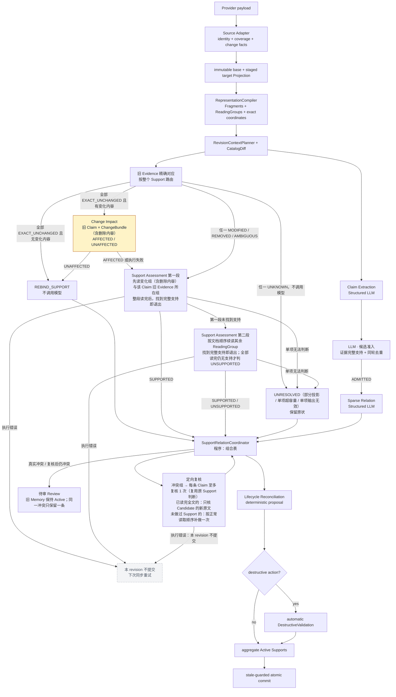
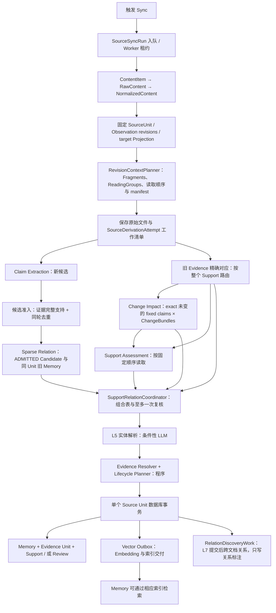

# 单篇文档从 Sync 到 Memory 的完整设计

日期：2026-09-07，最近更新：2026-09-26。本文描述共享代码的 Sync→Memory 合同；上一版紧凑 catalog 与可恢复分批的验收记录在已关闭的 [Cloud #473](https://github.com/dodoman-sun/memforge-cloud/issues/473)，第 0 节优化的实现与部署由 [Cloud #505](https://github.com/dodoman-sun/memforge-cloud/issues/505) 跟踪，其第一步是所有模型调用共用的 LLM batch runner：#505 的第一个 PR 交付它并把现有调用点迁移过去。[Cloud #506](https://github.com/dodoman-sun/memforge-cloud/issues/506) 在此基础上增加分类器 backend、Jev 评估与 prompt caching。

本文以一篇 Confluence 页面为主线，覆盖首次导入和后续更新。Jira、Markdown 和带附件的文档复用相同领域流程，差异集中在源解析与表示方式。实施前评审基线为 OSS main `abdbdf18a3c1100289051c289046c0c07092fa76`：基线核对的相关路径与固定复核工作树 `3b8b1fc4` 一致。Cloud 对照基线为 `11338e0235ab23df3199b8024a05c1b17ed71d10`。这里不宣称线上 Cloud 已部署目标设计。

**阅读约定：**第 0 节是已接受的目标合同，已在 OSS 全部实现（见下一段）。实现不代表已经部署：上线前仍要通过第 0.11 节的 shadow 门禁，Cloud 的 HANA 部分随 pin 升级实现；第 18 节继续记录实现差异。后文历史段落中的 L1–L7 只是旧模型职责编号，不能进入新的类型、方法或状态名称。新设计统一使用 Claim Extraction、候选准入（Candidate Admission）、Support Assessment、Sparse Relation（同 Unit 的 Claim Reconciliation）、SupportRelationCoordinator 和 Lifecycle Reconciliation。若旧段落与第 0 节冲突，以第 0 节和 [ADR 0034](../adr/0034-unify-incremental-support-and-claim-assessment.md#target-contract-tracked-by-cloud-issue-505)（Support 与 Relation 的汇合见[该 ADR 的目标合同概览](../adr/0034-unify-incremental-support-and-claim-assessment.md#target-contract-overview)）为准。

**当前实现：**Support 一侧的第 0.3-0.5 节已经实现：精确 Evidence 对应、按整个 Support 路由、Change Impact、顺序读取和 witness 累积，不再比较成本；第 0.6.1 节的候选准入（`candidate-admission-v2`）和第 0.6.2 节的 Sparse Relation 请求（`claim-revision-v8-sparse-catalog`，不带 Support 结论和证据蕴含状态）已经实现；Relation 与 Support Assessment 并行，由 SupportRelationCoordinator 汇合，冲突进入待审 Review（第 0.6.3、0.6.4 节）；每个准入的 ADD Candidate 各自新建 Memory（第 0.6.5 节）、自动 DestructiveValidation（第 0.7 节）和 Source Unit identity 改变时的提交顺序（第 0.8 节）已经实现。第 6.2 节的 Claim Extraction 读取范围已经实现（`revision-input-v7`）：更新只读获授权的变化结构及其 ReadingGroup，首次导入读每个 ReadingGroup，每个含授权 Primary 的 ReadingGroup 是 LLM batch runner 的一个 item，不比较成本、不截断。每个 Unit 的 Unit Title（第 0.9 节）投影为一条 Observation，出现在每一次模型读取中（第 0.2 节）。

## 文档职责与阅读入口

本文是普通 Source 文档从 Sync 到 Memory 的完整流程入口，解释模块、数据、模型调用和失败边界。共享决策以 OSS ADR 为准；本次合并判断与输入策略由 [ADR 0034](../adr/0034-unify-incremental-support-and-claim-assessment.md) 记录共享决策。第 18 节区分实施前基线与改造落点。

- [Document Memory Lifecycle](document-memory-lifecycle.md) 只定义 Evidence/Support、动作与 Review 的领域约束，不再重复完整 Sync 流程。
- [Source-Agnostic Memory Extraction](source-agnostic-memory-extraction.md) 负责当前提取、角色和 selector 合同；[增量 Primary authority](representation-scoped-incremental-primary-authority.md) 负责表示级差量算法。本文不另造 compiler 或授权规则。
- [ADR 0009](../adr/0009-bound-cross-document-relation-discovery.md)、[0017](../adr/0017-stage-recoverable-source-unit-derivation-before-lifecycle-commit.md)、[0030](../adr/0030-compile-revision-pinned-evidence-fragments.md) 分别拥有异步关系发现、可恢复推导、不可变 Evidence 的详细合同。
- [Semantic judgment execution](semantic-judgment-execution.md) 说明生成与分类调用如何共享 ContextBundle、如何使用 prompt cache，以及哪些判断可以选择 Structured LLM 或 TypeSafe/Jev；[ADR 0036](../adr/0036-separate-semantic-work-from-inference-executors.md) 记录该共享决策。
- [大文档恢复分析](large-document-reconciliation-recovery.md) 是历史问题与未批准选项的记录，不是另一份当前主流程或执行 backlog。

读取范围只决定文档语义材料的供应，不是对所有模型职责一律传全文：候选准入看候选及其所选 Evidence，Sparse Relation 看 Candidate、其当前 Evidence 与同 Unit 旧 Memory 的 Claim（不看 Support 结论），Entity Resolution 看名称语境，提交后的跨文档关系发现只看知识及范围。直接用户创建/纠正、managed agent commands 有各自的授权入口，复用后段 Evidence/Lifecycle，但不强制绕回 provider Sync。

## 0. 目标优化方案：少传历史正文，完整覆盖变化，自动保护删除

### 0.1 目标与取舍

本方案优先保证两件事：当前 Memory 拥有完整、可解析的当前 Evidence；系统不会因 Partial 采集、输入分组或模型漏判而错误删除仍然有效的知识。产品接受跨 Source Unit 关系发现的少量漏判、不同 Source Unit 各自保存同一知识（由关系发现标注 `equivalent`）、陈旧 Support 暂时保留，以及跨 Source Unit 后 Memory ID 不延续。同一 Source Unit 的 Candidate/Memory 关系不依赖语义 top-k：Sparse Relation 读取每个准入的 Candidate 和同 Unit 全部 Active 旧 Memory 的 Claim，每个 Candidate 输出一行，只列有意义的关系，省略表示“未提出关系”。

目标流程是（带颜色图例的完整版见 [revision-update-flow.png](images/revision-update-flow.png)，源文件 [revision-update-flow.excalidraw](images/revision-update-flow.excalidraw)，可用 Excalidraw 打开编辑）：



图中 Claim Extraction、候选准入、Change Impact、Support Assessment 和 Sparse Relation 都经同一个 LLM batch runner 调用模型（见 [ADR 0036](../adr/0036-separate-semantic-work-from-inference-executors.md)）。模型对每一项各返回一行。响应模型只检查一行的 JSON 结构（类型、必填字段、枚举值）；关于一行含义的规则都是行规则，由各阶段逐行单独检查。合格的行立即采用，不再重发；不合格或缺失的行合在一起重问一次，只带这些项，并逐项写明错误（例如“NEW-0003 引用了 MEM-0037，不在它允许比较的列表里”）。所以一个请求里有几行出错，都只多一次调用。如果某行用了本请求没有提供的 ID，说明整份回答的 ID 已经对不上（比如每个答案都挪到了下一项的 ID 下），整份回答按无法读出处理。只有无法定位到具体哪一项时才对半拆分：多条目请求组超时、超出容量，或者整个输出无法按行读出（格式错乱、有歧义的 JSON、schema 不符、出现本请求没有提供的 ID）且整体纠正一次后仍读不出。逐行校验适用于 Claim Extraction、候选准入、Change Impact、Support Assessment 和 Sparse Relation（`claim_revision`）；同 Unit identity 的目录作为一个整体校验，仍是整体纠正一次后拆分。失败按一条规则处理：某一项单独处理仍无法判断时，由所在阶段记录下来，revision 照常提交；其余失败统称执行错误，使该 Source Unit revision 不提交，下次同步重试。“无法判断”只有两种：这一项单独就超出容量；或模型确实返回了结果，但重问或纠正一次后仍通不过校验（包括格式错乱、有歧义的 JSON）。provider 错误、超时、被 provider 拒绝的请求（如 400）和意外异常（包括代码缺陷）都是执行错误。一项无法判断，不会挡住同一 Unit 的其他内容。Change Impact 用单独颜色标出，因为它是可以换成分类器 backend 的判断任务。Support 线与 Relation 线并行执行，只在 SupportRelationCoordinator 汇合。

执行器按任务类型选择，而不是按单条 confidence 分流：开放式生成和依赖多字段的 Evidence 计划使用 Structured LLM；封闭、输入完整、逐项独立的分类或排序使用分类器模型（Jev 或小参数 LLM）；exact 比较、完整性、权限和 lifecycle action 始终由程序负责。分类概率只用于离线评估和监控，不决定运行时是否换模型。Change Impact 在分类器 backend 通过 #506 的评估之前由现有 Structured LLM 执行；候选准入与 Sparse Relation 由 Structured LLM 执行，逐 pair 的分类器 backend 需要另立合同和评估。

### 0.2 `RevisionContextPlanner` 是唯一对外上下文接口

调用方只需要：

```python
plan_revision_context(
    base_projection,
    target_projection,
    change_set,
    existing_supports,
    coverage,
) -> RevisionContextPlan | TypedPlanningFailure
```

内部的 Markdown/HTML、纯文本、canonical JSON、Jira 和 Teams 表示 adapter 负责生成统一 ReadingGroup：

```text
scope / container / before / target / after
+ authority / selectable refs / exact coordinates
```

`target` 可以是 current Fragment，也可以是 `RemovedAnchor`。因此纯删除不需要伪造空 current Fragment。ReadingGroup 只扩大阅读范围，不扩大 Primary 权限；Context 和历史 excerpt 不能被选为当前 Evidence。

Support 与 Claim Extraction 共用同一个 ReadingGroup 划分：一个最外层列表，或一个 Fragment（`RevisionAssessmentContext.reading_groups`）。每一次模型读取（Claim Extraction 的每个请求、Support Assessment 的每一步、Change Impact 的每个 bundle）都在所读 Fragment 之外带同一份阅读上下文（`RevisionAssessmentContext.reading_context`）：

- 表示层给出的标题、标题后第一段和列表引导段；
- 所读 Observation 由 provider 声明其回复或跟随的那一条：有 `REPLIES_TO` 时取被回复的消息，否则取 `PRECEDES` 的前一条（Jira comment 读到前一条 comment 或 issue core）；不按顺序或文本相似度推断；
- 该 Unit 的 Unit Title（第 0.9 节）。

阅读上下文只能被选为 Required，不设字符上限；单个 item 连同其上下文超出容量时按 LLM batch runner 的规则处理。Unit Title 不自成 ReadingGroup，也不是 Support 读取顺序里的一段，它在每一步都作为阅读上下文出现；Unit Title 变化时作为变化内容进入 ChangeBundle 和 Support 读取顺序的第一段。

抽取时单个 ReadingGroup 连同阅读上下文就超出请求容量，该组被跳过：程序写诊断（Source Unit、ReadingGroup、`input_capacity_exceeded`），其余组照常抽取，revision 提交。规划时按容量判断放不下的组不进入任何请求；请求发出后 provider 仍对单独这一组报容量错误的，同样跳过。单独读这一组时，模型输出纠正一次后仍不合法的，也同样跳过，诊断原因为 `invalid_response`。恢复 derivation 时规划得到同样的跳过，跳过的组数计入抽取统计（`skipped_reading_group_count`）。这是已知限制，与 Support 的 `UNRESOLVED(capacity)` 并列：因为更新时只抽取变化的结构，这一组的知识要等该结构再次变化才会重新抽取。

#### `RepresentationCompiler` 只在 planner 内部暴露

Fragment 和 ReadingGroup 是同一 immutable Revision 的两种视图，不能由 Extraction、Support 和 request packer 分别解析。`RevisionContextPlanner` 私有调用一个深的 `RepresentationCompiler`：

```python
compile_representation(
    revision,
    candidate_ranges,
) -> CompiledRepresentation | TypedRepresentationFailure
```

`CompiledRepresentation` 同时包含 exact coordinate map、structure manifest、Fragment catalog 和只引用这些 Fragment 的 ReadingGroups。Markdown、HTML 和 canonical record 的 parser/AST 类型不会泄漏给 caller，也不新增持久化 Fragment/ReadingGroup 表。

实现优先采用能表达所需结构的成熟开源 parser，并把它锁在 representation adapter 内。开源 parser 只给 line range 或 normalized tree 时，adapter 负责映射并验证 raw half-open offsets；无法精确映射就 typed failure，不能把 normalized text 当 Evidence。自研代码只允许补齐坐标映射或未被库覆盖的注册结构，不允许重新实现一套散落在各调用方的 Markdown/HTML/JSON parser。

#### Context 与模型调用分开

Planner 输出 backend-neutral `ContextBundle`，按稳定性排列：

```text
CONTRACT → REVISION_SHARED → COHORT → CARRIED_STATE → ATTEMPT
```

Structured LLM adapter 将其渲染为稳定前缀在前的 prompt，并在实际 route 支持时请求 prompt caching；分类器 adapter 将同一判断上下文渲染为共享 state 和独立的封闭标签问题。分类器实现可以是 Jev，也可以是通过同一任务评估的小参数 LLM。Claim Extraction、候选准入与完整 Support Assessment 使用 `GenerationExecutor`；Change Impact、Sparse Relation 和 rerank 使用 `JudgmentExecutor`，其中 Change Impact 与 Sparse Relation 目前由 Structured LLM adapter 执行。两类 executor 都经同一个 LLM batch runner 发送请求。executor 只负责推理调用，不能改变 ReadingGroups、selectable refs、work manifest 或 lifecycle authority。

### 0.3 旧 Evidence 的确定性对应

程序始终持有 Memory、Support、Evidence、Observation、Revision、fragment digest、coverage 和 source provenance。digest、内部 ID、offset、trace 与 revision metadata 不进入模型输入；模型只收到本次语义判断所需的 prompt-local ref、结构标题和准确文本。程序将 prior Support Evidence 分类为：

“未变”不是上次 Sync 保存的布尔状态，也不是 LLM 判断。每次处理固定 base/target
时，Planner 从旧 Support 已持久化的 Observation 身份、固定 revision 的 Anchor、
准确 excerpt/内容 digest 与 Primary/Required 角色出发，对照目标 Projection 的
authoritative membership 和本次编译的 current Fragment catalog。若 Observation
Revision 原样沿用，仍有效的准确 Anchor 可直接对应；若它产生新 revision，旧 offset
和派生 Fragment ID 只能用来缩小查找，必须在**同一 Source Unit、同一 provider
Observation** 下找到唯一兼容的当前片段，并核对准确内容或 presentation digest。
对应关系每次重新计算，不给 Evidence 加一个可变的“未变”字段。
Provider `FragmentMapping` 不参与这一对应：它不能证明正文相等，也不在多个精确候选中挑选，重复出现的原文按 `AMBIGUOUS` 处理。标点变化会
改变准确匹配；同义改写更不能由 digest 自动视为未变。跨 Source Unit 不做自动
Evidence rebind。原文唯一精确匹配即为 `EXACT_UNCHANGED`；所在 ReadingGroup
是否变化不参与路由，变化内容已在 ChangeBundle 中。

| 状态 | 确定性判定 | 后续处理 |
| --- | --- | --- |
| `EXACT_UNCHANGED` | 同一 Source Unit 中存在唯一兼容的 exact fragment | 建立 current ref；不发送旧 excerpt |
| `MODIFIED` | 原 provider object/结构仍在，但 fragment 内容改变 | 旧 excerpt + 当前对应 ReadingGroup，直接进入 Support Assessment |
| `REMOVED` | authoritative complete coverage 证明原 fragment 消失 | 旧 excerpt，直接进入 Support Assessment |
| `AMBIGUOUS` | 多个 exact/structural candidate 或对应不唯一 | 旧 excerpt + 全部候选 ReadingGroups，直接进入 Support Assessment |
| `UNKNOWN` | Partial coverage 不能证明存在或删除 | 程序产生 `UNRESOLVED(partial_coverage)`，KEEP；不调用 Support LLM，不允许破坏性动作 |

状态按旧 Evidence **每个 part** 计算，再汇总到完整 Evidence Unit。只有一个 Primary
和全部 Required 都有明确合法的 current refs，才能走确定性 rebind；若其中一项
修改、删除或对应不唯一，已精确对应的 part 只是本次可选的当前证据，仍需核对
整条固定 Claim 并重建完整 Evidence Unit。精确匹配的旧 part 以 current ref 的形式
交给模型，和其他当前 ref 一样只是可选的候选；所选 Primary/Required 集合是否完整，
按“完整支持的定义”判断（第 0.4 节），程序不要求模型逐条说明没有选中的旧 part。
旧 excerpt 或旧 ref 不可补足缺口。
缺少足够准确旧 provenance 的 legacy Evidence 也不能伪装成 `EXACT_UNCHANGED`，
沿用已有 limited-Evidence 门禁。分类与 ref map 是每次操作的派生结果，不新建
持久状态；持久依据仍是旧 Support/Evidence、当前 Projection 与提交后的 Plan。

路由按整个 Support 判断，不按单个 part。按下列顺序取第一条成立的规则：

1. 任一 part 为 `UNKNOWN`（部分投影无法证明存在或删除）：`UNRESOLVED(partial_coverage)`，保留原状，不调用模型；
2. 任一 part 为 `MODIFIED`、`REMOVED` 或 `AMBIGUOUS`：进入 Support Assessment；
3. 全部 part 为 `EXACT_UNCHANGED`，且本次有变化内容（删除的内容也算变化内容）：进入 Change Impact；`UNAFFECTED` 则 `REBIND_SUPPORT`，`AFFECTED` 或 Change Impact 执行失败则进入 Support Assessment；
4. 全部 part 为 `EXACT_UNCHANGED`，且本次没有变化内容：直接 `REBIND_SUPPORT`，不调用模型。

RepresentationCompiler 若改变片段切分或文字表示，已有 Evidence 可能无法再精确匹配；相关 Support 会在其 Unit 下一次出现新 revision 时整体进入 Support Assessment。这是一次性成本，随文档更新自然分散，大批量由超时对半拆分处理。修改切分或文字表示的编译器变更须在 PR 中说明这一影响；不增加版本迁移或放量机制。

旧 excerpt 的发送规则没有可选分支：只对 `MODIFIED`、`REMOVED`、`AMBIGUOUS` 发送一次 immutable exact excerpt；`EXACT_UNCHANGED` 不发送，因为 current fragment 已包含相同正文；`UNKNOWN` 不进入模型。历史 excerpt 永远只读且不可被选择为 current Evidence。

`REBIND_SUPPORT` 只刷新当前 provenance：Memory ID 与 claim 不变，程序创建或复用 target Revision 的 Evidence Unit，并在同一 Lifecycle Plan 事务中 `ATTACH_SUPPORT` 新 assertion、将被替换的旧 assertion 标为 inactive。旧 Support 行、旧 Evidence 与 lifecycle history 保持不可变并可审计，不做物理删除或原地改写。幂等身份绑定 Memory、Source Unit、target Revision 与 current Fragment。

`EXACT_UNCHANGED` 只证明原句仍在，不证明远处没有新增例外。Planner 将全部新增、修改的 ReadingGroups（只删掉了其中几项的列表也算修改，整组连同引导句进入），以及被删除 Fragment 的旧文本（作为删除内容，带它在基线中的标题路径或记录字段），组合成 `ChangeBundle`，这样远处被删掉的限定条件也能被 Change Impact 看到；Change Impact 对每条 exact-rebound fixed claim 输出 `AFFECTED` 或 `UNAFFECTED`。一个 bundle 对 300 条 claims 是 300 个分类问题，不是 `300 × group_count`。一次请求放不下时，LLM batch runner 按 ReadingGroup 边界分成多个 bundle，程序对每条 claim 的各 bundle 结果作 OR 归约；任一 `AFFECTED` 进入完整 Support Assessment，全部 `UNAFFECTED` 才完成 KEEP+REBIND。变化中出现作用范围不明确的全局性说法（如“以上流程”“本文档”“自某日起停用”）时判为 `AFFECTED`；不为这条规则单独设计评估用例。某条 claim 的 Change Impact 执行失败（对半拆分到单条仍失败、不可分超限、输出纠错后仍不合法等）时，该 claim 进入 Support Assessment；程序不把执行失败记成 `AFFECTED` 标签。

Change Impact 在分类器 backend（Jev 或小参数 LLM）通过 #506 的通用评估之前，由现有 Structured LLM 执行。backend 是否接管该任务由固定评估集整体决定，不按单条 confidence fallback。

**Cloud 影响：**精确对应、按整个 Support 路由和 Change Impact 规则都是 OSS 共享代码，不改存储协议，Cloud 升级 pin 即可。Change Impact 默认由现有 Structured LLM 执行，Cloud 继续经 LiteLLM 的 `sap/` 路由和 `AICORE_*` 环境变量调用，不新增配置。编译器变更引起的重新评估同样发生在 Cloud，相关 PR 的影响说明要覆盖 Cloud 的重新评估负载。

### 0.4 按固定顺序读取当前全文

三个输入概念必须分开：

- `ReadingGroup` 是一个可独立理解的当前结构单元，可包含多个可引用 `EvidenceFragment`；
- `AssessmentContext` 是单次 Support 调用实际收到的一个或多个 ReadingGroups，以及由它们生成的 prompt-local Evidence Candidate Catalog；
- `AssessmentScope` 是整个 Support work 必须覆盖的逻辑范围，即完整的有效当前 revision。

读取顺序的第一段为：

```text
changed ReadingGroups (added, modified; removed ones as read-only old text)
+ ReadingGroups that contain this Claim's own prior Evidence
+ fixed claims and compact Support metadata
+ historical excerpts exactly for MODIFIED/REMOVED/AMBIGUOUS
```

第二段是当前 revision 的其余 ReadingGroups。

Support Assessment 只有一条规则：按固定顺序流式读取当前全部内容，变化的 ReadingGroup（新增、修改和删除的；删除的读其旧文本）和该 Claim 自己的旧 Evidence 所在的 ReadingGroup 先读，其余在后；第一段按 Claim 划分，不同 Claim 的第一段终点可以不同；第一段还有未读的 ReadingGroup 时，Claim 不能退出；第一段读完后，每条 Claim 找到完整支持即退出，全部读完仍无支持才判 `UNSUPPORTED`。Delta 不是一种模式，只是读取顺序的第一段。Planner 只负责排读取顺序，不比较成本，不决定从哪里开始，也不让模型判断否定结果是否已经足够。`EXACT_UNCHANGED` 只贡献 current ref 和 compact state；`MODIFIED` 使用对应 current ReadingGroup；`AMBIGUOUS` 使用全部确定候选。

**完整支持的定义。**Support Assessment 和候选准入判断的是同一件事：所选 Evidence 是否完整支持一条 Claim。两处模型请求使用同一段定义文本（`pipeline/complete_support.py`）：Claim 写出的每一项具体信息，包括人、系统和事物的名称、编号、数量、日期和时间、状态、条件和范围，都必须出现在所选 Evidence 中，或能从中直接得出；只要有一项具体信息与 Evidence 矛盾，或 Evidence 中没有，这条 Claim 就不被支持，即使其余部分都对得上。判断不使用 Evidence 以外的知识。所以话题、动作或大部分措辞相符都不够：Claim 写的编号与它选作 Required Evidence 的 Unit Title 不同，或写的人、数字、日期与 Primary Evidence 不同，在 Support Assessment 中判为 `UNSUPPORTED`，在候选准入中判为 `REJECTED(evidence_incomplete)`。Change Impact 不判断支持，不使用这条定义。定义改变时，`REVISION_SUPPORT_CONTRACT`、Support Assessment 工作合同和候选准入合同一起升级（当前为 `revision-support-v7`、`support-ordered-reading-v5` 和 `candidate-admission-v2`），旧合同下完成的工作不再复用。

**Cloud 影响：**这条定义是共享的 OSS prompt 文本，Cloud 升级 pin 即可生效；HANA 中的 derivation work 和 reconciliation manifest 带上新的合同版本，不需要改 schema，旧版本下完成的工作会重新计算，不会复用。

这条规则的前提是 Full 按 ReadingGroup 流式读取并允许中途退出。Full 表示逻辑上覆盖完整 effective current Projection，不表示一次把原始全文塞进模型。小文档可用一个 AssessmentContext；大文档将完整 current Catalog 划分成多个由完整 ReadingGroup 组成的 AssessmentContexts，按顺序处理并携带 grounded previous state；已找到完整支持的 Claim 不再进入后续请求。

只有全部 contexts 读完，且每个受影响对象的覆盖是权威的，才可产生 `unsupported`；读取不会把 `PARTIAL_PROJECTION` 升级为完整快照。覆盖按受影响对象判断，而不是按整个 provider。例如 Jira issue 的 description 已完整取得并被改写，而 comments 分页不完整：Evidence 在 description 中的 Support，在读完全部当前内容（包括 Partial Projection 保留的旧 comments）后仍无支持时可以判 `UNSUPPORTED`；Evidence 在未返回 comment 中的 Support 为 `UNKNOWN`。

Support 可以使用两种 cache 布局。一个固定 current Evidence Catalog 对多个 Memory cohorts 时使用 `REVISION_FIRST`（evidence-fixed batching）；一个 cohort 流式读取多个 AssessmentContexts 时使用 `COHORT_FIRST`（cohort-fixed streaming）。布局只改变稳定前缀顺序，不改变逻辑材料，也不是正确性条件：Claim 提前退出或请求被对半拆分后，后续请求的 cohort 前缀会变化，缓存未命中是可以接受的代价。`previous_state` 与 attempt diagnostics 永远位于变化后缀。SAP/gateway route 只有在实际透传并报告 provider cache 时才启用 `cache_control`。

单个超大 Observation 只能按已注册 representation contract 拆成具有 exact authority coverage 的结构，例如完整列表、heading+paragraph、完整表格或 canonical record field。仍不可分且超限时返回 typed capacity failure，KEEP 受影响 Support，不推进 baseline，也不从部分结果创建 Memory。

容量判断和分批由 LLM batch runner 统一完成。多条目请求组遇到以下任一情况都视为容量不足：超时（`deadline_exceeded`）、输入超限（`input_capacity_exceeded`）、provider 返回 413（`payload_too_large`）、输出被截断（`finish_reason=length`）。这时对半拆分后分别重发，直到完成；每条 work 恰好得到一个结果。输出被截断时不用同样的 `max_tokens` 改发 JSON 文本请求。每一步的每行单独校验：合格的行推进各自的 Claim；ref 或选择不合法的 Claim 合在一起重读同一步，位置和携带的状态都不变，重问时逐项写明错误，通过后回到原来的队列。整个输出无法按行读出、整体纠正一次后仍读不出时，才按 Claim 对半拆分。某一步只剩一条 Claim、但它跨多个 ReadingGroup 时，遇到容量不足先对半拆分 ReadingGroup。拆到一条 work 仍失败时，按原因区分：这条 work 的 ReadingGroup 单独就超出模型容量时，该 Support 为 `UNRESOLVED(capacity)`；这条 work 的行重问一次后仍不合法时，为 `UNRESOLVED(invalid_response)`。两者都 KEEP，诊断写明 Source Unit 和 ReadingGroup，其余 work 与 revision 照常提交。遇到执行错误时，该 Source Unit revision 不提交，下次同步重试。不设输出预算，不按 tokens/s 预估请求大小，也不设按任务写死的条目数或字符数上限；只保留 backend adapter 自己声明的限制（例如 Jev 的选项数）。

**Cloud 影响：**读取顺序和容量失败时的对半拆分只依赖 LiteLLM 元数据、现有 `MEMFORGE_LLM_MAX_*` 上限和 `request_timeout_s`，在只有环境变量、没有数据库配置行的 Cloud 部署中同样成立；不新增环境变量，不改 HANA 协议，Cloud 升级 pin 即可。

### 0.5 Support witness 累积

Support Assessment 的 work key 是 `(memory_id, independent_support_id)`。不同来源或不同 Evidence Unit 不能拼成一个 Support；一个 Evidence Unit 始终是一 Primary、零到多个 Required。一个 ReadingGroup 可以包含多条 EvidenceFragments，一个 AssessmentContext 也可以包含多个 ReadingGroups，因此“当前 ReadingGroup”与多 Evidence 并不冲突。

Support 的最终语义结果只有：

```text
SUPPORTED(work_id, primary_ref, required_refs[])
UNSUPPORTED(work_id)
```

只有 `SUPPORTED` 允许并要求 selector 字段；`UNSUPPORTED` 的 schema 禁止 `primary_ref` 和 `required_refs`，不再发送 `null` 与空数组。Primary/Required 必须来自当前 AssessmentContext 的 Evidence Candidate Catalog，或来自 `previous_state` 中已由更早 AssessmentContext grounding、并在本次请求中重新提供正文的 current refs；历史 refs 永远不可选择。

每个流式 `support_assess` step 对尚未找到完整支持的 work 只输出本次新增的 bounded grounded witnesses，不输出累计 `status`：

```json
{
  "work_id": "WRK-0001",
  "witness_delta": {
    "support_witness_refs": ["PRM-0012"],
    "opposing_witness_refs": ["PRM-0041"]
  }
}
```

程序验证 `witness_delta` 的 membership 后，与此前 supporting/opposing sets 做单调 union；后一次模型输出不能通过省略删除早期 decisive witness。下一次调用必须同时收到这个程序持有的 union 中所有 current refs 的准确正文与 Primary 资格，形成 `carried_witness_catalog`；只传 ref 会让模型无法继续验证组合语义。例如读取顺序分为两个 AssessmentContexts：第一组找到“HR 审批”并把 `PRM-0012` 加入 supporting set；第二组收到该 union 及 `PRM-0012` 的 current 正文，找到“Finance 审批”的 `REQ-0041`。最后一个 `support_assess` 返回 `SUPPORTED(WRK-0001, PRM-0012, [REQ-0041])`；`support_finalize` 验证 selectors、manifest 与 coverage 后产生 `COMPLETED(SUPPORTED)` 收据。若第二组出现取消 Finance 审批的 current Evidence，则 ref 被 union 到 opposing set，最终不能被第一组的局部支持覆盖。

第一段还没读完时，每一步对每条 work 只返回 `witness_delta`；从读完第一段的那一步起，Structured LLM 对仍未退出的 work 返回 `SUPPORTED(...)`（该 work 退出，不再进入后续请求）或 `witness_delta`；程序先将 delta 单调合并到累计 witnesses，下一步只读取尚未处理的 contexts。读完顺序中最后一组的调用，对仍未退出的 work 返回 `SUPPORTED(...)` 或 `UNSUPPORTED(work_id)`；`UNSUPPORTED` 还要求受影响对象的覆盖是权威的。

执行结果由程序另行包装为 `COMPLETED(SUPPORTED|UNSUPPORTED)` 或 `UNRESOLVED(reason)`。`UNRESOLVED` 有三个原因：`partial_coverage`（有 `UNKNOWN` part，不调用模型）、`capacity`（单个 ReadingGroup 单独就超出模型容量）和 `invalid_response`（这条 work 单独的输出纠正一次后仍不合法）。三者都 KEEP、不允许自动破坏性动作、不推进 Support baseline，revision 照常提交。拆到单条 work 后仍是执行错误的，不算 `UNRESOLVED`：该 Source Unit revision 不提交，下次同步重试。

旧 Evidence 作为可选候选交给模型：每个精确匹配的旧 part 以 current ref 出现在 `prior_evidence` 中，之后的请求也把它带在 `carried_witness_catalog` 里。所选集合是否完整只按“完整支持的定义”判断。程序检查所选 ref 都是本请求提供过的，不要求模型交代没有选中的旧 part。完整 Support Assessment 是依赖多字段的 Evidence 计划，统一由 Structured LLM 完成，不拆成按 confidence 选择 backend 的 cascade。

### 0.6 候选准入、Sparse Relation 与两条线的汇合

本节是目标合同，由 #505 跟踪；模型调用经 #505 第一步交付的 LLM batch runner。规范性决策记录在 [ADR 0034](../adr/0034-unify-incremental-support-and-claim-assessment.md) 和 [ADR 0039](../adr/0039-create-memories-within-the-source-unit.md)。第 0.6.1 至 0.6.4 节已经实现：Relation 与 Support Assessment 并行执行，目录包含全部旧 Memory，由 SupportRelationCoordinator 汇合，冲突进入待审 Review；第 0.6.5 节说明 ADD 只在本 Unit 内新建 Memory。

#### 0.6.1 候选准入

候选准入是右线的独立步骤：Claim Extraction → 候选准入 → Sparse Relation。它对每个 Candidate 都执行，与 Unit 是否有旧 Memory 无关。同一个准入请求内完成两项职责，不新增调用轮次：

1. 证据完整支持：所选 Primary/Required Evidence 是否完整支持该 Claim，包括范围、例外和表头限定；Claim 写出的每一项具体信息都要有 Evidence（定义见第 0.4 节“完整支持的定义”）；
2. 同轮去重：是否与本轮其他 Candidate 为同一条知识。每个准入请求都带本轮全部 Candidate 的 ID 与 Claim 文本（不带 Evidence）作为共享上下文，所以不同请求里的重复也能被报告；程序按确定规则合并。这份列表一次放不下时，由 LLM batch runner 分块，程序合并各块结果。

| 结果 | 处理 |
| --- | --- |
| `ADMITTED` | 进入 Sparse Relation |
| `REJECTED`（`evidence_incomplete` 证据不足，或 `low_value`） | 本轮不新增，不进 Review |
| 同轮重复 | 合并，保留一个进入 Sparse Relation |
| 单独处理仍无法判断（单项超容量，或输出纠正一次后仍不合法） | 本轮按 `REJECTED` 处理，拒绝理由为 `capacity_exceeded` 或 `invalid_response`，像其他拒绝一样记录事件；不 ADD，不进 Review，revision 照常提交 |
| 执行错误（provider 错误、超时、请求被拒或意外异常） | 该 Source Unit revision 不提交，Candidate 本轮不新增；下次同步重试这个 revision（沿用现有提取失败合同），不部分发布 |

`REJECTED` 记录一条结构化事件，内容为 Source Unit、revision、Candidate Claim、所选 Evidence 引用和拒绝理由，不保存完整原文。每个 revision 统计 admitted、rejected、merged 数量，用于发现抽取质量退化，例如某个 Source 或某次部署后拒绝比例升高。执行错误沿用现有 failure trace，不新增机制；同轮合并只计数，不作为异常记录。

模型只能准入、拒绝或合并现有候选，不自行编写新的合成 claim。候选准入不与其他 Unit、其他 source 的 Memory 比较，同步流程中也没有其他步骤这样做（第 0.6.5 节）。

#### 0.6.2 Sparse Relation

Sparse Relation（同 Unit 的 claim revision）只接收 `ADMITTED` Candidate，只判断它们与同 Unit 旧 Memory 的关系。全部准入的 Candidate 都进入模型请求，文本与旧 Memory 完全相同的 Candidate 也不例外；模型输入只有三类内容：Candidate 的 Claim、该 Candidate 的当前 Evidence、同 Unit 全部 Active 旧 Memory 的 Claim。输入不含 Support 结论和理由；Support 结果只在 SupportRelationCoordinator 中由程序使用，所以 Relation 与 Support Assessment 并行执行。旧 Memory 目录包含全部 Active 旧 Memory，因为 Relation 运行时还不知道哪些 Support 会得到 `UNRESOLVED`。

输出为每个 Candidate 一行完成记录，只列有意义的关系：等价、矛盾、带方向的细化，或明确列出的不确定旧 Memory。某条旧 Memory 未被列出表示“未提出关系”，不是判定无关。缺少 Candidate 行、未知 ID、同一对重复或矛盾的关系都会被拒绝；输出被截断属于容量失败，由 LLM batch runner 拆分重发；这些都不能当作“未提出关系”。每个 Candidate 的行单独校验，不合格的行合在一起重问一次，逐项写明错误。某个 Candidate 重问后仍不合法，SupportRelationCoordinator 消费它，不 ADD，不建 Review，写诊断。它的完成行本应覆盖本 Unit 的全部旧 Memory，缺了这一行，就无法确定它和哪条旧 Memory 有关：它可能正是某条旧 Memory 的新说法。所以本 revision 的 Relation 不完整，DestructiveValidation 本轮不执行本 Unit 的任何 DELETE、SUPERSEDE 或 UPDATE：这些旧 Memory 保留原 Support，不推进验证基线；只因被拦下的 SUPERSEDE 或 UPDATE 才起作用的 Candidate 也不 ADD。不带破坏性的工作照常提交：换绑、其他 Candidate 的 ADD 和 Review。遇到执行错误时，该 Source Unit revision 不提交，下次同步重试，不部分发布。Relation 不检查证据是否完整支持 Candidate，这由候选准入负责。

Catalog 正文在每个请求中只出现一次；请求放不下时由 LLM batch runner 切分，旧 Memory 目录被分块时，程序对每个 Candidate 各块的关系取并集。切分只是传输细节，不产生业务状态，不改变覆盖，也不部分提交。该步骤由 Structured LLM 执行；逐 pair 输出标签的分类器 backend 需要另立合同和评估。

跨 Source Unit/全工作区关系发现仍先由现有 hybrid retrieval 产生有限 `K`，再做分类，因为全工作区笛卡尔积没有界；该发现路径的漏判不能授权破坏性 lifecycle action。

#### 0.6.3 SupportRelationCoordinator

两条线都完成后，程序中的 SupportRelationCoordinator 按下表组合结果，然后才交给 Lifecycle Planner。两条线互不替对方判断真假。各行按以下顺序匹配，先命中的生效：无法判断的 Claim 所在行（`UNRESOLVED(capacity)` 或 `UNRESOLVED(invalid_response)`，保留原状）优先；其次是同一旧 Memory 同时有 equivalent 边和 contradicts 边的行（进入 Review，暂存矛盾的 Candidate，拟替代旧 Memory）；最后是其余各行，包括 `UNRESOLVED(partial_coverage)` 的三行。Support Assessment 或复核的执行错误不会进入协调器，因为该 revision 不提交。Relation 无法判断的 Candidate 没有任何边：协调器消费它，不 ADD，不建 Review，计入未决 Candidate 数；因为 Relation 不完整，DestructiveValidation 随后拦下本 Unit 的全部破坏性决定。

| Support 结果 | Relation 结果 | 处理 |
| --- | --- | --- |
| `SUPPORTED` | 无关系或 equivalent | 保留旧 Memory；equivalent 的 Candidate 被消费，不 ADD |
| `SUPPORTED` | contradicts | 当前来源同时支持两条互斥说法：旧 Memory 已验证的 Support 换绑到当前 Evidence，并创建协调器 Review |
| `UNSUPPORTED`（完整读取） | equivalent | 用该 Candidate 的当前 Evidence 定向复核：支持则保留旧 Memory 并换绑到该 Evidence；仍不支持则进入 Review |
| `UNSUPPORTED`（完整读取） | contradicts | 正常 SUPERSEDE |
| `UNSUPPORTED`（完整读取） | 无关系 | 移除本来源的 Support；只有没有其他来源的 Active Support 时才退休 Memory |
| `UNAFFECTED`（已换绑） | contradicts | 分类器漏判：对该 Claim 补做一次 Support Assessment（按正常顺序读取） |
| `UNRESOLVED(capacity)` 或 `UNRESOLVED(invalid_response)` | 任意 | 保留原状；相关 Candidate 在本轮被消费，不 ADD，也不做破坏性动作 |
| `UNRESOLVED(partial_coverage)` | equivalent | 用该 Candidate 的当前 Evidence 定向复核：支持则保留旧 Memory、换绑到该 Evidence，并消费该 Candidate，不 ADD；仍不支持则创建协调器 Review |
| `UNRESOLVED(partial_coverage)` | contradicts | 创建协调器 Review，拟用矛盾的 Candidate 替代旧 Memory；旧 Evidence 的状态未知，所以不自动替代 |
| `UNRESOLVED(partial_coverage)` | 无关系 | 保留原状 |
| 任意 | 同一旧 Memory 同时有 equivalent 边和 contradicts 边 | 进入 Review |

已换绑的 `UNAFFECTED` 且无 contradicts 边，按 `SUPPORTED` 行处理；REFINES 与不确定关系沿用局部 unresolved 规则（协调器与 revision proof 规则），未决组件内的旧 Memory 不做 refinement 两两比较。同一 Candidate 对不同旧 Memory 得到不同处理，或者同时暂存在多个旧 Memory 的 Review 里时，同样沿用局部 unresolved 的连通组件规则：整个相关组件在本轮被消费，不 ADD，也不做破坏性动作。同一 Candidate 暂存两次时没有唯一决定：每次批准都会再执行一遍，要么再建一次同一条 Memory，要么把第二个旧 Memory 也换绑到同一 Claim。`UNAFFECTED` × contradicts 补做的那次 Support 即该 Claim 唯一的一次复核，结果重新查表。

已知限制：某条 Claim 的单个 ReadingGroup 单独就超出模型容量时，其 Support 为 `UNRESOLVED(capacity)`；这条 Claim 单独的输出纠正一次后仍不合法时，为 `UNRESOLVED(invalid_response)`。旧 Memory 保持不变，诊断写明 Source Unit 和 ReadingGroup，revision 照常提交。相关 Candidate 在本轮被消费，不 ADD，也不做破坏性动作；因为更新时只提取变化的结构，这些新知识要等该结构再次变化才会重新提取。Relation 单独判断仍无法判断的 Candidate 同样被消费；它缺少完成行期间，本 Unit 的旧 Memory 只保留，不删除、不替代、不修订。除局部 unresolved 关系规则外，只有这几种情况会让 Candidate 未经判定就被消费。

冲突组的定向复核规则：

- 每条 Claim 每个 revision 至多复核 1 次，复用原 Support Assessment 合同，不新增提示词；
- 已读完全文的 Claim，以及 Support 为 `UNRESOLVED(partial_coverage)` 的 Claim：只核 Candidate 的新原文。后者复核得到支持后，原先含 `UNKNOWN` part 的 Support 被替换，之后的 revision 不会再因它得到 `UNKNOWN`；
- 未做过 Support 的 Claim（Change Impact 判为 `UNAFFECTED`，Relation 却发现矛盾）：按正常顺序读取补做一次，允许读到全文；
- 复核后仍冲突就进入 Review，不做第二次复核；
- 复核遇到执行错误时，该 Source Unit revision 不提交，下次同步重试，不进 Review；复核用到的 ReadingGroup 单独就超出容量，或复核输出单独纠正后仍不合法时，为 `UNRESOLVED(capacity)` 或 `UNRESOLVED(invalid_response)`，按该行处理。

复核找到支持时可以采信，因为“有支持”由程序可验证的具体当前 ref 证明，而“没找到”只说明一次长读取中没有发现。所以只核 Candidate 新原文的复核没找到支持时，该 Claim 保持原来的结果，不会因此失去 Support。

一个旧 Memory 在本 Unit 可能有多条 Support，它们按表的优先级合成一个 Memory 级结果：任一 Support 为 `UNRESOLVED(capacity)` 时为 capacity；否则任一为 `UNRESOLVED(invalid_response)` 时为 invalid_response；否则任一为 `UNRESOLVED(partial_coverage)` 时为 partial_coverage；否则只要有一条经读取判为支持即 `SUPPORTED`；只经换绑、没有读取的为 `UNAFFECTED`，此时补做的 Support 只读那些换绑的 Support；全部读完仍不支持才是 `UNSUPPORTED`。只核 Candidate 新原文的复核对一条 Claim 只做一次，一次读完它全部等价 Candidate 的 Evidence，并带上该 Claim 在本 Unit 的全部旧 Evidence part。

同一旧 Memory 有多条 contradicts 边时不猜后继：全文读完仍不支持时移除本来源的 Support，各 Candidate 各自新增；其余情况旧 Memory 保留，每条矛盾 Candidate 各得一条协调器 Review。

#### 0.6.4 待审 Review

以下规则只适用于 SupportRelationCoordinator 产生的 Review；Source Authority 产生的 Review 不变。第一版保持最简：

- 存储：协调器 Review 就是 Lifecycle Plan 现有的 `CREATE_REVIEW` 变更，写入 `lifecycle_reviews`。引发 Review 的 Candidate（矛盾的 Candidate；`UNSUPPORTED` × equivalent 和 `UNRESOLVED(partial_coverage)` × equivalent 两行是那条等价 Candidate）连同拟执行的动作一起保存在 Review 的 staged evidence 中，不为它新建 Memory。批准时执行 Review 中记录的动作，拒绝则维持现状。`UNSUPPORTED` × equivalent 或 `UNRESOLVED(partial_coverage)` × equivalent 复核后仍不支持时，记录的动作是保留旧 Memory 并换绑到该 Candidate 的 Evidence；`SUPPORTED` × contradicts 和 `UNRESOLVED(partial_coverage)` × contradicts 记录的动作是用暂存的矛盾 Candidate 新建 Memory 并替代（SUPERSEDE）旧 Memory。同一旧 Memory 同时有 equivalent 边和 contradicts 边时，暂存的是矛盾的 Candidate，记录的动作同样是替代；拒绝时保留旧 Memory，并换绑到等价 Candidate 的 Evidence。
- stale guard：Review 在 staged evidence 中保存自己的 stale guard，取自创建它的 Plan 执行完本身变更之后的状态。因此同一 Plan 中的换绑（`SUPPORTED` × contradicts 行）已经计入 guard，批准时检查的是这份 guard，而不是创建它的 Plan 在执行前记录的 guard。Plan apply 在执行完全部变更后写入这份 guard，planner 把新的协调器 Review 排在最后。拒绝时需要换绑到等价 Candidate 的 Evidence，这次拒绝同样是一个 Plan：`RESOLVE_REVIEW(rejected)` 加上换绑，受同一份 guard 保护。
- ID：Review ID 由 Source Unit、旧 Memory、提案类型（替代或换绑）和规范化后 Candidate Claim 的 hash 确定性生成，不包含每次运行都会变的 scope ID，所以同一冲突始终对应同一条 Review；人工拒绝某条 Claim 的换绑，不会压下之后用它替代的提案。
- 再次出现：新 revision 又得出同一冲突时，按原 Review 的状态处理，任何情况下都不新建第二条记录：
  - `pending`：沿用；本 revision 对同一 ID 的 `CREATE_REVIEW` 刷新它的 staged evidence 和 stale guard，guard 取本 revision 的 Support 集合（包括本轮换绑后的 Support）；
  - `rejected`：不再提出同一冲突，尊重人工决定；
  - `stale`：重新打开为 `pending`，并刷新 staged evidence 和 stale guard；
  - `approved`：动作已经执行，冲突已不存在。

  已决定的冲突再次出现时维持现状：旧 Memory 按本轮结果处理、不再进 Review，Candidate 被消费。
- 可见性：待审期间旧 Memory 保持 Active、检索可见、状态不变。暂不增加“有冲突”标注。source 处于 lifecycle gate 时，要移除 Support 的换绑也随 Review 等待，Review 按当前 Support 提出动作；该旧 Memory 只有一个 Review 决定。
- 新 revision：照常处理，由协调器重新判断。更新时只抽取变化的结构，Candidate 所在结构没变时本 revision 不会再抽取它，Relation 也就无法再次提出这个冲突。因此待审 Review 暂存的 Candidate Evidence 仍全部精确对应当前内容时，程序把这条 Candidate 和原来的边重新交给协调器，不再复核，按表处理：通常刷新 Review；旧 Memory 本轮读完仍不支持时，按行正常替代，Review 随之关闭。本 revision 对旧 Memory 作出了决定、却不再提出这个冲突时，冲突已消失，由本 revision 的 Plan 用现有的 `stale` 状态关闭 Review，关闭排在 Plan 的破坏性变更之前。本 revision 没有对旧 Memory 作出决定、只是保留原状时（局部未决组件、`UNRESOLVED(capacity)` 或 `UNRESOLVED(invalid_response)`，或被 DestructiveValidation 保留的破坏性决定），它的待审 Review 原样保留，等之后对它作出决定的 revision 刷新或关闭。变成不同冲突时，Candidate Claim 的 hash 或提案类型不同，对应另一条 Review。协调器 Review 不提供手动刷新，下一次提出同一冲突的 revision 会重新打开它。
- 审核结果只在相关 Memory、Support 和 Source Unit revision 未变化时生效，沿用现有 stale guard。guard 不再成立时拒绝这次决定（409），协调器 Review 保持待审，因为 `stale` 只表示冲突已消失；该 Source Unit 的下一个 revision 会按当前状态重新提出这个冲突。
- lifecycle gate：批准和需要换绑的拒绝都是 Plan，要求该来源的 lifecycle gate 已启用，gate 状态下返回 409；不需要换绑的拒绝只改 Review 状态，gate 状态下也可以执行。

#### 0.6.5 每个 ADD 各自新建 Memory

协调器和 Lifecycle Planner 保留为 ADD 的每个准入 Candidate，都新建自己的 Memory 和 Evidence Unit Support，不挂到其他 Source Unit 的 Memory 上；文本完全相同也不合并。规范性决策见 [ADR 0039](../adr/0039-create-memories-within-the-source-unit.md)。

- 同 Unit 的重复只由候选准入的同轮去重和 Sparse Relation 判断。Sparse Relation 漏报 equivalent 时，本 Unit 多出一条 Memory，后续步骤不补救；提交后的关系发现只比较不同文档的 Memory，这一对也不会被标注。
- 跨 Source Unit（包括跨 Source）的同一知识，只由提交后的关系发现标注为 `equivalent`（第 14 节）。关系不合并、不退休、不改写任何一方；搜索时只返回排名较高的一条，并注明另一来源说法相同。
- Lifecycle Plan 只给本 Plan 新建的 Memory 和本 Unit 的旧 Memory 挂 Support，Plan 校验拒绝其他 `ATTACH_SUPPORT`。提交时不按文本查找已有的 Active Memory，两个 Unit 可以各有一条文本相同的 Active Memory。
- 因此同步处理只依赖本 Unit：一次 revision 只读写本 Unit 的旧 Memory、本次新建的 Memory 和自己的 Evidence，不为其他 Unit 调用模型。每条新建的 Memory 都登记提交后关系发现。

不合并的原因：Jira 和 Confluence 写着同一条规则时，如果共用一条 Memory，Jira 之后改了规则，这条 Memory 失去 Jira 的 Support，却仍靠 Confluence 的 Support 保持 Active，内容是旧规则，读者看不到 Jira 已经改了。各自一条 Memory 时，Jira 的 Memory 由 Jira 的 Unit 修订或替代，Confluence 的保留旧文本，关系发现把这一对标为 `updates`。某个来源删掉的知识，只要另一来源还有自己的 Memory，就仍可检索，不需要靠合并保留。

已经同时带有多个 Unit Support 的存量 Memory 保持有效：每个 Unit 各自维护自己的 Support，只有没有任何 Active Support 时才退休；本 Unit 替代或退休它时，仍走第 0.8 节的推迟提交。

**Cloud 影响：**候选准入、Relation 输入和协调器都是 OSS 共享代码与提示词；Cloud 升级 pin 即可，不改配置。`LiteLlmStructuredClient` 的构造调用不变；#505 第一个 PR 删除 `SourceSupportDetector`，Cloud `proxy/external_runtime.py` 第 23、217、237、249 行随 pin 升级同批修改。协调器 Review 的 ID 生成、Review 自带的 stale guard 和再次出现时的判断都在 OSS planner 与 review 代码中。沿用、重新打开和关闭都要修改 `lifecycle_reviews` 里已有的行，所以 SQLite 和 HANA 的 Plan apply 都把 `CREATE_REVIEW` 作为按 Review ID 的 upsert：把已有的 `pending` 或 `stale` 行写回 `pending`，并更新 Plan ID 和 staged evidence，其他状态拒绝（planner 不会为 `rejected` 或 `approved` 的 Review 发出它）；`RESOLVE_REVIEW` 也接受 `stale` 和 `rejected`；Plan apply 在全部变更之后写入每条新建 Review 自带的 guard；`list_lifecycle_reviews` 增加 `incumbent_memory_ids` 参数，按本 Unit 的旧 Memory 读取 Review。需要修改的位置是 OSS `storage/database.py` 中 `_apply_lifecycle_mutation_unlocked` 的 `CREATE_REVIEW` 与 `RESOLVE_REVIEW` 分支，以及 Cloud HANA adapter（`packages/adapters/store/hana/.../workspace.py`）中 `_apply_lifecycle_mutation_on_connection` 的相同分支。`UNRESOLVED(partial_coverage)` 行产生的 Review 走同样的 Plan apply；执行错误导致的未提交 revision 沿用现有 sync 失败状态和 LLM failure trace。单项无法判断时新增的 Support 原因 `invalid_response` 只存在于内存结果中，候选准入的拒绝沿用现有审计事件，都不需要改 HANA。不新增字段、状态、迁移或变更类型，但 Cloud 需要在升级 pin 时同批修改 HANA adapter。每个 ADD 各自新建 Memory 后，`RelationalStore` 不再有 `find_active_exact_claim_candidate`、`find_active_exact_claim_candidates`、`list_active_ordinary_claim_memories` 和 `find_active_ordinary_claim_memories_by_entities`，Plan apply 也不再做精确 claim 检查；HANA adapter 在同一次 pin 升级中删除对应实现，不需要迁移或配置。

### 0.7 自动 DestructiveValidation

已实现（#505，`memory/destructive_validation.py`）。

普通 KEEP、Evidence replacement 和非破坏性 ADD 不增加额外检查。准备 `REMOVE_SUPPORT`、`SUPERSEDE` 或 `RETIRE_MEMORY` 时，程序自动验证：

1. affected object 有 authoritative coverage 或 explicit tombstone；
2. Claim Extraction、Support Assessment 与 work manifest 完整且无技术失败；抽取时因单独读仍无法处理（超容量或输出无效）而跳过的 ReadingGroup 是已记录的覆盖事实，不算技术失败；DELETE、SUPERSEDE 或 UPDATE 都要求 Sparse Relation 完整：每个 Candidate 的完成行覆盖本 Unit 全部旧 Memory，缺一行就无法确定哪条旧 Memory 可以安全处理；
3. decisive current witnesses 可重新解析，Support set 与 revision 未 stale；
4. `UNSUPPORTED` proposal 是否绑定完整顺序读取的完成收据，且受影响对象的覆盖是权威的；
5. 模拟 source-scoped removal 后，Memory 是否还有其他 Active Support。

这一步没有人工确认，也不会再次扫描 current Projection。完整顺序读取只由 Support Assessment 执行一次；DestructiveValidation 只验证完成收据、coverage、witnesses、Support count 与 stale guards。UNKNOWN coverage、`UNRESOLVED`、capacity failure 和 stale input 均自动 KEEP。只有最后一个 Active Support 被合法移除时才可 retire Memory。

当前实现：协调器之后、Plan 之前，对 DELETE、SUPERSEDE、UPDATE 逐条检查：

- 第 1、2 条：该旧 Memory 在本 Unit 的每个 Support 都有结果，且没有 `UNRESOLVED`。exact correspondence 只在显式 tombstone 或覆盖能证明缺失时给出 `REMOVED`，`UNKNOWN` part 在调用模型之前就路由为 `UNRESOLVED(partial_coverage)`。
- 第 4 条：DELETE 与 SUPERSEDE 依赖的每个 Support 都读完了整个读取顺序并写了完成收据；只读 Candidate Evidence 的复核不算。Support 读取的顺序为空时，也写一条程序收据（`coverage.total = 0`）；内容变为空的 revision 不做读取，按下文由覆盖决定。
- SUPERSEDE 与 UPDATE 还要求 Relation 线给每个准入 Candidate 都返回了完成行，覆盖本轮由 Support 与 Relation 决定的全部旧 Memory。由待审 Review 携带的 Candidate 本轮没有再抽取，它的完成行是提出该 Review 的那个 revision 给出的；旧 Memory 读完仍不支持时，表仍可以用它替代。
- 第 3、5 条由原有位置负责：Plan 的 stale guard 在提交时拒绝 Support 集合、Memory 版本或 Observation revision 已变化的结果；planner 只在移除的是最后一个 Support 时 retire。

不通过的决定改为保留：旧 Memory 保留 Support 和验证基线，替代它的 Candidate 被消费、不 ADD；统计按原因计数（`destructive_validation_kept_<reason>_count`）。进入 Review 的决定是提案，审批时由 stale guard 保护。内容变为空的 revision 不做读取：Evidence 所在的每个 Observation 都已返回（现在为空），或覆盖能证明缺失时，才移除 Support；否则为 `UNRESOLVED(partial_coverage)`。部分投影不需要单独的保护：已返回、已读完的 Observation 可以移除 Support，未返回的不能。

### 0.8 Source Unit identity 改变

Provider Page ID、Teams window identity 等发生变化时，系统按旧 Unit 删除＋新 Unit 创建处理，不跨 Unit 做破坏性语义 rebind，也不保证 Memory ID 连续：

```text
B 新增（先提交）
  → 正常提取 Candidate
  → 每个准入的 ADD Candidate 新建 Memory

COMPLETE_SNAPSHOT 证明 A 消失（B 提交之后）
  → 移除 A-scoped Supports
  → 无其他 Active Support 时 retire
```

`PARTIAL_PROJECTION` 中 A 未返回只代表 UNKNOWN，必须保留 A Support。提交顺序固定：先提交 B，再移除 A，因为只有本 run 的文档都已提交，删除检测才能证明缺失。B 的 Memory 是新 ID；A 的 Memory 在最后一个 Support 移除后退休，此前两者短暂并存，关系发现可能把它们标为 `equivalent`。这只是顺序约束，不新增状态。两步都必须幂等并最终收敛。

当前实现（`pipeline/sync.py` 的 `sync_gene` 第 5 步）：先让本 run 被推迟、且只等待本 run 其他 Unit 的提交收敛，再做删除检测；最终失败的推迟提交算作失败文档，本 run 不据此证明缺失。收敛后仍在推迟的提交，只要没有直接或经另一个推迟提交等待本 run 以外的 Unit，就已经没有机会再提交，同样算作失败。等待本 run 删除的 Unit 的推迟提交在删除之后再重试；等待本 run 以外、且本 run 没有删除的 Unit 的推迟提交不重试，直接记为失败。B 提交后、A 删除前中断时，下一次完整同步删除 A。Provider 明确的 move/reply/quote/corrects mapping 可以扩大确定比较范围；文本相似度不能。

### 0.9 Source adapter 前置合同

统一流程依赖 Adapter 提供：稳定 Unit/Observation identity、coherent provider checkpoint、细粒度 coverage、Added/Changed/Removed/Tombstoned facts、结构/顺序/回复关系、exact selectable ranges，以及 Unit Title。

Unit Title 是 provider 展示给人的 Unit 名称：Jira 的 key、类型和 summary，Confluence 的 space 和页面标题，GitHub 的仓库、路径和 ref，GitHub Pages 的标题和 URL，本地 Markdown 的 vault 和路径，Teams 的会话类型、team、频道、窗口标题和时间范围，agent session 的客户端、窗口类型和标题；扩展 Source 至少给出标题和 source type。Adapter 只写 payload 里有的值，不猜测，也不为某个 Source 写专用 prompt。Unit Title 投影为每个 live Unit 的第一条 Observation（类型 `unit_identity`，表示 `unit-identity`），每次投影都返回，部分投影下也不会成为 `UNKNOWN`；整个 Unit 被 tombstone 时不再有 Unit Title。它编译为一个 Fragment：永远不能作为 Primary，可以被选为 Required 并随 Evidence 持久化。Claim 写出或依赖 Unit 名称（例如 issue key）时应把它选为 Required，候选准入据此检查识别信息（第 0.6.1 节）。Unit Title 变化（Jira summary 修改、页面改名、文件移动）是普通的修改内容：不产生抽取工作，选了它的 Support 为 `MODIFIED`，其他 Support 经 Change Impact。Jira 应分别表达 core/comments/changelog coverage 并完成分页；Teams 应提供稳定 thread/window membership、reply pagination 和明确 edit/delete/tombstone。Adapter 无法证明时降级为 Partial，流程仍可处理 positive changes，但不会从缺失推断删除。

**Observation 修订时间。** 每个 Observation Revision 的 `observed_at` 是来源自己记录的、这份内容形成的时间，不是 MemForge 发现、拉取、接收或同步它的时间。来源没有这样的时间时为空，任何路径都不用同步时间、提交时间或当前时间代替。时间是修订的属性，不参与修订身份：修订 id 只由 Observation 和语义哈希决定，Unit 修订、Evidence Unit 和 Lifecycle Plan 的身份也不含时间，所以纠正时间不会产生新修订或 Delta。已有修订的时间为空、本次投影给出时间时，存储补写一次；已写入的时间不再改。内容从 A 改成 B 再改回 A 时，第二次的 A 复用第一次的修订，时间仍是第一次 A 的时间。Adapter 输出进入投影时，所有时间统一成 UTC ISO 8601；没有时区偏移或格式无法解析的值当作没有时间，不让整个投影失败。

整篇正文只有一个 Observation 的来源（Confluence 页面、GitHub 文件、GitHub Pages 页面、本地文件、agent concept 文档、扩展 Source），由 Gene 在 `normalize()` 里通过 `source_semantics["source_updated_at"]`（带时区偏移的 ISO 时间）报告正文的时间，没有就不写。这个时间属于整篇正文，对其中某一段来说是上界。`ContentItem.last_modified` 只用于发现阶段的变化判断、`since` 过滤和文档的 `last_modified`，可以是发现或提交时间，从不当作内容时间读取；文档和 Memory 的 `source_updated_at` 也只取 Gene 报告的时间。Adapter 尽量从已经取得的数据里拿时间；确实需要多一次 provider 调用时，选最便宜的真实来源，并写明成本，不加轮询，也不加配置。

| 来源 | Observation 时间 | 额外成本 |
|---|---|---|
| Confluence 页面正文 | 页面版本时间 `version.when`，发现时已取得 | 无 |
| Jira `issue_core` | changelog 完整时，取改动 core 字段（summary、description、status、priority、assignee、labels、resolution）的最晚一条 history 的 `created`；没有这样的 history 时取 `fields.created`；changelog 被截断或 payload 里没有 changelog 时为空。Issue 接口内嵌的 changelog 只有一页（通常 100 条），history 更多的 issue 被截断，core 时间为空。`fields.updated` 会被评论等其他变化推后，不用 | 无。以后如要补上，只对被截断的 issue 分页读 `/issue/{key}/changelog`，每个这样的 issue 多几次调用 |
| Jira comment、changelog | 评论的 `updated`，没有则 `created`；history 的 `created`。Issue 的文档时间取 `fields.updated` | 无，local agent 不改 |
| Teams message | 编辑过的消息取 chatsvc 的 `properties.edittime`（毫秒时间戳，规范化消息里的 `edited_time`），否则取发送时间 `composetime`（`time`）。窗口的文档时间取窗口内最晚的一个。之前已记录的编辑消息修订保留当时的发送时间 | 无，时间在已取得的消息里；local agent 升级后才发送 `edited_time` |
| GitHub Repository（cloud pull） | 在本次集合的 commit 上，改动该文件的最后一次提交的 committer 时间；符号链接取链接本身和最终目标两者中较晚的一次，中间的链接不计。blob 没变时沿用上次同步记录的时间（文档 `item_extra` 的 `last_commit_at`）。GitHub 拒绝请求时时间为空，文件照常同步，下次同步再查 | 只对新 blob 或还没有时间的文件多 1 次 REST 调用（`commits?sha=&path=&per_page=1`，符号链接 2 次），在 `fetch()` 里执行 |
| GitHub Repository（local push） | 同上，由 local agent 用 `gh api` 查询，随请求的 `source_updated_at` 发送；查询失败时不带时间上传 | 只对需要上传的文件多 1 次调用；旧版 local agent 不发送，时间为空 |
| GitHub Pages | repo 模式取页面文件在分支上的最后提交时间；sitemap 模式取 `lastmod`；HTTP 模式取 `Last-Modified`（GitHub Pages 给的是部署时间，可能晚于真正的修改）；都没有时为空 | 无 |
| 本地 Markdown | 在 Git 里已跟踪、没有本地修改的文件取最后提交时间（checkout 和 clone 会把文件修改时间设成当时）；其他文件取文件修改时间（复制或同步工具可能重置它，解压和可复现构建可能把它设成 1970 或 1980 年这样的固定值） | 有文件要上传时多 1 次本地 `git status`，每个上传文件 1 次 `git log -1`，没有网络调用；旧版 local agent 不发送，时间为空 |
| agent session concept | 授权这次修改的 primary 事件的 `timestamp`；用户更正、退休和 maintenance operator 关闭 claim 都改了 concept 内容，取这次操作的时间 | 无，插件不改 |
| Unit Title | 空；它不能作为 Primary | 无 |
| Source Artifact | 继承同一投影里父 Observation 的时间 | 无 |
| 扩展 Source | Gene 报告的时间，没有则为空 | 无 |

**Local agent 文件包的来源时间。** GitHub Repository（local push）和本地 Markdown 的包带着文件的来源时间。文件包的输入身份（`raw_sha256`）由文档、内容和来源时间一起决定：同样的内容先不带时间、后带时间上传，是两个输入，带时间的那个会被保留和投影，不会并进旧输入；不带时间的包仍只由内容决定，所以已有的输入身份不变。Local agent 在 manifest 请求里声明包契约版本（`package_contract_version`，当前为 2）。版本 2 起，服务端对文件来源只复用带来源时间的已保留包，其余的列入 `required_doc_ids`，由 local agent 带时间重传。这是一次性成本：升级后的第一次集合重传所有已保留但没有时间的文件，之后只在内容变化或时间仍然查不到时重传。不声明版本的旧 local agent 照旧复用。Jira 和 Teams 的时间在 `raw_payload` 里，不受这条规则影响。

Evidence Unit 的时间取 Primary 锚定的 Observation Revision 的时间；去重 Support 指向 Memory 而不是来源修订，没有时间。关系分类器的原文时间只读这个时间（第 14 节），不再按 Source 类型退回文档时间。Unit 修订的 `observed_at` 是创建时成员修订时间里最晚的一个，Evidence Unit 的 `observed_at` 是创建时 Primary 修订的时间；两者创建后不再更新，更早的数据里可能还是同步时间，只作记录，任何地方都不把它们当作来源时间读取。

### 0.10 验收案例

| 案例 | 预期 |
| --- | --- |
| 标点变化 | 旧 Evidence `MODIFIED`；重新评估并替换为 current Evidence，Memory ID 保留 |
| 同页移动和同义改写 | changed group 被提取；旧 fixed claim 获得 current Evidence；等价 Candidate 被消费 |
| 累计 Meeting Minutes 只追加 | 旧 Claim 的 Evidence 全部 `EXACT_UNCHANGED`，经 Change Impact 判 `UNAFFECTED` 后直接换绑；`AFFECTED` 的 Claim 在读取顺序第一段找到支持，读完第一段即退出；不做成本比较 |
| 末尾新增“废止此前所有规则” | opposing witness 对所有 scoped claims 保留到 finalize；不得被后续 group 覆盖 |
| 旧句删除、未变远处仍有同义支持 | 第一段未命中不判 `UNSUPPORTED`；Support Assessment 在读取顺序第二段找到 current Support 并换 Evidence；DestructiveValidation 只验证完成收据 |
| 近全文重写 | 当前全部 ReadingGroups 流式读完；全部 work 完成后一次提交；某个 ReadingGroup 单独就超出容量时该 Support 为 `UNRESOLVED(capacity)` 并 KEEP，其余照常提交 |
| 全部 part 为 `EXACT_UNCHANGED`，本次无变化内容 | 直接 `REBIND_SUPPORT`，不调用模型 |
| Change Impact 执行失败 | 相关 Claim 进入 Support Assessment；不记 `AFFECTED` 标签 |
| 多条目请求组超时、输入超限、provider 413、输出截断，或整个输出纠正一次后仍无法按行读出 | 对半拆分后重发直到完成，每条 work 恰好一个结果；拆到单条 work 后，单项超容量为 `UNRESOLVED(capacity)`，单项输出仍不合法为 `UNRESOLVED(invalid_response)`，都保留诊断；执行错误使该 revision 不提交 |
| Support 请求拆到单条后仍是执行错误 | 该 Source Unit revision 不提交；下次同步重试成功，相关 Candidate 不丢失 |
| 单个 ReadingGroup 单独超出容量 | 旧 Memory 保持不变，诊断写明 Source Unit 和 ReadingGroup；revision 提交 |
| 部分投影下旧 Support 有 `UNKNOWN` part，Relation 报 equivalent | 用 Candidate 的当前 Evidence 复核一次；支持则换绑到该 Evidence，不新增 Memory |
| 部分投影下旧 Support 有 `UNKNOWN` part，Relation 报 contradicts | 创建协调器 Review，不自动替代 |
| 候选证据不完整支持 Claim | 候选准入 `REJECTED`：不新增、不进 Review，记录拒绝事件并计数 |
| Jira Claim 写出 issue key | Claim 选了 Unit Title 为 Required 时，准入看得到 key 并可准入；Claim 把本 issue 的内容写成另一个 key 且所选 Evidence 没有给出它时 `REJECTED(evidence_incomplete)` |
| 已有 Unit 升级后首次带 Unit Title | Unit Title 是新增内容，不产生抽取调用；`EXACT_UNCHANGED` 的 Support 经 Change Impact |
| Jira summary 修改 | 选了 Unit Title 的 Support 为 `MODIFIED`，进入 Support Assessment；其他 Support 经 Change Impact |
| 已关闭的 Jira issue 按当前 revision 重新处理 | 不访问 provider，从存储的原始内容和已提交 revision 的 Artifact 重新投影；抽取读每个 ReadingGroup；每条 Support 按没有可用基线整篇读取（带 Unit Title，不换绑、不走 Change Impact）；同步游标不变，不推断删除；其他 Unit 不受影响 |
| 已关闭的 Confluence 子页面按当前 revision 重新处理 | Document 行保存了 Gene 发现该页面时的 item 元数据（含父页面），重新投影得到与已提交 revision 相同的位置 |
| 重新处理时存储内容缺失或不再重现 Unit 位置 | 该 Unit 以 `stored_raw_content_missing`、`stored_artifact_missing`、`stored_artifact_invalid` 或 `stored_input_incomplete` 等原因失败、不提交，其他 Unit 照常处理；保存 item 元数据之前存储的 Confluence 子页面和 GitHub 文件属于后者，普通同步重新存储该 Document 后即可重新处理 |
| 更新的阅读上下文超过 20,000 字符 | 不截断：变化结构所在的整个 ReadingGroup 与其阅读上下文都被读到；单个 item 超出容量时按下一行跳过 |
| 抽取时单个 ReadingGroup 单独超出容量 | 跳过该组，诊断写明 Source Unit、ReadingGroup 和 `input_capacity_exceeded`；其余组的 Candidate 照常处理，revision 提交；恢复 derivation 得到同样的跳过 |
| Relation 漏报 equivalent | Candidate 按 ADD 新建自己的 Memory，本 Unit 多出一条内容相同的 Active Memory；ADR 0039 接受这一结果，后续步骤不补救 |
| Change Impact 判 `UNAFFECTED`，Relation 报 contradicts | 对该 Claim 补做一次 Support Assessment；仍冲突进入 Review |
| 同一冲突在下一 revision 再次出现 | 确定性 ID 指向原 Review，不新建：`pending` 的沿用并刷新 stale guard，`rejected` 的不再提出，`stale` 的重新打开；冲突消失时以 `stale` 关闭 |
| Jira 完整删除 Comment | authoritative comments coverage 允许移除对应 Support |
| Jira Partial pagination | 未返回 Comment 为 UNKNOWN，禁止 retire |
| 部分投影下 description 的句子被删除 | description 已返回并读完，其 Claim 移除 Support；只由未返回 Comment 支持的 Claim 保留 |
| 部分投影下内容变为空 | 不读取；Evidence 所在 Observation 都已返回的 Claim 移除 Support，依赖未返回 Comment 的 Claim 由 DestructiveValidation 保留 |
| 破坏性决定缺少完成收据、Support 结果或 Relation 完成行 | DestructiveValidation 改为保留，旧 Memory 与验证基线不变，按原因计数 |
| Teams 同 window edit/delete | stable message ID + current revision/tombstone 驱动正常 Support 变更 |
| Teams 跨 window correction | 不自动破坏旧 window Memory；只走普通新增与提交后的关系发现 |
| Page A identity 消失、Page B 新增 | Complete 时允许 delete-and-recreate，先提交 B 的创建，再移除 A；Partial 时保留 A；不保证 Memory ID |
| B 的提交被推迟，只等待本 run 的其他 Unit | 先收敛 B，再移除 A；B 最终失败时本 run 不证明缺失，A 保留 |
| Jira 与 Confluence 写着同一条规则 | 各自新建 Memory；提交后关系发现标注 `equivalent`，搜索只返回排名较高的一条 |
| 存量 Memory 另有 Jira Support | Confluence Support 删除后 Memory 仍 Active，不能由 Confluence retire |

### 0.11 Support 稳定性合同

正常 revision 不应因为旧 Memory 数量增长而更容易变成 `UNSUPPORTED`。每个
independent Support 按自己的 prior Evidence 状态路由；Memory 数量只影响可并行的
work 数量和成本，不改变单条 Support 的语义结果：

| prior Evidence 情况 | 稳定路径 | 允许的负面结果 |
| --- | --- | --- |
| 全部 part 唯一精确匹配（`EXACT_UNCHANGED`） | 无变化内容时直接 REBIND；有变化内容时经 Change Impact，`UNAFFECTED` 则 REBIND | `AFFECTED` 或 Change Impact 执行失败只增加 Support Assessment 成本，不能直接移除 Support |
| 原 fragment 修改或同义改写 | old exact excerpt + 对应 current ReadingGroup + 全部 changed ReadingGroups | 第一段未命中继续读取其余部分；只有读完全部内容且受影响对象覆盖权威才能 `UNSUPPORTED` |
| 原 fragment 删除 | old exact excerpt + changed ReadingGroups | 读取顺序第二段仍会寻找其他未改位置的 current Support |
| 多个 exact candidate | old exact excerpt + 全部候选 ReadingGroups | 不能任取一个；单项无法判断时为 `UNRESOLVED(capacity)` 或 `UNRESOLVED(invalid_response)`，执行错误时 revision 不提交 |
| 受影响对象的覆盖为 Partial/Unknown | 不把未返回对象当删除 | `UNRESOLVED(partial_coverage)` + KEEP，禁止 `UNSUPPORTED` |

Confluence Page 使用稳定 page ID 与 page-body Observation；普通局部编辑仅改变相关
Markdown structures。未改 Evidence 走 exact rebind，标点或句子改写进入对应
ReadingGroup，移动到新 heading 的 exact 内容仍是 `EXACT_UNCHANGED`，新 heading 等
变化内容经 Change Impact 判断；近全文重写才可能使多数 Supports 读到全文。页面大小和
已有 Memory 数量本身不改变读取顺序。

Jira Issue 使用 immutable numeric issue ID；core、每个 comment 和每个 changelog
history 是独立 Observation。Core 由注册 canonical fields 比较，description/comment
正文再按 Markdown structures 比较。新增 comment/changelog 不使其他 Observation 的
Evidence 失效；comment edit 只重评该 comment 的 Supports。Comments 或 changelog
分页不完整时 Projection 必须为 Partial，未返回的旧 Evidence 保留，不能退休。

这些规则不能证明模型语义召回。上线前必须在不执行 lifecycle mutation 的固定
revision-pair cohort 上 shadow 运行，并按 source type 与 Evidence 状态记录：direct
rebind、Change Impact `AFFECTED` 与执行失败、读取顺序第一段内 `SUPPORTED`、第二段
`SUPPORTED`、`UNSUPPORTED`、`UNRESOLVED`、协调器复核与 Review 数。固定回归集要求零
false destructive proposal；受影响对象覆盖不权威时必须零 `UNSUPPORTED`；同一逻辑 work 在不同合法分包与拆分点下，
覆盖、work 身份、结果 schema 与 lifecycle 含义必须一致。模型/Prompt/representation contract 变化后重新执行该门禁。Fixture client
测试只证明 manifest、引用和传输合同，不能作为语义稳定率证据。

### 0.12 明确不做

- 不把阶段编号写入方法、类型或状态名；
- 不为普通 revision 引入人工确认步骤；Review 只来自既有 Source Authority 合同和第 0.6.3 节的组合表；
- 不以语义检索裁剪 Sparse Relation 的同 Unit 旧 Memory 目录；
- 不另加一轮 Candidate-to-Candidate 去重，同轮去重由候选准入请求报告、程序合并；
- 不为分批新增配置、业务 cache key 或 lifecycle 状态，不设输出预算或 tokens/s 预估，不设按任务写死的条目数或字符数上限；
- 不让分类器模型或 Structured LLM 直接执行 lifecycle action；
- 不新增永久 Fragment 表、MemoryRevision 或第二套 lifecycle；
- 不保证跨 Source Unit 的 Memory ID 连续；
- 不用截断、缩小业务覆盖或部分提交来规避模型容量。

## 1. 整个周期由谁负责

| 领域模块 | 对外负责什么 | 不拥有的决定 |
|---|---|---|
| Source Projection | 将 provider 内容转换成准确身份、不可变版本、成员集合、访问资格和版本变化 | 不决定什么知识应该新增或退休 |
| Evidence Derivation | 从获授权的变化提取 Candidate；验证固定旧 claim 的当前支持；解析可审计 Evidence | 不直接写正式 Memory 生命周期 |
| Memory Lifecycle | 候选准入、本 Unit 新旧知识对齐、完整 Evidence 检查、Plan 与原子提交 | 不让数据库事务等待远程 LLM；不改动其他 Source Unit 的 Memory |
| Knowledge Discovery | Memory 的索引交付、检索和提交后关系发现 | 不凭相似度自动替换别的来源的知识 |
| Review Orchestration | 展示未决事项，接收决定，重新检查条件并调用 Lifecycle | 不直接绕过 Plan 改 Support |

上表是职责分组，不要求新建五个 service、公共 interface 或数据库表。实现优先复用现有 planner/compiler、MemoryEngine、reconciler、MemoryStore 和 ReviewService；只有调用者需要的合同跨模块暴露。

SyncService、Worker、lease、任务池、SQLite/HANA、ArtifactStore 是执行与存储设施。无需为全文模式、delta 模式或每一种案例另建生命周期模块。

## 2. 主流程图



这是目标职责顺序（#505）：Support 线与 Relation 线并行，Relation 不接收 Support 结论，两条线在 SupportRelationCoordinator 汇合。Support Assessment 合并旧 claim 的支持判断与必要证据重构判断，避免先判 supported、后面对相同输入再独立重判一次。现有调用基础和需要修改的位置见第 18 节。

## 3. 进入系统后有哪些实体

同一段原文不会先后“变成”一串相互替代的对象；系统建立的是不同职责的表示和关联。

| 实体 | 生命周期与作用 | 是否正式知识 |
|---|---|---|
| Configured Source | 已保存的连接、采集范围、权限、配置版本 | 否 |
| SourceSyncRun | 一次 Source 同步的持久运行记录，含 lease、进度、重试与结果 | 否 |
| ContentItem | provider 枚举到的条目元数据；内存对象 | 否 |
| RawContent / NormalizedContent | 抓取结果与规范化结果；内存对象，正文另存文件/对象存储 | 否 |
| DocumentRecord | 文档标题、URL、内容 hash、原始/规范化内容 URI；当前记录由提交更新 | 否 |
| SourceUnit | 一篇页面、一个 issue 等 provider item 的稳定领域身份 | 否 |
| SourceObservation | Unit 内一个稳定内容部分，例如 page body、comment、attachment | 否 |
| SourceObservationRevision | 一个 Observation 的不可变版本，保存实际内容或 Artifact 表示信息 | 否 |
| SourceUnitRevision | 固定该时刻有效的 Observation Revision 集合；自身不是整篇正文 | 否 |
| SourceProjection / RevisionDelta | 拟提交的目标快照及变化事实；准备阶段存于 derivation payload，提交后投影为当前状态 | 否 |
| SourceDerivationAttempt / BatchRecord | 持久化本次目标、工作清单、完成输出和失败信息，以便准确恢复 | 否 |
| RevisionFragmentIndex / Catalog | 按固定版本编译的片段与临时引用；操作级复用，不引入片段业务状态表 | 否 |
| RawMemory / Candidate | 模型提取的候选及选择的证据；成功提取结果可暂存 | 否 |
| CandidateAdmission / 支持判断 / 关系判断 | 准入与生命周期准备结果；通常是工作内中间值，必要审计进入已有 Plan/runtime 记录 | 否 |
| Entity / EntityAlias | 项目、系统等名称的规范身份；实体字典不是 Memory | 否 |
| EvidenceReference | 精确版本、位置、摘要和角色的原文引用 | 是正式知识的依据 |
| EvidenceUnit | 一条 claim 的完整证据组：一个 Primary、零到多个 Required | 是正式支持依据 |
| MemoryUnitSupportAssertion | 将一条 Memory 与完整 EvidenceUnit 关联；本文简称 Support | 是 |
| Memory | 面向用户的 canonical claim、类型、范围、状态与时间等 | 是 |
| LifecyclePlan / LifecycleReview | 业务动作、覆盖、stale guards、审核与历史 | 是生命周期记录 |
| LifecycleVectorTask / RelationDiscoveryWork | 同事务登记的索引与关系发现工作，提交后执行 | 是可恢复后续工作 |

SourceSyncInput 是本地上传/daemon 输入的持久收据；服务器直接抓取 Confluence 时不要求先为每篇页面造一条这种记录。一次 SourceSyncRun 可处理多篇文档，每个 Source Unit 有自己的推导和提交边界，不是整个 Source 一个巨型事务。

**版本保存与用户看到的来源。** 本文的 v1/v2 是实际 revision 的讲解代称。服务端保存已采集的不可变 Observation 内容版本，为 delta 和证据追溯提供依据；这不等于备份来源系统的全部历史，也不包含两次同步之间未采集的版本。Source Unit 更新可以继续引用未变 Observation 的原版本，因此处理全部相关 Memory 不等于重建全部 Evidence。

get_memory 的 Evidence 摘录绑定确定版本；普通来源链接或文档内容链接不保证打开这个历史版本，不能拿链接当前显示的正文替代当时的证据。展示时应区分证据摘录与来源文档；Artifact 的具体版本引用继续按既有访问规则处理。本设计复用现有版本存储，不增加历史文档浏览器。

## 4. 步骤一：Trigger 与后台执行【已有，无 LLM】

版本基线的唯一决策来源是 [ADR 0034](../adr/0034-unify-incremental-support-and-claim-assessment.md#support-validation-baseline-ownership-2026-09-07)。流程中分别使用 Evidence 的不可变出处、Support 最后成功验证的 Plan、该 Plan 的目标 Unit 快照；不再由 Evidence 的 extraction run 隐含承担验证进度。只有实际建立或验证该 Support 的事务提交后才能推进关联。受保护而暂留的旧 Support 不自动获得新基线；异步冲突 Review 不冻结两边各自完成的验证。

这是 2026-09-07 的基线契约修订；下文第 18 节的实施前对照不构成另一个版本基线设计，也不证明本修订已部署。

用户点击 Sync、调度器到期，或输入事件触发 Sync。服务器检查 Source 是否存在、调用者权限、Source 是否暂停以及互斥操作，然后入队 SourceSyncRun，返回运行收据。

Worker 领取租约并续约，使用固定的 Source 配置与访问范围执行。重复触发使用已有 coalescing/后续运行合同，不直接创建第二份 Memory 工作。

本文跟踪该 run 中的页面 P。源枚举过程中出现的其他页面分别处理，不能因 P 失败回滚已经完成的其他页面，也不能因其他页面成功把 P 标成成功。

## 5. 步骤二：采集、规范化与快照【已有，无语义 LLM】

1. Gene 枚举 ContentItem：page id、URL、标题、provider version 等。
2. 抓取 RawContent：原始 bytes、content type、附件，以及明确的空内容/删除证据。
3. Normalizer 输出 NormalizedContent，供展示和后续处理。Confluence/Jira 等受支持文档的结构规范化按程序完成。
4. Source Projection Adapter 建立稳定 SourceUnit 和 SourceObservation。页面 body 通常是一个 Observation，附件可以是其他 Observation；Markdown 段落是后续 Fragment，不能把每段都当作一个新 Observation。
5. 建立目标 SourceObservationRevision，并由 SourceUnitRevision 固定有效成员集合。读取上一成功提交的快照，计算变化事实。

原始文件、规范化文件及准确 Artifact 可提前保存。此时只有“数据已抓取并保存”，不等于目标已成为当前投影，更不等于 Memory 已更新。访问变化、tombstone、Partial Projection 与 Artifact eligibility 必须作为确定性事实处理。

## 6. 步骤三：暂存目标、准备工作【已实现，无 LLM】

在 source_derivation_attempts/source_derivation_batches 中记录固定目标、base、上下文身份、工作输入 hash、提取合同版本及成功输出。未完成的工作可以恢复，完成输出只能在输入与合同完全匹配时复用。

Representation 为需要的固定 revision 构建一次索引；相同 base/target 的比较结果在本次操作复用。输入预算计算不等于重新解析每条 Memory 的整个文档。

### 6.1 两个授权范围

| 范围 | 决定什么 |
|---|---|
| 可读/可供判断的上下文 | 当前文档哪些片段实际交给模型理解 |
| 新候选 Primary 授权 | 本次新增、修改的哪些完整结构/字段可以成为新知识依据 |

小文档读全文也不能扩大第二个范围。旧片段可支持固定旧 claim；不能因为成为 revalidation Primary 就获得 extraction Primary 授权。Required 和辅助 Context 不自动产生新的提取权限。首次导入或明确全量 reprocess 使用其自身授权合同。

明确的重新处理有两种：force-resync 重新抓取整个 Source，每个 Unit 按当前全部 Observation 授权，Support 走普通路由；运维人员按当前 revision 重新处理（`REPROCESS` sync run，`POST /sources/{id}/reprocess` 或 `memforge sources reprocess`）只读指定 Document 的存储输入（Document 行保存的 Gene item 元数据、原始内容和已提交 revision 的 Artifact），用当前 adapter 和编译器重新投影，同样按全部 Observation 授权，并在 derivation 上下文里记录 `support_without_baseline`，让每条 Support 按没有可用基线整篇读取。两种都以本次运行 id 作为 `reprocess_operation_id`，所以重新投影与已提交 revision 相同时也会重新执行，不复用旧 derivation 的完成工作。两种都对照已提交的 base 规划：需要语义工作的 Unit 不提前记录投影，投影由生命周期提交在同一事务里记录，因此只有位置变化的 Unit 也能按已提交 base 重新处理。

### 6.2 输入范围与请求预算

本节中 Support Assessment 与 Claim Extraction 的读取规则已经实现。

首次导入与明确的重新处理：Claim Extraction 读每个 ReadingGroup，经 LLM batch runner 流式提取候选，不要求全文装进一次请求。
正常更新：统一 RevisionContextPlanner 用 exact correspondence、CatalogDiff、coverage
和完整 current manifest 确定 Support 的读取顺序。第一段包括新增、修改和删除的结构（删除的只读旧文本）、该 Claim 自己的旧
Evidence 所在的 ReadingGroups、compact Support metadata、旧 Evidence 的 current
exact candidates，以及仅为 `MODIFIED`、`REMOVED`、`AMBIGUOUS` 工作提供的 bounded
exact historical excerpts；第二段是当前 revision 的其余 ReadingGroups。
`EXACT_UNCHANGED` 不重复传输旧正文；第二段也不携带非当前 history。

对 Support Assessment，第一段读完之前 Claim 不退出；读完第一段后，每条 Claim 找到完整
支持即退出；第一段未找到完整 Support 就继续读取其余部分，不能把局部未命中当作
`UNSUPPORTED`。Planner 只排读取顺序，不比较成本，不调用分类器或 Structured LLM，不使用
改动比例、文档大小比例或 Source 类型阈值。
对 Claim Extraction，正常更新只读取变化的结构，并以其所在 ReadingGroup 作为上下文；
Primary 本来就只限于本次变化的授权工作。提取同样不比较 Delta 与 current-full 的成本，
也不要求一次请求装下完整阅读范围。程序可解析完整快照以计算准确 delta；这本身不授权全文。
实现上，每个含授权 Primary 的 ReadingGroup 是一个 item，请求读这些 item 及其阅读上下文
（第 0.2 节），阅读上下文里的 Fragment 一律降为 Required-only；runner 按实际容量把 item
打包成请求，每个请求在暂存前落成一个 derivation batch；执行时仍经 runner，多条目请求
超时、超容量或整个输出无法读出时对半拆分。每个授权 Primary Fragment 恰好属于一个请求。

Claim Extraction 按 representation-safe ReadingGroups 经 LLM batch runner 传输；
Support Assessment 按上述读取顺序流式传输。Claim Extraction 仅从每组获授权
current structures 产生候选；Context-only group 不能授权 Primary。工作清单与完成
收据保证所有 ReadingGroups 处理完毕后才进入原子提交，分包本身不形成业务状态。

阅读范围不改变 L1 的新候选 Primary 授权：
只有本次新增、修改的准确完整结构或字段可以成为新提取的 Primary；上下文仍为
Required-only。L3 检查固定旧 claim 时可以使用 catalog 中本来合法的当前 Primary。

阅读分组由 representation 决定，不由 source_type 决定。Markdown 与可准确定位的
HTML 通过标题范围带入所属标题及标题后第一个完整段落；一个 Markdown/HTML 列表
作为完整阅读组，带入可证明的紧邻引导段。无序列表各顶层项仍保留各自准确
Evidence anchor，
整组可读不等于整组获得 Primary。注册 canonical JSON 只带 schema 声明的上下文
字段，注册的嵌套 Markdown/HTML 字符串再复用相同规则；Teams `/content` 走这条
canonical 路径。Agent Session 上传先投影为 `session_summary` Markdown，再使用
Markdown 规则，不让 selector 猜测任意原始 JSON。新增上下文不会递归拉入无关组。
无标题文档、plain text、表格与 binary Artifact 不增加猜测性的阅读分组；表格和
Artifact 继续使用已有原子表示。reading index 不负责预算或分批，扩展后由请求策略
按实际 route 容量决定是否可执行。

基线是这组 Support 最后可靠验证的快照，不是 Evidence 的创建版本或最近一次
Source sync。完全没有已验证基线时，L3 可在目标覆盖充分时通过 current-full
重新证明。记录声称存在命名基线，但快照丢失、身份不符、损坏、不可访问或覆盖不全时，
这条 Support 没有可用基线，程序无法知道这次对它来说改了什么：不做程序换绑，也不经过
Change Impact，直接进入 Support Assessment，从头读完当前全文，不假定旧 Support
仍然有效，与没有基线时相同。结果照常是 `SUPPORTED` 或 `UNSUPPORTED`（覆盖规则不变），
成功后建立新的基线。同时记录诊断，写明是哪条 Support、哪个快照不可用，供排查数据问题；
处理不等待修复。Claim Extraction 另有规则：声明为 incremental 而缺少所需基线时，
不能静默变成首次导入。

这里的 full 是完整读取当前有效 Source Projection，不是重新抓取 provider 历史或
修复上游覆盖缺口。Partial Projection 明确保留的旧 Observation 仍属于有效当前
投影；覆盖不权威时未返回的对象不能因为选择 full 就当作删除。

LiteLLM 提供模型能力与 token 估算；应用统一预算指令、schema、Source、claims、
delta 的完整历史材料、累计状态、图片、输出和纠错余量。有效 input/context/output
上限取 LiteLLM 元数据与显式 operator cap 的较小值；未知 route 必须显式配置三种
上限。
单次请求可用输入为 `min(input, context - output) * fraction - correction reserve`，
默认 fraction 为 0.8、纠错预留为 1,024 tokens，输出预留不超过 output 上限和
context 的四分之一。输入与输出超限均通过 LLM batch runner 的分批处理，不能截断为
成功结果；这些数值是容量规则，不是语义准确率。这些计算由 LLM batch runner 对所有
模型调用统一完成，容量失败时的处理见第 0.4 节。

### 6.3 紧凑 catalog 与 Support Assessment 流式执行

普通文本模型输入只采用 prompt-local ref、结构标题和准确原文；重复 Observation/Revision metadata、digest、offset、内部 ID 与权限映射由程序持有，不进入 LLM。一个 ReadingGroup 可包含多个可选择 EvidenceFragments；一个 AssessmentContext 可包含一个或多个 ReadingGroups。

Support Assessment 的逻辑输入由 AssessmentScope 定义，物理输入由一个或多个 AssessmentContexts 供应。完整请求能装下时一次判断多条 fixed claims；大输入按 context 与 cohort 分片（分片由 LLM batch runner 负责），批间携带程序单调累计的 grounded supporting/opposing refs，并在下一次请求中重新提供其 current 正文。最终状态只在程序验证完整 manifest、current Evidence 和原子提交条件后产生。

Evidence-fixed、多 Memory cohorts 可使用 `REVISION_FIRST` cache layout；cohort-fixed、多 contexts streaming 可使用 `COHORT_FIRST` cache layout。已退出的 Claim 离开后续请求，cohort 前缀随之变化。稳定 Evidence Catalog 或 fixed claims 必须确定排序和序列化；`previous_state` 与纠错诊断始终在可缓存前缀之后。缓存命中只优化成本和延迟，不参与 work identity、正确性或恢复。

`support_assess` 保存模型阶段；`support_finalize` 仅是程序完成收据。分批 witness 不成为 Evidence 或 lifecycle state；分包与拆分点不改变覆盖、work 身份与 lifecycle 含义。测试要求：使用确定性的 fixture client 时，不同的合法分包和拆分点得到相同结果。

## 7. 步骤四：Claim Extraction【已实现，按 ReadingGroup 经 LLM batch runner】

**触发：**首次导入有获授权内容，或普通更新存在获授权的新增/修改结构。仅删除且无当前 Primary 授权时可跳过。

**输入：**允许生成 Primary 的当前片段所在的 ReadingGroups、它们的阅读上下文（含 Unit Title）、角色限制和输出合同。图片参与判断时必须实际供应对应 revision 的 bytes，不用空文字或摘要替代。

**LLM 输出：**canonical claim、类型、实体 mentions、适用时间等候选信息，以及 Primary/Required 的当前片段引用。文档摘要或 Artifact 摘要如有，属于可选辅助输出，不能替代 Evidence。

**程序校验：**输出格式、真实引用、Primary 授权、角色、访问兼容性及证据完整性。通过后保存到本次 derivation 的成功输出，形成 RawMemory/Candidate。尚不创建正式 Memory。

**容量：**单个 ReadingGroup 连同阅读上下文单独超出容量时，跳过该组并写诊断，其余组照常抽取，revision 提交（第 0.2 节）。

本文按两个步骤描述：L1 找出本次变化带来的新知识候选；L3 检查已有知识是否仍被当前来源支持。L1 输出候选，不直接创建 Memory；L3 输出支持判断与证据调整方案，不直接修改旧 Memory。两种结果都交给后面的统一 reconciliation 和 Lifecycle Plan，决定最终如何提交。

## 8. 步骤五：候选准入【已实现，每个 Candidate 执行】

程序先做确定性质量检查。每个 Candidate 都经 LLM batch runner 判断一次；规范化后 Claim、类型和有效期都相同的 Candidate 由程序直接视为重复，但各自按自己的 Evidence 判断，只有一个 Candidate、Unit 没有旧 Memory 时也一样：请求带 Candidate 的 Claim、类型、有效期和所选 Primary/Required Evidence 原文，并带本轮全部 Candidate 的 ID 与 Claim 作为共享上下文。Claim 写出的名称、编号、数量、日期、状态等每一项具体信息，所选 Evidence 没有给出或与之矛盾时判为 `REJECTED(evidence_incomplete)`（定义见第 0.4 节“完整支持的定义”）。

共享上下文被分块时，任一块判 `REJECTED` 即为 `REJECTED`，各块报告的重复取并集。程序只在 `ADMITTED` 的 Candidate 之间按连通分量合并，每组保留内容最具体（规范化后最长）的一条，相同时保留先抽取的一条；被拒绝的 Candidate 不吸收、也不连接其他 Candidate。准入请求作为 `candidate_admission` 工作记入 derivation，重试时复用已完成的请求，提交门禁要求这些工作已完成。

每个 `REJECTED` 记一条 `candidate_admission_rejected` 审计事件，内容为 Source Unit、目标 revision、Claim、所选 Evidence 的位置和拒绝理由，不含原文；统计键为 `candidate_admission_admitted_count`、`_rejected_count`、`_merged_count`、`_llm_calls`、`_prompt_chars`。拆分到单条后仍超容量或输出仍不合法的 Candidate 本轮按 `REJECTED` 处理，拒绝理由为 `capacity_exceeded` 或 `invalid_response`；执行错误，以及缺少所选 Evidence 等输入错误，使该 Source Unit revision 不提交，下次同步重试。完整规则见第 0.6.1 节。

这是本次候选内部的准入，不与已有 Memory 比较。模型只能准入、拒绝或合并现有候选，不自行编写新的合成 claim。

通过本阶段不表示立即 CREATE_MEMORY。候选还要经过第 10 节同 Unit reconciliation；仍为 ADD 的候选各自新建 Memory。与其他 Source Unit 的关系由第 14 节的提交后关系发现处理，跨文档路径见第 11 节。

## 9. 步骤六：Support Assessment【早期合同已实现；第 0 节优化待验收】

首先按稳定 SourceUnit ID 读取通过本 Unit 的独立 Evidence Units 获得支持的 Active Memories。首次导入没有同 Unit old Support 时跳过。

程序使用 fragment digest、结构 locator 与 coverage 将 prior Evidence 分类为 `EXACT_UNCHANGED`、`MODIFIED`、`REMOVED`、`AMBIGUOUS` 或 `UNKNOWN`，再按第 0.3 节对整个 Support 路由。`UNKNOWN` 由程序直接产生 `UNRESOLVED(partial_coverage)` 并 KEEP。`MODIFIED`、`REMOVED`、`AMBIGUOUS` 固定携带一次 old exact excerpt；其他状态禁止携带 old excerpt。

全部 part 为 `EXACT_UNCHANGED` 且本次有变化内容的 fixed claims，与合并后的 ChangeBundles 做 Change Impact；本次没有变化内容时直接 REBIND，不调用模型。Change Impact 在分类器 backend 通过 #506 评估之前由现有 Structured LLM 执行，每个 claim 对每个 capacity-safe bundle 输出 `AFFECTED` 或 `UNAFFECTED`；程序对多个 bundles 做 OR。没有 confidence fallback。`UNAFFECTED` 完成 KEEP+REBIND；`AFFECTED`、Change Impact 执行失败与所有直接受影响状态进入 Structured LLM Support Assessment。

程序先生成 Support 读取顺序，不调用模型：

```json
{
  "work_manifest": ["WRK-0001"],
  "reading_order": ["CTX-0001", "CTX-0002", "CTX-0003"],
  "provider_coverage": "COMPLETE"
}
```

`reading_order` 先排包含变化 ReadingGroup（含删除内容）与各 Claim 旧 Evidence 的 contexts，其余在后。每条 Claim 的第一段只含变化的 ReadingGroup 和它自己的旧 Evidence 所在的 ReadingGroup，这个终点由 LLM batch runner 的 chain task 按条目携带。

每个 Structured LLM `support_assess` 输入：

```text
fixed old claim
+ old excerpt exactly for MODIFIED/REMOVED/AMBIGUOUS
+ current AssessmentContext(s)
+ current Evidence Candidate Catalog: ref + exact text + primary_eligible
+ previous_state: support_witness_refs + opposing_witness_refs
+ carried_witness_catalog: prior selected current refs + exact text + primary_eligible
```

`ReadingGroup` 是可理解结构，内部可有多条 EvidenceFragments；`AssessmentContext` 是一次调用实际读取的一个或多个 ReadingGroups；`AssessmentScope` 是整个 work 的逻辑覆盖。读取顺序对大文档按 contexts 流式覆盖完整 current Catalog，而不是一次传原始全文。

第一段读完之前，每一步对每条 work 只输出 `witness_delta`；此后每一步对仍未退出的 work 输出 `SUPPORTED(primary_ref, required_refs[])`（该 work 退出）或 `witness_delta`。`witness_delta` 是本次观察到的 supporting/opposing current refs，程序校验后与已有 state 单调 union。读完最后一个 context 的调用，对仍未退出的 work 输出最终判别联合：`SUPPORTED` 必须带一 Primary 和零到多个 Required；`UNSUPPORTED` 禁止 selector 字段。部分覆盖、单组超容量和单项输出纠正后仍不合法由程序包装为 `UNRESOLVED(reason)`，不是模型的第三个语义状态；执行错误使该 Source Unit revision 不提交。`UNSUPPORTED` 只提出 source-scoped Support removal，最终是否 supersede/retire 仍由 Lifecycle Planner 检查完整 coverage、其他 Active Supports 和 stale guards。

程序解析选择并构造完整 current Evidence Unit；模型判断语义，程序验证 revision、selector membership、角色、digest 与 authority。`REBIND_SUPPORT` 在同一事务中附加 target-Revision Evidence 的新 Support assertion，并将被替换的旧 assertion 标为 inactive；Memory/claim 不变，旧行与历史不改写。

## 10. 步骤七：Sparse Relation【已实现，与 Support 并行】

本阶段只比较本 Unit 的 `ADMITTED` Candidates 与同 Unit Active 旧 Memory。Structured LLM 读取每个 Candidate、其当前 Evidence 和同 Unit 全部 Active 旧 Memory 的 Claim，为每个 Candidate 输出一行，只列有意义的关系。输入不含 Support 结论，也不检查 Candidate 的证据。合同细节见第 0.6.2 节，请求形状见 [Sparse claim catalog](sparse-claim-catalog.md)。

Relation 与 Support Assessment 并行执行，两条线都完成后由 SupportRelationCoordinator 按第 0.6.3 节的组合表汇合；任一条线抛出执行失败时取消另一条，该 revision 不提交。Relation 的执行错误或合同失败作为该线的结果返回，不抛出，所以 Support 线会读完；revision 同样不提交，重试时从 journal 复用这些 Support 结果。Relation 单独判断仍无法判断的 Candidate 属于完整结果的一部分，标为未判断，由协调器消费，并使 Relation 不完整。

| 关系 | 含义 |
| --- | --- |
| equivalent | 主体、范围、时间和要求强度的真值条件一致 |
| 带方向的细化 | 同一知识项的一方在相容前提下增加实质要求或缩小范围；必须保留方向 |
| contradicts | 同一主体、重叠范围和时间内不能同时为真 |
| 不确定 | 明确列出无法判断的旧 Memory ID |

未列出的旧 Memory 表示“未提出关系”。缺少 Candidate 行、未知 ID、重复或矛盾的关系或模型拒绝都是执行失败；输出截断先由 LLM batch runner 拆分重发；不合格的行先重问一次。这些都不能当作“未提出关系”。某个 Candidate 单独判断仍无法判断时，按第 0.6.2 节消费它，并拦下本 Unit 的全部破坏性决定；执行错误时该 Source Unit revision 不提交，下次同步重试。

Relation 结果不是 lifecycle action。等价和矛盾如何处理由第 0.6.3 节的组合表决定；任何 REMOVE、SUPERSEDE 或 RETIRE 仍需要 Support Assessment 与 DestructiveValidation。跨文档关系继续由 bounded retrieval 产生 `K` pairs 后分类，不做全工作区 N×M。

例如旧规则为“所有美国常规薪资发布需要两名审批人”：等价改写报 equivalent；增加“来自不同团队”报带方向的细化；改为一名审批人报 contradicts；“审批记录保存七年”不列出。范围仅覆盖紧急场景的 refiner 不能整体替换普通场景。

## 11. 步骤八：实体解析 L5【已有】

L5 是检索辅助，不是知识真实性或生命周期授权检查。其现有步骤是：对已提取名称规范化去重 → 查询已有名称/别名 → 对未命中名称召回候选并按配置做 Embedding 筛选 → 仅对疑似同一对象调用 LLM → 复用实体并按规则记录别名，或保留为独立实体。结果随新 Memory 保存为实体关联，供 L7 的共享实体召回和检索使用；同实体不能直接证明两条 Memory 等价或冲突。

这不是每篇文档固定增加一次 LLM，也不要求建设新的本体或实体生命周期。现有 caller 实际只传文档前 2,000 字符作为语境，不是精确挑选的相关 Evidence；本次不把实体消歧重构列为必需改造，也不声称其召回效果已经验证。Embedding 与语义生成调用分开计量。实体字典可能提前持久化，不意味着 Memory 已提交。

实体解析之后，第 10 节仍为 ADD 的候选各自新建 Memory（第 0.6.5 节），不与其他 Source Unit 的 Memory 比较。例如 Jira 先提交 M，Confluence 之后处理同一规则时新建自己的 Memory，两者由提交后的关系发现标注 `equivalent`。

### 跨文档三条路径

“跨文档”通常意味着不同 Source Unit，可以是同一个 Confluence Source 的两篇页面，也可以是 Jira 与 Confluence 两个 Source。候选仍只来自本次获授权变化；跨文档检索查找已有 Memory，不重新提取所有旧文档全文。

| 场景 | 当前 Lifecycle | 提交后 L7 |
|---|---|---|
| Jira 已有“两人审批”，Confluence 新候选表达相同规则 | 新建 Confluence 自己的 Memory 与 Support，不挂到 Jira 的 Memory 上 | 标注 `equivalent`，搜索只返回其中一条并注明另一来源说法相同；之后任一方变化，由各自的 Unit 处理 |
| Jira 为“两人审批”，Confluence 新候选明确改为“三人审批”，此前二者没有共享 Memory | 不属于等价，不能把支持三人的 Evidence 附到两人 claim；候选按其合法来源进入独立创建 | 两者适用于同一情境、不能同时成立，且原文显示随时间变化：标注 `updates`，按两边 Primary Evidence 的原文时间（`evidence_time`，第 14 节）确定较新一方，搜索时较新一条靠前、较旧一条附提示；时间分不出先后则标注 `contradicts`。都不覆盖或退休 Jira 的知识 |
| 存量 Memory 已同时有 Jira/Confluence 的 Support，之后 Confluence 改为三人审批 | 当前 Unit 已能通过 scoped Support 找到这条共享 Memory；完整评估 Confluence 的支持变化。其他 Source 仍有 Support 时，替代受 external-support Review gate 约束 | 可补充跨文档关系标注；不能接管当前 Unit 的原子 Support 更新 |

跨文档只是更具体的补充、或属于不同场景时，两者都能成立，标注为 `none`，不把相似度当成 `equivalent`。命中跨文档候选不赋予修改其来源的权限。当前 Unit 的完整处理覆盖与跨文档的有界候选发现是不同合同；后者不能替代前者。

## 12. 步骤九：构建 Evidence 与 LifecyclePlan【已有骨架，校验接口改造，无 LLM】

统一 Evidence Resolver 将合法选择或继承计划转换为当前 EvidenceReference 和完整 EvidenceUnit。每条 Source-backed Unit 恰好一个 Primary，零到多个 Required；Context 单独关联，不作为 Support 成员。

关系为：**Memory ← MemoryUnitSupportAssertion → EvidenceUnit → Primary + Required**。

一个 Memory 可由多个独立完整 Unit 支持。一次 revalidation 固定本次 Source Unit 的支持范围，不能借用其他来源的零散片段补全它。

Lifecycle Planner 汇总整篇文档的动作，检查：

- 每个旧 Memory 有明确处理结果；候选与证据关联完整。
- 目标仍是本次固定 revision，当前 source activity、owner、Support 集合与内容 hash 没变。
- 只给本 Plan 新建的 Memory 和本 Unit 的旧 Memory 附加 Support。
- UPDATE 有完整无损修订证明；SUPERSEDE/退休满足相应 authority 和 gate。
- 其他 Source 仍有 Support 时，不能用本 Source 的变化自动替换整条共享 Memory；按既有 Review 规则处理。

Planner 输出一个 LifecyclePlan，包含必要的 CREATE_MEMORY、ATTACH_SUPPORT、REMOVE_SUPPORT、SUPERSEDE_MEMORY、RETIRE_MEMORY、索引和 Review 动作。模型不生成数据库 ID、offset、digest 或可直接执行的任意写操作。

UPDATE 是知识修订语义：现有 planner 使用新修订记录关联旧历史，不能将其描述成直接覆盖同一 Memory row。纯 Evidence 更新则保留原 Memory 的 claim 和身份。

## 13. 步骤十：唯一的正式生命周期提交【已有，无 LLM】

在一个 Source Unit 数据库事务内，重新验证 stale guards，完成：

1. 提交目标 Source Projection 与当前 DocumentRecord、lineage。
2. 保存准确的 EvidenceReferences、EvidenceUnits 和必要实体关联。
3. 创建/修订/保留 Memory，并原子调整 Support。
4. 保存 LifecyclePlan、业务审计以及需要的 LifecycleReview。
5. 登记 LifecycleVectorTask 和 RelationDiscoveryWork。
6. 将适用的已消费 derivation 标为已应用。

事务内不执行 provider 抓取、LLM 或向量服务写入。SQLite 与 HANA 实现同一个业务合同，锁顺序和重试不能改变业务语义。

只有这个提交成功，才能称“Memory 已生成/已更新”。原始文件、staged 输出、实体字典等准备材料可能早已保存，不能笼统声称提交之前数据库完全没有写入。

若业务未决形成 Review，事务可以保存明确的未决状态并推进 Projection；被保留的旧 Support 是 contested，不能伪称当前版本已验证通过。Review 状态不是同名的 Memory 状态：旧 Memory 可能仍 active，待审批替代记录则按既有隐藏/激活规则处理。协调器产生的冲突 Review 按第 0.6.4 节去重、保持旧 Memory 可见，冲突消失时以现有 `stale` 状态关闭。

## 14. 步骤十一：索引、关系与运行完成【已有】

### 索引交付：Embedding / 无生成式 LLM

提交后由 MemoryStore/Worker 消费 LifecycleVectorTask，计算需要的 embedding，执行 upsert/delete 并更新交付状态。重试必须检查当前 Memory 状态、内容和可见性，防止旧任务复活已退休知识。

数据库成功而向量服务暂时失败时，Memory 已持久化，但相应向量检索可能尚未可用。不能重新跑 extraction 来修向量交付。事务性 outbox 的职责是将业务提交与后续交付可靠关联，参见 [AWS 原始模式说明](https://docs.aws.amazon.com/prescriptive-guidance/latest/cloud-design-patterns/transactional-outbox.html)。

### 提交后关系发现 L7：分类器（ADR 0037）

RelationDiscoveryWork 固定 Memory 的身份、预期内容 hash 和来源。Worker 先确认该 Memory 仍适用，再召回其他 Source Unit 的 Memory（同一 Source 的其他文档也算），对每一对调用关系分类器。

每一对只给一个标签，定义与领域无关，不列举版本、国家、环境等具体维度。标签取决于两条陈述是否说的是同一情境：对象相同、适用范围相同、陈述性质相同（都在说应该怎样、都在说实际发生了什么，或都在说计划或决定了什么）、说的是同一次发生，四条都满足才算同一情境；任何一条不同或无法确认，就判 `none`。不同的事件或不同的运行不是同一次发生；同一个持续的状态或决定，即使来源在不同时间记录，也是同一情境，`updates` 正是这种情况。要求和观察到的行为、设计和缺陷现象、两次不同的运行，都不是同一情境。

| 标签 | 含义 | 读取时的表现 |
|---|---|---|
| `none` | 不是同一情境，或是同一情境、两条都能成立但说的不是同一知识（例如一条比另一条更具体） | 无 |
| `equivalent` | 同一情境，两条说的是同一知识 | 只返回其中一条，注明另一来源说法相同 |
| `updates` | 同一情境，现在不能同时成立，较晚的一条取代较早的一条 | 较新一条靠前；较旧一条附提示，指向较新的 Memory、来源和日期 |
| `contradicts` | 同一情境，不能同时成立，且不是随时间的取代 | 返回任一条时附上另一条和警告 |

分类器对每条 Memory 看到：陈述、Memory 类型、来源类型、文档标题、Primary Evidence 的原文时间（未知时为空），以及支撑该陈述的 Evidence 原文。Evidence 原文是 Primary 和 Required Evidence 锚定范围内的 Fragment 呈现文本，与 Support Assessment 读到的相同；记录类来源按原文顺序给出字段内容，每个字段标上 JSON pointer，同一数组项的字段排在一起（如 Jira 评论正文，changelog 每一项的字段、旧值和新值），不给原始 JSON。原文时间取 Primary 锚定的 Observation Revision 的 `observed_at`，即来源给这份内容的时间（第 0.9 节），锚定的 revision 已不是当前 revision 或来源没有时间时为空；所有 Source 用同一条规则，不把同步或提交时间当作原文时间。标题、时间和 Evidence 就是判断是否同一情境的依据。

Evidence 原文只能和存储的锚点一样窄：whole-Observation 锚点给出整个 Observation，页面或文件就是整页、整个文件，上限是 Fragment catalog 的 `DEFAULT_MAX_FRAGMENTS` 和 `DEFAULT_MAX_PRESENTATION_CHARS`；超过上限、锚定的 revision 已不是当前 revision、或 Primary 不是文本（如图片附件）时，没有 Evidence 原文。更窄的 Evidence 要靠抽取和 Support 产生更窄的锚点，不在分类器里裁剪。

拿不准时判 `none`：误报会打扰每一个读到这两条 Memory 的人，漏报只是少一条提示。`updates` 的方向由程序按分类器看到的同一个原文时间（`RelationSubject.evidence_time`）决定，不由模型决定；关系连同两边的原文时间一起存储，读取时显示的先后和日期就是判断时的。任一方时间未知或两边是同一天时，记为 `contradicts`。分类器按标签使用经过评估的阈值，低于阈值即 `none`；分类器评估通过之前，由现有 Structured LLM 按同一合同给出同样四个标签。任何 prompt、标签定义、后端或阈值的改动，先在人工标注过的 Memory 对上评估，再上线。

L7 只写关系，不生成 Review，不合并 Memory，也不退休任何一方。只有调用者能看到两条 Memory 时才附上关系。关系只绑定两边的内容：任一方内容变化后，关系不再有效，下次该 Memory 的 L7 重新判断。Support 变化不会让关系失效，因为标签描述的是两条陈述；`updates` 的先后和显示的日期仍是判断时的，直到 L7 再次判断这一对。L7 不是去重：同一知识在不同 Source Unit 各有一条 Memory，`equivalent` 只影响读取时的展示。

人在使用时处理，不设待审队列：在搜索结果、Memory 详情或 agent 会话里看到关系的人，可以把它标为不成立（对这一对和两边当前内容生效，任一方变化后失效，可撤销，不带任何 lifecycle 权限），或者通过现有的 Memory Correction Proposal / 退休流程处理过时的一方。管理界面可以筛选带关系的 Memory，它是视图，不是待办。

**异步边界已接受。** 有效来源支持的新 Memory 可以先提交、被读取，跨文档冲突关系随后由 L7 发现；用户接受短时间尚未标注冲突的窗口。这是收录策略，不是数据库禁止提交前做模型判断。任务与业务状态同事务登记，现有 worker 负责重试与 stale guards；失败或耗尽重试必须可见，不能承诺固定时限完成。L7 是有界发现，不是全库无冲突证明，也不是持续重审所有历史冲突的扫描器。

L7 使用实体图、语义向量与内容 BM25 的独立候选渠道召回候选，经 RRF 和访问/来源过滤后判断。完成时的守卫是：挑战方和每个被判断的候选都还是判断时的内容，候选仍 active、可见且 Support 未变，读到的 Evidence Unit 仍是挑战方在该 Source Unit 的当前证据；Source Unit 出了新 revision 而这份证据仍然当前时，任务照常完成。耗尽重试的任务在管理 API（`GET /api/v1/relation-discovery/work`）中列出并计数，worker 指标输出耗尽数；运维可以按错误类型、时间段或分类器版本重新执行已耗尽或已完成的任务（`POST /api/v1/relation-discovery/work/rerun`，需要 maintenance operator），例如修复缺陷或新分类器版本评估通过后。重新执行前把原状态和错误写入审计事件，任务以新的 generation 重新排队，是否仍然有效由原有的内容、Support 与访问检查决定。

旧的 Cross-Source Conflict Review 由一次性转换处理（`/api/v1/memories/cross-source-review-conversion/report|apply|delete`，都需要 maintenance operator）：已确认的 Review 标签为 `contradicts`，已驳回的为 `none`，report 和 apply 可以用与评估种子相同的 `label_overrides` 按 Review id 改标（只能改已决的 Review，否则 400）。两边未变时，标签为 `contradicts`、`updates` 或 `equivalent` 的转为该标签的关系（`decided_by='review'`），标签为 `none` 的转为 `contradicts` 和 `updates` 两条撤销记录（`none` 的意思是两条都成立，这两个标签都说它们不能同时成立；人已经撤回过的撤销不会再写）；标签为 `none` 且有一边已变的丢弃，其余已变或待定的重跑挑战方的发现；耗尽的任务一并重跑，旧发现流程写进 Evidence Unit 关系投影的行被清除。报告、应用和删除 Review 行分三步分别批准；删除要求应用的写入数与报告一致，并且评估用例已固定为 cohort。

### 完成信号

SourceSyncRun/SyncState 汇总页面处理结果，报告成功、局部失败或失败。文档 lifecycle 已提交、vector delivery 是否 pending、relation work 是否完成是可独立查询的进度；不得将它们折叠成“所有工作一定同时完成”。局部失败只恢复需要处理的文档/工作，不默认重跑整个 Source。

## 15. 模型职责总表

| 领域职责 | 何时发生 | 主要输入 | 输出 | 是否直接改变正式 Memory |
|---|---|---|---|---|
| Claim Extraction | 有获授权 Primary 工作 | 含授权 Primary 的 current ReadingGroups、阅读上下文（含 Unit Title）、实际图片 | Candidate + 当前 Evidence selection | 否 |
| 候选准入 | 每个 Candidate | 候选、所选 Evidence 与同轮其他候选 | `ADMITTED` / `REJECTED` / 合并；Structured LLM | 否 |
| Change Impact | 全部 part 为 `EXACT_UNCHANGED` 且本次有变化内容 | fixed claims + capacity-safe ChangeBundle | 每 claim 的 `AFFECTED` / `UNAFFECTED`；现有 Structured LLM，分类器 backend 通过 #506 评估后可替换 | 否 |
| Support 读取顺序 | Support work 已建立 | exact correspondence、CatalogDiff、coverage、完整 current manifest | 固定读取顺序；程序 | 否 |
| Support Assessment | `AFFECTED`、Change Impact 执行失败，或 Evidence 为 modified/removed/ambiguous | fixed claim、明确 old excerpt 规则、AssessmentContext、current Evidence Catalog、previous witness state | 每步：supported 即退出；读完：supported / unsupported；Structured LLM | 否 |
| Sparse Relation | 存在 `ADMITTED` Candidates 与同 Unit 旧 Memory | Candidate + 其当前 Evidence + 同 Unit 旧 Memory 的 Claim | 每个 Candidate 一行，只列有意义的关系；Structured LLM | 否 |
| SupportRelationCoordinator | 两条线都完成后 | Support 结果 + Relation 结果 | 动作草案或 Review；冲突组每条 Claim 至多复核 1 次；程序 | 否 |
| Entity Resolution | 精确名称/别名不足以确定 | mention、实体候选、必要局部语境 | 匹配/不匹配 | 否；实体字典可准备写入 |
| Post-commit Relation Discovery | 有关系候选且没有有效已分类结果 | 已提交 Memory 对及范围 | 每对一个标签：`none` / `equivalent` / `updates` / `contradicts`；分类器（评估通过前为 Structured LLM） | 否；只写关系标注，不生成 Review |

程序归约、资格检查、delta 计算、Evidence Resolver、Lifecycle Planner、数据库提交不新增语义 LLM。Embedding、token counting、provider API 单独计量，不混算为“revalidation 调用”。可选 Artifact 摘要复用提取响应，不额外规定一个必需的摘要模型阶段。

首次导入没有 Support Assessment，也没有需要比较的旧 Memory，Sparse Relation 可跳过，候选准入仍对每个 Candidate 执行；没有关系候选跳过 Post-commit Relation Discovery。一套通用流程不等于一次 LLM 调用。具体调用数量由实际候选/旧 Memory 数量、既有工作合同、歧义及有限重试决定。

## 16. 用一篇页面展示首次导入与三种更新

### 首次导入

页面 P v1：“所有美国常规薪资发布均需两名审批人”。没有同 Unit 旧 Memory。

Claim Extraction 得到候选 C1 → 程序验证证据 → 候选准入（证据完整支持 + 同轮去重） → 跳过旧 Support 与 Relation 工作 → 实体解析 → Plan 创建 M1、EU1、Support(M1, EU1) → 提交 → 索引与关系工作。

若 Jira 已有等价 M0，仍创建 M1；提交后的关系发现把 M0 与 M1 标为 `equivalent`，搜索只返回其中一条。

### v2-A：只重组表达

“Cedar 需两名审批人；Cedar 指所有美国常规薪资发布”。Claim Extraction 可以产生等价候选；Support Assessment 判原 claim 成立；Sparse Relation 报 equivalent，协调器按 `SUPPORTED` × equivalent 保留 M1。新 Primary 与定义 Required 组成 EU2，Plan 保留 M1 并切换本范围的 Support。等价候选已消费，不另行 ADD。

### v2-B：规则替代

“从即日起，仅超过 100 万元的美国常规薪资发布要求双人审批，其余不再要求”。Claim Extraction 产生带金额条件的 C2；Support Assessment 读完全部内容后判旧普遍要求不再受支持；Sparse Relation 报同范围的 contradicts，协调器按 `UNSUPPORTED` × contradicts 走正常 SUPERSEDE。Lifecycle Reconciliation 自动执行 DestructiveValidation，再根据权限及其他 Support 执行替代或现有 authority gate。不得只给 M1 加一个 Required 隐藏金额条件。

### v2-C：增加实质要求

“所有美国常规薪资发布均需两名来自不同团队的审批人”。Claim Extraction 产生完整 C3，候选准入确认其当前 Evidence 完整支持 C3；Support Assessment 判原两人要求仍成立；Sparse Relation 将 C3 相对 M1 报为同一知识项的带方向细化。Lifecycle Reconciliation 组合这三项结果与 authority/scope gate 后才能修订；若不能完整替代，则保留旧知识、独立处理候选；若材料不足或判断矛盾，则自动 KEEP。UPDATE 的物理新记录与新增独立事实应分别统计。范围缩小及其他边界例子见第 10 节。

## 17. 失败、重试与版本推进

| 情况 | 已保存什么 | 正式 Memory/当前 Projection 如何处理 | 恢复位置 |
|---|---|---|---|
| provider 抓取失败 | Run 与错误；可能有其他成功页面 | 本页不据此证明删除 | provider/本页采集 |
| Artifact 不适合当前推理 | 准确原始 Artifact 与 eligibility | 依赖它的 Support 走明确未决保护；不伪造视觉验证 | eligibility/既有 Review |
| 提取 schema/transport 失败 | 固定 target 与成功 sibling batch 输出 | 本页不以不完整提取覆盖提交新知识 | 失败工作；精确输出复用 |
| 请求超容量，或多条目请求组超时、provider 413、输出截断 | 固定目标与成功阶段 | LLM batch runner 按容量拆分；多条目请求组遇到这些容量失败时对半拆分后重发，直到完成；不截断成“完整” | 精确复用成功阶段；拆到单条仍失败时：执行错误使该 revision 不提交、下次同步重试；单项无法判断（超容量或输出仍不合法）由各阶段记录，revision 提交：Support 为 `UNRESOLVED(capacity)` 或 `UNRESOLVED(invalid_response)`，候选准入本轮拒绝该 Candidate，Sparse Relation 与 identity 消费该 Candidate、不 ADD（Sparse Relation 还拦下本 Unit 的全部破坏性决定），Claim Extraction 跳过该组并写诊断 |
| Support 未决 (`UNRESOLVED`) | 原 Memory、Support、Evidence、验证基线 | 目标（#505）：部分覆盖（`partial_coverage`）、单个 ReadingGroup 单独超出容量（`capacity`）和单项输出纠正后仍不合法（`invalid_response`）成为 `UNRESOLVED` 并 KEEP，本轮 NOOP，其他处理和 Source 提交继续；Support 结果只有 `SUPPORTED` 和 `UNSUPPORTED`，没有 insufficient。已实现（`revision_work.py`、`engine.py`）：`supported` 为 None 并带未决原因，该 Memory 保留，Unit 其余部分继续；只有执行错误（provider 错误、超时、请求被拒、意外异常）使整个 Unit 失败 | KEEP；记录 `partial_coverage`、`capacity` 或 `invalid_response` 原因，后两者的诊断写明 Source Unit 和 ReadingGroup；不新增人工确认 |
| Support 或定向复核执行错误 | 失败诊断（现有 failure trace） | 目标（#505）：拆到单条 work 后仍是执行错误时，该 Source Unit revision 不提交；Unit 内其他工作在重试时重新计算 | 下次同步重试该 revision；重复失败通过现有 sync 失败状态和 LLM failure trace 可见，不新增机制 |
| Change Impact 执行失败 | 失败诊断 | 相关 Claim 进入 Support Assessment；不记 `AFFECTED` 标签 | 同一 revision 内由 Support Assessment 继续 |
| 候选准入执行错误 | 失败诊断（现有 failure trace） | 该 Source Unit revision 不提交，本轮不新增该 Candidate，不部分发布 | 下次同步重试该 revision（现有提取失败合同） |
| Sparse Relation 输出不完整 | 判断诊断 | 不强行支持，不擅自破坏旧知识；缺 Candidate 行、未知 ID 或截断不是“未提出关系”；拆分到单个 Candidate 仍不完整时，该 Candidate 被消费、不 ADD；Relation 不完整，本 Unit 本轮不执行 DELETE、SUPERSEDE 或 UPDATE，旧 Memory 保留；revision 提交 | 该 Candidate 的知识等其结构再次变化时重新判断；不自动换模型重试 |
| Support 与 Relation 冲突 | 协调器诊断 | 每条 Claim 至多复核 1 次；仍冲突进入 Review；复核的执行错误使该 revision 不提交，不进 Review | 下一 revision 重新判断；同一冲突按第 0.6.4 节沿用原 Review |
| 事务锁冲突/可重试提交失败 | 准备结果；业务事务回滚 | 不留下半套 Memory/Support | 同一准备结果重试并重查 guards |
| target/旧 Memory/Support 已改变 | 历史准备与审计 | 不使用过期判断提交 | 重新针对适用快照准备 |
| 进程在 commit 前崩溃 | 持久 extraction staging 保留；部分生命周期准备仍可能只是内存 | 不保证所有生命周期模型结果都免重跑 | 已有恢复合同 |
| 向量交付失败 | 已提交 Memory 与 outbox | Memory 保持已提交；报告索引待交付 | outbox，不重跑 extraction |
| 关系发现失败 | 已提交 Memory 与 relation work | 不回滚已生成 Memory | relation work |

恢复不能将不同 Source Unit、revision、访问范围或不同旧 Support 输入下的模型结果拼用。依赖旧 Memory 的评估结果如需未来持久复用，必须把旧内容和 Support hash 纳入其身份；本阶段不承诺新增一套语义检查点账本。

### 17.1 防止过严校验重新制造整篇重试

校验保护的是 Evidence、覆盖、访问和动作权限，不是强迫模型输出只有一种无害表述。调用合并必须保留已经实现的规范化、固定槽位绑定、局部 correction 和错误分类，不能将新结果对象设计成新的拒绝器。

| 输入或结果情况 | 处理原则 |
|---|---|
| 提取 Required 中重复相同 ref，或重复列出 Primary | 保留现有 admission 的确定性去重，再交严格 Resolver；不重新调用整轮模型。此规则不等于跨版本 quote rematching |
| 关系响应对同一 Candidate/旧 Memory 重复或给出矛盾关系 | 拒绝；每个 Candidate 恰有一行完成记录，省略旧 Memory 表示未提出关系 |
| 某类关系不需要修订判断；或 supported=false | 只检查该结果适用的字段，不强求无意义的 proof/current Evidence。能由判断项确定的最终资格由程序归约，避免让模型重复输出可互相冲突的派生结论 |
| 语义相同但 Evidence 被拆分/合并、移动或改写 | 接受合法当前片段构成的新完整 Unit；不要求旧/新 offset 接近或 Required 数量相同 |
| 静态格式有效但当前 workset selector 无效 | 沿现有边界最多一次局部纠正，保持相同输入与 allowed refs；耗尽后产生明确错误，不让外层重跑 extraction、关系分类或同目标整个文档 |
| revision/access/Primary 资格错误、缺失必需决策、捏造引用或不完整 Support | 保留硬约束，不能默认为有效、无关或独立 ADD；局部修复不可行则明确终止当前工作 |
| 读完全部当前内容后没有任何 Support | Support Assessment 返回 `UNSUPPORTED`；程序仍需通过 DestructiveValidation、其他 Active Supports 和 stale guards 才能移除/退休 |
| 部分覆盖、单组超容量或单项输出无效 | `UNRESOLVED(reason)` 保留旧 Memory；Support 与 Relation 的语义冲突按第 0.6.3 节组合表处理，不自动换模型期待改口 |
| Support 或定向复核执行错误 | 该 Source Unit revision 不提交，下次同步重试 |

失败按一条规则处理：某一项单独处理仍无法判断（超容量，或输出纠正一次后仍不合法）时，由所在阶段记录，revision 提交；其余的执行错误（provider 错误、超时、请求被拒、意外异常）使该 Source Unit revision 不提交，下次同步重试。各阶段的记录方式：Support Assessment 与定向复核为 `UNRESOLVED(capacity)` 或 `UNRESOLVED(invalid_response)` 并 KEEP；候选准入本轮拒绝该 Candidate；Sparse Relation 消费该 Candidate，不 ADD，并拦下本 Unit 的全部破坏性决定；Claim Extraction 跳过该 ReadingGroup。Change Impact 的任何执行失败都进入 Support Assessment；Sparse Relation 的失败不能当作“未提出关系”。任何一步的失败都不能变成“直接新增”。保留已有日志/指标，分别统计确定性规范化、局部纠正、语义 Review、能力失败及实际外层重试；不能只看最终 partial sync 数量。

实施验收必须回放此前修复的边界样例：角色 ref 兼容、重复 Required、固定 slot 重复、非适用字段、完整选择纠正、纠正耗尽不重放外层工作，以及文档其他 Unit 继续完成。支持的输入不应因新模型 schema 更严而退化为 partial sync；真正无法证明的状态仍不能假报成功。

### 17.2 版本升级边界

这些版本不能混称为 compiler v9：

| 当前标识 | 实际职责 | 本次升级原则 |
|---|---|---|
| `projection-extraction-v9` | L1 的提取合同，使用 Fragment catalog 与模型 selector；是 Source 抽取使用的唯一合同 | 保持现有 L1 selector/授权语义时不因 L3/L4 合并而自动命名 v10；若提取合同含义确实改变，再显式注册新提取合同 |
| `COMPILER_CONTRACT_VERSION = 4` | 表示编译、片段边界、坐标和 catalog 身份合同 | 完整表格、列表、HTML 等结构语义已经由 compiler 4 固定；输入模式变化不重编译历史 Evidence。改变片段切分或文字表示时，已有 Evidence 可能无法再精确匹配，相关 Support 在其 Unit 下一次出现新 revision 时整体进入 Support Assessment；不再更新的 Unit 由运维人员按当前 revision 重新处理（第 6.1 节）。这类变更须在 PR 中说明 OSS 与 Cloud 的负载以及建议重新处理哪些 Unit，不做版本迁移或放量机制 |
| authority policy / presentation policy（当前分别 6 / 5） | 增量结构授权及模型目录呈现规则 | 只有对应规划/呈现语义改变才调整，变化必须进入工作输入身份 |
| L3/L4 的语义工作合同及输入身份 | 决定结果是否可复用 | **必须显式更新**：新输入模式、支持判断、可变 Required 与合并关系/修订响应不能复用旧合同结果；沿用现有 descriptor/hash/staging 机制，不新建版本账本 |
| Source revision / Evidence Unit v2 | 前者是采集内容版本，后者是 Support 数据模型能力 | 都不因模型调用合并自动变化；本阶段没有新 Support schema 或历史内容迁移要求 |

现有 `source_derivation.py` 将 extraction contract、base/target、权限、inference
能力及 authority/presentation 规则纳入可复用身份。未完成 derivation 按现有
合同变更流程失效/重建，已提交 Memory 和历史 Evidence 不被批量改写。当前实现
保持 `projection-extraction-v9` 和 compiler 4，使用 authority policy 6、presentation
policy 5、`revision-support-v7`、`support-ordered-reading-v5`、`change-impact-v2`、
`candidate-admission-v2`、`claim-revision-v8-sparse-catalog` 和 `memory-relation-v3`；
阅读范围与阅读上下文使用 `revision-input-v7`，并进入 inference capability hash 与
source-derivation `semantic_input_policy`。去掉 Support 结论与证据蕴含字段的 Relation
请求和候选准入各自有新的合同版本，也进入生命周期操作输入身份。改变这些输入不能复用
旧结果，也不能通过改 compiler 常量代替正确的工作身份失效。

## 18. 逐步实现评审与改动规模

以下矩阵保留上述两个 main 快照的**实施前**调用链审计，解释改造范围，不代表改造后的运行状态或部署证明。小＝复用为主/局部接线；中＝共享合同及多处调用适配；大＝语义与生命周期衔接需完整回归。模型职责编号不对应一组新 service。

| 步骤 | 实施前代码与可复用部分 | 目标差异及规模 | 必须验证的边界 |
|---|---|---|---|
| 1 Trigger/Worker | `admin_api` 的 Source sync 路由 → SyncService → SourceSyncWorker，已有 run/lease/coalescing | **小，已实现**：按当前 revision 重新处理是同一队列上的 `REPROCESS` run（`source_sync_runs.reprocess_document_ids_json`）；有活动运行时返回 409、不合并，重新处理期间请求的同步在它之后执行；失败不自动重试；`dry_run` 只读 | 只恢复失败工作；不新增调度器 |
| 2 采集/快照（重新处理） | `pipeline/stored_document.py` 从 Document 行（含 Gene 的 item 元数据）、存储的原始内容和已提交 revision 的 Artifact 还原输入 | **小，已实现**：不访问 provider；Artifact 随 Unit 带回；存储输入不能重现已提交位置时该 Unit 失败；读取最新存储的输入 | 不推进游标、不做删除检测；存储缺失只影响该 Unit |
| 2 采集/快照 | `pipeline/sync.py`、SourceProjectionAdapter、不可变 revisions、raw/normalized/Artifact 存储 | 无基础重构；资格问题单独见下表 | provider 部分覆盖、删除证明、稳定 Unit 身份 |
| 3 工作准备 | `source_derivation.py`、`pipeline/projection_context.py` 与 Fragment compiler 已有暂存、结构授权和索引 | **中，已实现**：`plan_projection_evidence_work` 只算授权，`pipeline/extraction_requests.py` 按 ReadingGroup item 经 runner 规划请求；首次导入读每个 ReadingGroup、更新时只读变化结构及其 ReadingGroup（不做成本比较、不截断）；适用基线和工作合同身份 | 首次导入、contested Support、超限不可截断、旧输出不可复用到新合同 |
| 4 L1 提取 | 已有结构目录与 Primary/Required selector；增量完整结构授权已实现 | **小到中**：消费上述读取范围；不放宽已实现的 Primary 授权 | 全文只是可读上下文；canonical 完整解析不等于全记录 Primary |
| 5 候选准入 | 实施前为 `candidate_ledger.py`，确定性去重与条件性模型选择 | **已实现**（`memory/candidate_admission.py`，`candidate-admission-v2`）：每个 Candidate 执行证据完整支持 + 同轮去重（请求带本轮全部 Candidate Claim，程序合并）；`DROP_LOW_VALUE` 并入 `REJECTED(low_value)`；单项无法判断时本轮拒绝该 Candidate，执行错误时 revision 不提交；`REJECTED` 事件与 admitted/rejected/merged 计数 | `REJECTED` 不进 Review；Relation 只接收 `ADMITTED` |
| 6 Support Assessment | 早期合并判断与 current Evidence 解析可复用 | **大，主要改动**：接入 exact correspondence（无容器状态）、按整个 Support 路由、明确 excerpt 规则、ChangeBundle 分类、固定顺序读取与提前退出、判别联合和 automated DestructiveValidation（已实现） | UNKNOWN 不调用模型；读完全部内容且覆盖权威才能 unsupported；REBIND 不重写历史 |
| 7 Sparse Relation | 现有 sparse claim revision 合同与 revision proof 类型可复用 | **中**：请求删除 Support 结论与证据蕴含字段并更新合同版本（已实现，`claim-revision-v8-sparse-catalog`）；只接收 `ADMITTED` Candidate（已实现）；与 Support 并行（已实现） | 每个 Candidate 恰一行；省略即未提出关系；分片不能改变覆盖或原子提交 |
| 7 程序归约/未决 | `reduce_relation_ledger` 与现有单提案 Review 可复用；proof 技术失败目前可退回 KEEP+ADD，多互斥 refiner 会抛错 | **中到大**：禁止把合并响应失败当独立新增；明确单提案可表达范围和失败出口；增加 SupportRelationCoordinator 组合表、至多一次复核与待审 Review 的确定性 ID、按状态复用和以 `stale` 关闭（已实现，`pipeline/support_relation_coordinator.py`，取代 `reduce_relation_ledger`）；SQLite 的 Plan apply 支持 Review 按 ID upsert 和 `stale` 关闭（已实现），HANA 随 pin 升级同改 | ADD/NOOP 不因 flag 自动产生 Review；多候选竞争不自动选后继；不顺带实现多选提案 UI |
| 8 L5 实体解析 | `entity_resolver.resolve_many` 已有名称/别名、Embedding、条件性消歧、作用域与指标 | **无必需改造** | 它是辅助召回，不是事实依据；现有语境为文档前缀，非精准语境 |
| 8 L6 身份匹配 | `identity_resolver.py` 与 `memory/store.py` 的 exact + bounded semantic/entity 召回 | **删除**（[ADR 0039](../adr/0039-create-memories-within-the-source-unit.md)）：每个准入的 ADD Candidate 各自新建 Memory；删除召回查询、排除集合、挂接路径和 Plan apply 的精确 claim 检查 | 同步处理只依赖本 Unit；跨 Unit 的同一知识只由 L7 标注 `equivalent` |
| 9 Evidence/Plan | `pipeline/projection_fragments.py`、`lifecycle_planner.py`、Evidence Unit v2 与 Source Authority/gates | **中**：消费 L3 的继承/重组结果与 L4 结果；保留既有存储实体 | 每组完整，一 Primary、多 Required；其他 Support 不被本 Unit 擅自改写；不新增版本域模型 |
| 10 原子提交 | MemoryEngine prepare/commit、MemoryStore、SQLite/HANA、causal stale guards 与既有同 run deferred commit | **小到中**：接口/fixture parity；不因 prompt 合并改事务所有权 | 模型在事务外；输入变更拒绝旧结果；复用既有 Deferred，不另建 checkpoint/依赖图 |
| 11 向量交付 | 现有 `lifecycle_vector_outbox` 与 worker | **无必需改造** | 重试当前关系事实，不重新提取，不复活终态 Memory |
| 11 L7 关系发现 | 现有 durable work、RRF 候选发现、跨文档关系分类器（Structured LLM，`cross-document-relation-v1`）、关系表和原子完成；耗尽任务列表与重跑 | **已实现（ADR 0037）**：只写关系，不建 Review；读取、撤销和一次性转换已接入 | 可见冲突窗口已接受；关系是标注，不改变 lifecycle；不穷尽全库 |
| 12 Run 完成/恢复 | 已有 Run、derivation、模型 typed errors、work/outbox 重试与活动进度 | **中**：新语义合同版本和错误分类接入既有恢复/指标 | 单次 selector correction、技术失败和业务 Review 分开；不是所有模型结果都已持久缓存 |

实际落点：

- `RevisionContextPlanner` 复用固定 revision index，内部完成 exact correspondence、
  removed-anchor context、ReadingGroups、Support 读取顺序和 work manifests。
  Claim Extraction 始终保留原授权 Primary；Support Assessment 按独立 Evidence Unit
  评估固定旧 claim，并解析当前完整选择。
- Sparse Relation 对同 Unit exact 以外的 `ADMITTED` Candidate 与全部 Active 旧 Memory 使用 Structured LLM，每个 Candidate 一行；分片并发不产生业务状态。同轮 Candidate 去重在候选准入中完成。
- MemoryEngine 将 Support Assessment 与 Sparse Relation 的结果交给 SupportRelationCoordinator，其决定经 Lifecycle Planner 形成 Plan；
  自动 DestructiveValidation 只保护拟执行的破坏性动作。后续原子提交和
  outbox 保持原职责。
- 输入预算采用 LiteLLM 已知能力、显式部署 input/context/output 上限及 0.8 比例，同时预留本次输出、schema 和 correction。未知模型路由需要明确配置，不静默假设通用模型窗口。`MEMFORGE_LLM_MAX_INPUT_TOKENS`、`MEMFORGE_LLM_CONTEXT_WINDOW_TOKENS`、`MEMFORGE_LLM_MAX_OUTPUT_TOKENS`、`MEMFORGE_LLM_INPUT_BUDGET_FRACTION` 可调整；实际提取输出 allowance 同样进入恢复身份。这些计算由 LLM batch runner 对所有模型调用统一完成，不新增环境变量；按任务写死的条目数和字符数上限一并删除，只保留 backend adapter 自己声明的限制。
- 请求可能需要图片时先取得既有图片执行配额；请求规划按每个请求的最终目录加载准确
  bytes，并把图片 token 计入请求。
  容量不足不能通过丢弃必需图片变成可执行；摘要、长度或资格错误不会触发整篇
  文档重试。

主要代码入口见第 20 节；上表不是新执行 backlog。此次目标集中在输入准备、L3、L4 和它们与协调器/Plan 的接线，不是重写整套 Sync。

### 既有审查风险与本次设计的关系

| 风险 | 审查定位与本次处理 | 预计改动范围 |
|---|---|---|
| 删除内容仍可进入某些提取入口 | tombstone/资格统一是既有安全合同，不能靠新 L3 代偿；历史复核为条件性入口风险，不等于普通 UI retrigger 已触发 | 中：共享入口资格与源表示测试；不建 Tombstone service |
| Artifact revalidation 缺少实际图像输入 | 共享模型供应路径必须实际携带对应 revision 的图像；摘要/空文本不算视觉验证 | 中：模型输入接线与 Artifact 集成测试；不加图片摘要 agent |
| HANA 锁顺序不一致 | prepare/commit 公共入口需与 OSS 事务语义一致；此前模拟锁证据不等于线上死锁 | 中到大：HANA 锁顺序及适配器并发验证；不以 Cloud 特例修共享语义 |

### 避免过度设计的结论

保留已有 Source Projection、Evidence Unit/Support、Lifecycle Plan、outbox/work 和 Review；不新增通用 agent 框架、永久 Fragment 表、语义 checkpoint 账本、独立 MemoryRevision、全库冲突扫描或历史文档浏览器。一次操作复用表示索引与证据准备，只减少重复计算，不扩展成第二套业务状态。

Sparse Relation 在同 Unit 内读取全部 Active 旧 Memory，每个 Candidate 只列有意义的关系；正文通过共享 catalog 复用，batch 仅是 transport/computation 细节。跨 Unit 仍以 bounded retrieval 产生 K，允许非破坏性关系发现漏判。同轮去重由候选准入请求报告、程序合并，不另加一轮；自动 DestructiveValidation 独立保护 REMOVE/SUPERSEDE/RETIRE。

未实现的 agentic 补读仅由 [Cloud Issue #468](https://github.com/dodoman-sun/memforge-cloud/issues/468) 跟踪；未识别的远处背景缺失可能造成少量误判，属于已接受的第一阶段取舍。多选提案 Review 是历史分析中的未批准选项，不纳入本阶段，不据此新增框架。

## 19. 评审与验收重点

- 保留第 17.1 节的既有容错及局部纠正回归；新增严格检查必须指出保护的业务不变量和可触发反例，不能只验证模型表述习惯。
- 按第 17.2 节分别处理语义工作、提取、compiler 和 Support 版本；历史结果不可误复用，也不能无故触发全量重提取。

- 首次导入的流式读取和更新时只读变化结构，都只改变供应内容，不能改变同一变化的新知识授权。
- 三个例子分别得到证据更新、替代、无损修订；任何新增条件不能藏在 Required 中而保留错误 claim。
- Sparse Relation 为每个 `ADMITTED` Candidate 输出一行；覆盖等价、细化双向、同范围新增要求、仅缩小范围、冲突和不确定。缺 Candidate 行、非法引用、重复或矛盾关系均为执行失败，不能被静默当作未提出关系；单个 Candidate 仍无法判断时，该 Candidate 被消费、不 ADD，本 Unit 本轮不执行任何破坏性决定，revision 照常提交。
- 第 0.6.3 节组合表每行一个 fixture；每条 Claim 至多复核 1 次，复核的执行错误使 revision 不提交、下次同步重试。
- Relation 漏报 equivalent 的 fixture 下，Candidate 新建自己的 Memory，本 Unit 多出一条 Active Memory（ADR 0039 接受的结果，见 `test_an_add_restating_a_kept_old_memory_creates_its_own_memory`）；Lifecycle Plan 拒绝给本 Plan 旧 Memory 和新建 Memory 以外的 Memory 挂 Support。
- 候选准入：证据不完整支持的 Candidate 为 `REJECTED`，记录拒绝事件；同轮重复被合并；每个 revision 报告 admitted/rejected/merged 数量。
- 合格的行立即采用、不再重发；不合格的行合在一起重问一次：53 项的请求里 2 行出错共 2 次调用，1 行持续出错也是 2 次调用、该项无法判断。多条目请求组超时、输入超限、provider 413、输出截断，或整个输出纠正后仍无法按行读出时对半拆分直到完成，每条 work 恰一个结果；单条 work 仍失败时保留诊断：单项无法判断（超容量或输出仍不合法）由各阶段记录、revision 提交，执行错误使该 revision 不提交，重试成功后 Candidate 不丢失。
- 同 Unit 内与旧 Memory 等价的 Candidate 由 Sparse Relation 判定，不再 ADD；跨文档的同一知识各自保留 Memory，由关系发现标注 `equivalent`；跨文档的 `equivalent` / `updates` / `contradicts` 都只写关系标注，不生成 Review，不退休、不合并任何一方。
- Required 拆分/合并、移动+改写、重复原文、新增远处例外都进入同一个合同测试。
- 每个 incumbent 有明确结果；模型未判到的事实风险与程序丢失完整输入/非法引用分开评价。
- 一个失败 batch、一次 stale commit、一次 vector failure 分别从正确位置恢复，不能放大成重跑整个 Source。
- 报告真实模型的错误接受、错误拒绝、Review、重复 Memory、输入量、调用数及 P95；80% 阈值和“大多数可覆盖”均不能只靠静态设计证明。
- OSS 记录共享 ADR/协议，Cloud/HANA 做同合同测试。实施阶段的 Cloud pin、部署和 smoke 是另外的交付证据，结果以发布证据为准。

## 20. 代码依据

- [Sync 入口](https://github.com/shno-labs/mem-forge/blob/abdbdf18a3c1100289051c289046c0c07092fa76/src/memforge/server/admin_api.py#L7007)
- [Worker 与运行](https://github.com/shno-labs/mem-forge/blob/abdbdf18a3c1100289051c289046c0c07092fa76/src/memforge/runtime.py#L822)
- [单篇文档处理](https://github.com/shno-labs/mem-forge/blob/abdbdf18a3c1100289051c289046c0c07092fa76/src/memforge/pipeline/sync.py#L2121)
- [Source Unit / Observation 定义](https://github.com/shno-labs/mem-forge/blob/abdbdf18a3c1100289051c289046c0c07092fa76/src/memforge/source_projection.py#L198)
- [可恢复 derivation](https://github.com/shno-labs/mem-forge/blob/abdbdf18a3c1100289051c289046c0c07092fa76/src/memforge/source_derivation.py#L134)
- [候选与 reconciliation 汇合点](https://github.com/shno-labs/mem-forge/blob/abdbdf18a3c1100289051c289046c0c07092fa76/src/memforge/memory/engine.py#L1365)
- [语义关系与动作归约](https://github.com/shno-labs/mem-forge/blob/abdbdf18a3c1100289051c289046c0c07092fa76/src/memforge/pipeline/reconciler.py#L50)
- [Planner](https://github.com/shno-labs/mem-forge/blob/abdbdf18a3c1100289051c289046c0c07092fa76/src/memforge/memory/lifecycle_planner.py)
- [Evidence / Support 定义](https://github.com/shno-labs/mem-forge/blob/abdbdf18a3c1100289051c289046c0c07092fa76/src/memforge/memory/evidence.py#L169)
- [L5 实体解析](https://github.com/shno-labs/mem-forge/blob/abdbdf18a3c1100289051c289046c0c07092fa76/src/memforge/memory/entity_resolver.py)
- [L7 异步关系发现](https://github.com/shno-labs/mem-forge/blob/abdbdf18a3c1100289051c289046c0c07092fa76/src/memforge/memory/relation_discovery.py)
- [提取合同 v8/v9 的能力选择](https://github.com/shno-labs/mem-forge/blob/abdbdf18a3c1100289051c289046c0c07092fa76/src/memforge/pipeline/extraction_contract.py)
- [Evidence compiler 合同版本](https://github.com/shno-labs/mem-forge/blob/abdbdf18a3c1100289051c289046c0c07092fa76/src/memforge/pipeline/evidence_fragments.py)
- [ADR 0017：阶段、覆盖与提交](https://github.com/shno-labs/mem-forge/blob/abdbdf18a3c1100289051c289046c0c07092fa76/docs/adr/0017-stage-recoverable-source-unit-derivation-before-lifecycle-commit.md)

测试、真实模型和部署结果记录在实现 PR 与 Cloud 发布证据中；静态设计本身不证明准确率、P95 或线上运行成功。
