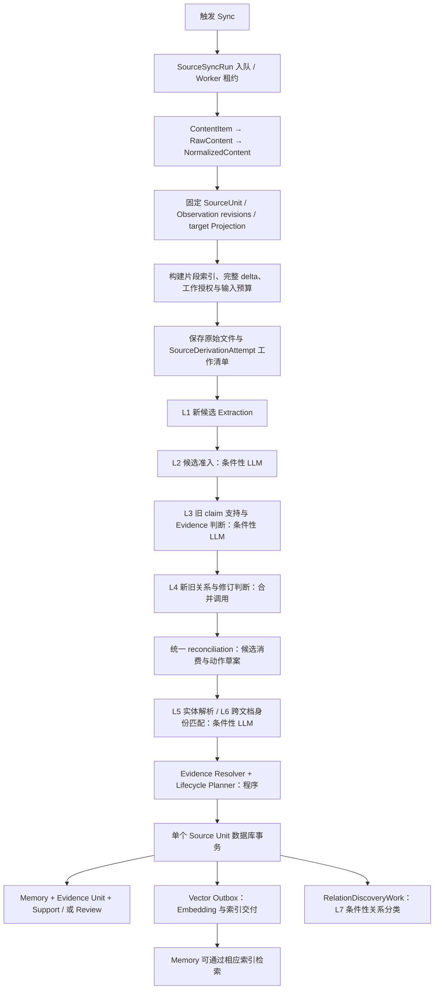

# 单篇文档从 Sync 到 Memory 的完整设计

日期：2026-09-07。本文描述共享代码的 Sync→Memory 合同；紧凑 catalog 与可恢复分批的发布、部署及运行验收由 [Cloud #473](https://github.com/dodoman-sun/memforge-cloud/issues/473) 跟踪。

本文以一篇 Confluence 页面为主线，覆盖首次导入和后续更新。Jira、Markdown 和带附件的文档复用相同领域流程，差异集中在源解析与表示方式。实施前评审基线为 OSS main `abdbdf18a3c1100289051c289046c0c07092fa76`：基线核对的相关路径与固定复核工作树 `3b8b1fc4` 一致。Cloud 对照基线为 `11338e0235ab23df3199b8024a05c1b17ed71d10`。这里不宣称线上 Cloud 已部署目标设计。

**阅读约定：**“已有”表示沿用的职责；“改造”表示此次替换的职责。第 18 节保留实施前差异评审并列出实际落点。L1–L7 是目标设计的模型职责编号，不是保证每篇文档恰好调用七次。L4 在同一次调用中完成关系分类与条件性的修订判断。没有触发条件的阶段不调用模型，同一职责也可能按既有执行合同有多个请求。

## 文档职责与阅读入口

本文是普通 Source 文档从 Sync 到 Memory 的完整流程入口，解释模块、数据、模型调用和失败边界。共享决策以 OSS ADR 为准；本次合并判断与输入策略由 [ADR 0034](../adr/0034-unify-incremental-support-and-claim-assessment.md) 记录共享决策。第 18 节区分实施前基线与改造落点。

- [Document Memory Lifecycle](document-memory-lifecycle.md) 只定义 Evidence/Support、动作与 Review 的领域约束，不再重复完整 Sync 流程。
- [Source-Agnostic Memory Extraction](source-agnostic-memory-extraction.md) 负责当前提取、角色和 selector 合同；[增量 Primary authority](representation-scoped-incremental-primary-authority.md) 负责表示级差量算法。本文不另造 compiler 或授权规则。
- [ADR 0009](../adr/0009-bound-cross-document-relation-discovery.md)、[0017](../adr/0017-stage-recoverable-source-unit-derivation-before-lifecycle-commit.md)、[0030](../adr/0030-compile-revision-pinned-evidence-fragments.md) 分别拥有异步关系发现、可恢复推导、不可变 Evidence 的详细合同。
- [大文档恢复分析](large-document-reconciliation-recovery.md) 是历史问题与未批准选项的记录，不是另一份当前主流程或执行 backlog。

全文/delta 选择用于文档语义材料的供应，不是对所有 LLM 步骤一律传全文：L2 看候选，L4 看知识对和候选 Evidence，L5 看名称语境，L6/L7 看知识对及范围。直接用户创建/纠正、managed agent commands 有各自的授权入口，复用后段 Evidence/Lifecycle，但不强制绕回 provider Sync。

## 1. 整个周期由谁负责

| 领域模块 | 对外负责什么 | 不拥有的决定 |
|---|---|---|
| Source Projection | 将 provider 内容转换成准确身份、不可变版本、成员集合、访问资格和版本变化 | 不决定什么知识应该新增或退休 |
| Evidence Derivation | 从获授权的变化提取 Candidate；验证固定旧 claim 的当前支持；解析可审计 Evidence | 不直接写正式 Memory 生命周期 |
| Memory Lifecycle | 候选准入、新旧知识对齐、身份复用、完整 Evidence 检查、Plan 与原子提交 | 不让数据库事务等待远程 LLM |
| Knowledge Discovery | Memory 的索引交付、检索和提交后关系发现 | 不凭相似度自动替换别的来源的知识 |
| Review Orchestration | 展示未决事项，接收决定，重新检查条件并调用 Lifecycle | 不直接绕过 Plan 改 Support |

上表是职责分组，不要求新建五个 service、公共 interface 或数据库表。实现优先复用现有 planner/compiler、MemoryEngine、reconciler、MemoryStore 和 ReviewService；只有调用者需要的合同跨模块暴露。

SyncService、Worker、lease、任务池、SQLite/HANA、ArtifactStore 是执行与存储设施。无需为全文模式、delta 模式或每一种案例另建生命周期模块。

## 2. 主流程图

这是推荐的职责顺序。L3 的目标是合并旧 claim 的支持判断与必要证据重构判断，避免先判 supported、后面对相同输入再独立重判一次。现有调用基础和需要修改的位置见第 18 节。

## 3. 进入系统后有哪些实体

同一段原文不会先后“变成”一串相互替代的对象；系统建立的是不同职责的表示和关联。

| 实体 | 生命周期与作用 | 是否正式知识 |
|---|---|---|
| Configured Source | 已保存的连接、采集范围、权限、配置版本 | 否 |
| SourceSyncRun | 一次 Source 同步的持久运行记录，含 lease、进度、重试与结果 | 否 |
| ContentItem | provider 枚举到的条目元数据；内存对象 | 否 |
| RawContent / NormalizedContent | 抓取结果与规范化结果；内存对象，正文另存文件/对象存储 | 否 |
| DocumentRecord | 文档标题、URL、内容 hash、原始/规范化内容 URI；当前记录由提交更新 | 否 |
| SourceUnit | 一篇页面、一个 issue 等 provider item 的稳定领域身份 | 否 |
| SourceObservation | Unit 内一个稳定内容部分，例如 page body、comment、attachment | 否 |
| SourceObservationRevision | 一个 Observation 的不可变版本，保存实际内容或 Artifact 表示信息 | 否 |
| SourceUnitRevision | 固定该时刻有效的 Observation Revision 集合；自身不是整篇正文 | 否 |
| SourceProjection / RevisionDelta | 拟提交的目标快照及变化事实；准备阶段存于 derivation payload，提交后投影为当前状态 | 否 |
| SourceDerivationAttempt / BatchRecord | 持久化本次目标、工作清单、完成输出和失败信息，以便准确恢复 | 否 |
| RevisionFragmentIndex / Catalog | 按固定版本编译的片段与临时引用；操作级复用，不引入片段业务状态表 | 否 |
| RawMemory / Candidate | 模型提取的候选及选择的证据；成功提取结果可暂存 | 否 |
| CandidateLedgerResult / 支持判断 / 关系判断 | 准入与生命周期准备结果；通常是工作内中间值，必要审计进入已有 Plan/runtime 记录 | 否 |
| Entity / EntityAlias | 项目、系统等名称的规范身份；实体字典不是 Memory | 否 |
| EvidenceReference | 精确版本、位置、摘要和角色的原文引用 | 是正式知识的依据 |
| EvidenceUnit | 一条 claim 的完整证据组：一个 Primary、零到多个 Required | 是正式支持依据 |
| MemoryUnitSupportAssertion | 将一条 Memory 与完整 EvidenceUnit 关联；本文简称 Support | 是 |
| Memory | 面向用户的 canonical claim、类型、范围、状态与时间等 | 是 |
| LifecyclePlan / LifecycleReview | 业务动作、覆盖、stale guards、审核与历史 | 是生命周期记录 |
| LifecycleVectorTask / RelationDiscoveryWork | 同事务登记的索引与关系发现工作，提交后执行 | 是可恢复后续工作 |

SourceSyncInput 是本地上传/daemon 输入的持久收据；服务器直接抓取 Confluence 时不要求先为每篇页面造一条这种记录。一次 SourceSyncRun 可处理多篇文档，每个 Source Unit 有自己的推导和提交边界，不是整个 Source 一个巨型事务。

**版本保存与用户看到的来源。** 本文的 v1/v2 是实际 revision 的讲解代称。服务端保存已采集的不可变 Observation 内容版本，为 delta 和证据追溯提供依据；这不等于备份来源系统的全部历史，也不包含两次同步之间未采集的版本。Source Unit 更新可以继续引用未变 Observation 的原版本，因此处理全部相关 Memory 不等于重建全部 Evidence。

get_memory 的 Evidence 摘录绑定确定版本；普通来源链接或文档内容链接不保证打开这个历史版本，不能拿链接当前显示的正文替代当时的证据。展示时应区分证据摘录与来源文档；Artifact 的具体版本引用继续按既有访问规则处理。本设计复用现有版本存储，不增加历史文档浏览器。

## 4. 步骤一：Trigger 与后台执行【已有，无 LLM】

用户点击 Sync、调度器到期，或输入事件触发 Sync。服务器检查 Source 是否存在、调用者权限、Source 是否暂停以及互斥操作，然后入队 SourceSyncRun，返回运行收据。

Worker 领取租约并续约，使用固定的 Source 配置与访问范围执行。重复触发使用已有 coalescing/后续运行合同，不直接创建第二份 Memory 工作。

本文跟踪该 run 中的页面 P。源枚举过程中出现的其他页面分别处理，不能因 P 失败回滚已经完成的其他页面，也不能因其他页面成功把 P 标成成功。

## 5. 步骤二：采集、规范化与快照【已有，无语义 LLM】

1. Gene 枚举 ContentItem：page id、URL、标题、provider version 等。
2. 抓取 RawContent：原始 bytes、content type、附件，以及明确的空内容/删除证据。
3. Normalizer 输出 NormalizedContent，供展示和后续处理。Confluence/Jira 等受支持文档的结构规范化按程序完成。
4. Source Projection Adapter 建立稳定 SourceUnit 和 SourceObservation。页面 body 通常是一个 Observation，附件可以是其他 Observation；Markdown 段落是后续 Fragment，不能把每段都当作一个新 Observation。
5. 建立目标 SourceObservationRevision，并由 SourceUnitRevision 固定有效成员集合。读取上一成功提交的快照，计算变化事实。

原始文件、规范化文件及准确 Artifact 可提前保存。此时只有“数据已抓取并保存”，不等于目标已成为当前投影，更不等于 Memory 已更新。访问变化、tombstone、Partial Projection 与 Artifact eligibility 必须作为确定性事实处理。

## 6. 步骤三：暂存目标、准备工作【已有框架，输入准备需改造，无 LLM】

在 source_derivation_attempts/source_derivation_batches 中记录固定目标、base、上下文身份、工作输入 hash、提取合同版本及成功输出。未完成的工作可以恢复，完成输出只能在输入与合同完全匹配时复用。

Representation 为需要的固定 revision 构建一次索引；相同 base/target 的比较结果在本次操作复用。输入预算计算不等于重新解析每条 Memory 的整个文档。

### 6.1 两个授权范围

| 范围 | 决定什么 |
|---|---|
| 可读/可供判断的上下文 | 当前文档哪些片段实际交给模型理解 |
| 新候选 Primary 授权 | 本次新增、修改的哪些完整结构/字段可以成为新知识依据 |

小文档读全文也不能扩大第二个范围。旧片段可支持固定旧 claim；不能因为成为 revalidation Primary 就获得 extraction Primary 授权。Required 和辅助 Context 不自动产生新的提取权限。首次导入或明确全量 reprocess 使用其自身授权合同。

### 6.2 文档语义输入的全文与 delta 选择

- 先按实际模型统计完整请求预计输入，包括指令、claim、目录包装、schema 和多模态内容；同时处理输出空间与 provider 限制。
- 完整当前目录可装入工作预算，则可以使用全文上下文。初始预算按讨论采用约 80% 的可用输入上限，作为可调配置，不作为准确率保证。
- 超过预算且存在可用基线，则使用完整结构 delta，加必要的旧 claim/受影响旧 Evidence 和程序可确定的标题、字段、表头等上下文。
- 原证据内容、结构语境和资格可确认未受影响时，可以由程序沿用，不强制把所有旧 Evidence 反复给模型。
- 全文或完整 delta 仍超限时，按 Source 结构切分，再按完整请求预算装入多个 claim/Support；覆盖全部 Source × claim 工作后统一汇总。容量不会直接产生 semantic Review。
- 初次导入没有旧基线，不能制造 delta。L1 在原 Primary 授权内按完整请求预算分批，所有授权片段恰好作为 Primary 候选覆盖一次。标题等必要上下文可以按准确 ref 作为 Required 随批提供。

对已正常处理的 Support，base 通常是上一成功处理快照。Review 中的 contested Support 不假装具有该有效基线：需要重判时，使用其已知有效基线到 target 的完整净差量，或分批读取当前全文；基线无法恢复则使用当前全文重新判断，不能把最近一次 sync 的空 diff 当作通过。源端未采集的中间编辑无需回放，比较两个实际快照即可。

Token 预算应统计完整请求而非正文字符，参见 [官方 token counting 说明](https://platform.claude.com/docs/en/build-with-claude/token-counting)。预算不是 provider Coverage 或语义充分性的证明。

### 6.3 紧凑 catalog 与大文档执行

模型侧的普通文本是 `[ref, 准确原文]`。Primary/Required 目录仍显式区分，Observation/Revision 只在映射中出现一次，结构组使用短别名。标题仍是普通可引用 Fragment；字段路径、表头、HTML 中被剥离的标题/代码/引用类型等必要语义保留。内部 anchor、类型和 hash 不变。按准确身份去重上下文与旧 Evidence，独立 Support 的分组不合并。

小输入可以一次判断多个固定 claim。大输入采用固定流程：

1. 为每个 Source 批次装入预算允许的 claim/Support。扫描只返回相关依据、反例、范围、依赖，或明确本批无影响；不升级 Evidence。
2. 程序确认每个工作项的完整输入范围均有有效结果。只有 ID、没有判断的响应不能算完成；相同重复响应可归一化，冲突或缺项做一次 correction。
3. 按 claim 汇集所有批次的发现，取回准确原文及可确定的原标题等祖先 Fragment。若汇总仍超限，逐层归约，每条 finding 都须有保留或消除冗余的处置。摘要只作导航，不能成为 Evidence。
4. 最终请求可以合装多个 claim；联合考虑全部相关材料，返回固定 claim 的判断与一组完整当前 Evidence。不存在“每批都没冲突，所以整体通过”的投票规则。

每个 Support 使用自己的有效基线；相同基线的 delta 只算一次，相同目标全文可共享。执行前比较各基线分批的预计总成本与共享全文的预计总成本，包含重复请求、输出及图片；用实际序列化请求和有界装箱采样估算，不追求全局最优。实际执行仍独立检查每批预算与完整覆盖。历史 Evidence 本身过大时，可以不携带全部旧文，改为完整扫描当前全文验证固定 claim。普通 Source 总长度通过分批处理；单个不可分结构、必要视觉输入或无法再归约的完整证明超过能力时，才报告明确能力错误，保留已有成功工作，不伪装为语义结论。

LiteLLM 提供模型 metadata 与 token 估算；应用不维护第二份模型清单。已知模型没有隐含统一窗口上限，部署可显式降低 input/context/output caps；未知路由必须配置能力。规划为指令、schema、Source、claims、历史 Evidence、图片、输出和一次 correction 预留空间。发送前按实际展开的 JSON fallback/模板值再次检查；纠错可消费已预留空间，不重复扣留同一 reserve。

新增 `DerivationWork` 是已有 SourceDerivationAttempt 下的执行阶段记录：scan、reduce、finalize。L1 复用已有 BatchRecord。输入身份包含模型及能力快照、范围、claim/Support、prompt/schema 和父阶段结果 hash。成功阶段不可被迟到失败覆盖；恢复复用完全匹配的成功结果。最终 Lifecycle 事务除既有 stale guards 外，还要求本次使用的 finalize 阶段完成。批次不会创建新的 Memory 状态或额外 Support。

## 7. 步骤四：提取新候选 L1【已有，输入合同需改造】

**触发：**首次导入有获授权内容，或普通更新存在获授权的新增/修改结构。仅删除且无当前 Primary 授权时可跳过。

**输入：**本次工作类型、允许生成 Primary 的当前片段、可读上下文、角色限制和输出合同。图片参与判断时必须实际供应对应 revision 的 bytes，不用空文字或摘要替代。

**LLM 输出：**canonical claim、类型、实体 mentions、适用时间等候选信息，以及 Primary/Required 的当前片段引用。文档摘要或 Artifact 摘要如有，属于可选辅助输出，不能替代 Evidence。

**程序校验：**输出格式、真实引用、Primary 授权、角色、访问兼容性及证据完整性。通过后保存到本次 derivation 的成功输出，形成 RawMemory/Candidate。尚不创建正式 Memory。

本文按两个步骤描述：L1 找出本次变化带来的新知识候选；L3 检查已有知识是否仍被当前来源支持。L1 输出候选，不直接创建 Memory；L3 输出支持判断与证据调整方案，不直接修改旧 Memory。两种结果都交给后面的统一 reconciliation 和 Lifecycle Plan，决定最终如何提交。

## 8. 步骤五：候选准入 L2【已有，条件性 LLM】

输入仅是本次提取到的候选集合及必要的候选元数据，不需要再次读全文。程序先做确定性质量检查和完全相同内容合并；需要时 LLM 选择不冗余且有价值的候选，输出 CandidateLedgerResult。

没有候选或确定性去重后仅一个候选时，已有路径不调用此模型。模型只能选择/拒绝现有候选，不自行编写一个新合成 claim。

这是本次候选内部的准入，不是跨文档 Memory 身份匹配。既有准入异常允许保留候选继续处理的分支，不等于证据有效性或旧 Memory 支持判断可以同样 fail-open。

通过本阶段不表示立即 CREATE_MEMORY。候选还要经过第 10 节同 Unit reconciliation 和第 11 节跨文档身份匹配；跨文档冲突/细化关系由第 14 节的关系工作处理。跨文档完整路径集中说明如下。

## 9. 步骤六：旧 claim 的支持与证据评估 L3【核心改造】

首先用这篇文档的稳定 SourceUnit ID，查询当前有哪些 Memory 通过本 Unit 的完整 EvidenceUnit 获得支持，并读取这些 Support。这个查询依据已有身份和关联，不靠文本相似度或 offset。首次导入若没有这种已有 Memory，就跳过本阶段；其他文档已存在的等价 Memory 仍由后面的身份匹配处理。

offset 只在它所属的固定 Observation Revision 内用于定位或校验证据。例如旧引用的位置只能用于读取旧版内容，不能原样套到新版，也不能与新版位置是否重叠来决定 claim 是否受影响。目标设计依据完整结构 delta 和语义判断评估变化；最终选中的新版片段由程序生成或验证新版引用。证据摘录已保存时可直接使用，不要求每次都重新按 offset 切片。

只有程序能依据完整变化事实确定本次变化不影响该支持时，才可明确保留而跳过语义调用。仅发现旧证据正文没改，或其位置附近没有 diff，不足以排除文档其他位置新增的例外。

**输入：**固定旧 claim、本次授权范围和完整全文或 delta 材料，以及判断受影响部分所需的旧证据。未变部分可由程序继承；输入必须说明旧内容是历史材料、新内容属于哪个固定 revision。

**LLM 输出两个相互对应的结果：**

- 原 claim 仍被当前 Source 支持 / 当前 Source 不再支持 / 所给材料不足。
- 成立时，受影响 Evidence 应选用哪些当前片段；可以新增、删除或拆分 Required。程序可沿用的未变部分不要求模型重复输出正文。

这是一次固定 claim 的支持评估，不能用 Required 隐式改变 claim。对于 changed Evidence，需要完整当前 Unit，但模型不必恢复作者的编辑历史，也不必把旧每个 Required 对应为恰好一个新 Required。

程序将可证明沿用的部分和模型选择组合成完整当前 Evidence 候选。两个层面分别校验：LLM 判断语义；程序核对 revision、范围、digest、角色和资格。继承未显示证据是基于已有有效 Support 的增量推导，不能称为模型重新逐段验证了整套证据。

**实现边界：**L3 已替代此前分开的 support audit 和 NOOP rebind validation。固定 claim 的判断及当前证据重构结果供后续直接复用，同输入不再独立重复判定。

L3 不能只筛选“直接编辑旧 Evidence”的 delta；其他位置新增的例外同样可能影响旧 claim。缺少远处未变解释造成的语义误判属于用户接受的第一阶段风险。

## 10. 步骤七：新旧知识关系与修订判断 L4【合并调用，复用 L3】

本阶段连接 L1 的新候选与 L3 的旧知识支持结果：判断两条知识是什么关系，以及新候选能否作为旧知识的完整修订。关系分类和条件性的修订证明在同一次 LLM 调用内完成，不在判为细化后再追加一次独立修订判断请求。此处“一次”指合并这两种判断，不承诺整个 Source Unit 的全部比较只用一个请求，也不引入新的 batching。

**输入边界：**旧 claim、新候选 claim、两者的主体/范围/时间/要求强度、新候选的完整当前 Evidence（Primary 与必要 Required），以及同一目标 revision、旧 claim 与 Support 输入下的 L3 支持结果。只提供新增细节或 Required 数量不足以证明完整修订。不要求再次读取整篇文档或全部 delta；文档变化是否影响旧 claim 由 L3 负责。本阶段复用该结果并检查一致性，不重复执行旧支持验证，也不扩展新候选的 Primary 授权。

**关系类型：**Source 类型不改变定义；关系标签不是数据库动作。

| 类型 | 设计定义 | 边界 |
|---|---|---|
| EQUIVALENT | 主张含义一致，主体、适用范围、时间与要求强度等实质条件一致 | 表面相似或多一个实质条件都不等于等价 |
| REFINES | 一条比另一条更具体，增加相容要求或限定适用范围 | 必须明确新细化旧或旧细化新；范围缩小不能自动整体替代旧知识 |
| CONTRADICTS | 在重叠的主体、适用范围和时间内，两条主张不兼容 | 不同国家、不同有效期或仅主题相近不能自动算冲突；标签本身不证明替代权限 |
| UNRELATED | 已有材料足以判断不存在上述关系 | 不表示两条知识一定没有共同主题，也不能拿它代替“材料不足” |

**条件性的修订判断：**仅当新候选细化旧 claim 时，检查四个条件：同一知识身份、保留全部旧含义及适用范围、新 claim 可独立表达完整知识、当前 Evidence 完整支持新 claim。四项全部有依据才可提出修订。已确定有条件不成立时，表示不能整体替代；缺少依据时，表示尚不能确定，两者不能混为一个通过结果。反方向细化及其他关系不适用此项判断。

**统一结果合同：**每次返回同一种结果结构，包含被比较的知识身份、关系及方向、条件性修订判断、与 L3 的一致性和简短依据。修订不适用时明确为空，不改变顶层结构。材料不足（INSUFFICIENT）是判断未完成的状态，不是第五种已成立的知识关系，也不是新增 Memory 状态。程序先沿既有规则规范化无歧义冗余，再检查适用字段、完整覆盖、已有引用及修订条件；语义不确定或与 L3 矛盾必须保持未决，只有能由现有单提案 Review 完整表达的结果才转换为 Review；否则按明确合同失败停止本 Unit，不能假定设置 flag_for_review 就足够。规范化或有界局部纠正后仍存在的格式错误、缺失应答和非法引用按技术失败处理。不能把任何一种失败降为 UNRELATED 后继续新增。

例如 L3 判旧 claim 不再受支持，模型却认为有当前充分支持的等价候选，应报告两项结果不一致；不能同时执行“删除旧知识”和“另建等价知识”。

**场景与处理方向。** 下表旧 claim 统一为“所有美国常规薪资发布需要两名审批人”；例子均假设比较的是相应当前生效规则。

| 新候选或变化 | L3 与本阶段判断 | 程序处理方向 |
|---|---|---|
| “所有美国常规薪资发布必须由两人审批” | 仍支持；EQUIVALENT | 保留 claim，更新/复用完整 Evidence；等价候选不再独立 ADD |
| “所有美国常规薪资发布需要两名来自不同团队的审批人” | 仍支持；新细化旧，四项修订条件均通过 | 提出 UPDATE 修订，候选不再独立 ADD |
| “美国紧急常规薪资发布需要两名来自不同团队的审批人” | 仍支持；新细化旧，但范围只覆盖紧急场景 | 保留旧 claim，新候选独立处理，不能丢失非紧急场景的旧知识 |
| 新候选比旧 claim 更宽泛 | 仍支持；旧细化新 | 不以更宽泛表述覆盖旧细节；候选按既有准入与身份匹配继续处理 |
| “现改为只需一名审批人，两人要求取消” | 不再支持；唯一且明确的同范围冲突/替代 | 提出替代，由 Lifecycle 的权限与其他 Support 决定执行或 Review |
| “审批记录保存七年” | 仍支持；UNRELATED | 保留旧 claim，新候选独立处理 |
| 旧规则被取消，未提取出替代规则 | 不再支持；无替代候选 | 无需模型比较空候选；提出移除本来源 Support，是否退休另行检查 |
| 缺少判断关系或修订所需材料，或与 L3 结果矛盾 | 判断未决 | 能完整表达则交单提案 Review，否则明确停止本 Unit；不强行替代或因未决关系生成重复知识 |

“独立处理”不表示立即创建 Memory；候选仍要经过后面的身份匹配、证据检查和 Lifecycle。多个候选同时匹配或冲突时，程序必须综合相关结果，不能凭单对判断猜一个唯一后继。存在新候选时，本 Unit 旧 Memory 的 reconciliation 覆盖保持完整；不能因为旧 Evidence 在别的段落就不比较。

现有多候选互斥 refiners 仍可能触发 non_unique_refinement_conflict。合并模型调用不取消这项检查，也不证明多条分别合格的修订能同时采用。本阶段不新增候选两两全扫描或多选提案 Review/UI；已有单提案无法表达的竞争保持 fail-closed。

此阶段产生 ReconcileOperation 等动作草案，不写正式 Memory。重复 Candidate 被消费后不再作为独立 ADD 创建；已有多 incumbent 场景仍允许一个有充分依据的候选关联多个相关决定，不能误设计为强制一对一匹配。最终破坏性动作仍由 Lifecycle 检查完整 Support、权限、stale guards 和原子提交条件。

## 11. 步骤八：实体解析 L5 与全局身份匹配 L6【已有】

L5 是检索辅助，不是知识真实性或生命周期授权检查。其现有步骤是：对已提取名称规范化去重 → 查询已有名称/别名 → 对未命中名称召回候选并按配置做 Embedding 筛选 → 仅对疑似同一对象调用 LLM → 复用实体并按规则记录别名，或保留为独立实体。结果供 L6/L7 的共享实体召回使用；同实体不能直接证明两条 Memory 等价或冲突。

这不是每篇文档固定增加一次 LLM，也不要求建设新的本体或实体生命周期。现有 caller 实际只传文档前 2,000 字符作为语境，不是精确挑选的相关 Evidence；本次不把实体消歧重构列为必需改造，也不声称其召回效果已经验证。Embedding 与语义生成调用分开计量。实体字典可能提前持久化，不意味着 Memory 已提交。

对第 10 节剩余的 ADD 候选，IdentityResolver 先按访问兼容范围查询已提交的完全相同 claim。精确命中可不调用 LLM。

未精确命中时，用向量与共享实体召回候选 Memory。L6 对召回的新旧 claim 判断语义等价，并复用相同输入、当前 Support 和访问条件仍有效的已有分类结果。输入是候选知识对及范围，不是源文档全文。

- 找到等价目标：复用已有 Memory，追加本次完整 Evidence Unit 的 Support。
- 未找到等价目标：保留 CREATE_MEMORY 草案。
- 访问不兼容：不自动合并。

例如 Jira 先提交 M，Confluence 后处理时可以找到 M 并追加 Support，不要求两个 Source 同一个事务。本设计不宣称有界召回可消灭所有语义重复，也不把同时发生的独立并发创建假定为已全局去重。

### 跨文档三条路径

“跨文档”通常意味着不同 Source Unit，可以是同一个 Confluence Source 的两篇页面，也可以是 Jira 与 Confluence 两个 Source。候选仍只来自本次获授权变化；跨文档检索查找已有 Memory，不重新提取所有旧文档全文。

| 场景 | 创建前 L6 / 当前 Lifecycle | 提交后 L7 |
|---|---|---|
| Jira 已有“两人审批”，Confluence 新候选表达相同规则 | 等价且访问兼容则复用原 Memory，追加 Confluence 的独立完整 Support | 按需要发现其他关系；不再创建一个重复 Memory 后做合并 |
| Jira 为“两人审批”，Confluence 新候选明确改为“三人审批”，此前二者没有共享 Memory | 不属于等价，不能把支持三人的 Evidence 附到两人 claim；候选按其合法来源进入独立创建 | 在同主体/范围冲突被确认时建立关系与既有冲突 Review，不自动覆盖 Jira 的知识 |
| Memory 已同时有 Jira/Confluence 的 Support，之后 Confluence 改为三人审批 | 当前 Unit 已能通过 scoped Support 找到这条共享 Memory；完整评估 Confluence 的支持变化。其他 Source 仍有 Support 时，替代受 external-support Review gate 约束 | 可补充跨来源关系与冲突信息；不能接管当前 Unit 的原子 Support 更新 |

跨文档只是更具体的补充、或属于不同场景时，不把 REFINES/相似度当成 EQUIVALENT：可以保留独立知识并建立关系。命中跨文档候选不赋予修改其来源的权限。当前 Unit 的完整处理覆盖与跨文档的有界候选发现是不同合同；后者不能替代前者。

## 12. 步骤九：构建 Evidence 与 LifecyclePlan【已有骨架，校验接口改造，无 LLM】

统一 Evidence Resolver 将合法选择或继承计划转换为当前 EvidenceReference 和完整 EvidenceUnit。每条 Source-backed Unit 恰好一个 Primary，零到多个 Required；Context 单独关联，不作为 Support 成员。

关系为：**Memory ← MemoryUnitSupportAssertion → EvidenceUnit → Primary + Required**。

一个 Memory 可由多个独立完整 Unit 支持。一次 revalidation 固定本次 Source Unit 的支持范围，不能借用其他来源的零散片段补全它。

Lifecycle Planner 汇总整篇文档的动作，检查：

- 每个旧 Memory 有明确处理结果；候选与证据关联完整。
- 目标仍是本次固定 revision，当前 source activity、owner、Support 集合与内容 hash 没变。
- 附加 Support 的内容等价证明和访问范围成立。
- UPDATE 有完整无损修订证明；SUPERSEDE/退休满足相应 authority 和 gate。
- 其他 Source 仍有 Support 时，不能用本 Source 的变化自动替换整条共享 Memory；按既有 Review 规则处理。

Planner 输出一个 LifecyclePlan，包含必要的 CREATE_MEMORY、ATTACH_SUPPORT、REMOVE_SUPPORT、SUPERSEDE_MEMORY、RETIRE_MEMORY、索引和 Review 动作。模型不生成数据库 ID、offset、digest 或可直接执行的任意写操作。

UPDATE 是知识修订语义：现有 planner 使用新修订记录关联旧历史，不能将其描述成直接覆盖同一 Memory row。纯 Evidence 更新则保留原 Memory 的 claim 和身份。

## 13. 步骤十：唯一的正式生命周期提交【已有，无 LLM】

在一个 Source Unit 数据库事务内，重新验证 stale guards，完成：

1. 提交目标 Source Projection 与当前 DocumentRecord、lineage。
2. 保存准确的 EvidenceReferences、EvidenceUnits 和必要实体关联。
3. 创建/修订/保留 Memory，并原子调整 Support。
4. 保存 LifecyclePlan、业务审计以及需要的 LifecycleReview。
5. 登记 LifecycleVectorTask 和 RelationDiscoveryWork。
6. 将适用的已消费 derivation 标为已应用。

事务内不执行 provider 抓取、LLM 或向量服务写入。SQLite 与 HANA 实现同一个业务合同，锁顺序和重试不能改变业务语义。

只有这个提交成功，才能称“Memory 已生成/已更新”。原始文件、staged 输出、实体字典等准备材料可能早已保存，不能笼统声称提交之前数据库完全没有写入。

若业务未决形成 Review，事务可以保存明确的未决状态并推进 Projection；被保留的旧 Support 是 contested，不能伪称当前版本已验证通过。Review 状态不是同名的 Memory 状态：旧 Memory 可能仍 active，待审批替代记录则按既有隐藏/激活规则处理。

## 14. 步骤十一：索引、关系与运行完成【已有】

### 索引交付：Embedding / 无生成式 LLM

提交后由 MemoryStore/Worker 消费 LifecycleVectorTask，计算需要的 embedding，执行 upsert/delete 并更新交付状态。重试必须检查当前 Memory 状态、内容和可见性，防止旧任务复活已退休知识。

数据库成功而向量服务暂时失败时，Memory 已持久化，但相应向量检索可能尚未可用。不能重新跑 extraction 来修向量交付。事务性 outbox 的职责是将业务提交与后续交付可靠关联，参见 [AWS 原始模式说明](https://docs.aws.amazon.com/prescriptive-guidance/latest/cloud-design-patterns/transactional-outbox.html)。

### 提交后关系发现 L7：条件性 LLM

RelationDiscoveryWork 固定 Memory 的身份、预期内容 hash、来源和已知分类。Worker 先确认该 Memory 仍适用，再召回其他 Memory，复用尚有效的分类，否则调用关系分类模型。

输出关系或既有跨 Source 冲突 Review。它不自动合并 Memory、不依据关系标签退休其他 Source 的知识。L6 是创建前的身份复用；L7 是提交后的非破坏性知识关系发现，两者不能混为一次“去重”。

**异步边界已接受。** 有效来源支持的新 Memory 可以先提交、被读取，跨文档冲突关系随后由 L7 发现；用户接受短时间尚未标注冲突的窗口。这是收录策略，不是数据库禁止提交前做模型判断。任务与业务状态同事务登记，现有 worker 负责重试与 stale guards；失败或耗尽重试必须可见，不能承诺固定时限完成。L7 是有界发现，不是全库无冲突证明，也不是持续重审所有历史冲突的扫描器。

L7 复用有效分类，否则使用实体图、语义向量与内容 BM25 的独立候选渠道，经 RRF 和访问/来源过滤后判断。当前代码只有不同 Source 的明确冲突进入 CROSS_SOURCE_CONFLICT Review；同 Source 不同文档的冲突仍为非破坏性关系。Review 的发现/确认不自动授权淘汰另一来源，不能与 gated LifecycleReview 的批准动作混同。

### 完成信号

SourceSyncRun/SyncState 汇总页面处理结果，报告成功、局部失败或失败。文档 lifecycle 已提交、vector delivery 是否 pending、relation work 是否完成是可独立查询的进度；不得将它们折叠成“所有工作一定同时完成”。局部失败只恢复需要处理的文档/工作，不默认重跑整个 Source。

## 15. LLM 调用总表

| 编号 | 职责 | 何时发生 | 主要输入 | 输出 | 是否直接改变正式 Memory |
|---|---|---|---|---|---|
| L1 | 新候选提取 | 有获授权 Primary 工作 | 当前片段目录、授权、解释上下文、实际图片 | Candidate + 当前 Evidence selection | 否 |
| L2 | 候选准入 | 多个候选需判断重复/价值 | 本次候选集合 | 选择与拒绝理由 | 否 |
| L3 | 旧 claim 支持与 Evidence 重构 | 存在需要语义判断的旧 Support | 旧 claim、全文或完整 delta、必要旧证据 | 支持判断 + Evidence 计划 | 否 |
| L4 | 同 Unit 新旧关系与条件性修订判断 | 存在待比较候选与旧 Memory | claim 对与适用条件、完整候选当前 Evidence、L3 结果 | 关系及方向、条件性修订判断、一致性或未决结果 | 否 |
| L5 | 实体消歧 | 精确名称/别名不足以确定 | mention、实体候选、必要局部语境 | 匹配/不匹配 | 否；实体字典可准备写入 |
| L6 | 跨文档身份判断 | 精确 claim 未命中且召回候选 | 新旧 claim 与范围 | 等价目标或无目标 | 否 |
| L7 | 提交后关系发现 | 有关系候选且没有有效已分类结果 | 已提交 Memory 对及范围 | 关系/冲突判定 | 否；通过既有关系/Review提交 |

程序归约、资格检查、delta 计算、Evidence Resolver、Lifecycle Planner、数据库提交不新增语义 LLM。Embedding、token counting、provider API 单独计量，不混算为“revalidation 调用”。可选 Artifact 摘要复用提取响应，不额外规定一个必需的摘要模型阶段。

首次导入没有 L3/L4 的旧 Memory 工作；精确身份匹配可跳过 L6；没有关系候选跳过 L7。一套通用流程不等于一次 LLM 调用。具体调用数量由实际候选/旧 Memory 数量、既有工作合同、歧义及有限重试决定。

## 16. 用一篇页面展示首次导入与三种更新

### 首次导入

页面 P v1：“所有美国常规薪资发布均需两名审批人”。没有同 Unit 旧 Memory。

L1 得到候选 C1 → 程序验证证据 → 准入 → 跳过旧 Support/reconciliation 工作 → 实体与全局身份匹配 → 若没有等价已存 Memory，Plan 创建 M1、EU1、Support(M1, EU1) → 提交 → 索引与关系工作。

若 Jira 已有等价 M0，则最后是 Support(M0, EU1)，不创建独立 M1。

### v2-A：只重组表达

“Cedar 需两名审批人；Cedar 指所有美国常规薪资发布”。L1 可以产生等价候选；L3 判原 claim 成立；L4 判等价。新 Primary 与定义 Required 组成 EU2，Plan 保留 M1 并切换本范围的 Support。等价候选已消费，不另行 ADD。

### v2-B：规则替代

“从即日起，仅超过 100 万元的美国常规薪资发布要求双人审批，其余不再要求”。L1 产生带金额条件的 C2；L3 判旧普遍要求不再受支持；L4 识别同范围的明确替代/冲突。Planner 检查权限及其他 Support 后执行替代，或保存 Review。不得只给 M1 加一个 Required 隐藏金额条件。

### v2-C：增加实质要求

“所有美国常规薪资发布均需两名来自不同团队的审批人”。L1 产生完整 C3；L3 判原两人要求仍成立；合并后的 L4 在同次响应中判定新细化旧，并确认同一规则无损增加要求且当前 Evidence 完整。通过并满足 gate 时做知识修订；若已确定不能完整替代，则保留旧知识、独立处理候选；若材料不足或判断矛盾，则走未决/Review。UPDATE 的物理新记录与新增独立事实应分别统计。范围缩小及其他边界例子见第 10 节。

## 17. 失败、重试与版本推进

| 情况 | 已保存什么 | 正式 Memory/当前 Projection 如何处理 | 恢复位置 |
|---|---|---|---|
| provider 抓取失败 | Run 与错误；可能有其他成功页面 | 本页不据此证明删除 | provider/本页采集 |
| Artifact 不适合当前推理 | 准确原始 Artifact 与 eligibility | 依赖它的 Support 走明确未决保护；不伪造视觉验证 | eligibility/既有 Review |
| 提取 schema/transport 失败 | 固定 target 与成功 sibling batch 输出 | 本页不以不完整提取覆盖提交新知识 | 失败工作；精确输出复用 |
| 完整请求超容量 | 固定目标与成功阶段 | 按 Source × claim 分批，不截断成“完整” | 精确复用成功阶段；不可分证明才报告能力错误 |
| 已识别语义不确定/分类矛盾 | 判断诊断与可表达的 Review | 不强行支持，不擅自破坏旧知识；无可表达提案时停止本 Unit | 单提案 Review 或明确未决失败，不自动语义重试 |
| 事务锁冲突/可重试提交失败 | 准备结果；业务事务回滚 | 不留下半套 Memory/Support | 同一准备结果重试并重查 guards |
| target/旧 Memory/Support 已改变 | 历史准备与审计 | 不使用过期判断提交 | 重新针对适用快照准备 |
| 进程在 commit 前崩溃 | 持久 extraction staging 保留；部分生命周期准备仍可能只是内存 | 不保证所有生命周期模型结果都免重跑 | 已有恢复合同 |
| 向量交付失败 | 已提交 Memory 与 outbox | Memory 保持已提交；报告索引待交付 | outbox，不重跑 extraction |
| 关系发现失败 | 已提交 Memory 与 relation work | 不回滚已生成 Memory | relation work |

恢复不能将不同 Source Unit、revision、访问范围或不同旧 Support 输入下的模型结果拼用。依赖旧 Memory 的评估结果如需未来持久复用，必须把旧内容和 Support hash 纳入其身份；本阶段不承诺新增一套语义检查点账本。

### 17.1 防止过严校验重新制造整篇重试

校验保护的是 Evidence、覆盖、访问和动作权限，不是强迫模型输出只有一种无害表述。调用合并必须保留已经实现的规范化、固定槽位绑定、局部 correction 和错误分类，不能将新结果对象设计成新的拒绝器。

| 输入或结果情况 | 处理原则 |
|---|---|
| 提取 Required 中重复相同 ref，或重复列出 Primary | 保留现有 admission 的确定性去重，再交严格 Resolver；不重新调用整轮模型。此规则不等于跨版本 quote rematching |
| 关系响应重复已绑定 pair slot | 保留现有 first-decision 规范化与完整 ID 集合检查；不能仅因响应总数变化就失败，也不能据此允许遗漏或越界 |
| 某类关系不需要修订判断；或 supported=false | 只检查该结果适用的字段，不强求无意义的 proof/current Evidence。能由判断项确定的最终资格由程序归约，避免让模型重复输出可互相冲突的派生结论 |
| 语义相同但 Evidence 被拆分/合并、移动或改写 | 接受合法当前片段构成的新完整 Unit；不要求旧/新 offset 接近或 Required 数量相同 |
| 静态格式有效但当前 workset selector 无效 | 沿现有边界最多一次局部纠正，保持相同输入与 allowed refs；耗尽后产生明确错误，不让外层重跑 extraction、关系分类或同目标整个文档 |
| revision/access/Primary 资格错误、缺失必需决策、捏造引用或不完整 Support | 保留硬约束，不能默认为有效、无关或独立 ADD；局部修复不可行则明确终止当前工作 |
| 内容真的存在冲突或无法判断 | 视为语义结果而非可重试 transport 错误；按可表达的 Review 或明确未决失败处理，不自动重跑期待模型改口 |

不同阶段的容错有不同语义：L2 保留原候选是既有准入容错，不能复制成 L3/L4 的“失败也直接新增”。反过来，L3/L4 的引用硬约束也不能用来取消 L2 已批准的非破坏性容错。保留已有日志/指标，分别统计确定性规范化、局部纠正、语义 Review、能力失败及实际外层重试；不能只看最终 partial sync 数量。

实施验收必须回放此前修复的边界样例：角色 ref 兼容、重复 Required、固定 slot 重复、非适用字段、完整选择纠正、纠正耗尽不重放外层工作，以及文档其他 Unit 继续完成。支持的输入不应因新模型 schema 更严而退化为 partial sync；真正无法证明的状态仍不能假报成功。

### 17.2 版本升级边界

这些版本不能混称为 compiler v9：

| 当前标识 | 实际职责 | 本次升级原则 |
|---|---|---|
| `projection-extraction-v9` | L1 的提取合同，使用 Fragment catalog 与模型 selector；当前 Evidence Unit v2 能力选择它，legacy Reference v1 路径仍对应 v8 | 保持现有 L1 selector/授权语义时不因 L3/L4 合并而自动命名 v10；若提取合同含义确实改变，再显式注册新提取合同 |
| `COMPILER_CONTRACT_VERSION = 3` | 表示编译、片段边界、坐标和 catalog 身份合同 | 本阶段复用 compiler；仅当这些语义改变才升级，不为模型编排变化重编译历史 Evidence |
| authority policy / presentation policy（当前分别 5 / 2） | 增量结构授权及模型目录呈现规则 | 只有对应规划/呈现语义改变才调整，变化必须进入工作输入身份 |
| L3/L4 的语义工作合同及输入身份 | 决定结果是否可复用 | **必须显式更新**：新输入模式、支持判断、可变 Required 与合并关系/修订响应不能复用旧合同结果；沿用现有 descriptor/hash/staging 机制，不新建版本账本 |
| Source revision / Evidence Unit v2 | 前者是采集内容版本，后者是 Support 数据模型能力 | 都不因模型调用合并自动变化；本阶段没有新 Support schema 或历史内容迁移要求 |

现有 `source_derivation.py` 将 extraction contract、base/target、权限、inference 能力及 authority/presentation 规则纳入可复用身份。L3/L4 的输出并非都已持久缓存；实施时应在真实复用边界绑定新语义身份，而非假设改 compiler 常量就能失效所有旧结果。未完成 derivation 按现有合同变更流程失效/重建，已提交 Memory 和历史 Evidence 不被批量改写。本实现保持 L1 v9、compiler 3、authority policy 5 和 presentation policy 2；语义合同为 revision-support-v2 / claim-revision-v3，共享关系分类为 memory-relation-v3，输入策略为 revision-input-v1。这些身份对应方向性蕴含与重叠作用域判断，并进入实际工作复用边界。

## 18. 逐步实现评审与改动规模

以下矩阵保留上述两个 main 快照的**实施前**调用链审计，解释改造范围，不代表改造后的运行状态或部署证明。小＝复用为主/局部接线；中＝共享合同及多处调用适配；大＝语义与生命周期衔接需完整回归。模型职责编号不对应一组新 service。

| 步骤 | 实施前代码与可复用部分 | 目标差异及规模 | 必须验证的边界 |
|---|---|---|---|
| 1 Trigger/Worker | `admin_api` 的 Source sync 路由 → SyncService → SourceSyncWorker，已有 run/lease/coalescing | 无行为改造 | 只恢复失败工作；不新增调度器 |
| 2 采集/快照 | `pipeline/sync.py`、SourceProjectionAdapter、不可变 revisions、raw/normalized/Artifact 存储 | 无基础重构；资格问题单独见下表 | provider 部分覆盖、删除证明、稳定 Unit 身份 |
| 3 工作准备 | `source_derivation.py`、`pipeline/projection_context.py` 与 Fragment compiler 已有暂存、结构授权和索引 | **中**：统一完整请求预算、全文/delta 模式、适用基线和工作合同身份 | 首次导入、contested Support、超限不可截断、旧输出不可复用到新合同 |
| 4 L1 提取 | 已有结构目录与 Primary/Required selector；增量完整结构授权已实现 | **小到中**：消费统一输入模式；不放宽已实现的 Primary 授权 | 全文只是可读上下文；canonical 完整解析不等于全记录 Primary |
| 5 L2 准入 | `candidate_ledger.py`，确定性去重与条件性模型选择 | **无必需改造** | 保留候选的容错不扩展到 Evidence/生命周期校验 |
| 6 L3 支持评估 | `reconciler._audit_incumbent_support` 与 `engine._rebind_noop_evidence_to_current_revision` 目前分开调用；共享索引已有 | **大，主要改动**：合并支持判断及完整 Evidence 重构，允许 Required 数量变化，结果供后续复用 | 删除当前 40,000/100,000 字符截断；不能依靠旧位置匹配召回；false/不足/非法选择分别处理 |
| 7 L4 新旧关系/修订 | `reconcile_memories` 先分类、再 audit、再条件性独立 proof；proof 目前只有 Primary 摘录及 Required 数量 | **中到大**：L3 先供结果；一个模型结果完成关系和条件性证明，输入完整候选 Evidence | 完整 pair/incumbent 覆盖；双向细化；缺失响应不是 UNRELATED；新证据载荷需预算验证 |
| 7 程序归约/未决 | `reduce_relation_ledger` 与现有单提案 Review 可复用；proof 技术失败目前可退回 KEEP+ADD，多互斥 refiner 会抛错 | **中到大**：禁止把合并响应失败当独立新增；明确单提案可表达范围和失败出口 | ADD/NOOP 不因 flag 自动产生 Review；多候选竞争不自动选后继；不顺带实现多选提案 UI |
| 8 L5 实体解析 | `entity_resolver.resolve_many` 已有名称/别名、Embedding、条件性消歧、作用域与指标 | **无必需改造** | 它是辅助召回，不是事实依据；现有语境为文档前缀，非精准语境 |
| 8 L6 身份匹配 | `identity_resolver.py` 与 `memory/store.py` 的 exact + bounded semantic/entity 召回 | **无业务重构**；若复用 L4 分类，适配新结果为小改动 | 只复用确证等价且访问兼容目标；并发创建/召回遗漏不保证全消重 |
| 9 Evidence/Plan | `pipeline/projection_fragments.py`、`lifecycle_planner.py`、Evidence Unit v2 与 Source Authority/gates | **中**：消费 L3 的继承/重组结果与 L4 结果；保留既有存储实体 | 每组完整，一 Primary、多 Required；其他 Support 不被本 Unit 擅自改写；不新增版本域模型 |
| 10 原子提交 | MemoryEngine prepare/commit、MemoryStore、SQLite/HANA、causal stale guards 与既有同 run deferred commit | **小到中**：接口/fixture parity；不因 prompt 合并改事务所有权 | 模型在事务外；输入变更拒绝旧结果；复用既有 Deferred，不另建 checkpoint/依赖图 |
| 11 向量交付 | 现有 `lifecycle_vector_outbox` 与 worker | **无必需改造** | 重试当前关系事实，不重新提取，不复活终态 Memory |
| 11 L7 关系发现 | 现有 durable work、RRF 候选发现、分类、Review 和原子完成 | **无异步架构改造**；共享分类结果的适配为小改动 | 可见冲突窗口已接受；跨 Source Review 与同 Source 关系不同；不穷尽全库 |
| 12 Run 完成/恢复 | 已有 Run、derivation、模型 typed errors、work/outbox 重试与活动进度 | **中**：新语义合同版本和错误分类接入既有恢复/指标 | 单次 selector correction、技术失败和业务 Review 分开；不是所有模型结果都已持久缓存 |

实际落点：

- `RevisionAssessmentContext` 复用固定 revision 索引，为 L1/L3 选择完整全文或完整净差量。L1 只保留原授权 Primary；L3 按独立 Evidence Unit 评估固定旧 claim，并解析当前完整选择。
- `assess_claim_pairs` 在既有配对执行边界内合并 L4。一个候选的完整 Evidence 在同一组只传一次，各旧 claim 有独立 Support 结果与结果槽位。
- MemoryEngine 将 L3/L4 结果交给原 reducer/Plan；已删除旧 NOOP 的第二次语义验证路径。L5/L6/L7、原子提交和 outbox 保持原职责。
- 输入预算采用 LiteLLM 已知能力、显式部署 input/context/output 上限及 0.8 比例，同时预留本次输出、schema 和 correction。未知模型路由需要明确配置，不静默假设通用模型窗口。`MEMFORGE_LLM_MAX_INPUT_TOKENS`、`MEMFORGE_LLM_CONTEXT_WINDOW_TOKENS`、`MEMFORGE_LLM_MAX_OUTPUT_TOKENS`、`MEMFORGE_LLM_INPUT_BUDGET_FRACTION` 可调整；实际提取输出 allowance 同样进入恢复身份。
- 完整上下文可能需要图片时先取得既有图片执行配额；按最终目录加载准确 bytes，并统计实际供应。容量不足可以选择完整 delta，不能丢弃其必需图片；摘要、长度或资格错误不会触发整篇文档重试。

主要代码入口见第 20 节；上表不是新执行 backlog。此次目标集中在输入准备、L3、L4 和它们与 reducer/Plan 的接线，不是重写整套 Sync。

### 既有审查风险与本次设计的关系

| 风险 | 审查定位与本次处理 | 预计改动范围 |
|---|---|---|
| 删除内容仍可进入某些提取入口 | tombstone/资格统一是既有安全合同，不能靠新 L3 代偿；历史复核为条件性入口风险，不等于普通 UI retrigger 已触发 | 中：共享入口资格与源表示测试；不建 Tombstone service |
| Artifact revalidation 缺少实际图像输入 | 共享模型供应路径必须实际携带对应 revision 的图像；摘要/空文本不算视觉验证 | 中：模型输入接线与 Artifact 集成测试；不加图片摘要 agent |
| HANA 锁顺序不一致 | prepare/commit 公共入口需与 OSS 事务语义一致；此前模拟锁证据不等于线上死锁 | 中到大：HANA 锁顺序及适配器并发验证；不以 Cloud 特例修共享语义 |

### 避免过度设计的结论

保留已有 Source Projection、Evidence Unit/Support、Lifecycle Plan、outbox/work 和 Review；不新增通用 agent 框架、永久 Fragment 表、语义 checkpoint 账本、独立 MemoryRevision、全库冲突扫描或历史文档浏览器。一次操作复用表示索引与证据准备，只减少重复计算，不扩展成第二套业务状态。

L4 合并减少逻辑调用次数，但完整候选 Evidence 会增加关系请求体积，不能宣称总 token 或延迟必然下降。继续完整比较本 Unit 的既有知识；配对全集不变，完整请求超限时拆分其传输批次，不截断候选。L5 的收益用已有指标评估，本次不扩充实体框架。

未实现的 agentic 补读仅由 [Cloud Issue #468](https://github.com/dodoman-sun/memforge-cloud/issues/468) 跟踪；未识别的远处背景缺失可能造成少量误判，属于已接受的第一阶段取舍。多选提案 Review 是历史分析中的未批准选项，不纳入本阶段，不据此新增框架。

## 19. 评审与验收重点

- 保留第 17.1 节的既有容错及局部纠正回归；新增严格检查必须指出保护的业务不变量和可触发反例，不能只验证模型表述习惯。
- 按第 17.2 节分别处理语义工作、提取、compiler 和 Support 版本；历史结果不可误复用，也不能无故触发全量重提取。

- 小文档全文和大文档 delta 只改变供应内容，不能改变同一变化的新知识授权。
- 三个例子分别得到证据更新、替代、无损修订；任何新增条件不能藏在 Required 中而保留错误 claim。
- L4 同次响应完成关系与条件性修订判断；覆盖等价、细化双向、同范围新增要求、仅缩小范围、冲突、无关及材料不足。修订不适用时结果结构保持一致；缺证、与 L3 矛盾、非法引用或多候选竞争均不能被静默当作通过或无关。
- 等价候选不重复 ADD；跨来源等价可追加 Support；跨来源冲突不自动退休其他来源。
- Required 拆分/合并、移动+改写、重复原文、新增远处例外都进入同一个合同测试。
- 每个 incumbent 有明确结果；模型未判到的事实风险与程序丢失完整输入/非法引用分开评价。
- 一个失败 batch、一次 stale commit、一次 vector failure 分别从正确位置恢复，不能放大成重跑整个 Source。
- 报告真实模型的错误接受、错误拒绝、Review、重复 Memory、输入量、调用数及 P95；80% 阈值和“大多数可覆盖”均不能只靠静态设计证明。
- OSS 记录共享 ADR/协议，Cloud/HANA 做同合同测试。实施阶段的 Cloud pin、部署和 smoke 是另外的交付证据，结果以发布证据为准。

## 20. 代码依据

- [Sync 入口](https://github.com/shno-labs/mem-forge/blob/abdbdf18a3c1100289051c289046c0c07092fa76/src/memforge/server/admin_api.py#L7007)
- [Worker 与运行](https://github.com/shno-labs/mem-forge/blob/abdbdf18a3c1100289051c289046c0c07092fa76/src/memforge/runtime.py#L822)
- [单篇文档处理](https://github.com/shno-labs/mem-forge/blob/abdbdf18a3c1100289051c289046c0c07092fa76/src/memforge/pipeline/sync.py#L2121)
- [Source Unit / Observation 定义](https://github.com/shno-labs/mem-forge/blob/abdbdf18a3c1100289051c289046c0c07092fa76/src/memforge/source_projection.py#L198)
- [可恢复 derivation](https://github.com/shno-labs/mem-forge/blob/abdbdf18a3c1100289051c289046c0c07092fa76/src/memforge/source_derivation.py#L134)
- [候选、reconciliation 和身份匹配汇合点](https://github.com/shno-labs/mem-forge/blob/abdbdf18a3c1100289051c289046c0c07092fa76/src/memforge/memory/engine.py#L1365)
- [语义关系与动作归约](https://github.com/shno-labs/mem-forge/blob/abdbdf18a3c1100289051c289046c0c07092fa76/src/memforge/pipeline/reconciler.py#L50)
- [Planner](https://github.com/shno-labs/mem-forge/blob/abdbdf18a3c1100289051c289046c0c07092fa76/src/memforge/memory/lifecycle_planner.py)
- [Evidence / Support 定义](https://github.com/shno-labs/mem-forge/blob/abdbdf18a3c1100289051c289046c0c07092fa76/src/memforge/memory/evidence.py#L169)
- [L5 实体解析](https://github.com/shno-labs/mem-forge/blob/abdbdf18a3c1100289051c289046c0c07092fa76/src/memforge/memory/entity_resolver.py)
- [L6 身份匹配](https://github.com/shno-labs/mem-forge/blob/abdbdf18a3c1100289051c289046c0c07092fa76/src/memforge/memory/identity_resolver.py)
- [L7 异步关系发现](https://github.com/shno-labs/mem-forge/blob/abdbdf18a3c1100289051c289046c0c07092fa76/src/memforge/memory/relation_discovery.py)
- [提取合同 v8/v9 的能力选择](https://github.com/shno-labs/mem-forge/blob/abdbdf18a3c1100289051c289046c0c07092fa76/src/memforge/pipeline/extraction_contract.py)
- [Evidence compiler 合同版本](https://github.com/shno-labs/mem-forge/blob/abdbdf18a3c1100289051c289046c0c07092fa76/src/memforge/pipeline/evidence_fragments.py)
- [ADR 0017：阶段、覆盖与提交](https://github.com/shno-labs/mem-forge/blob/abdbdf18a3c1100289051c289046c0c07092fa76/docs/adr/0017-stage-recoverable-source-unit-derivation-before-lifecycle-commit.md)

测试、真实模型和部署结果记录在实现 PR 与 Cloud 发布证据中；静态设计本身不证明准确率、P95 或线上运行成功。
