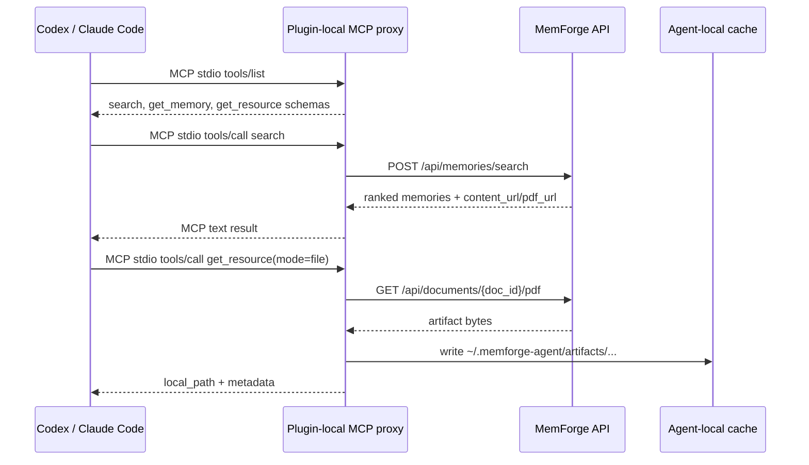

# Agent Client Integrations

MemForge supports Codex, Claude Code, and similar tools through thin client
adapters. The adapter boundary is deliberately small so different agent session
formats can be normalized without moving memory decisions into the client.

## Client-Side Responsibilities

The agent-client package owns:

- reading the hook payload supplied by the host tool
- requesting memory context from the service before the user prompt is handled
- keeping a local retry queue for failed lifecycle uploads
- translating native transcript rows into a bounded canonical evidence window
- redacting obvious client-visible secrets before upload
- uploading the window to `POST /api/agent-sessions/windows`
- exposing a local MCP proxy that forwards memory operations to the service
- downloading source artifacts into a client-local cache when an agent calls
  `get_resource(mode="file")`

The client does not extract canonical memories, write memory rows, run source
sync, or read transcript files that belong to another tool.

## MCP Communication Flow

Codex, Claude Code, and similar agent clients speak MCP over stdio to the
plugin-local MemForge proxy. The proxy then calls the MemForge API over HTTP(S).
For self-hosted use, the API is usually `http://127.0.0.1:8765` with no auth.
For hosted MemForge, the same proxy uses `MEMFORGE_API_URL` and
`MEMFORGE_API_TOKEN`.

The proxy accepts the common stdio JSON-RPC framings used by agent clients:
newline-delimited JSON and `Content-Length` framed messages. This is a client
compatibility boundary only; it does not change the MemForge service contract.

The service never creates agent-local filesystem paths. When an agent asks for a
source artifact in `file` mode, the local proxy downloads the bytes from the
service, writes the file on the agent machine, and returns that `local_path`.



| MCP tool | Proxy action | Service endpoint | Local state |
| --- | --- | --- | --- |
| `search` | Forward query | `POST /api/memories/search` | None |
| `get_memory` | Fetch memory detail | `GET /api/memories/{memory_id}` | None |
| `submit_agent_session_document` | Submit generated summary | `POST /api/agent-sessions/documents` | None |
| `get_resource(mode="text")` | Fetch artifact text | Service `content_url` | None |
| `get_resource(mode="base64")` | Fetch artifact bytes | Service artifact URL | None |
| `get_resource(mode="file")` | Fetch artifact bytes and cache locally | Service artifact URL | Writes `~/.memforge-agent/artifacts` |

Hook traffic is separate from MCP tool calls. Hooks use the Admin API directly
for compact prompt context, receipts, and agent-session windows:
`/api/hooks/context`, `/api/hooks/receipts`, and
`/api/agent-sessions/windows`. MCP is the read path and explicit-tool path; it
is not the reliable automatic sync trigger for lifecycle capture.

The human CLI follows the same read path for local checks:

```bash
memforge search "docker artifact provenance"
memforge get-memory mem-123
memforge get-resource /api/documents/doc-456/pdf --mode file
```

Those commands use the same API URL and token environment variables as the
plugin proxy. They are a terminal surface over the same service behavior, not a
separate local-database reader.

## Source Artifact Access

Agents retrieve memory context progressively:

- Use `search` first for compact memory cards and the primary source's
  `content_url` / `pdf_url`.
- Call MCP `get_resource` directly on that URL when the primary source is
  enough evidence.
- Call MCP `get_memory(memory_id)` first when complete provenance,
  corroborating sources, contradiction context, or lifecycle metadata is needed;
  then call `get_resource` for whichever source artifact is most useful.

This keeps Codex, Claude Code, and future adapters source-format agnostic. The
client follows service-provided URLs instead of assuming where MemForge stores
documents on disk. `get_resource` resolves relative artifact URLs against
`MEMFORGE_API_URL`; in `file` mode the local MCP proxy downloads the bytes into
`~/.memforge-agent/artifacts` and returns a path on the agent host. The service
never returns service-local or container-local filesystem paths as agent
evidence.

## Service-Side Responsibilities

The MemForge service owns:

- validating the window schema and client metadata
- redacting again because client-side redaction is not a trust boundary
- canonicalizing evidence into a bounded agent-session window
- deciding whether a gated turn contains enough signal to process
- asking the structured LLM client for a durable session-outcome patch proposal
- reconciling the candidate against same-user, same-repo, same-client private
  agent-session memory rows
- resolving claim projection from the matched memory when lifecycle updates an
  existing claim
- validating the final write against owner, visibility, repo, and claim scope
- writing private concept, claim, citation, memory, and lifecycle rows
- applying quality gates, reconciliation, storage, search, and lifecycle policies

This is the same adapter boundary for local self-hosting and a future hosted
service. `MEMFORGE_API_URL` defaults to `http://127.0.0.1:8765` for the
self-hosted stack and can point at a hosted MemForge service. `MEMFORGE_API_TOKEN`
is optional for local no-auth deployments and becomes the bearer/API-token hook
for SaaS. The MCP proxy itself stays local so `local_path` always means a path
on the agent machine.

The server-side database is authoritative for agent-session memory state. The
human-readable concept markdown is rendered from database records after a patch
is accepted; clients should not upload markdown as the transactional source of
truth for automatic lifecycle capture.

## Window Shape

```json
{
  "schema_version": "agent-session-window/v1",
  "client": "codex",
  "session_id": "session-123",
  "workspace": "/workspace/mem-forge",
  "repo": "shno-labs/mem-forge",
  "branch": "main",
  "trigger": "GATED_CAPTURE",
  "window": {
    "from": "line:120",
    "to": "line:180",
    "events": [
      {
        "role": "user",
        "kind": "message",
        "text": "Add tests for the adapter."
      },
      {
        "role": "assistant",
        "kind": "tool_call",
        "text": "uv run pytest tests/test_hook_adapter.py -q"
      }
    ]
  },
  "redaction": {
    "applied": true,
    "patterns": ["bearer", "json", "generic"]
  },
  "process_now": false
}
```

Automatic hook uploads use `process_now=false` so the API can acknowledge the
window quickly and let the service-owned queue process it. Explicit MCP
submissions can still use immediate processing when the caller already has a
small generated summary.

## Capture Triggers

`REQUIRED_CAPTURE` is used when context is about to be lost, such as compaction.
`GATED_CAPTURE` is used at ordinary turn boundaries and only captures when the
window contains durable work signals. `RECOVER` is used on resume to re-arm any
uncaptured tail.

These names describe capture policy rather than host-specific hook names. Codex,
Claude Code, and future clients can map their own hook events into the same
small vocabulary.
