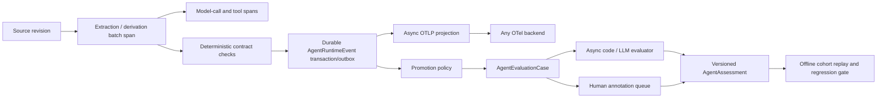

# Online agent evaluation and telemetry for MemForge

Date: 2026-08-13

Status: Research recommendation. This note is based only on current official specifications and project documentation. It does not propose implementation changes in this research branch.

## Executive recommendation

MemForge should not make an observability vendor, sampled trace, or LLM evaluator the system of record for extraction quality. The clean design has three related but distinct planes:

1. **Durable runtime facts** — a small, append-only, provider-neutral OSS module records what the extraction path actually did: structured-output validation, evidence localization, admission, fallback, rejection, and batch completion. These records carry stable MemForge lineage IDs and contain no source text, prompt text, quote text, or model response.
2. **OpenTelemetry observability** — the same work emits duration-bearing spans, point-in-time events, diagnostic logs, and low-cardinality metrics. OTLP is the interoperability boundary. Trace and span IDs correlate operational telemetry, but are never the only identity of an audit fact.
3. **Evaluation and feedback** — asynchronous code, LLM, and human evaluators append versioned assessments to a durable runtime fact or offline case. A signal is not ground truth. Human-adjudicated reference data is the preferred ground truth; LLM-judge and deterministic-check results remain named, versioned assessments.

This division preserves exact product auditability even when telemetry is sampled, permits any OTLP-compatible backend, and supports a deliberate live-to-offline evaluation loop without putting raw customer content into ordinary observability infrastructure.

## Why the boundary matters

OpenTelemetry defines a span as an operation with duration and an event as a meaningful point-in-time occurrence. Its event guidance recommends spans for operations with duration, attributes for properties of an operation as a whole, and ordinary logs for unstructured diagnostics. Event names must identify a stable event class rather than contain dynamic values. ([OpenTelemetry event semantic conventions](https://opentelemetry.io/docs/specs/semconv/general/events/))

OpenTelemetry LogRecords can carry `TraceId`, `SpanId`, `TraceFlags`, resource identity, attributes, body, and an `EventName`. This makes an OTel event/log a good interoperable projection of a runtime fact, but not automatically a complete durable audit record. ([OpenTelemetry logs specification](https://opentelemetry.io/docs/specs/otel/logs/), [OpenTelemetry log data model](https://opentelemetry.io/docs/specs/otel/logs/data-model/))

Sampling is the decisive reason not to treat traces as the product ledger. Head sampling cannot know that a later operation will fail; tail sampling can preserve error, latency, and attribute-matched traces, but it is stateful and operationally more complex. The OTel documentation also warns that sampling may be inappropriate when data volume is low or records must not be dropped for regulatory reasons. ([OpenTelemetry sampling](https://opentelemetry.io/docs/concepts/sampling/))

Therefore:

- A rejected evidence quote, invalid structured result, or degraded fallback is a **durable MemForge runtime fact**.
- Its representation inside an active derivation trace is an **OTel event** attached to the relevant span.
- The derivation batch, model call, or evidence-localization operation is a **span** because it has duration.
- A traceback or developer-oriented explanation is a **log** correlated by trace/span and MemForge event ID.
- An evaluator's judgment about that fact is an **assessment**, not a rewrite of the fact.

## Official-framework comparison

| Framework | Interoperable model | Live evaluation and feedback | Privacy, sampling, and identity | Recommended MemForge role |
|---|---|---|---|---|
| **OpenTelemetry GenAI** | Standard traces, spans, events/logs, metrics, baggage, and OTLP. The GenAI conventions model agent/model/tool/memory operations as spans and define a `gen_ai.evaluation.result` event. | The evaluation event can record evaluator name, score/label, explanation, response ID, and evaluator error. It is a result representation, not an evaluator queue, dataset, or ground-truth workflow. | The GenAI spec says instructions, inputs, and outputs are sensitive and potentially large and should not be captured by default. It offers explicit opt-in content capture or references to a separately secured external store. Trace IDs correlate a sampled execution, not a durable business identity. | **Canonical telemetry protocol and semantic baseline.** Use custom `memforge.*` events/attributes where no stable GenAI convention exists; export by OTLP. Do not use sampled traces as the audit ledger. ([GenAI agent spans](https://github.com/open-telemetry/semantic-conventions-genai/blob/main/docs/gen-ai/gen-ai-agent-spans.md), [GenAI evaluation event](https://github.com/open-telemetry/semantic-conventions-genai/blob/main/docs/gen-ai/gen-ai-events.md#event-gen_aievaluationresult)) |
| **OpenInference** | An OTel-compatible AI semantic convention with span kinds such as `AGENT`, `LLM`, `TOOL`, `RETRIEVER`, `RERANKER`, `GUARDRAIL`, and `EVALUATOR`. Every OpenInference trace remains a valid OTLP trace. | Annotation model supports span, trace, and session targets; numeric/categorical feedback; explanation; `HUMAN`, `LLM`, or `CODE` annotator kind; and stable annotation identifiers. Post-hoc evaluation uses a new `EVALUATOR` carrier span with exactly one span link to the completed target. | Provides explicit hide-input/output/message/tool/prompt/vector/text controls and an experimental external-blob reference. The documented hide controls default to false, so production deployment must opt into redaction. | **Useful optional semantic/export compatibility**, especially for evaluator carrier spans and Phoenix. Preserve MemForge's own event/assessment IDs because the OTel evaluation event does not directly cover all OpenInference annotation fields. ([OpenInference specification](https://arize-ai.github.io/openinference/spec/), [annotations](https://arize-ai.github.io/openinference/spec/annotations.html), [privacy configuration](https://arize-ai.github.io/openinference/spec/configuration.html)) |
| **OpenLLMetry / Traceloop** | Automatic OTel instrumentation for LLM SDKs, frameworks, vector databases, and workflows; exports to any OTel-compatible backend. | Primarily tracing/instrumentation rather than a canonical evaluation-case or feedback data model. | Traceloop documents that prompt, completion, and embedding content is recorded in span attributes by default unless `TRACELOOP_TRACE_CONTENT=false` or content capture is selectively disabled. | **Optional instrumentation only.** Never make it a core dependency or enable default content capture for production MemForge workloads. ([OpenLLMetry introduction](https://www.traceloop.com/docs/openllmetry/introduction), [official repository](https://github.com/traceloop/openllmetry), [trace privacy](https://www.traceloop.com/docs/openllmetry/privacy/traces)) |
| **MLflow** | Accepts and exports OTel traces through OTLP and translates common GenAI conventions. | Automatic evaluation applies filtered and sampled LLM judges asynchronously to live traces/sessions; assessments arrive later without blocking trace ingestion. Historical production traces can be annotated, scored, and reused as offline evaluation inputs. Feedback attaches to a trace or span and records source (`HUMAN`, `LLM_JUDGE`, or `CODE`), value, rationale, errors, metadata, and revisions. | Sampling/filtering control evaluation cost. Expectations are modeled separately from assessments, which usefully distinguishes reference truth from observed/judged quality. | **Strong optional backend and reference architecture** for async live judges plus offline replay. Keep its trace/span identity and server scheduler outside the canonical OSS contract. ([automatic evaluations](https://mlflow.org/docs/latest/genai/eval-monitor/automatic-evaluations/), [production trace evaluation](https://www.mlflow.org/docs/latest/genai/eval-monitor/running-evaluation/traces/), [feedback model](https://mlflow.org/docs/latest/genai/concepts/feedback/), [OTel interoperability](https://mlflow.org/docs/latest/genai/tracing/opentelemetry/)) |
| **Langfuse** | Trace/observation/session model with scores attached at several scopes. | LLM-as-a-judge and code evaluators can run asynchronously against live observations or controlled experiments, with filters and independent sampling. Scores have numeric, categorical, boolean, or text value; source; comment; and score-config identity. Annotation queues support domain-expert review and corrected outputs. | Evaluator executions have their own status, including completed, error, delayed, and pending. Evaluator/rule versioning is explicit; current live-evaluator APIs are documented as evolving. | **Useful optional product/backend and design reference** for evaluator rules, score objects, and annotation queues. Do not leak its observation IDs or API lifecycle into the OSS core. ([LLM-as-a-judge](https://langfuse.com/docs/evaluation/evaluation-methods/llm-as-a-judge), [code evaluators](https://langfuse.com/docs/evaluation/evaluation-methods/code-evaluators), [score data model](https://langfuse.com/docs/evaluation/scores/data-model), [annotation queues](https://langfuse.com/docs/evaluation/evaluation-methods/annotation-queues)) |
| **Arize Phoenix** | OTel/OpenInference tracing, structured annotations, datasets, experiments, and traced evaluators. | Supports code and LLM evaluations over traces/datasets. Annotations can carry labels, scores, explanations, annotator kind, and stable identifier. Annotated production spans can be exported into datasets for later experiments and judge development. | Human annotations are explicitly used to build ground truth; automated evaluation discovers broader patterns. Phoenix documentation points continuous online evaluation with alerting to Arize AX, so OSS Phoenix should not be assumed to provide the full production scheduler. | **Good optional OSS trace/offline-evaluation backend**, particularly when OpenInference compatibility is desired. Not the canonical MemForge runtime-fact store. ([Phoenix evaluations](https://arize.com/docs/phoenix/evaluation/evals), [annotation concepts](https://arize.com/docs/phoenix/tracing/concepts-tracing/annotations-concepts), [capture feedback](https://arize.com/docs/phoenix/tracing/how-to-tracing/feedback-and-annotations/capture-feedback), [export annotated spans](https://arize.com/docs/phoenix/tracing/how-to-tracing/importing-and-exporting-traces/exporting-annotated-spans)) |
| **OpenAI agent tracing/evals** | Platform-specific traces include model calls, tool calls, handoffs, guardrails, and custom spans. | Trace grading assigns structured scores/labels to end-to-end traces; the documented workflow moves high-signal traces into datasets and repeatable evaluation runs. | The design pattern is useful, but the interfaces are OpenAI-platform-specific. The current evaluation guide also warns that a legacy Evals surface is scheduled for read-only and shutdown, so MemForge should not adopt it as a portable core contract. | **Conceptual reference only:** trace first, investigate failures, promote high-value examples, align graders to annotations, and run repeatable evaluations. ([agent evals](https://developers.openai.com/api/docs/guides/agent-evals), [trace grading](https://developers.openai.com/api/docs/guides/trace-grading), [agent observability integrations](https://developers.openai.com/api/docs/guides/agents/integrations-observability), [evaluation getting started](https://developers.openai.com/api/docs/guides/evaluation-getting-started)) |

## Proposed canonical OSS model

### 1. `AgentRuntimeEvent`: immutable execution fact

The durable object should be named for what it is. `AgentEvaluationEvent` is ambiguous because the ecosystem consistently uses “evaluation” for a score, label, or assessment produced by a code, LLM, or human evaluator. Prefer `AgentRuntimeEvent` for the factual record, and reserve `AgentAssessment` for evaluation output.

Example stable event classes:

- `memforge.agent.structured_output.result`
- `memforge.agent.evidence_localization.result`
- `memforge.agent.memory_admission.result`
- `memforge.agent.extraction_batch.result`

Each event has a low-cardinality outcome such as `accepted`, `degraded`, `rejected`, or `failed`, plus a documented low-cardinality reason code. The event name never contains a source ID, document ID, memory ID, model name, or error message. This follows OTel's event naming rule and prevents metric-series explosion. ([OpenTelemetry event semantic conventions](https://opentelemetry.io/docs/specs/semconv/general/events/), [semantic-convention naming](https://opentelemetry.io/docs/specs/semconv/general/naming/))

Recommended fixed fields:

| Class | Fields |
|---|---|
| Identity | `event_id`, `event_name`, `schema_version`, `occurred_at` |
| Lineage | `source_id`, `source_type`, `source_unit_id`, `source_unit_revision_id`, `projection_run_id`, `derivation_id`, `batch_id`, optional candidate/memory ID |
| Execution | outcome, reason code, attempt, retry/fallback flags, prompt/contract version, deployment revision, provider/model family |
| Evidence localization | block ID, canonical-content hash, quote hash, start/end range, localization mode, match count; never the source or quote text |
| Correlation | optional `trace_id`, `span_id`, `trace_flags`, request/job ID |
| Bounded measurements | item counts, input/output sizes, latency, token counts when available |

The event ID must be a stable product identity. A deterministic ID can be derived from the event schema version, stable lineage IDs, event class, and an explicit event sequence/discriminator. A replay may create a new derivation event because it is a new execution; retry idempotency for the same execution should resolve to the same event ID. Trace IDs must not participate in this identity because replay and exporter topology can change them.

`QualitySignal` can remain a private, transient collector/helper type if it makes the extraction code readable, but it should not become the public persisted schema. The persisted event must be bounded, serializable, versioned, and independent of a provider SDK.

### 2. `AgentAssessment`: evaluator output

An assessment is append-only and targets an `event_id`, evaluation case, trace/span, memory, or source unit through a typed target reference. Use the narrowest meaningful target, matching OpenInference's recommendation to avoid attaching a local judgment to an overly broad trace or session. ([OpenInference annotations](https://arize-ai.github.io/openinference/spec/annotations.html))

Recommended fields:

- `assessment_id`, target type and target ID
- `criterion`, numeric score and/or categorical/boolean label
- optional bounded rationale or protected artifact pointer
- `annotator_kind`: `code`, `llm`, or `human`
- evaluator name, version, rubric/prompt hash, model/provider, deployment revision
- execution status, stable error type, created time, optional supersedes/revision link
- optional original trace/span IDs for operational correlation

The model must not collapse these different claims:

- a runtime event says “the quote did not localize”;
- a code assessment says “the emitted range violates the evidence contract”;
- an LLM assessment says “the extracted memory appears useful”;
- a human assessment says “this is the accepted reference answer.”

Only the last becomes ground truth when the product workflow explicitly accepts it. An LLM judge is an online quality signal, not ground truth merely because it produces a confident score.

For a post-hoc evaluator after the original span has ended, export a new `EVALUATOR` span linked to the original target span and emit the OTel `gen_ai.evaluation.result` event inside it. Preserve MemForge assessment ID, annotator kind, evaluator version, and target event ID as namespaced attributes because the standard OTel event does not carry every OpenInference annotation field. ([OpenInference annotations](https://arize-ai.github.io/openinference/spec/annotations.html), [OTel GenAI evaluation event](https://github.com/open-telemetry/semantic-conventions-genai/blob/main/docs/gen-ai/gen-ai-events.md#event-gen_aievaluationresult))

### 3. `AgentEvaluationCase`: explicit live-to-offline promotion

Do not make every production trace an evaluation dataset row. Promotion should create an immutable case manifest containing:

- the triggering runtime event IDs and stable source/source-unit revision lineage;
- prompt/contract/schema versions, model/provider, and deployment revision;
- protected artifact handles needed to reconstruct the exact input/output under normal authorization;
- the selection rule and time;
- expected-output/annotation state and its revision history.

The telemetry/audit record stores handles and hashes, not copied customer content. The protected source/evidence store remains the content authority and enforces its own access and retention rules.

Promotion sources should be explicit and composable:

- **deterministic:** every schema rejection, evidence mismatch, admission conflict, unsupported fallback, or internal invariant failure;
- **risk-triggered:** selected source types, model/prompt changes, first use of a new contract, repeated retries, or severe user feedback;
- **sampled:** a small unbiased success/control cohort;
- **human-selected:** support, review, or product investigation.

This follows the common production pattern documented by MLflow, Phoenix, Langfuse, and OpenAI: collect traces, attach feedback, promote useful examples into datasets/queues, align automated graders with human feedback, and run repeatable offline experiments. ([MLflow production trace evaluation](https://www.mlflow.org/docs/latest/genai/eval-monitor/running-evaluation/traces/), [Phoenix datasets](https://arize.com/docs/phoenix/learn/datasets-and-experiments/datasets-concepts), [Langfuse annotation queues](https://langfuse.com/docs/evaluation/evaluation-methods/annotation-queues), [OpenAI agent evals](https://developers.openai.com/api/docs/guides/agent-evals))

## Runtime flow

The synchronous extraction path should perform only the cheap deterministic checks required for correctness. It records the resulting runtime facts in the same transaction, or through a transactional outbox, as the associated derivation/batch state. Remote telemetry export and LLM evaluation happen asynchronously and must never block ingestion or decide whether the product transaction committed.

Live LLM evaluators should run only on a filtered, bounded, sampled/risk-triggered queue. Each run records evaluator version and execution status, including failures, rather than silently turning evaluator failure into a missing score. This mirrors MLflow's asynchronous live evaluation and Langfuse's explicit evaluator execution states. ([MLflow automatic evaluations](https://mlflow.org/docs/latest/genai/eval-monitor/automatic-evaluations/), [Langfuse LLM-as-a-judge](https://langfuse.com/docs/evaluation/evaluation-methods/llm-as-a-judge))

Offline evaluation should replay a fixed, versioned cohort against candidate code/prompt/model changes and compare assessments on that same cohort. A changed model or prompt must not silently change the dataset. Human-reviewed cases should be retained separately from sampled controls so aggregate trends and regression gates remain interpretable.

## OpenTelemetry mapping

### Spans

Use spans for work with duration:

- source synchronization and source-unit projection;
- extraction/derivation batch;
- model inference;
- tool/retrieval call;
- evidence-localization computation when it is independently useful to time;
- asynchronous evaluator execution.

Use stable, low-cardinality span names such as `memforge.agent.extract` rather than embedding a document or source ID. Put attributes known at span creation—operation kind, provider/model family, source type, contract version—on the span early so a head sampler can use them. Span links should represent asynchronous or batch causality where strict parent/child structure is misleading. ([OpenTelemetry trace API](https://opentelemetry.io/docs/specs/otel/trace/api/), [OTel specification overview](https://opentelemetry.io/docs/specs/otel/overview/), [GenAI agent spans](https://github.com/open-telemetry/semantic-conventions-genai/blob/main/docs/gen-ai/gen-ai-agent-spans.md))

### Events

Project each durable runtime fact into an OTel EventRecord or span event with the stable event name and bounded fields. Attach it to the active derivation/batch span when one exists. Standalone events remain valid when evaluation or reconciliation occurs outside the original trace.

Use `error.type` for evaluator or operation failures and keep its values predictable and low-cardinality. Do not put stack traces, provider messages, quotes, or arbitrary source text into the event. ([OpenTelemetry event semantic conventions](https://opentelemetry.io/docs/specs/semconv/general/events/))

### Logs

Use ordinary logs for stack traces, developer diagnostics, and unexpected free-form context. Include `trace_id`, `span_id`, and `memforge.agent.event_id` so the log can be joined to both the operational trace and durable fact. The durable fact should remain understandable without the log.

### Metrics

Produce only aggregate, low-cardinality series, for example:

- event count by event class, outcome, reason class, source type, evaluator kind, and deployment revision;
- batch duration and item count;
- evaluator queue delay, execution duration, failure count, and score distribution;
- promotion count and human-annotation backlog.

Never put workspace, source, document, source-unit, memory, candidate, event, trace, span, request, or user IDs into metric labels. OTel defines metric cardinality as unique attribute combinations and its SDK specification provides a default cardinality limit with overflow aggregation; unbounded identifiers would destroy useful aggregation and can exhaust backend budgets. ([OpenTelemetry metrics SDK](https://opentelemetry.io/docs/specs/otel/metrics/sdk/), [semantic-convention guidelines](https://opentelemetry.io/docs/specs/semconv/how-to-write-conventions/))

Use trace exemplars or links from a dashboard to detailed audit queries rather than identifier-valued labels.

## Privacy and retention

The production default must be metadata-only:

- no prompt, source message/page/issue body, model input/output, quote, memory text, attachment, tool arguments, or provider response in runtime events, spans, metrics, or ordinary logs;
- store hashes, ranges, counts, sizes, block IDs, schema/prompt versions, and protected artifact references instead;
- allow content capture only through an explicit, separately authorized debug/evaluation workflow with independent encryption, access controls, retention, and audit;
- treat explanations and evaluator rationale as potentially sensitive and bounded; prefer a protected artifact pointer for long rationale;
- apply the source's visibility and owner/access-scope rules to runtime-event, case, assessment, and artifact queries.

These defaults are stricter than OpenInference and OpenLLMetry defaults and match the OTel GenAI guidance that model instructions, inputs, and outputs should not be captured by default. ([OTel GenAI agent spans](https://github.com/open-telemetry/semantic-conventions-genai/blob/main/docs/gen-ai/gen-ai-agent-spans.md), [OpenInference privacy configuration](https://arize-ai.github.io/openinference/spec/configuration.html), [OpenLLMetry trace privacy](https://www.traceloop.com/docs/openllmetry/privacy/traces))

Retention should be policy-defined rather than hard-coded in the shared protocol. Runtime-event retention, protected evaluation-case retention, assessment retention, and external telemetry-backend retention are separate policies. Promotion of a case should not automatically extend the retention of raw source content beyond the source's own authority and privacy policy.

## Sampling and loss policy

Use two independent policies:

1. **Product/audit policy:** record every bounded high-value runtime fact needed to diagnose correctness. This is not trace sampling. If volume later becomes material, reduce event scope only through an explicit product decision; do not silently drop failures.
2. **Telemetry policy:** tail-sample error, rejected, degraded, and high-latency traces; probabilistically sample ordinary successes. An OTLP exporter may be unavailable without causing the source transaction to fail.

Evaluation sampling is a third policy. It controls costly asynchronous judges and should preserve all deterministic failures plus a small success/control cohort. The selected evaluation case and selection reason must be durable so the offline population is explainable.

Never compute exact product audit counts from sampled traces, and never interpret an absent assessment as a successful assessment.

## OSS deep-module boundary

The canonical OSS module should own the vocabulary and invariants, not a telemetry vendor:

- immutable domain types for `AgentRuntimeEvent`, `AgentAssessment`, `AgentEvaluationCase`, target references, outcome/reason enums, and version metadata;
- a storage protocol with append/idempotent-put, get, and paginated filtered listing;
- promotion policy and evaluator task protocol, with evaluators registered outside the core domain;
- deterministic mapping from domain objects to OTel spans/events/attributes;
- content-redaction and bounded-field validation at the module boundary;
- conformance tests reusable by SQLite and Cloud adapters.

The shared query contract should include half-open time bounds plus source/type/event/outcome/reason/model/deployment/evaluator filters, stable ordering, pagination, visibility, and consistent not-found/error behavior. A bounded per-batch collector may accumulate at most a configured number of events and flush at the batch boundary; it must not retain source documents, prompts, or provider payloads in memory. This prevents OOM without inventing a second business lifecycle.

OTel, OpenInference, MLflow, Langfuse, Phoenix, or Traceloop integration belongs behind exporters/adapters. The core extraction pipeline should compile and run when none is installed.

## Cloud/HANA adapter

Cloud should implement exactly the OSS storage and query protocol, adding only Cloud concerns:

- mandatory workspace/tenant partition and existing caller visibility semantics;
- fixed indexed columns for common filters and bounded JSON only for optional versioned fields;
- unique/idempotency constraint on `event_id`;
- indexes led by `(workspace_id, occurred_at)`, `(workspace_id, event_name, outcome, occurred_at)`, and `(workspace_id, source_id, occurred_at)`, refined from measured query plans rather than speculative indexing;
- transaction/outbox linkage between extraction batch state and audit-event publication;
- asynchronous OTLP export after commit;
- no HANA-only event vocabulary, Teams/Confluence/Jira branch, content fallback, or provider-specific compatibility path.

HANA should not store copied quote/source/prompt/model-response content in this audit table. The record contains the stable source-unit revision, block/range/hash evidence coordinates, and a protected artifact reference where a separately authorized investigation requires content.

The Cloud adapter must honor the same filters, pagination, stable ordering, idempotency, and error behavior as SQLite. Adapter contract tests should execute the same scenarios against both implementations and assert workspace/source visibility in the generated HANA query and bound parameters.

## Minimum useful first increment

Avoid building a generalized evaluation platform before proving the loop. A useful first increment is:

1. Persist the four runtime event classes above for structured-output, evidence localization, memory admission, and batch result.
2. Emit their OTel projections plus batch/model spans and low-cardinality counters.
3. Add a self-contained audit query by event ID, source/source-unit revision, derivation/batch, outcome/reason, deployment revision, and trace ID.
4. Promote every rejected/failed event and a small deterministic success sample into evaluation cases.
5. Run one deterministic offline evaluator and one human-review queue; add an LLM judge only after the human labels define what “correct” means.
6. Export optional OTLP and validate with one backend, while keeping all tests/backend interfaces vendor-neutral.

This increment directly addresses the operational need: when quote/block localization or structured output fails, an investigator can identify the exact source revision, extraction contract, memory/candidate lineage, model/prompt/build, outcome, and protected evidence coordinates without needing an unsampled trace or raw customer content in a log.

## Decision summary

- **Standardize on OTel/OTLP for observability, not as the sole persistence mechanism.**
- **Use stable MemForge event IDs and lineage IDs as canonical identity; trace/span IDs are secondary correlation.**
- **Separate runtime facts, assessments, and accepted ground truth.**
- **Keep raw content out of telemetry by default.**
- **Use low-cardinality metrics and sample traces, never durable high-value audit facts.**
- **Promote selected live cases into an immutable offline cohort with versioned human/code/LLM assessments.**
- **Make MLflow, Langfuse, Phoenix, OpenInference, and OpenLLMetry optional integrations behind the OSS contract.**
- **Implement one shared OSS protocol and require SQLite/HANA adapter parity; do not create source-type-specific telemetry mechanisms.**

